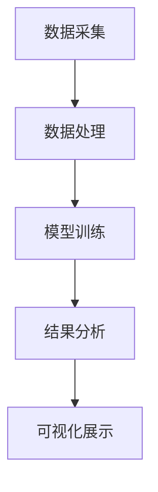

                 

# 芒格的"关键变量"理论：找出决定投资成败的核心因素

> 关键词：芒格、关键变量理论、投资决策、数据分析、系统架构、算法实现

> 摘要：本文系统阐述了芒格的"关键变量"理论，从理论背景、核心概念、数学模型、系统架构、算法实现到项目实战，全面分析了关键变量理论在投资决策中的应用。通过具体案例分析，揭示了关键变量在投资决策中的重要性，为投资者提供了一套科学的投资分析方法。

---

## 第一部分：芒格的“关键变量”理论概述

### 第1章：芒格“关键变量”理论的背景与核心概念

#### 1.1 投资理论的演进历程

##### 1.1.1 传统投资理论的局限性
传统投资理论，如基本面分析和图表分析，依赖于大量复杂的指标和数据，但往往忽略了最关键的因素。投资者在面对海量信息时，容易陷入信息过载的困境，难以找到真正影响投资结果的核心因素。

##### 1.1.2 芒格投资理念的形成背景
芒格的投资理念深受其心理学背景影响，他提出“关键变量”理论，强调在投资决策中，真正影响结果的核心因素往往只有几个。这种方法不仅简化了分析过程，还提高了决策的准确性。

##### 1.1.3 关键变量理论的提出与核心思想
关键变量理论的核心思想是，找到那些能够解释大部分投资结果的少数关键因素。这些因素通常是那些能够直接反映市场趋势、公司基本面或投资者心理的关键指标。

#### 1.2 关键变量理论的核心概念

##### 1.2.1 关键变量的定义与特征
关键变量是指那些对投资结果具有决定性影响的因素，通常具有高度的相关性和预测性。它们可能是市场指数、财务指标或情绪指标。

##### 1.2.2 关键变量与投资结果的关系
关键变量通过影响市场趋势、公司业绩或投资者心理，直接或间接地影响投资结果。例如，利率变化可能影响股市的整体走势，而公司的净利润增长率可能影响其股票价格。

##### 1.2.3 关键变量的分类与层次分析
关键变量可以分为市场变量、公司变量和投资者变量。市场变量包括宏观经济指标，公司变量包括财务指标，投资者变量包括情绪指标。

---

### 第2章：关键变量理论的数学模型与分析方法

#### 2.1 关键变量的识别与筛选

##### 2.1.1 数据分析方法
通过数据分析，可以识别出与投资结果高度相关的变量。例如，使用相关系数来衡量变量之间的关联性。

##### 2.1.2 统计学模型
使用统计学模型，如线性回归，来筛选关键变量。回归分析可以帮助确定哪些变量对投资结果的解释力最强。

##### 2.1.3 机器学习算法在关键变量识别中的应用
机器学习算法，如随机森林和LASSO回归，可以有效地进行变量筛选。这些算法能够自动识别出对目标变量影响最大的特征。

#### 2.2 关键变量的权重与影响分析

##### 2.2.1 权重计算方法
通过赋予每个变量不同的权重，可以量化其对投资结果的影响程度。例如，使用熵权法或主成分分析法来计算变量的权重。

##### 2.2.2 因子分析与主成分分析
因子分析可以帮助将复杂的变量简化为几个因子，从而更容易识别关键变量。主成分分析则是一种降维技术，可以提取出变量的主要成分。

##### 2.2.3 回归分析与相关性分析
回归分析可以用来衡量变量之间的关系，相关性分析可以帮助识别哪些变量与投资结果高度相关。

---

### 第3章：关键变量理论的系统架构与实现

#### 3.1 投资决策系统的功能设计

##### 3.1.1 系统需求分析
投资决策系统需要具备数据采集、分析、预测和可视化等功能。

##### 3.1.2 系统功能模块划分
系统功能模块包括数据采集模块、数据处理模块、模型训练模块、结果分析模块和可视化模块。

##### 3.1.3 系统功能流程图
使用mermaid绘制系统功能流程图，展示数据从采集到分析的整个流程。

#### 3.2 系统架构设计

##### 3.2.1 分层架构设计
系统采用分层架构，包括数据层、业务逻辑层和表现层。

##### 3.2.2 组件化设计
系统分为数据采集组件、数据分析组件和结果展示组件，各组件之间通过接口进行通信。

##### 3.2.3 高可用性与扩展性设计
系统采用分布式架构，确保高可用性和扩展性。通过负载均衡和容错设计，提高系统的稳定性和性能。

---

### 第4章：关键变量理论的算法实现与代码解析

#### 4.1 关键变量识别算法

##### 4.1.1 数据预处理与特征提取
使用Python进行数据清洗和特征提取，例如去除缺失值和标准化数据。

##### 4.1.2 基于决策树的特征选择
使用决策树算法（如随机森林）进行特征重要性评估，识别关键变量。

##### 4.1.3 基于随机森林的特征重要性排序
通过随机森林模型，计算每个特征的重要性得分，排序后筛选出关键变量。

#### 4.2 权重计算与影响分析

##### 4.2.1 基于线性回归的权重计算
使用线性回归模型，计算每个变量的回归系数，系数绝对值越大，变量的重要性越高。

##### 4.2.2 基于XGBoost的特征重要性排序
使用XGBoost模型，计算每个特征的特征重要性得分，排序后筛选出关键变量。

##### 4.2.3 基于神经网络的非线性权重计算
使用神经网络模型，计算每个变量的权重，通过反向传播算法优化权重。

---

### 第5章：关键变量理论的项目实战与案例分析

#### 5.1 项目背景与目标

##### 5.1.1 项目需求分析
项目目标是通过关键变量理论，筛选出影响股票价格的关键因素，构建一个股票价格预测模型。

##### 5.1.2 项目目标设定
项目目标包括数据采集、关键变量识别、模型训练和结果分析。

##### 5.1.3 数据来源与数据集描述
数据来源包括公开的股票数据和财务数据，数据集包括历史股价、财务指标和市场指标。

#### 5.2 项目实施过程

##### 5.2.1 数据清洗与特征工程
对数据进行清洗，处理缺失值和异常值，提取特征变量。

##### 5.2.2 模型训练与参数调优
使用随机森林和XGBoost模型进行训练，通过网格搜索进行参数调优。

##### 5.2.3 模型评估与结果分析
通过交叉验证评估模型性能，分析关键变量对股票价格的影响。

---

### 第6章：关键变量理论的最佳实践

#### 6.1 小结
关键变量理论通过识别影响投资结果的核心因素，简化了投资决策过程，提高了决策的准确性。

#### 6.2 注意事项
在实际应用中，需要注意数据质量、模型选择和结果解释。同时，要结合市场变化和投资者心理，动态调整关键变量。

#### 6.3 拓展阅读
推荐阅读相关书籍和论文，深入了解关键变量理论的应用和优化方法。

---

## 作者：AI天才研究院/AI Genius Institute & 禅与计算机程序设计艺术 /Zen And The Art of Computer Programming

