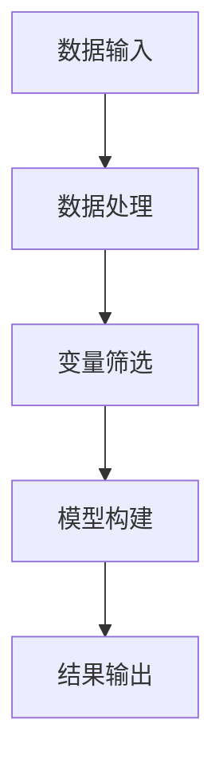

                 


# 芒格的"关键变量"识别在复杂自适应系统投资中的运用

---

## 关键词：
- 芒格的关键变量识别
- 复杂自适应系统
- 投资策略
- 系统架构设计
- 数学模型

---

## 摘要：
本文探讨了芒格的关键变量识别方法在复杂自适应系统投资中的应用。通过分析复杂自适应系统的特性，结合关键变量识别的核心概念、算法原理、数学模型和系统架构设计，本文为投资者提供了一套系统化的投资策略框架。通过实际案例分析和项目实战，展示了如何将理论应用于实践，帮助投资者在复杂多变的市场中做出明智决策。

---

## 第一章：芒格的关键变量识别方法概述

### 1.1 芒格的关键变量识别方法
#### 1.1.1 方法的背景与起源
芒格的关键变量识别方法源于其对心理学、经济学和投资学的深刻理解。该方法通过识别影响系统行为的关键变量，帮助投资者在复杂环境中做出决策。

#### 1.1.2 方法的核心思想
关键变量识别的核心思想是：在复杂系统中，少数关键变量决定了系统的大部分行为。通过识别这些变量，可以简化问题并提高决策效率。

#### 1.1.3 方法在投资中的应用
在投资领域，关键变量识别用于筛选影响资产价格的主要因素，如宏观经济指标、行业趋势和公司基本面。

### 1.2 复杂自适应系统的定义与特点
#### 1.2.1 复杂系统的定义
复杂系统是指由多个相互作用的组件构成，表现出非线性特征和涌现性的系统。

#### 1.2.2 自适应系统的特征
自适应系统能够根据环境变化调整自身行为，具有学习和适应能力。

#### 1.2.3 复杂自适应系统的动态特性
复杂自适应系统具有动态性、不确定性、涌现性和不可预测性。

---

## 第二章：关键变量识别的核心概念

### 2.1 关键变量识别的原理
#### 2.1.1 变量识别的基本原理
关键变量识别通过分析变量之间的关系，筛选出对系统行为影响最大的变量。

#### 2.1.2 变量之间的关系分析
变量之间的关系包括因果关系、相关关系和相互作用关系。

#### 2.1.3 变量的动态变化特征
关键变量在系统中的作用随时间变化而变化，需动态监测和调整。

### 2.2 关键变量识别的步骤与方法
#### 2.2.1 确定研究目标
明确研究目标，如预测股票价格波动。

#### 2.2.2 数据收集与分析
收集相关数据，进行统计分析和特征提取。

#### 2.2.3 变量筛选与验证
使用统计方法筛选关键变量，并通过验证确保其有效性。

---

## 第三章：关键变量识别的算法原理

### 3.1 算法概述
#### 3.1.1 算法的基本流程
数据预处理、变量筛选、模型构建、验证与优化。

#### 3.1.2 算法的输入与输出
输入：数据集；输出：关键变量列表。

#### 3.1.3 算法的优缺点
优点：高效准确；缺点：依赖数据质量和模型假设。

### 3.2 算法实现
#### 3.2.1 数据预处理
数据清洗、标准化和特征工程。

#### 3.2.2 变量筛选
使用相关性分析、回归分析等方法筛选关键变量。

#### 3.2.3 算法优化
通过参数调优和模型优化提高算法性能。

---

## 第四章：数学模型与公式

### 4.1 数学模型概述
#### 4.1.1 模型的构建
构建变量筛选模型，如线性回归模型。

#### 4.1.2 模型的假设
假设变量之间存在线性关系。

#### 4.1.3 模型的验证
通过交叉验证和统计检验验证模型的有效性。

### 4.2 关键公式
#### 4.2.1 变量权重计算公式
$$权重 = \frac{变量的重要性分数}{总分数}$$

#### 4.2.2 变量相关性计算公式
$$相关性 = \frac{\text{协方差}(x,y)}{\sigma_x \sigma_y}$$

#### 4.2.3 变量影响程度评估公式
$$影响程度 = \sum (\beta_i \cdot x_i)$$

---

## 第五章：系统分析与架构设计

### 5.1 系统架构概述
#### 5.1.1 系统的整体架构
模块化设计，包括数据采集、变量筛选、模型构建和结果输出。

#### 5.1.2 系统的功能模块划分
数据处理模块、变量筛选模块、模型构建模块。

#### 5.1.3 系统的交互流程
数据输入 → 数据处理 → 变量筛选 → 模型构建 → 结果输出。

### 5.2 系统架构图


---

## 第六章：项目实战

### 6.1 项目背景与目标
#### 6.1.1 项目背景
分析股票价格波动，识别关键影响变量。

#### 6.1.2 项目目标
构建股票价格预测模型，优化投资策略。

#### 6.1.3 项目范围
选取某行业股票，分析宏观经济指标和公司财务数据。

### 6.2 项目实施
#### 6.2.1 环境搭建
安装Python、Pandas、Scikit-learn等工具。

#### 6.2.2 核心代码实现
```python
import pandas as pd
from sklearn.linear_model import LinearRegression
from sklearn.feature_selection import SelectKBest, f_regression

# 数据预处理
data = pd.read_csv('stock_data.csv')
X = data.drop('price', axis=1)
y = data['price']

# 变量筛选
selector = SelectKBest(score_func=f_regression, k=3)
X_selected = selector.fit_transform(X, y)
selected_features = X.columns[selector.get_support()]

# 模型构建
model = LinearRegression()
model.fit(X_selected, y)
```

#### 6.2.3 案例分析
分析宏观经济指标（如GDP增长率、利率）和公司财务指标（如利润、收入）对股票价格的影响，识别关键变量。

---

## 第七章：总结与展望

### 7.1 总结
本文系统介绍了芒格的关键变量识别方法在复杂自适应系统投资中的应用，通过理论分析和实际案例展示了其有效性。

### 7.2 未来展望
未来研究可进一步优化算法，探索更多关键变量识别方法在投资中的应用。

---

## 作者：AI天才研究院/AI Genius Institute & 禅与计算机程序设计艺术 /Zen And The Art of Computer Programming

