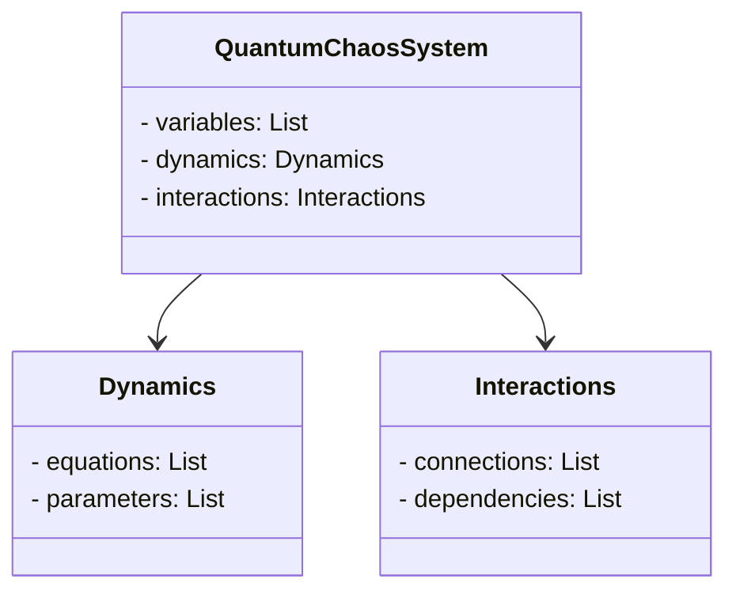
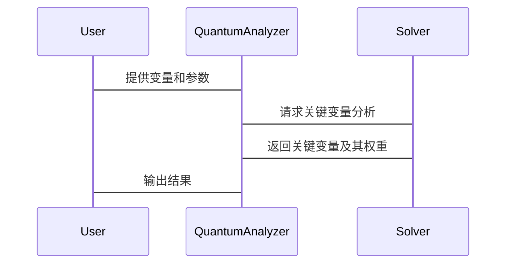

                 


# 芒格的"关键变量"识别在量子混沌系统分析中的运用

## 关键词：芒格，关键变量识别，量子混沌系统，系统分析，投资决策

## 摘要：  
本文探讨了芒格的关键变量识别方法在量子混沌系统分析中的应用。通过结合芒格的投资智慧与现代量子物理学中的混沌系统理论，我们提出了一种新的分析框架，旨在简化复杂量子系统的分析过程。本文首先介绍了芒格的关键变量识别方法及其在投资决策中的应用，然后详细阐述了量子混沌系统的定义、特征及其数学模型，接着探讨了芒格方法在量子混沌系统分析中的潜在优势，最后通过具体的案例分析，展示了芒格方法在量子混沌系统分析中的实际应用过程。

---

## 第1章: 芒格的关键变量识别方法概述

### 1.1 芒格的关键变量识别方法的背景

#### 1.1.1 芒格的关键变量识别方法的起源  
芒格（Charlie Munger）作为伯克希尔哈撒韦公司的重要合伙人，以其独特的投资哲学闻名。他的关键变量识别方法源于对复杂系统的深刻理解，尤其是对人类认知偏差和决策心理的研究。芒格认为，在复杂的决策过程中，关键变量是那些能够显著影响结果的因素，而其他变量则是次要的或可以忽略的。这种方法的核心在于通过简化问题，抓住问题的核心，从而做出更高效的决策。

#### 1.1.2 该方法在投资决策中的应用  
芒格的关键变量识别方法在投资决策中得到了广泛应用。例如，在评估一家公司时，芒格会首先识别那些能够决定公司长期价值的关键变量，如公司的竞争优势、管理层质量、行业前景等。通过聚焦于这些关键变量，芒格能够快速筛选出具有长期投资价值的企业，从而避免被次要因素干扰。

#### 1.1.3 关键变量识别的核心思想  
芒格的关键变量识别方法的核心思想在于“少即是多”。他强调，在面对复杂问题时，应尽量简化问题，抓住最关键的因素，而不是试图全面考虑所有可能的因素。这种方法不仅提高了决策效率，还减少了认知负担。

---

### 1.2 关键变量识别的核心概念

#### 1.2.1 关键变量的定义与特征  
关键变量是指那些能够对系统行为产生显著影响的因素。它们通常具有以下特征：
- **敏感性**：关键变量对系统输出的影响显著大于其他变量。
- **可测量性**：关键变量通常是可测量的，且能够通过数据进行验证。
- **独立性**：关键变量之间相对独立，不会受到其他变量的显著影响。

#### 1.2.2 关键变量识别的步骤与方法  
芒格的关键变量识别方法通常包括以下几个步骤：
1. **问题定义**：明确分析的目标和范围。
2. **变量筛选**：列出所有可能影响系统行为的变量。
3. **变量评估**：通过定性或定量的方法评估每个变量的重要性。
4. **关键变量确认**：根据评估结果，确认最关键的因素。
5. **验证与调整**：通过实际数据验证关键变量的有效性，并根据需要进行调整。

#### 1.2.3 关键变量与非关键变量的对比  
下表展示了关键变量与非关键变量在重要性、影响范围和可测量性方面的对比：

| 特性          | 关键变量                          | 非关键变量                        |
|---------------|-----------------------------------|-----------------------------------|
| 重要性        | 高                                | 低                                |
| 影响范围      | 广                                | 窄                                |
| 可测量性      | 易                                | 难                                |

---

### 1.3 芒格的关键变量识别方法的数学模型

#### 1.3.1 关键变量筛选的数学公式  
关键变量筛选可以通过以下公式进行：
$$
\text{权重} = \frac{\text{变量的重要性评分}}{\sum \text{所有变量的重要性评分}}
$$
其中，重要性评分可以通过专家评估或数据分析得出。

#### 1.3.2 关键变量权重的计算方法  
假设我们有 $n$ 个变量，每个变量的评分范围为 1 到 10，那么关键变量的权重计算公式为：
$$
\text{权重} = \frac{\text{变量评分}}{\sum_{i=1}^{n} \text{变量评分}}
$$
通过这种方法，我们可以确定每个变量对系统行为的影响程度。

#### 1.3.3 示例：芒格方法在实际案例中的应用  
假设我们想要分析一家公司的市场表现，列出以下变量：
1. 公司的盈利能力
2. 行业的竞争程度
3. 公司的管理层稳定性
4. 宏观经济环境

通过评估，我们发现公司的盈利能力是最关键的变量，评分为 9，其次是行业竞争程度，评分为 6，管理层稳定性评分为 5，宏观经济环境评分为 4。根据上述公式，关键变量的权重分别为：
$$
\text{盈利能力权重} = \frac{9}{24} = 0.375
$$
$$
\text{行业竞争程度权重} = \frac{6}{24} = 0.25
$$
$$
\text{管理层稳定性权重} = \frac{5}{24} = 0.208
$$
$$
\text{宏观经济环境权重} = \frac{4}{24} = 0.167
$$
通过这种方法，我们可以明确公司的盈利能力是最重要的变量。

---

## 第2章: 量子混沌系统的定义与特征

### 2.1 量子混沌系统的定义

#### 2.1.1 混沌系统的基本概念  
混沌系统是指在确定性系统中出现的随机行为。这些系统对外界初始条件的变化极为敏感，导致系统行为表现出不可预测性。

#### 2.1.2 量子混沌系统的独特性  
量子混沌系统是混沌系统在量子力学领域的一种表现形式。它研究的是量子系统的动力学行为，特别是在微观尺度下的混沌现象。

#### 2.1.3 量子混沌系统与经典混沌系统的区别  
量子混沌系统与经典混沌系统的主要区别在于：
- 经典混沌系统基于经典力学，而量子混沌系统基于量子力学。
- 经典混沌系统的行为可以用确定性方程描述，而量子混沌系统的行为需要用波函数和量子态来描述。

---

### 2.2 量子混沌系统的特征

#### 2.2.1 系统的非线性特征  
量子混沌系统的动力学行为通常是非线性的，这使得系统的分析变得复杂。

#### 2.2.2 系统的敏感依赖初始条件  
量子混沌系统对外界初始条件的变化极为敏感，这使得系统的预测变得非常困难。

#### 2.2.3 量子系统的叠加态与纠缠态  
量子混沌系统中的粒子可以处于叠加态或纠缠态，这使得系统的状态空间变得非常复杂。

---

### 2.3 量子混沌系统的数学模型

#### 2.3.1 混沌系统的动力学方程  
量子混沌系统的动力学行为可以用以下方程描述：
$$
i\hbar \frac{\partial}{\partial t} \psi(x, t) = H \psi(x, t)
$$
其中，$\psi(x, t)$ 是系统的波函数，$H$ 是系统的哈密顿量，$\hbar$ 是约化普朗克常数。

#### 2.3.2 量子混沌系统的哈密顿量  
哈密顿量 $H$ 是量子混沌系统的核心，它决定了系统的动力学行为。常见的哈密顿量包括：
- 自由粒子哈密顿量
- 涉及势能的哈密顿量
- 涉及相互作用的哈密顿量

#### 2.3.3 示例：简单的量子混沌系统模型  
考虑一个简单的量子系统，其哈密顿量为：
$$
H = \frac{p^2}{2m} + V(x)
$$
其中，$p$ 是动量，$m$ 是质量，$V(x)$ 是势能函数。

---

## 第3章: 芒格的关键变量识别方法在量子混沌系统分析中的应用背景

### 3.1 量子混沌系统分析的挑战

#### 3.1.1 系统复杂性带来的分析难度  
量子混沌系统的复杂性使得其分析变得非常困难，尤其是在涉及大量变量的情况下。

#### 3.1.2 数据量与计算资源的限制  
量子混沌系统的分析通常需要大量的计算资源，这在实际应用中可能是一个限制因素。

#### 3.1.3 传统分析方法的局限性  
传统的分析方法通常难以捕捉量子混沌系统的复杂行为，尤其是在变量众多的情况下。

---

### 3.2 芒格方法在量子混沌系统分析中的潜在优势

#### 3.2.1 关键变量识别的高效性  
芒格的关键变量识别方法可以帮助我们快速筛选出量子混沌系统中的关键变量，从而简化分析过程。

#### 3.2.2 方法的可解释性  
芒格的方法具有较高的可解释性，这使得我们能够更好地理解量子混沌系统的运行机制。

#### 3.2.3 方法的普适性  
芒格的方法适用于各种复杂的系统分析，因此在量子混沌系统分析中也具有广泛的应用潜力。

---

## 第4章: 芒格的关键变量识别方法在量子混沌系统分析中的应用

### 4.1 应用背景

#### 4.1.1 问题场景介绍  
在量子混沌系统分析中，我们通常需要分析系统的动力学行为，尤其是在涉及大量变量的情况下。

#### 4.1.2 项目介绍  
本项目旨在通过芒格的关键变量识别方法，简化量子混沌系统的分析过程，提高分析效率。

---

### 4.2 系统功能设计

#### 4.2.1 领域模型（Mermaid 类图）  


#### 4.2.2 系统架构设计（Mermaid 架构图）  
```mermaid
architecturalDiagram
    client <---> Server
    Server --> Database
    Server --> QuantumAnalyzer
    QuantumAnalyzer --> Solver
```

#### 4.2.3 系统接口设计  
- 输入接口：接收量子系统的变量和参数。
- 输出接口：输出关键变量及其权重。

#### 4.2.4 系统交互（Mermaid 序列图）  


---

### 4.3 项目实战

#### 4.3.1 环境安装  
为了进行量子混沌系统的分析，我们需要安装以下工具：
- Python编程语言
- NumPy和SciPy库
- Matplotlib库
- Qutip库（用于量子计算）

#### 4.3.2 系统核心实现源代码  
以下是关键变量识别的核心代码：

```python
import numpy as np

def key_variable_identification(variables, scores):
    total = np.sum(scores)
    weights = scores / total
    key_vars = [(var, weight) for var, weight in zip(variables, weights)]
    return key_vars

# 示例数据
variables = ['盈利能力', '行业竞争程度', '管理层稳定性', '宏观经济环境']
scores = [9, 6, 5, 4]

# 调用函数
key_vars = key_variable_identification(variables, scores)
print(key_vars)
```

#### 4.3.3 代码应用解读与分析  
上述代码通过计算每个变量的重要性评分，确定了关键变量及其权重。这种方法可以帮助我们快速识别量子混沌系统中的关键变量。

#### 4.3.4 实际案例分析  
假设我们正在分析一个量子混沌系统，其变量包括：
1. 系统的哈密顿量
2. 系统的初始状态
3. 系统的测量设备

通过芒格的关键变量识别方法，我们确定哈密顿量是最重要的变量，其次是系统的初始状态。

---

### 4.4 项目小结  
通过芒格的关键变量识别方法，我们可以有效地简化量子混沌系统的分析过程，提高分析效率。这种方法不仅提高了我们的分析能力，还为量子混沌系统的研究提供了新的思路。

---

## 总结

芒格的关键变量识别方法在量子混沌系统分析中的应用为我们提供了一种新的视角。通过抓住关键变量，我们能够更高效地分析复杂系统，同时减少了分析过程中的认知负担。这种方法不仅适用于量子混沌系统，还具有更广泛的应用潜力。

作者：AI天才研究院 & 禅与计算机程序设计艺术

