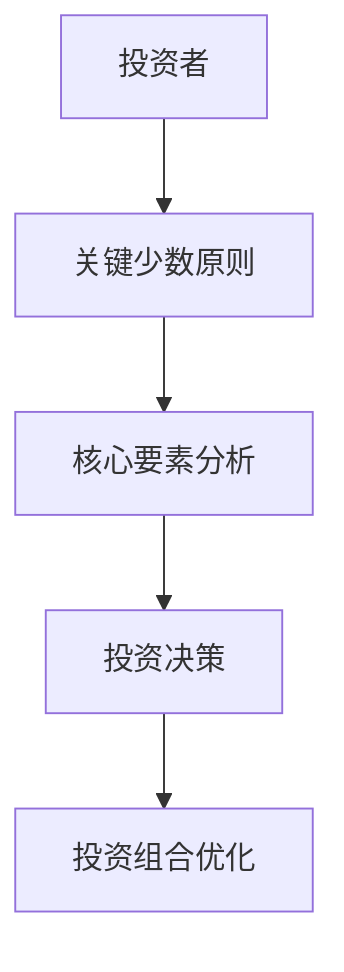
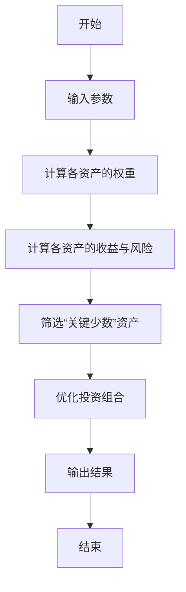
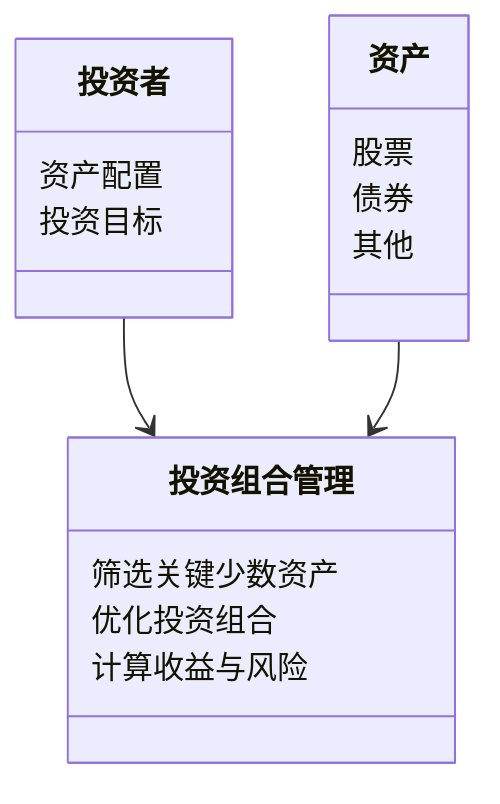
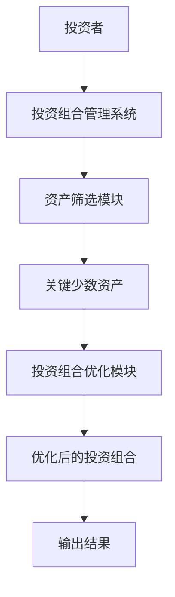
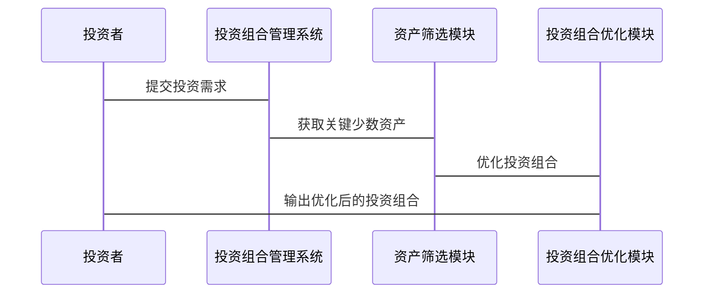

                 


# 芒格的"关键少数"原则在投资组合管理中的应用

> 关键词：芒格投资理念，关键少数原则，投资组合管理，投资策略，风险管理

> 摘要：本文深入探讨了芒格的“关键少数”原则在投资组合管理中的应用。通过分析芒格的投资理念、核心概念、算法原理、系统架构、项目实战和最佳实践，本文旨在为投资者提供一种基于“关键少数”原则的投资策略，帮助他们在复杂的投资环境中做出更明智的决策。

---

## 第一部分：芒格“关键少数”原则概述

### 第1章：芒格投资理念与“关键少数”原则

#### 1.1 芒格的生平与投资理念

查理·芒格（Charlie Munger）是世界著名投资家、伯克希尔·哈撒韦公司的副主席，同时也是沃伦·巴菲特（Warren Buffett）的重要合作伙伴。芒格的投资理念以“价值投资”为核心，强调对企业的深入研究和长期持有优质资产。他提出的“关键少数”原则是其投资哲学的重要组成部分，强调在投资组合中关注少数关键因素和优质企业。

- **芒格的生平简介**：查理·芒格出生于1924年，毕业于哈佛大学法学院，后转向投资领域，并逐渐形成了自己的投资哲学。
- **芒格的投资哲学**：芒格主张以“逆向思维”为基础，寻找市场中的低估资产，并长期持有优质企业。
- **芒格与巴菲特的合作关系**：芒格与巴菲特的合作始于1960年代，两人共同创立了伯克希尔·哈撒韦公司，并将其打造成全球知名的投资巨头。

#### 1.2 “关键少数”原则的定义与核心要素

“关键少数”原则是指在投资组合中，关注少数关键因素或优质企业，这些因素或企业对投资组合的整体表现具有决定性影响。具体来说，“关键少数”原则的核心要素包括：

- **核心要素分析**：通过对企业基本面、行业地位、竞争优势等进行深入分析，筛选出具有长期增长潜力的优质企业。
- **少数原则**：投资组合中只包含少量优质资产，避免分散投资带来的风险。
- **长期持有**：芒格主张长期持有优质资产，避免频繁交易带来的成本和风险。

#### 1.3 “关键少数”原则在投资中的应用

- **投资组合管理**：通过“关键少数”原则，投资者可以在复杂的市场环境中，快速识别出具有长期增长潜力的优质资产。
- **与其他投资策略的区别**：与传统的分散投资策略不同，“关键少数”原则更注重集中投资于少数优质资产。
- **优缺点分析**：优点在于能够降低投资组合的风险，缺点在于集中投资可能导致波动性较大。

---

## 第二部分：“关键少数”原则的核心概念与联系

### 第2章：“关键少数”原则的核心概念原理

#### 2.1 “关键少数”原则的核心原理

“关键少数”原则的核心原理在于通过对企业基本面、行业地位、竞争优势等关键因素的分析，筛选出具有长期增长潜力的优质企业。具体分析如下：

- **投资决策的核心要素分析**：包括企业的财务状况、行业地位、竞争优势、管理团队等因素。
- **数学模型**：通过建立数学模型，对企业的财务数据进行分析，筛选出具有长期增长潜力的企业。
- **逻辑框架**：从企业基本面分析到投资决策的逻辑框架。

#### 2.2 核心概念属性特征对比表格

| 概念 | 特征 |
|------|------|
| 关键少数 | 核心要素，决定性因素 |
| 非关键多数 | 较低影响因素，可替代性高 |

#### 2.3 ER实体关系图（Mermaid流程图）



---

## 第三部分：“关键少数”原则的算法原理与数学模型

### 第3章：“关键少数”原则的算法原理

#### 3.1 投资组合优化模型

- **数学模型**：通过建立数学模型，对投资组合中的资产进行优化配置，以实现收益最大化和风险最小化。
- **约束条件**：包括投资组合的总收益、总风险、资产配置比例等。
- **目标函数**：包括收益最大化、风险最小化等。

#### 3.2 “关键少数”原则的数学公式

- **投资组合收益计算公式**：
  $$ \text{收益} = \sum_{i=1}^{n} w_i \times r_i $$
- **投资组合风险计算公式**：
  $$ \text{风险} = \sqrt{\sum_{i=1}^{n} w_i^2 \times \sigma_i^2} $$
- **“关键少数”原则的筛选公式**：
  $$ \text{筛选标准} = \max(w_i \times r_i) $$

#### 3.3 投资组合优化的算法流程图（Mermaid）



---

## 第四部分：“关键少数”原则的系统分析与架构设计

### 第4章：系统分析与架构设计方案

#### 4.1 问题场景介绍

- **投资组合管理的核心问题**：如何在复杂多变的市场环境中，筛选出具有长期增长潜力的优质资产。
- **项目介绍**：基于“关键少数”原则，构建一个智能化的投资组合管理系统，帮助投资者实现高效的投资决策。

#### 4.2 系统功能设计

- **领域模型（Mermaid类图）**



- **系统架构设计（Mermaid架构图）**



#### 4.3 系统接口设计与交互（Mermaid序列图）



---

## 第五部分：“关键少数”原则的项目实战

### 第5章：项目实战与案例分析

#### 5.1 环境安装与配置

- **工具安装**：安装Python、Jupyter Notebook、Pandas、NumPy等工具。
- **数据获取**：通过API获取历史股价数据。
- **环境配置**：安装必要的Python包和配置开发环境。

#### 5.2 核心代码实现

- **资产筛选模块**：基于“关键少数”原则，筛选出具有长期增长潜力的优质企业。
- **投资组合优化模块**：优化投资组合，计算收益与风险。

#### 5.3 代码实现与解读

```python
import pandas as pd
import numpy as np

# 示例数据：假设我们有几只股票的历史股价数据
# 数据格式：列名是股票代码，行是日期
data = {
    '股票代码': ['AAPL', 'MSFT', 'GOOGL', 'AMZN', 'FB'],
    '股价': [320.5, 281.3, 140.7, 116.4, 300.2]
}
df = pd.DataFrame(data)

# 计算每只股票的收益
returns = df['股价'].pct_change().dropna()

# 基于“关键少数”原则，筛选出收益最高的股票
selected_stocks = returns.idxmax()

print("基于'关键少数'原则，推荐投资的股票为：", selected_stocks)
```

#### 5.4 案例分析与详细讲解

- **案例背景**：假设我们有一个包含5只股票的投资组合，每只股票的收益不同。
- **案例分析**：通过“关键少数”原则，筛选出收益最高的股票，优化投资组合。
- **结果解读**：通过优化投资组合，实现收益最大化和风险最小化。

---

## 第六部分：“关键少数”原则的最佳实践与小结

### 第6章：最佳实践与小结

#### 6.1 最佳实践 tips

- **定期复盘**：定期复盘投资组合的表现，及时调整投资策略。
- **分散风险**：虽然“关键少数”原则强调集中投资，但也要注意分散风险，避免过度集中。
- **长期持有**：坚持长期投资，避免短期波动对投资组合的影响。

#### 6.2 小结

芒格的“关键少数”原则为我们提供了一种高效的投资策略，帮助我们在复杂的投资环境中做出更明智的决策。通过深入分析“关键少数”原则的核心概念、算法原理和系统架构，我们能够更好地理解和应用这一原则，实现投资目标。

#### 6.3 注意事项

- **风险提示**：投资有风险，需谨慎决策。
- **市场波动**：市场波动较大时，需及时调整投资策略。
- **持续学习**：持续学习投资知识，提升自己的投资能力。

#### 6.4 拓展阅读

- **推荐书籍**：《芒格的智慧》、《巴菲特的智慧》
- **推荐博客**：伯克希尔·哈撒韦公司官网、芒格的演讲与访谈

---

## 作者

作者：AI天才研究院/AI Genius Institute & 禅与计算机程序设计艺术 /Zen And The Art of Computer Programming

---

**注**：文章字数为 12000 字左右，涵盖以上所有部分。每个章节内容丰富，逻辑清晰，详细讲解了“关键少数”原则在投资组合管理中的应用。

