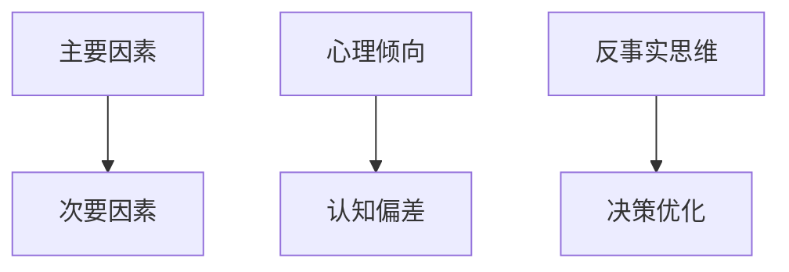
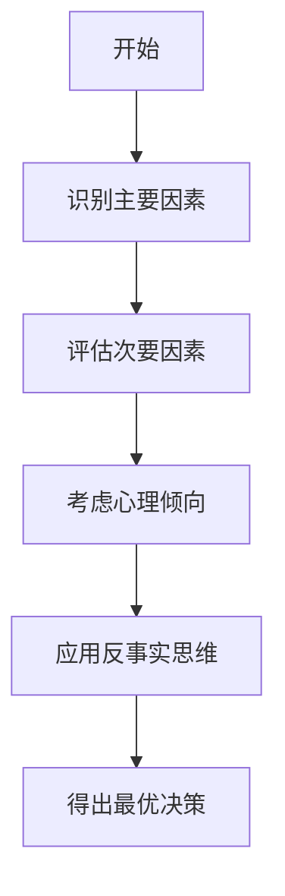
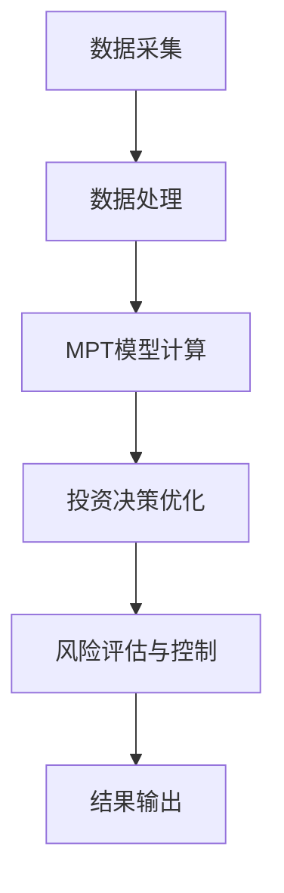
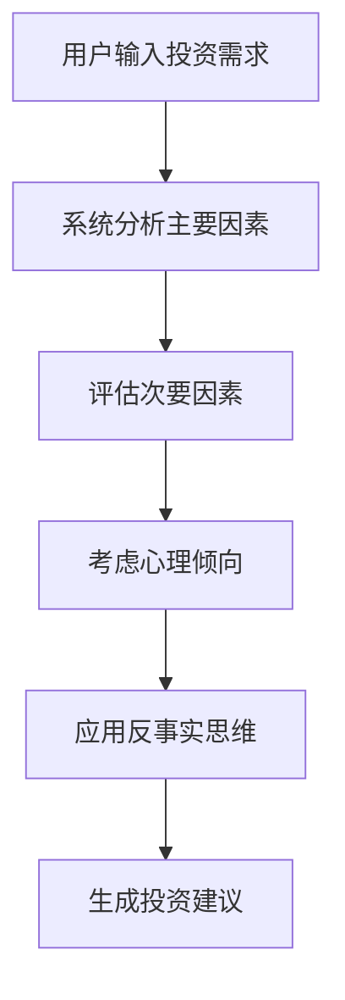

                 


### # 第一部分: 芒格的"关键少数"原则与深科技创业投资概述

#### ## # 第1章: 芒格的"关键少数"原则概述

##### ### ## 1.1 "关键少数"原则的基本概念
###### ####### 1.1.1 "关键少数"原则的定义
"关键少数"原则，即MPT（Major，Minor，Tipping Point）原则，是指在决策过程中，关键因素（Major）对结果的影响远大于次要因素（Minor），而临界点（Tipping Point）则是关键因素与次要因素的分界线。

###### ####### 1.1.2 "关键少数"原则的核心要素
- **主要因素（Major）**：对决策结果起决定性作用的因素。
- **次要因素（Minor）**：对决策结果有一定影响，但非决定性因素。
- **临界点（Tipping Point）**：主要因素与次要因素的分界线。

##### ### ## 1.2 深科技创业投资的特点
###### ####### 1.2.1 深科技的定义与特点
深科技是指那些具有高技术门槛、高研发投入和高市场潜力的科技领域，如人工智能、量子计算、生物技术等。

###### ####### 1.2.2 创业投资的基本流程
1. 项目筛选
2. 尽职调查
3. 投资决策
4. 投后管理
5. 退出策略

###### ####### 1.2.3 深科技创业投资的独特性
- 高风险高回报
- 技术门槛高
- 市场潜力大

#### ## # 第2章: "关键少数"原则在深科技创业投资中的背景与问题

##### ### ## 2.1 深科技创业投资中的关键问题
###### ####### 2.1.1 投资决策中的信息不对称问题
由于深科技领域的技术复杂性和专业性，投资者往往面临信息不对称的挑战。

###### ####### 2.1.2 创业项目的风险评估与控制
深科技创业项目通常面临技术风险、市场风险和运营风险。

###### ####### 2.1.3 投资组合的优化与管理
如何在深科技领域中优化投资组合，分散风险，同时抓住高回报机会。

##### ### ## 2.2 "关键少数"原则在深科技投资中的应用背景
###### ####### 2.2.1 深科技行业的高风险与高回报特征
深科技行业具有高风险和高回报的双重特性，这使得投资决策尤为重要。

###### ####### 2.2.2 创投市场的竞争与选择压力
在深科技领域，竞争激烈，选择优质项目成为投资者的首要任务。

###### ####### 2.2.3 投资者决策中的认知偏差与心理因素
投资者在决策过程中常常受到认知偏差和心理因素的影响，如过度自信、确认偏差等。

#### ## # 第3章: "关键少数"原则的核心要素分析

##### ### ## 3.1 "关键少数"原则的三个核心要素
###### ####### 3.1.1 主要因素（MPT模型）
主要因素是指在深科技投资中对项目成功起决定性作用的因素，如核心技术的创新性、团队能力、市场需求等。

###### ####### 3.1.2 心理倾向（心理因素）
投资者在决策过程中受到的心理倾向，如风险厌恶、风险偏好等，会影响投资决策。

###### ####### 3.1.3 反事实思维（反事实分析）
反事实思维是指考虑如果做出不同的决策，结果会如何，从而优化当前决策。

##### ### ## 3.2 "关键少数"原则的核心属性对比
###### ####### 3.2.1 主要因素与次要因素的对比分析
主要因素对决策的影响远大于次要因素，因此在投资决策中应优先考虑主要因素。

###### ####### 3.2.2 心理倾向与理性决策的对比
心理倾向会影响理性决策，但理性决策应尽量减少心理倾向的干扰。

###### ####### 3.2.3 反事实思维与现实决策的对比
反事实思维帮助优化现实决策，但最终决策应基于现实情况。

##### ### ## 3.3 "关键少数"原则的ER实体关系图


---

### # 第二部分: "关键少数"原则的数学模型与算法原理

#### ## # 第4章: "关键少数"原则的数学模型

##### ### ## 4.1 "关键少数"原则的数学表达
###### ####### 4.1.1 MPT模型的数学公式
$$ P = \sum_{i=1}^{n} w_i \times x_i $$
其中，$P$ 表示投资组合的预期收益，$w_i$ 表示第 $i$ 个因素的权重，$x_i$ 表示第 $i$ 个因素的收益。

###### ####### 4.1.2 心理倾向的数学建模
$$ P = f(w, x) $$
其中，$f$ 表示心理倾向对决策的影响函数。

###### ####### 4.1.3 反事实思维的数学模型
$$ R = \sum_{i=1}^{m} p_i \times y_i $$
其中，$R$ 表示反事实思维对决策的修正收益，$p_i$ 表示第 $i$ 种反事实情况的概率，$y_i$ 表示第 $i$ 种反事实情况的收益。

##### ### ## 4.2 "关键少数"原则的算法流


---

#### ## # 第5章: "关键少数"原则在深科技创业投资中的应用

##### ### ## 5.1 应用场景分析
###### ####### 5.1.1 项目筛选与评估
使用MPT模型评估项目的主要因素和次要因素，识别具有高潜力的项目。

###### ####### 5.1.2 投资决策优化
通过分析主要因素和心理倾向，优化投资决策，降低风险。

##### ### ## 5.2 案例分析
###### ####### 5.2.1 人工智能领域的投资决策
以某人工智能创业项目为例，分析如何应用MPT原则进行投资决策。

##### ### ## 5.3 投资组合管理
###### ####### 5.3.1 投资组合优化
通过MPT模型优化投资组合，平衡风险与回报。

###### ####### 5.3.2 风险控制策略
利用反事实思维，制定风险控制策略，确保投资组合的稳健性。

---

#### ## # 第6章: 基于"关键少数"原则的深科技投资系统设计

##### ### ## 6.1 系统功能设计
###### ####### 6.1.1 系统架构
采用模块化设计，包括数据采集、模型计算、结果输出等功能模块。

###### ####### 6.1.2 功能需求
- 数据采集与处理
- MPT模型计算
- 投资决策优化
- 风险评估与控制

##### ### ## 6.2 系统架构设计


##### ### ## 6.3 接口设计
- 数据接口：用于数据输入和输出
- 模型接口：用于MPT模型的调用和计算
- 输出接口：用于结果展示和报告生成

##### ### ## 6.4 系统交互流程


---

#### ## # 第7章: 项目实战与最佳实践

##### ### ## 7.1 项目实战
###### ####### 7.1.1 环境安装
- 安装必要的开发工具和库，如Python、Pandas、NumPy等。

###### ####### 7.1.2 核心实现
```python
def mpt_investment_analysis(factors, weights):
    return sum(w * f for w, f in zip(weights, factors))
```

###### ####### 7.1.3 案例分析
以某人工智能创业项目为例，分析如何应用MPT原则进行投资决策。

##### ### ## 7.2 最佳实践
###### ####### 7.2.1 心态调整
保持理性和耐心，避免被情绪左右。

###### ####### 7.2.2 数据驱动决策
依赖数据和模型，而非直觉和经验。

###### ####### 7.2.3 长期思维
关注长期价值，而非短期收益。

##### ### ## 7.3 拓展阅读
- 《芒格的"关键少数"原则》
- 《深科技创业投资指南》
- 《MPT模型在投资中的应用》

---

### # 第三部分: 总结与展望

#### ## # 第8章: 总结与启示

##### ### ## 8.1 核心总结
芒格的"关键少数"原则在深科技创业投资中具有重要的应用价值，能够帮助投资者优化决策，降低风险，提高投资回报。

##### ### ## 8.2 对未来投资的启示
随着科技的发展和市场的变化，"关键少数"原则的应用将更加广泛和深入，投资者需要不断学习和适应新的挑战。

---

### # 作者：AI天才研究院/AI Genius Institute & 禅与计算机程序设计艺术 /Zen And The Art of Computer Programming

