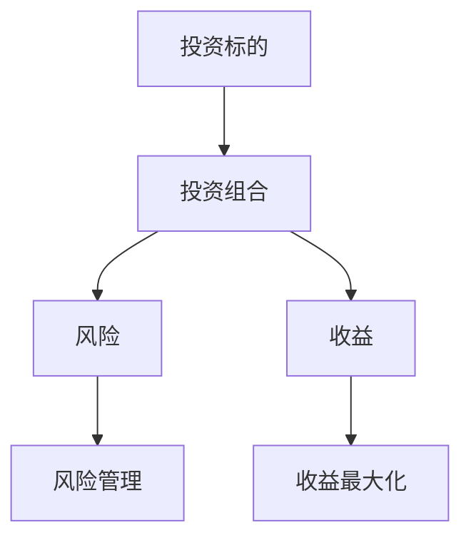
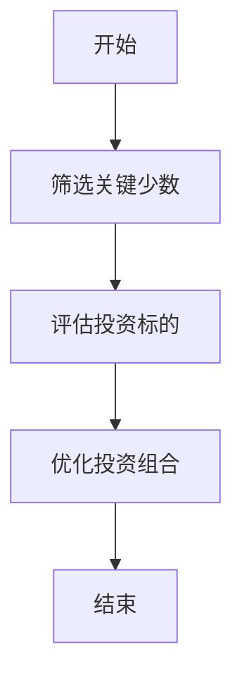
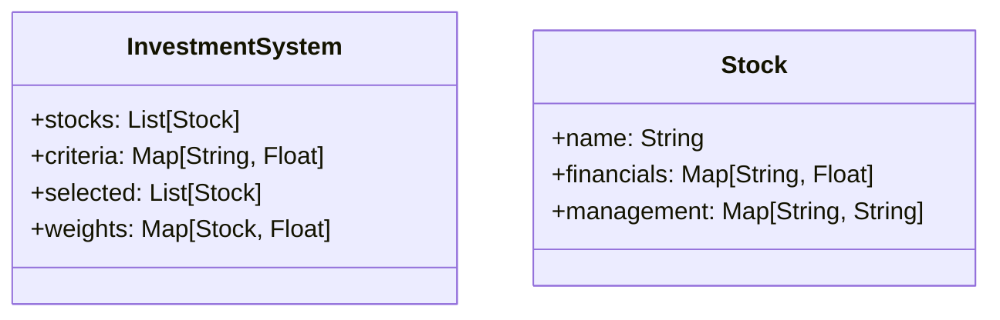

                 


# 芒格的"关键少数"原则：集中投资的智慧

> **关键词**：芒格、关键少数、集中投资、投资原则、价值投资、风险管理、投资策略  
> **摘要**：本文深入探讨了芒格的“关键少数”原则，分析其在投资决策中的应用逻辑，结合算法原理、系统架构和项目实战，全面解读该原则在现代投资中的智慧与实践价值。

---

# 第一部分：芒格“关键少数”原则的背景与核心理念

## 第1章：芒格“关键少数”原则的起源与核心思想

### 1.1 芒格投资哲学的起源

#### 1.1.1 芒格的生平简介

查理·芒格（Charlie Munger）是世界著名投资者、巴菲特的合伙人，被誉为“投资界的哲学家”。芒格的投资哲学以“价值投资”为核心，强调对投资标的深刻理解以及对风险的严格控制。

#### 1.1.2 芒格投资哲学的核心思想

芒格的投资哲学强调“逆向思考”和“理性决策”，主张通过分析企业的基本面、行业地位和竞争优势，寻找具有长期价值的投资标的。

#### 1.1.3 “关键少数”原则的提出背景

在芒格的投资实践中，他发现市场中大多数投资机会都具有高度不确定性，而只有少数优质企业能够长期创造超额收益。因此，他提出了“关键少数”原则，主张集中投资于少数具有强大竞争优势的企业。

### 1.2 “关键少数”原则的定义与内涵

#### 1.2.1 什么是“关键少数”原则

“关键少数”原则是指在投资组合中，集中投资于少数具有长期竞争优势、稳定财务表现和良好管理的企业，而非分散投资于大量低质量的企业。

#### 1.2.2 “关键少数”原则的核心要素

- **少数优质企业**：选择具有强大竞争优势、良好财务状况和长期增长潜力的企业。
- **集中投资**：将大部分资金集中投资于少数优质企业，降低投资组合的复杂性和风险。
- **长期视角**：关注企业的长期价值，而非短期市场波动。

#### 1.2.3 该原则在投资中的应用逻辑

- **降低风险**：通过集中投资于少数优质企业，减少投资组合的波动性和不确定性。
- **提高收益**：通过长期持有优质企业，获得其复利增长的收益。

### 1.3 “关键少数”原则与现代投资理论的对比

#### 1.3.1 现代投资组合理论概述

现代投资组合理论（MPT）主张通过分散投资来降低风险，认为通过投资于不同资产类别和行业的企业，可以有效降低整体投资组合的波动性。

#### 1.3.2 “关键少数”原则的独特性

与现代投资组合理论相比，“关键少数”原则更加注重投资标的的质量和长期价值，而非单纯追求分散化。该原则认为，通过集中投资于少数优质企业，可以获得更高的长期收益。

#### 1.3.3 两种理念的优缺点分析

| 理论 | 优点 | 缺点 |
|------|------|------|
| 现代投资组合理论 | 分散化降低风险，适合风险厌恶型投资者 | 需要大量优质企业，难以在熊市中获得超额收益 |
| “关键少数”原则 | 高收益潜力，投资逻辑简单 | 高风险集中，市场波动可能导致短期亏损 |

---

## 第2章：芒格“关键少数”原则的核心概念与联系

### 2.1 “关键少数”原则的核心概念

#### 2.1.1 投资标的筛选标准

- **行业地位**：选择行业龙头或具有竞争优势的企业。
- **财务表现**：关注企业的盈利能力、现金流和资产负债表。
- **管理团队**：优秀的管理团队是企业长期成功的关键。

#### 2.1.2 投资组合的集中度

“关键少数”原则强调投资组合的集中度，通常将资金集中在3-5家优质企业中。

#### 2.1.3 风险与收益的平衡

通过集中投资于优质企业，投资者可以在长期获得超额收益，同时通过选择具有强大护城河的企业降低风险。

### 2.2 核心概念的属性特征对比

| 概念 | 属性特征 |
|------|----------|
| 投资标的 | 质量、竞争优势、长期增长潜力 |
| 投资组合 | 集中度、质量、风险 |
| 风险与收益 | 长期收益、短期波动、护城河 |

### 2.3 ER实体关系图架构



---

## 第3章：芒格“关键少数”原则的算法原理

### 3.1 算法原理概述

#### 3.1.1 集中投资的逻辑

“关键少数”原则的算法核心在于筛选出优质企业，并将资金集中投资于这些企业。

#### 3.1.2 关键少数筛选的算法流程

1. 筛选优质企业：根据财务指标、行业地位和管理团队等标准筛选出优质企业。
2. 计算投资权重：根据企业的质量评分，确定每个企业的投资权重。
3. 构建投资组合：将资金集中投资于少数优质企业。

#### 3.1.3 投资组合优化的数学模型

$$ \text{收益} = \sum_{i=1}^{n} w_i \times r_i $$

其中，$w_i$ 是第 $i$ 个企业的权重，$r_i$ 是第 $i$ 个企业的预期收益。

### 3.2 算法流程图



### 3.3 算法实现代码

```python
def key_minority_investment(stocks, criteria):
    selected = []
    for stock in stocks:
        if stock[criteria] > threshold:
            selected.append(stock)
    return selected
```

---

## 第4章：芒格“关键少数”原则的系统分析与架构设计

### 4.1 系统功能设计

#### 4.1.1 系统功能模块

- 数据采集模块：收集企业财务数据、行业信息和市场数据。
- 标的筛选模块：根据预设标准筛选优质企业。
- 投资组合优化模块：根据筛选结果优化投资组合。

#### 4.1.2 领域模型（Mermaid 类图）



#### 4.1.3 系统架构设计（Mermaid 架构图）


---

## 第5章：芒格“关键少数”原则的项目实战

### 5.1 项目背景与目标

选择一个具体的行业，如科技行业，筛选出具有长期竞争优势的企业进行投资。

### 5.2 核心代码实现

```python
def main():
    stocks = [
        {'name': '苹果', '财务指标': 90, '管理团队': '优秀'},
        {'name': '谷歌', '财务指标': 85, '管理团队': '优秀'},
        {'name': '微软', '财务指标': 80, '管理团队': '良好'},
    ]
    threshold = 80
    selected = key_minority_investment(stocks, '财务指标')
    print("精选投资标的：", selected)

if __name__ == "__main__":
    main()
```

### 5.3 实际案例分析

以科技行业为例，筛选出财务指标和管理团队均为“优秀”的企业，如苹果和谷歌，集中投资于这两家企业。

### 5.4 代码应用解读与分析

通过代码实现，我们可以看到“关键少数”原则在实际投资中的应用逻辑：通过筛选优质企业，集中投资于少数标的，从而实现长期收益最大化。

---

## 第6章：芒格“关键少数”原则的最佳实践

### 6.1 最佳实践 tips

- **集中投资**：将资金集中投资于少数优质企业。
- **长期视角**：关注企业的长期价值，而非短期波动。
- **风险管理**：通过选择具有强大护城河的企业降低风险。

### 6.2 小结

芒格的“关键少数”原则是一种高效的投资策略，通过集中投资于少数优质企业，投资者可以在长期获得超额收益。

### 6.3 注意事项

- 避免过度集中投资，需根据市场环境调整投资组合。
- 定期评估投资标的，及时调整投资策略。

### 6.4 拓展阅读

- 《芒格的投资思想》
- 《投资的智慧：芒格的投资策略》

---

# 结语

芒格的“关键少数”原则是一种以质量为导向的投资策略，通过集中投资于少数优质企业，投资者可以在长期获得超额收益。本文通过理论分析、算法实现和项目实战，全面解读了该原则的智慧与实践价值。

---

**作者：AI天才研究院/AI Genius Institute & 禅与计算机程序设计艺术 /Zen And The Art of Computer Programming**

