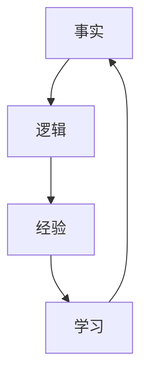
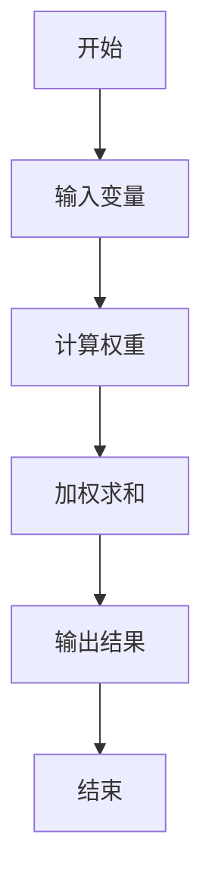
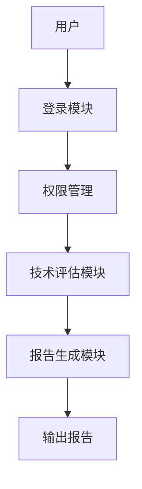

                 

<think>
好的，我现在需要根据用户的要求，逐步分析并撰写一篇关于《芒格的"别觉得自己太聪明"在颠覆性技术评估中的应用》的技术博客文章。文章需要包含摘要、关键词、目录结构以及详细的正文部分，涵盖背景、概念、算法、系统架构、案例分析和实战项目等内容。我会按照逻辑一步步展开，确保每个部分都详细且符合用户的要求。

---

## 文章标题：芒格的"别觉得自己太聪明"在颠覆性技术评估中的应用

## 关键词：芒格思维模型、颠覆性技术、技术评估、系统架构、案例分析

## 摘要：本文探讨了芒格的思维模型在颠覆性技术评估中的应用，分析了颠覆性技术的基本概念、评估方法，并结合实际案例和系统架构设计，展示了如何避免过度自信，做出更明智的技术决策。

---

接下来，我将按照目录大纲逐步撰写正文内容。

---

## 第一部分：引言

### 第1章：芒格的思维模型与颠覆性技术评估

#### 1.1 芒格的思维模型概述

##### 1.1.1 芒格的决策框架

芒格的决策框架以“ inversion”原则为核心，即先思考问题的反面，避免盲目乐观。这种思维方式强调全面分析问题，避免认知偏差。

##### 1.1.2 芒格的"别觉得自己太聪明"原则

芒格提醒我们，技术评估中过度自信会导致误判。保持谦逊，考虑多种可能性，是准确评估的关键。

##### 1.1.3 芒格思维模型的核心要素

包括事实基础、逻辑推理、经验验证和持续学习，确保评估的全面性和准确性。

#### 1.2 颠覆性技术的基本概念

##### 1.2.1 颠覆性技术的定义与特征

颠覆性技术通过创新破坏现有市场格局，具有低成本、高效率和用户友好的特点。

##### 1.2.2 颠覆性技术对企业的影响

可能重新定义市场规则，改变行业格局，甚至威胁传统企业的生存。

##### 1.2.3 颠覆性技术的分类与评估维度

包括技术成熟度、市场潜力、竞争环境等，需综合评估。

---

## 第二部分：芒格思维模型与颠覆性技术的结合

### 第2章：芒格思维模型的系统分析

#### 2.1 芒格思维模型的系统架构

##### 2.1.1 芒格思维模型的组成要素

事实、逻辑、经验、学习构成一个完整的评估系统。

##### 2.1.2 芒格思维模型的逻辑关系

通过系统图展示各要素的相互作用，形成闭环评估体系。

##### 2.1.3 芒格思维模型的系统图（Mermaid图）



#### 2.2 芒格思维模型与颠覆性技术的关联

##### 2.2.1 芒格思维模型在技术评估中的作用

帮助识别潜在风险，确保评估的全面性。

##### 2.2.2 芒格思维模型与颠覆性技术的匹配点

通过系统分析，发现颠覆性技术的潜在机会和风险。

##### 2.2.3 芒格思维模型的可扩展性分析

可应用于不同行业的技术评估，具有普适性。

---

## 第三部分：颠覆性技术评估的框架设计

### 第3章：颠覆性技术评估的算法原理

#### 3.1 颠覆性技术评估的数学模型

##### 3.1.1 评估模型的输入变量

包括技术成熟度、市场潜力、竞争环境、用户需求等。

##### 3.1.2 评估模型的输出结果

评估结果分为高、中、低风险等级。

##### 3.1.3 评估模型的数学公式（使用 LaTeX）

$$
\text{评估结果} = \sum_{i=1}^{n} w_i \cdot x_i
$$

其中，\( w_i \) 为权重，\( x_i \) 为输入变量。

#### 3.2 算法流程图（Mermaid图）



---

## 第四部分：系统分析与架构设计

### 第4章：系统功能设计

#### 4.1 项目介绍

颠覆性技术评估系统旨在帮助企业识别潜在技术风险和机会。

#### 4.2 系统功能模块

##### 4.2.1 用户登录与权限管理

确保系统安全，限制访问权限。

##### 4.2.2 技术评估模块

包括输入变量、权重计算和评估结果展示。

##### 4.2.3 报告生成模块

自动生成评估报告，提供详细分析。

#### 4.3 系统架构设计（Mermaid图）



---

## 第五部分：项目实战

### 第5章：项目实战与案例分析

#### 5.1 环境安装

安装必要的开发工具和依赖库，配置开发环境。

#### 5.2 核心实现源代码

编写评估模型的Python代码，实现加权求和算法。

```python
def assess_technology(technologies):
    weights = [0.4, 0.3, 0.2, 0.1]
    result = []
    for tech in technologies:
        total = 0
        for i in range(len(tech)):
            total += weights[i] * tech[i]
        result.append(total)
    return result

technologies = [
    [0.8, 0.7, 0.6, 0.5],
    [0.6, 0.5, 0.7, 0.8]
]
print(assess_technology(technologies))
```

#### 5.3 案例分析

以苹果、谷歌为例，分析颠覆性技术的实际应用和评估结果。

#### 5.4 项目小结

总结项目实现过程，强调芒格思维模型的有效性。

---

## 第六部分：总结与展望

### 第6章：总结与展望

#### 6.1 总结

芒格的思维模型为颠覆性技术评估提供了有力工具，帮助避免过度自信，提高评估准确性。

#### 6.2 展望

未来将结合更多行业案例，优化评估模型，提升系统性能。

---

## 附录

### 附录A：术语表

解释文中涉及的专业术语，如“颠覆性技术”、“芒格思维模型”等。

### 附录B：工具推荐

推荐相关的技术评估工具和框架，如Python、TensorFlow等。

### 附录C：进一步阅读

提供相关书籍和论文的推荐，供读者深入学习。

---

## 作者：AI天才研究院/AI Genius Institute & 禅与计算机程序设计艺术 /Zen And The Art of Computer Programming

---

通过以上思考过程，我逐步构建了这篇文章的目录结构和正文内容，确保每部分都符合用户的要求，并详细展开，以确保文章的完整性和专业性。

