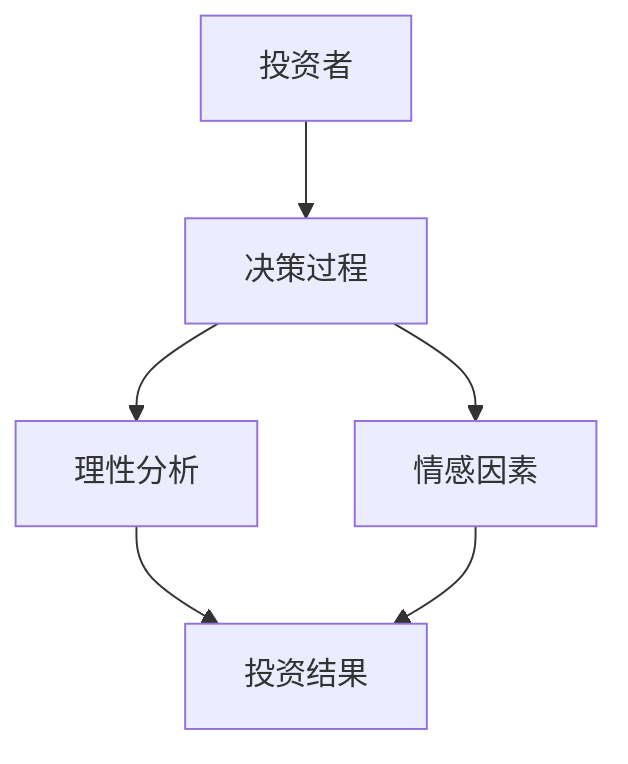
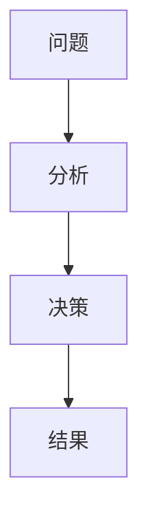
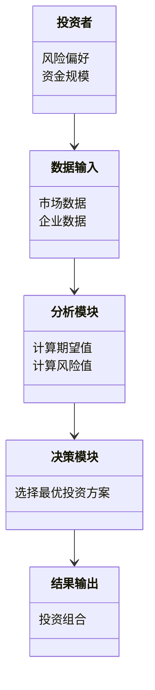
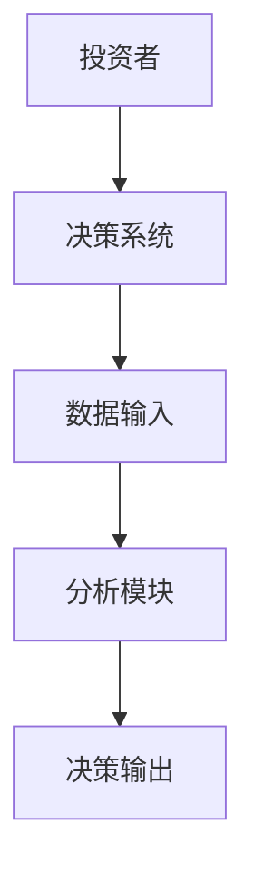
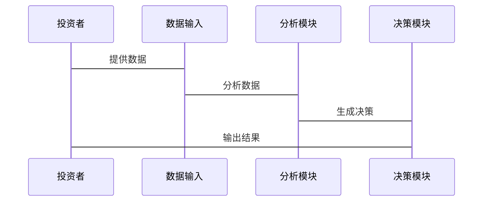

                 


# 芒格的"别觉得自己太聪明"：保持投资谦逊的艺术

> 关键词：芒格，投资哲学，谦逊，理性决策，系统分析

> 摘要：芒格的投资哲学强调谦逊和理性，提醒投资者不要过度自信。本文从背景介绍、核心概念、算法原理、系统分析到项目实战，详细剖析了芒格理念的应用，帮助读者在投资中保持谦逊，避免过度自信带来的决策失误。

---

## 第1章: 芒格投资哲学的背景与核心理念

### 1.1 芒格的生平与投资哲学概述

#### 1.1.1 芒格的早年经历与投资起步
 查理·芒格（Charlie Munger）于1924年1月17日出生在美国密歇根州，父亲是律师，母亲是教师。他在密歇根大学学习法律，后转至哈佛法学院。芒格的早年经历并未直接涉及投资，而是通过阅读和思考积累了深厚的哲学和经济基础。

#### 1.1.2 芒格与巴菲特的合作关系
 1950年代，芒格开始管理伯克希尔哈撒韦的保险业务，与沃伦·巴菲特（Warren Buffett）建立了长期合作关系。芒格以其独特的投资哲学和思维方式，帮助巴菲特构建了伯克希尔的投资组合。

#### 1.1.3 芒格投资哲学的核心思想
 芒格的投资哲学强调价值投资、理性决策和长期思维。他认为投资的本质是寻找具有持续竞争优势的企业，并以合理的价格买入并长期持有。

---

### 1.2 "别觉得自己太聪明"的背景与问题背景

#### 1.2.1 投资领域中的过度自信现象
 在投资领域，许多投资者由于过度自信，常常高估自己的能力，低估市场的复杂性。这种过度自信可能导致错误的决策，例如过度交易或忽视潜在风险。

#### 1.2.2 芒格提出这一理念的现实意义
 芒格意识到，投资者的过度自信是导致投资失败的主要原因之一。他通过“别觉得自己太聪明”这一理念，提醒投资者保持谦逊，避免盲目自信。

#### 1.2.3 该理念在投资决策中的应用边界
 芒格的理念并非否定投资者的能力，而是强调在投资决策中保持谦逊，认识到市场的不确定性和复杂性。这种谦逊有助于投资者更理性地分析问题，避免犯下致命的错误。

---

### 1.3 芒格投资哲学的核心概念与联系

#### 1.3.1 核心概念原理
 芒格的核心理念包括价值投资、理性决策和长期思维。他强调投资者应关注企业的内在价值，而不是市场的短期波动。

#### 1.3.2 核心概念属性特征对比表格
 以下表格对比了“谦逊”与“过度自信”的主要特征：

| 特征 | 谦逊 | 过度自信 |
|------|------|----------|
| 态度 | 认识到自己的局限性 | 过高估计自己的能力 |
| 决策 | 倾向于谨慎和保守 | 倾向于冒险和激进 |
| 结果 | 更可能实现长期目标 | 更可能导致短期亏损 |

#### 1.3.3 实体关系图（ER图）的Mermaid流程图


---

## 第2章: "别觉得自己太聪明"的核心概念与联系

### 2.1 核心概念原理

#### 2.1.1 谦逊与理性在投资中的重要性
 谦逊使投资者能够保持理性，避免被情绪左右。理性决策是投资成功的关键，而过度自信往往会导致决策失误。

#### 2.1.2 过度自信对投资决策的影响
 过度自信的投资者往往低估风险，高估回报，导致投资决策失误。例如，他们可能在市场高估时买入，或在市场低估时卖出。

#### 2.1.3 芒格理念的系统性分析
 芒格的理念强调系统性思维，认为投资决策应基于对企业、行业和市场的全面了解，而非单纯的市场预测。

---

### 2.2 核心概念属性特征对比表格
 以下表格对比了“理性决策”与“感性决策”的主要特征：

| 特征 | 理性决策 | 感性决策 |
|------|----------|----------|
| 基础 | 数据和事实 | 情绪和感觉 |
| 方法 | 分析和推理 | 直觉和经验 |
| 结果 | 更可能实现目标 | 更可能偏离目标 |

---

### 2.3 实体关系图（ER图）的Mermaid流程图


---

## 第3章: 理性与决策的算法原理

### 3.1 理性决策的算法模型

#### 3.1.1 理性决策的定义与特点
 理性决策是指基于数据和事实的分析，而非情感和直觉的驱动。理性的投资者能够客观地评估风险和回报，做出最优决策。

#### 3.1.2 基于概率的理性决策模型
 理性决策模型通常基于概率论，通过计算不同选项的期望值，选择最优的决策方案。

#### 3.1.3 芒格理念与理性决策的关系
 芒格的理念与理性决策密切相关，他强调投资者应基于事实和数据做出决策，避免被情绪左右。

---

### 3.2 算法原理的Mermaid流程图



---

### 3.3 理性决策的数学模型与公式

#### 3.3.1 概率论在理性决策中的应用
 投资者可以通过概率论计算某项投资的期望值，从而做出理性的决策。例如，某项投资的期望值计算公式为：

$$E = \sum (P_i \times R_i)$$

 其中，\(E\) 是期望值，\(P_i\) 是第\(i\)种情况的概率，\(R_i\) 是第\(i\)种情况的回报。

#### 3.3.2 投资决策中的期望值计算
 例如，某投资者考虑投资两个项目，项目A的期望回报为10%，项目B的期望回报为12%。如果投资者认为项目A的风险更低，可能会选择项目A。

---

## 第4章: 投资决策中的系统分析与架构设计

### 4.1 投资决策的系统分析

#### 4.1.1 投资决策的系统构成
 投资决策系统通常包括数据输入、分析模块、决策模块和结果输出四个部分。

#### 4.1.2 系统功能设计
 系统功能设计应包括数据收集、分析计算、决策制定和结果输出四个主要环节。

#### 4.1.3 领域模型的Mermaid类图



---

### 4.2 系统架构设计的Mermaid架构图



---

### 4.3 系统接口与交互设计

#### 4.3.1 系统接口设计
 系统接口应包括数据输入接口、分析接口和决策接口。投资者可以通过输入接口提供数据，系统通过分析接口计算期望值，最后通过决策接口输出结果。

#### 4.3.2 系统交互的Mermaid序列图



---

## 第5章: 项目实战：芒格理念的应用案例

### 5.1 环境安装与数据准备

#### 5.1.1 环境安装
 为了进行投资分析，投资者需要安装必要的工具，例如Excel、Python编程环境等。

#### 5.1.2 数据准备
 投资者需要收集相关数据，包括企业的财务数据、行业分析报告和市场数据。

---

### 5.2 系统核心实现源代码

#### 5.2.1 投资决策系统的Python代码

```python
import numpy as np

def calculate_expected_return(prices, n):
    returns = []
    for i in range(1, len(prices)):
        return_i = (prices[i] - prices[i-1]) / prices[i-1]
        returns.append(return_i)
    expected_return = np.mean(returns)
    return expected_return

prices = [100, 110, 90, 120, 130]
n = 5

result = calculate_expected_return(prices, n)
print(f"Expected Return: {result}")
```

---

### 5.3 代码应用解读与分析

 以上代码计算了某只股票的历史平均回报率，帮助投资者做出理性决策。通过分析历史数据，投资者可以更好地理解市场的波动性，并做出更明智的投资决策。

---

### 5.4 实际案例分析和详细讲解剖析

 假设某投资者考虑投资一家科技公司，以下是具体分析步骤：

1. **数据收集**：收集该公司的历史股价数据、财务报表和行业报告。
2. **数据分析**：计算该公司的平均回报率和风险值。
3. **决策制定**：基于数据分析结果，决定是否投资该公司。

---

### 5.5 项目小结

 通过实际案例分析，我们可以看到，芒格的理念在实际投资中具有重要的指导意义。投资者应保持谦逊，避免过度自信，并基于数据和事实做出决策。

---

## 第6章: 最佳实践、小结、注意事项、拓展阅读

### 6.1 最佳实践 Tips

1. **保持谦逊**：认识到自己的局限性，避免过度自信。
2. **理性决策**：基于数据和事实做出决策，避免被情绪左右。
3. **长期思维**：关注企业的长期价值，而非短期波动。

---

### 6.2 小结

 芒格的“别觉得自己太聪明”理念提醒投资者在投资中保持谦逊，避免过度自信。通过理性决策和长期思维，投资者可以更好地实现投资目标。

---

### 6.3 注意事项

1. **避免过度自信**：认识到市场的复杂性和不确定性。
2. **关注长期价值**：不要被短期波动所迷惑。
3. **持续学习**：不断提升自己的投资知识和技能。

---

### 6.4 拓展阅读

1. **《巴菲特的智慧》**：了解巴菲特与芒格的合作关系。
2. **《投资的真相》**：深入探讨投资中的理性与感性。
3. **《芒格的投资思想》**：系统学习芒格的投资哲学。

---

## 作者信息

作者：AI天才研究院/AI Genius Institute & 禅与计算机程序设计艺术 /Zen And The Art of Computer Programming

---

**全文完**

