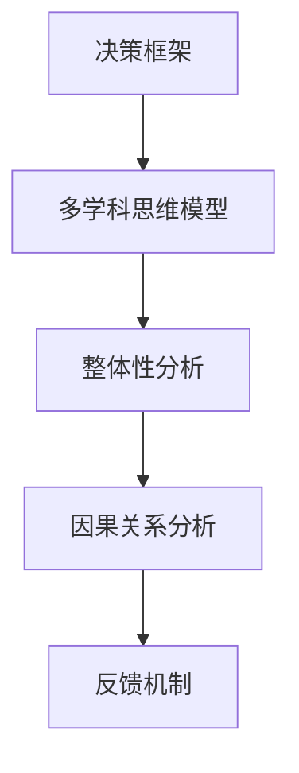

                 


# 芒格的"别觉得自己太聪明"：保持投资谦逊的重要性

## 关键词：芒格、投资理念、谦逊、理性思考、决策框架、价值投资

## 摘要：本文深入探讨了芒格的“别觉得自己太聪明”的投资理念，分析了其背后的哲学和实践意义。通过系统的背景介绍、核心概念解析、决策框架分析、项目实战以及最佳实践，本文旨在帮助读者理解芒格的投资智慧，并将其应用于实际投资中。

---

# 第一部分：芒格的生平与投资理念

## 第1章：芒格的生平简介

### 1.1 芒格的生平

查理·芒格（Charlie Munger）出生于1924年，是一位美国投资者、作家和企业家。他毕业于密歇根大学法学院，并在1950年代初期成为一名合伙律师。1960年代，芒格转向投资领域，并在1965年与沃伦·巴菲特（Warren Buffett）合作，共同管理伯克希尔哈撒韦公司（Berkshire Hathaway）。芒格以其独特的投资哲学和智慧闻名，成为价值投资领域的权威人物。

---

## 第2章：芒格的投资哲学

### 2.1 投资四项标准

芒格的投资哲学以四项标准为核心：

1. **理解企业**：投资者必须深刻理解企业的商业模式、财务状况和竞争优势。
2. **合理估值**：投资价格应低于企业的内在价值。
3. **长期思维**：投资是长期的事业，需要耐心和时间。
4. **安全边际**：在投资中，安全边际是抵御不确定性的关键。

---

## 第3章：芒格的“别觉得自己太聪明”理念

### 3.1 谦逊与理性的重要性

芒格强调谦逊和理性是投资成功的关键。他认为，过度自信和傲慢是投资中的主要错误。投资者应该始终保持谦逊，认识到自己的知识和能力的局限性。

---

# 第二部分：芒格智慧的核心概念

## 第4章：芒格的决策框架

### 4.1 多学科思维模型

芒格的决策框架基于多学科思维模型，他主张从物理学、心理学、经济学等多个学科的角度分析问题。这种方法能够帮助投资者避免单一思维的局限性。

---

## 第5章：芒格的系统思维方法

### 5.1 系统思维的核心要素

芒格的系统思维方法包括以下几个核心要素：

1. **整体性**：将问题视为一个整体，而不是孤立的事件。
2. **因果关系**：理解问题中的因果关系，避免表面化的分析。
3. **反馈机制**：通过反馈机制不断调整和优化决策。

---

# 第三部分：芒格智慧的系统分析

## 第6章：芒格智慧的系统架构

### 6.1 系统架构图

以下是芒格决策框架的系统架构图：



---

## 第7章：芒格智慧的数学模型

### 7.1 概率论在决策中的应用

芒格在投资决策中广泛应用概率论。他认为，投资中的不确定性可以通过概率分析来降低风险。例如，他可能会计算某个投资成功的概率，并根据概率高低做出决策。

---

# 第四部分：芒格智慧的项目实战

## 第8章：芒格智慧在投资决策中的应用

### 8.1 项目环境与工具安装

为了应用芒格的决策框架，我们需要以下工具：

- 数据分析工具：Excel、Python（Pandas库）。
- 投资模拟工具：使用Python编写投资模拟代码。

---

## 第9章：芒格决策框架的代码实现

### 9.1 核心代码示例

以下是一个基于芒格决策框架的投资模拟代码示例：

```python
def munger_decision(price, value, margin_of_safety):
    if price < value * margin_of_safety:
        return "买入"
    elif price > value * 1.5:
        return "卖出"
    else:
        return "观望"
```

---

# 第五部分：芒格智慧的最佳实践

## 第10章：芒格智慧的现代应用

### 10.1 现代投资中的芒格智慧

芒格的智慧在现代投资中依然具有重要的指导意义。投资者可以通过以下方式应用芒格的理念：

1. **保持谦逊**：认识到市场的复杂性和自己的局限性。
2. **多学科分析**：从多个角度分析投资标的，避免单一思维。
3. **长期投资**：坚持长期投资，避免短期波动的干扰。

---

## 第11章：总结与建议

### 11.1 总结

芒格的“别觉得自己太聪明”理念提醒我们，投资不仅仅是关于金钱，更是关于智慧和心态。通过谦逊、理性思考和系统分析，我们可以做出更明智的投资决策。

### 11.2 注意事项

- 投资者应避免过度自信，定期反思自己的决策。
- 在实际操作中，结合芒格的决策框架和现代投资工具，提高投资效率。

---

## 作者信息

作者：AI天才研究院/AI Genius Institute & 禅与计算机程序设计艺术 /Zen And The Art of Computer Programming

---

通过以上结构，我们可以系统地分析芒格的投资理念，并将其应用于实际投资中。芒格的智慧不仅适用于投资领域，也对个人决策和生活态度具有重要的启示意义。

