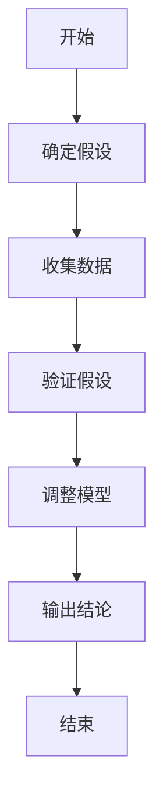
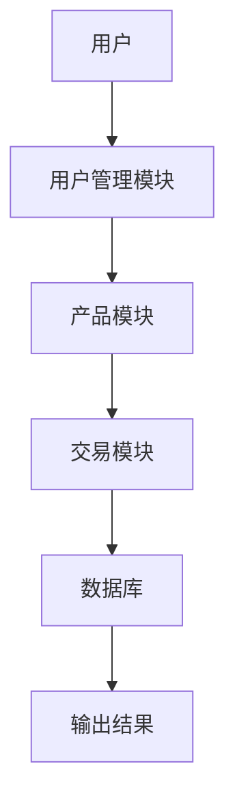
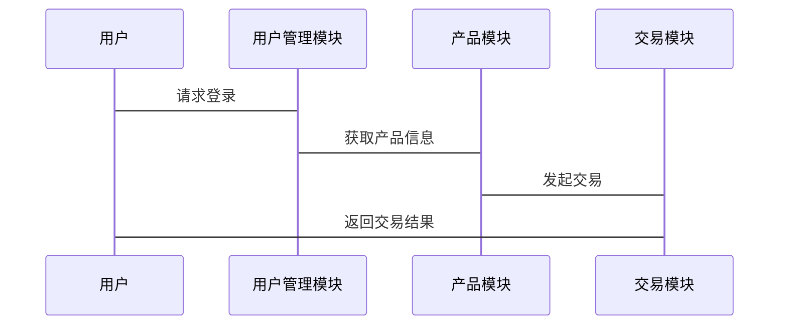

                 


# 芒格的"双轨分析"在混合现实商业模式评估中的应用

## 关键词：芒格双轨分析，混合现实，商业模式评估，商业分析，系统架构设计

## 摘要：本文探讨了芒格的"双轨分析"方法在混合现实商业模式评估中的应用，通过理论分析和实际案例，展示了如何利用双轨分析的系统性思维来优化混合现实商业模式的设计与实施。文章从背景介绍、核心概念、算法原理、系统架构设计、项目实战等方面展开，深入剖析了双轨分析在混合现实商业模式评估中的独特价值和应用优势。

---

## 第一部分：芒格的"双轨分析"与混合现实商业模式评估的背景介绍

### 第1章：芒格的"双轨分析"概述

#### 1.1 芒格"双轨分析"的核心思想
- "双轨分析"是芒格在商业决策中常用的一种思维方式，强调从多个维度分析问题，包括逻辑推理和事实验证。
- 通过分析"价格"和"价值"的双重轨道，芒格能够更全面地评估商业机会和风险。

#### 1.2 "双轨分析"在商业决策中的应用
- "双轨分析"的逻辑结构：从假设出发，通过事实验证和逻辑推理，最终得出结论。
- "双轨分析"的独特性：结合定性分析和定量分析，避免单一维度的决策偏差。

#### 1.3 "双轨分析"与混合现实商业模式评估的契合点
- 混合现实商业模式的复杂性需要多维度的分析方法。
- "双轨分析"能够帮助企业在混合现实市场中做出更科学的决策。

### 第2章：混合现实技术与商业模式

#### 2.1 混合现实技术的基本概念
- 混合现实（Mixed Reality，MR）的定义：将虚拟数字内容与真实物理环境无缝融合的技术。
- MR的核心技术：实时定位与追踪、三维建模、人机交互等。

#### 2.2 混合现实商业模式的特点
- 产品与服务的结合：混合现实技术需要与具体应用场景结合，形成商业模式。
- 用户体验为核心：MR商业模式的成功依赖于用户体验的优化。

#### 2.3 混合现实商业模式的优劣势分析
- 优势：技术创新、市场潜力大。
- 劣势：技术门槛高、用户接受度有限。

---

## 第二部分：芒格"双轨分析"的核心概念与联系

### 第3章："双轨分析"的核心概念

#### 3.1 "双轨分析"的结构
- 第一轨道：基于逻辑推理的假设分析。
- 第二轨道：基于事实验证的数据分析。

#### 3.2 "双轨分析"的核心要素
- 分析维度：价格、价值、市场、用户需求等。
- 数据支持：通过数据验证假设的合理性。

#### 3.3 "双轨分析"与传统商业分析的对比

| 对比维度 | 双轨分析 | 传统商业分析 |
|----------|----------|--------------|
| 分析方法 | 结合逻辑与数据 | 侧重数据或逻辑 |
| 结果输出 | 综合性结论 | 单一维度结论 |

#### 3.4 混合现实商业模式的ER实体关系图

```mermaid
erDiagram
    customer[用户] {
        用户ID : int
        用户名称 : string
        用户类型 : string
    }
    product[产品] {
        产品ID : int
        产品名称 : string
        产品类型 : string
    }
    transaction[交易] {
        交易ID : int
        交易时间 : datetime
        交易金额 : float
    }
    customer --|{拥有} product
    product --|{销售} transaction
```

---

## 第三部分：芒格"双轨分析"的算法原理

### 第4章：算法原理与数学模型

#### 4.1 "双轨分析"的数学模型
- 价格模型：P = a * Q + b，其中P为价格，Q为需求量，a和b为常数。
- 价值模型：V = c * P + d，其中V为价值，P为价格，c和d为常数。

#### 4.2 算法流程图



#### 4.3 算法实现代码示例

```python
# 数据预处理
import pandas as pd
data = pd.read_csv('data.csv')

# 模型训练
from sklearn.linear_model import LinearRegression
model = LinearRegression()
model.fit(data[['price']], data['value'])

# 模型评估
import matplotlib.pyplot as plt
plt.scatter(data['price'], data['value'])
plt.plot(data['price'], model.predict(data[['price']]), color='red')
plt.show()
```

---

## 第四部分：混合现实商业模式的系统架构设计

### 第5章：系统功能设计与架构

#### 5.1 混合现实商业模式的系统功能模块

```mermaid
classDiagram
    class 用户管理 {
        用户ID : int
        用户信息 : string
        用户行为 : string
    }
    class 产品模块 {
        产品ID : int
        产品信息 : string
        产品定价 : float
    }
    class 交易模块 {
        交易ID : int
        交易时间 : datetime
        交易金额 : float
    }
    用户管理 -->> 产品模块
    产品模块 -->> 交易模块
```

#### 5.2 系统架构设计



#### 5.3 系统接口设计与交互流程



---

## 第五部分：混合现实商业模式评估的项目实战

### 第6章：项目实战与案例分析

#### 6.1 项目背景与目标
- 项目背景：基于混合现实技术的虚拟教育平台。
- 项目目标：评估平台的商业模式可行性。

#### 6.2 数据收集与处理
```python
import pandas as pd
data = pd.read_csv('user_data.csv')
data.head()
```

#### 6.3 模型训练与评估
```python
from sklearn.metrics import accuracy_score
model = ...  # 训练好的模型
y_pred = model.predict(X_test)
print(accuracy_score(y_test, y_pred))
```

#### 6.4 实际案例分析与结果解读
- 案例分析：用户留存率、转化率等关键指标的分析。
- 结果解读：优化建议，如改进用户体验、调整定价策略等。

---

## 第六部分：总结与展望

### 第7章：总结与最佳实践

#### 7.1 双轨分析的优势与局限性
- 优势：系统性、全面性。
- 局限性：需要大量数据支持。

#### 7.2 混合现实商业模式的未来趋势
- 技术融合：AR与VR的进一步结合。
- 用户需求：个性化体验需求的增长。

#### 7.3 最佳实践 tips
- 数据驱动决策。
- 持续优化模型。
- 注重用户体验。

---

## 作者：AI天才研究院 & 禅与计算机程序设计艺术

---

以上为完整的技术博客文章大纲，涵盖从背景介绍到项目实战的各个方面，结合理论与实践，深入剖析芒格的"双轨分析"在混合现实商业模式评估中的应用。

