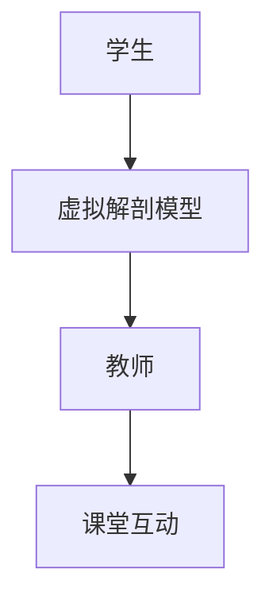
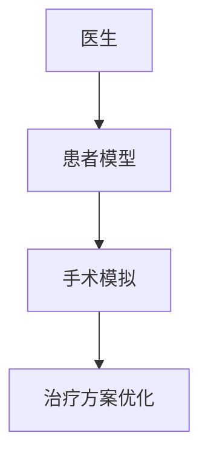
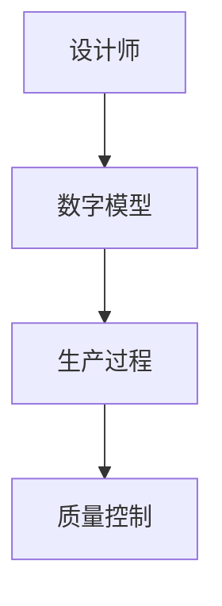
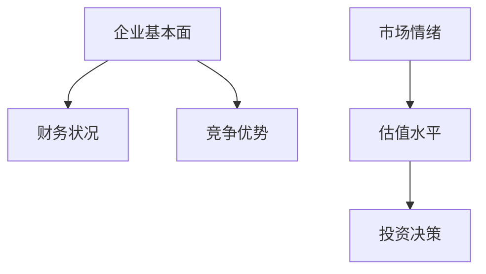
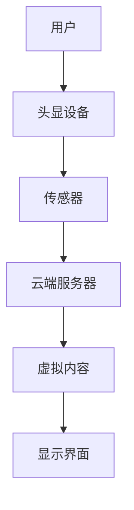
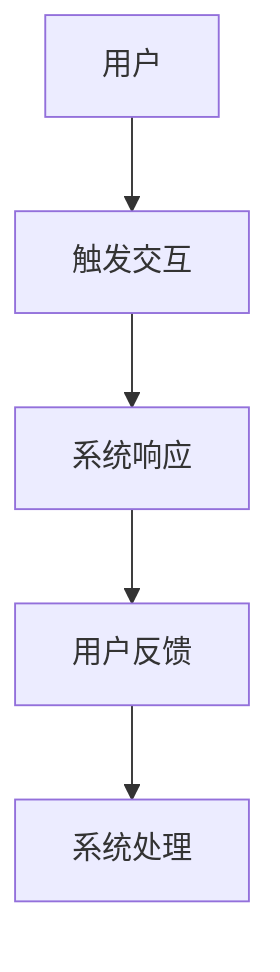

                 


---

# 芒格的"双轨分析"在混合现实技术投资中的应用

> **关键词**：芒格双轨分析、混合现实技术、投资策略、系统架构、项目实战

> **摘要**：本文详细探讨了芒格的“双轨分析”方法在混合现实技术投资中的应用。通过分析混合现实技术的定义、特点、应用场景，结合双轨分析法的核心思想，构建了适用于混合现实投资的分析框架。文章还深入探讨了混合现实技术的系统架构、市场分析及投资策略，并通过实际案例展示了如何在实践中应用这些方法。最后，总结了混合现实技术的发展趋势及投资建议。

---

## 第1章：芒格的“双轨分析”概述

### 1.1 芒格投资理念的核心思想

芒格的“双轨分析”是其投资哲学的重要组成部分，强调通过分析企业的微观结构和宏观环境来评估投资价值。双轨分析法将投资分为“轨道一”（企业基本面分析）和“轨道二”（市场情绪与估值分析）。这种方法不仅关注企业的内在价值，还考虑市场波动和投资者心理，为投资决策提供了全面的视角。

### 1.2 双轨分析法的核心要素

- **轨道一**：企业基本面分析，包括财务状况、盈利能力、管理团队、竞争优势等。
- **轨道二**：市场情绪与估值分析，关注市场波动、估值水平和投资者心理。

### 1.3 双轨分析法与传统投资分析的对比

传统投资分析往往侧重于企业基本面或市场趋势，而双轨分析法则将两者结合，强调两者的动态平衡。这种方法尤其适合技术投资，因为技术领域常常面临高波动性和不确定性。

---

## 第2章：混合现实技术的定义与特点

### 2.1 混合现实技术的定义

混合现实（Mixed Reality，MR）是一种将数字内容与真实环境无缝融合的技术。它结合了增强现实（AR）和虚拟现实（VR）的特点，使用户能够在现实环境中与虚拟对象进行互动。

### 2.2 混合现实与增强现实、虚拟现实的区别

| **技术** | **特点** | **应用场景** |
|----------|----------|--------------|
| 虚拟现实（VR） | 完全沉浸于虚拟环境 | 游戏、模拟训练 |
| 增强现实（AR） | 在现实环境中叠加虚拟元素 | 导航、购物 |
| 混合现实（MR） | 实现虚拟与现实的深度交互 | 教育、医疗、工业设计 |

### 2.3 混合现实技术的核心特征

- **实时交互性**：用户可以与虚拟对象进行实时互动。
- **高精度定位**：通过传感器和摄像头实现精准定位。
- **多模态融合**：结合视觉、听觉、触觉等多种感官体验。

---

## 第3章：混合现实技术的应用场景

### 3.1 教育领域的应用

混合现实技术在教育中的应用尤为突出，例如通过虚拟解剖模型帮助学生学习人体结构。



### 3.2 医疗领域的应用

在手术模拟和患者治疗中，混合现实技术提供了高度精确的三维模型。



### 3.3 工业领域的应用

混合现实技术用于产品设计和生产过程中的实时协作。



### 3.4 娱乐领域的应用

在游戏和虚拟社交中，混合现实技术提供了更沉浸式的体验。

---

## 第4章：双轨分析法在混合现实投资中的应用框架

### 4.1 双轨分析法的基本框架



### 4.2 双轨分析法与混合现实技术的结合点

- **企业基本面分析**：评估混合现实企业的技术创新能力、财务状况和市场竞争力。
- **市场情绪与估值分析**：关注市场对混合现实技术的接受度和投资估值。

---

## 第5章：混合现实技术的市场分析与投资策略

### 5.1 混合现实技术的市场现状

#### 5.1.1 全球混合现实市场的规模与增长

根据市场研究，2023年全球混合现实市场规模约为XX亿美元，预计年增长率XX%。

#### 5.1.2 主要国家与地区的市场发展情况

- **北美**：占据最大市场份额，技术发展领先。
- **欧洲**：政策支持，市场需求稳步增长。
- **亚洲**：新兴市场，潜力巨大。

#### 5.1.3 市场竞争格局分析

主要竞争企业包括微软、苹果、谷歌和一些初创公司。

### 5.2 混合现实技术的投资策略

#### 5.2.1 基于双轨分析法的投资框架

结合企业基本面和市场情绪，制定投资策略。

#### 5.2.2 投资决策中的关键指标

- **技术创新能力**：企业的研发投入和专利数量。
- **市场竞争力**：市场份额和客户反馈。
- **财务健康状况**：盈利能力和发展潜力。

#### 5.2.3 风险评估与风险管理

识别潜在风险，如技术瓶颈、政策变化和市场需求波动，制定应对策略。

---

## 第6章：混合现实技术的系统分析与架构设计

### 6.1 混合现实系统的构成要素

#### 6.1.1 硬件设备

- **头显设备**：如微软的HoloLens。
- **传感器**：用于环境感知和用户交互。

#### 6.1.2 软件平台

- **操作系统**：支持混合现实应用的平台。
- **开发工具**：用于创建虚拟内容的SDK。

#### 6.1.3 网络基础设施

- **高速网络**：支持实时数据传输。
- **云计算**：提供后端支持和服务。

#### 6.1.4 用户交互界面

- **图形界面**：直观的操作界面。
- **语音和手势交互**：提升用户体验。

### 6.2 混合现实系统的架构设计



### 6.3 系统接口设计与交互流程

#### 6.3.1 系统接口设计

- **API接口**：用于设备与软件的通信。
- **数据格式**：如JSON，用于数据传输。

#### 6.3.2 系统交互流程



---

## 第7章：混合现实技术的项目实战

### 7.1 项目背景与目标

某教育科技公司计划开发一款基于混合现实技术的教育应用，目标是提高学生的学习效果。

### 7.2 项目实施步骤

#### 7.2.1 环境安装

安装开发环境，如Unity3D和相关SDK。

```bash
# 安装Unity3D
sudo apt-get install unity3d
```

#### 7.2.2 核心代码实现

实现用户与虚拟模型的交互功能。

```python
# 示例代码：用户点击模型触发事件
def on_model_click(model):
    print("点击了模型", model)
```

#### 7.2.3 案例分析

分析市场竞争，优化系统架构，确保用户体验流畅。

---

## 第8章：总结与展望

### 8.1 全文总结

芒格的双轨分析法为混合现实技术的投资提供了系统的框架，结合企业基本面和市场情绪，帮助投资者做出明智决策。

### 8.2 未来展望

随着技术的进步，混合现实将在更多领域得到应用，投资者需持续关注技术创新和市场动态，优化投资策略。

### 8.3 投资建议

- **关注技术创新**：投资具备强大研发能力的企业。
- **评估市场潜力**：选择具有广泛应用前景的领域。
- **分散投资风险**：通过多元化投资降低风险。

### 8.4 最佳实践 Tips

- 定期评估投资组合，调整策略。
- 保持对行业动态的关注，及时捕捉机会。
- 与专家和同行交流，获取更多信息。

---

**作者：AI天才研究院 & 禅与计算机程序设计艺术**

---

通过以上结构，文章系统地介绍了芒格的双轨分析法在混合现实技术投资中的应用，从理论到实践，为投资者提供了全面的指导。

