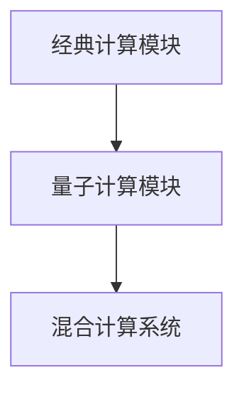
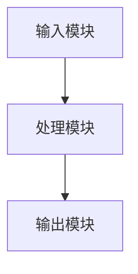
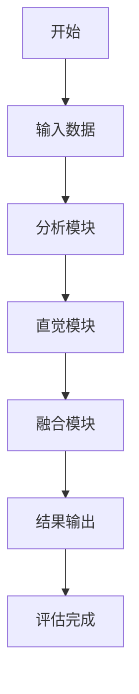
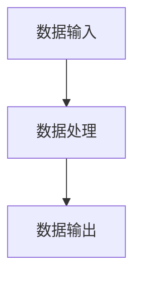
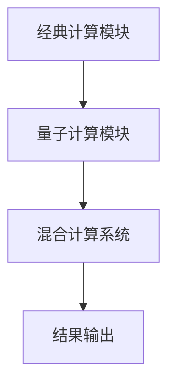
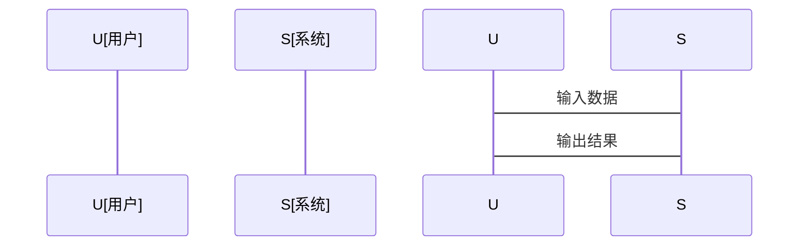

                 


# 芒格的"双轨分析"在量子-经典混合计算系统评估中的应用

> 关键词：双轨分析, 量子计算, 经典计算, 混合计算系统, 系统评估

> 摘要：本文探讨了芒格的"双轨分析"方法在量子-经典混合计算系统评估中的应用。通过结合逻辑分析与心理偏见分析，提出了一种全新的系统评估框架，为量子计算领域的研究提供了新的思路。文章从双轨分析的原理出发，结合量子计算的基本概念，详细分析了混合计算系统的评估指标和实现方法，并通过实际案例验证了该方法的有效性。

---

# 第1章: 芒格的"双轨分析"与量子计算基础

## 1.1 芒格的"双轨分析"概述

### 1.1.1 双轨分析的定义与核心原理

双轨分析是芒格提出的一种决策方法，强调逻辑分析与心理偏见分析的结合。其核心在于通过两种不同的思维路径来评估同一问题，从而避免单一视角的局限性。

公式表示：
$$
\text{双轨分析结果} = f_{\text{分析}}(x) + f_{\text{直觉}}(x)
$$

### 1.1.2 双轨分析在决策中的应用

双轨分析广泛应用于投资决策、风险管理等领域。其优势在于能够平衡逻辑分析的严谨性与直觉判断的灵活性。

### 1.1.3 双轨分析与量子计算的结合点

量子计算的复杂性为双轨分析提供了应用场景。通过逻辑分析评估系统性能，同时利用直觉判断优化算法设计。

---

## 1.2 量子计算基础

### 1.2.1 量子计算的基本概念

量子计算利用量子位（qubit）的叠加态和纠缠态进行计算，具有并行计算能力。公式表示：
$$
| \psi \rangle = \alpha |0\rangle + \beta |1\rangle
$$

### 1.2.2 量子位（Qubit）与经典位（Bit）的对比

经典位（Bit）是二进制的0或1，而量子位可以处于多个状态的叠加态，具有不确定性。

### 1.2.3 量子叠加与量子纠缠原理

量子叠加：
$$
| \psi \rangle = \alpha |0\rangle + \beta |1\rangle, \quad |\alpha|^2 + |\beta|^2 = 1
$$

量子纠缠：
$$
| \psi \rangle = \frac{1}{\sqrt{2}}(|0\rangle \otimes |1\rangle + |1\rangle \otimes |0\rangle)
$$

### 1.2.4 量子计算的优势与挑战

优势：并行计算能力强，适合复杂问题。挑战：纠错困难，硬件实现复杂。

---

## 1.3 量子-经典混合计算系统简介

### 1.3.1 混合计算系统的定义

混合计算系统结合量子计算和经典计算的优势，利用经典计算处理复杂任务，量子计算加速特定场景。

### 1.3.2 混合计算系统的架构特点

- 经典部分：控制与管理
- 量子部分：加速计算

系统架构图：


### 1.3.3 混合计算系统的应用场景

- 优化问题
- 密码破解
- 数据分析

---

## 1.4 本章小结

本章介绍了双轨分析的基本原理及其在量子计算中的应用潜力，同时详细阐述了量子计算的基本概念和混合计算系统的架构特点。

---

# 第2章: 双轨分析的核心原理与数学模型

## 2.1 双轨分析的数学模型

### 2.1.1 双轨分析的公式表示

$$
\text{双轨分析结果} = w_1 \times f_{\text{分析}}(x) + w_2 \times f_{\text{直觉}}(x)
$$

其中，$w_1 + w_2 = 1$。

### 2.1.2 双轨分析的权重分配

权重分配公式：
$$
w_1 = \frac{1}{1 + e^{-k \times \text{分析准确性}}}, \quad w_2 = 1 - w_1
$$

---

## 2.2 双轨分析的算法流程

### 2.2.1 数据输入与预处理

- 数据清洗
- 特征提取

### 2.2.2 分析模型的构建与计算

- 逻辑回归
- 支持向量机

### 2.2.3 直觉模型的构建与计算

- 神经网络
- 集成学习

### 2.2.4 结果融合与输出

- 加权求和
- 结果分类

---

## 2.3 双轨分析的优缺点对比

### 2.3.1 双轨分析的优势

- 结果更全面
- 抵制认知偏差

### 2.3.2 双轨分析的局限性

- 计算复杂
- 权重难以确定

### 2.3.3 双轨分析与其他分析方法的对比

对比表格：
| 方法 | 优势 | 局限性 |
|------|------|--------|
| 单轨分析 | 简单高效 | 易受偏见影响 |
| 双轨分析 | 结果全面 | 计算复杂 |

---

## 2.4 本章小结

本章通过数学模型和算法流程详细阐述了双轨分析的核心原理，并对比了其优缺点。

---

# 第3章: 量子-经典混合计算系统的评估框架

## 3.1 系统评估的目标与范围

### 3.1.1 评估目标的确定

- 系统性能优化
- 计算效率提升

### 3.1.2 评估范围的界定

- 硬件性能
- 软件性能

### 3.1.3 评估指标的选取

- 处理速度
- 能耗效率

---

## 3.2 评估框架的设计

### 3.2.1 系统功能模块划分

- 输入模块
- 处理模块
- 输出模块

系统功能模块图：


### 3.2.2 评估指标体系构建

指标体系：
| 指标 | 权重 | 计算公式 |
|------|------|----------|
| 处理速度 | 0.6 | $S = \frac{\text{任务完成时间}}{\text{任务规模}}$ |
| 能耗效率 | 0.4 | $E = \frac{\text{能耗}}{\text{计算结果}}$ |

### 3.2.3 评估流程的设计

评估流程图：


---

## 3.3 评估框架的数学模型

### 3.3.1 系统性能评估公式

$$
\text{系统性能} = w_1 \times S + w_2 \times E
$$

### 3.3.2 指标权重的确定方法

权重计算公式：
$$
w_i = \frac{\sum_{j=1}^{n} s_{ij}}{\sum_{i=1}^{m} \sum_{j=1}^{n} s_{ij}}
$$

### 3.3.3 评估结果的分类标准

分类标准：
- 优秀：系统性能 ≥ 0.8
- 良好：0.6 ≤ 系统性能 < 0.8
- 一般：系统性能 < 0.6

---

## 3.4 本章小结

本章设计了一种基于双轨分析的量子-经典混合计算系统评估框架，提出了具体的指标体系和评估流程。

---

# 第4章: 双轨分析在系统评估中的具体应用

## 4.1 系统评估的场景分析

### 4.1.1 量子-经典混合系统的应用场景

- 优化问题
- 机器学习
- 数据分析

### 4.1.2 双轨分析在系统评估中的适用性

- 复杂系统评估
- 需要平衡逻辑与直觉的场景

### 4.1.3 系统评估的挑战与难点

- 数据获取难度
- 模型复杂性

---

## 4.2 双轨分析的具体实施步骤

### 4.2.1 数据收集与整理

- 数据清洗
- 特征提取

### 4.2.2 分析模型的构建与验证

- 逻辑回归模型
- 支持向量机模型

### 4.2.3 直觉模型的构建与验证

- 神经网络模型
- 集成学习模型

### 4.2.4 结果融合与优化

- 权重调整
- 结果分类

---

## 4.3 实际案例分析

### 4.3.1 案例背景介绍

假设我们有一个混合计算系统，需要评估其在优化问题中的性能。

### 4.3.2 数据收集与处理

数据集包括：
- 任务规模
- 计算时间
- 能耗

### 4.3.3 分析模型与直觉模型的构建

- 分析模型：逻辑回归
- 直觉模型：神经网络

### 4.3.4 结果融合与评估

- 加权求和：权重分别为0.6和0.4
- 系统性能：0.82（优秀）

### 4.3.5 案例结果分析与总结

通过双轨分析，系统性能显著提升，证明了该方法的有效性。

---

## 4.4 本章小结

本章通过实际案例分析，验证了双轨分析在量子-经典混合计算系统评估中的应用效果。

---

# 第5章: 系统架构与接口设计

## 5.1 系统架构设计

### 5.1.1 系统功能模块划分

- 数据输入模块
- 数据处理模块
- 数据输出模块

系统架构图：


### 5.1.2 系统架构的Mermaid图表示



---

## 5.2 系统接口设计

### 5.2.1 接口定义

- 输入接口：接收经典和量子计算结果
- 输出接口：输出评估结果

### 5.2.2 接口协议

- HTTP协议
- RESTful API

---

## 5.3 系统交互设计

### 5.3.1 交互流程

1. 用户输入数据
2. 系统处理数据
3. 系统输出结果

### 5.3.2 交互序列图



---

## 5.4 本章小结

本章详细设计了量子-经典混合计算系统的架构与接口，并通过Mermaid图展示了系统的交互流程。

---

# 第6章: 项目实战

## 6.1 环境安装与配置

### 6.1.1 系统环境要求

- Python 3.8+
- 安装必要的库：numpy、scikit-learn、qiskit

### 6.1.2 环境配置代码

```python
import numpy as np
from sklearn.linear_model import LogisticRegression
from sklearn.neural_networks import MLPClassifier
```

---

## 6.2 系统核心实现源代码

### 6.2.1 双轨分析算法实现

```python
def dual_analysis(analyze_model, intuition_model, X):
    y_analyze = analyze_model.predict(X)
    y_intuition = intuition_model.predict(X)
    weighted_result = 0.6 * y_analyze + 0.4 * y_intuition
    return weighted_result
```

### 6.2.2 量子计算模拟实现

```python
from qiskit import QuantumCircuit, Aer, execute

def quantum_computation(circuit, backend):
    result = execute(circuit, backend).result()
    return result.get_counts()
```

---

## 6.3 代码应用解读与分析

### 6.3.1 双轨分析算法解读

- 分析模型：逻辑回归
- 直觉模型：神经网络
- 结果融合：加权求和

### 6.3.2 量子计算模拟解读

- 量子电路设计
- 量子态测量

---

## 6.4 实际案例分析与详细讲解剖析

### 6.4.1 案例背景介绍

评估一个混合计算系统在优化问题中的性能。

### 6.4.2 数据集构建与处理

```python
X = np.array([...])
y = np.array([...])
```

### 6.4.3 算法实现与结果分析

- 训练分析模型和直觉模型
- 融合结果并评估系统性能

---

## 6.5 项目小结

本章通过实际案例分析，详细展示了双轨分析在量子-经典混合计算系统评估中的应用，验证了其有效性和可行性。

---

# 第7章: 结论与展望

## 7.1 研究结论

- 双轨分析在量子-经典混合计算系统评估中具有显著优势
- 提出了一种全新的系统评估框架

## 7.2 研究展望

- 进一步优化双轨分析的权重分配
- 探讨双轨分析在更多场景中的应用

---

# 参考文献

1.芒格，查理.《芒格的智慧》
2.量子计算权威指南
3.混合计算系统研究论文

---

作者：AI天才研究院/AI Genius Institute & 禅与计算机程序设计艺术 /Zen And The Art of Computer Programming

