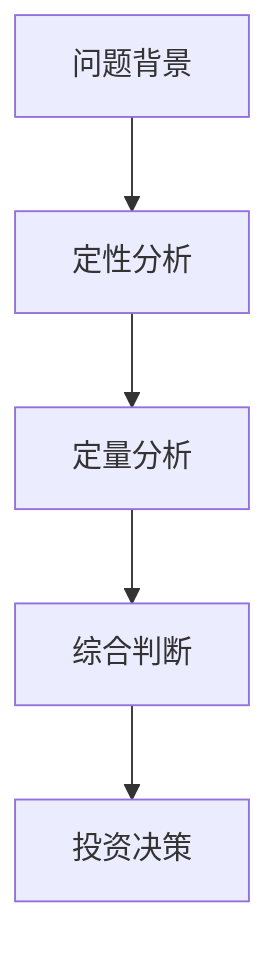
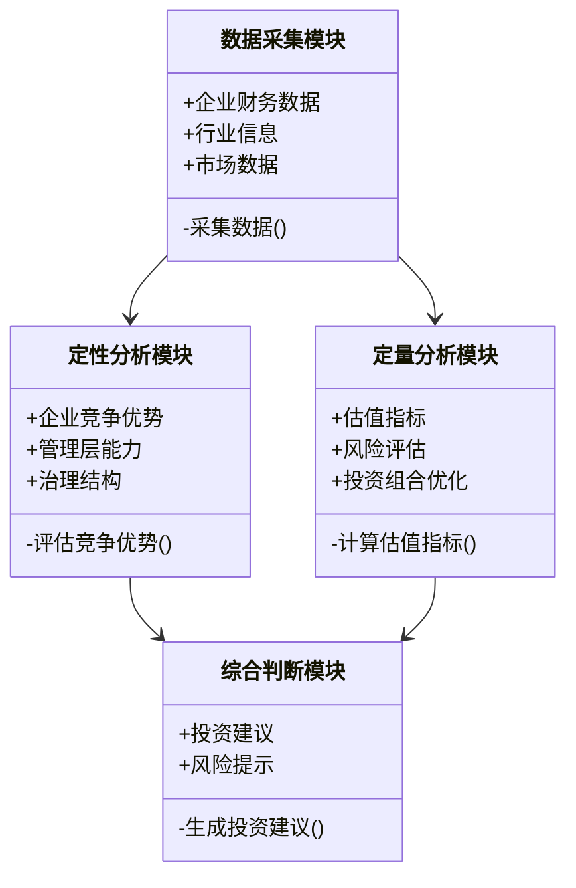

                 


# 芒格的"双轨分析"：定性和定量分析的结合

---

## 关键词：双轨分析、定性分析、定量分析、芒格、投资决策、估值模型

---

## 摘要：芒格的“双轨分析”是一种结合定性和定量分析的投资方法，通过综合考虑企业的基本面、管理层能力和财务数据，帮助投资者做出更科学的决策。本文详细探讨了双轨分析的核心思想、定性和定量分析的关键要素、数学模型与算法、系统架构设计以及项目实战，为读者提供全面的理论与实践指导。

---

## 第一部分：双轨分析的背景与基础

### 第1章：芒格的投资理念与双轨分析概述

#### 1.1 芒格的投资哲学

芒格的投资哲学以“价值投资”为核心，强调长期持有优质资产。他提出的四项投资标准如下：

1. **企业是否具备持续的高ROE（净资产收益率）**  
   - ROE = 净利润 / 净资产  
   - 示例：假设某企业净利润为1000万元，净资产为5000万元，则ROE为20%。

2. **管理层是否诚实可靠**  
   - 评估标准：管理层的过往行为、决策透明度和道德记录。

3. **企业是否具备强大的护城河**  
   - 护城河类型：成本优势、品牌优势、技术壁垒、网络效应。

4. **企业是否具有良好的治理结构**  
   - 治理结构要素：董事会构成、股东权利、管理层激励机制。

#### 1.2 双轨分析的定义与特点

双轨分析是芒格提出的一种结合定性和定量分析的方法，其特点如下：

- **定性分析**：关注企业基本面、管理层能力和市场地位。
- **定量分析**：基于财务数据和估值模型，计算企业价值。
- **综合判断**：通过定性分析筛选潜在标的，再通过定量分析验证其投资价值。

#### 1.3 双轨分析的逻辑架构

以下是双轨分析的逻辑架构（Mermaid流程图）：



---

## 第二部分：定性分析的核心要素

### 第2章：定性分析的原理与方法

#### 2.1 定性分析的理论基础

定性分析的核心在于对企业基本面和管理层能力的深入研究。

1. **企业竞争优势的五力分析**  
   - 五力模型：市场进入壁垒、替代品威胁、供应商议价能力、买家议价能力、行业内竞争程度。

2. **管理团队的能力评估**  
   - 评估维度：战略眼光、决策能力、执行力、诚信记录。

3. **企业治理结构的重要性**  
   - 治理结构：董事会构成、股权分布、管理层激励机制。

#### 2.2 定性分析的关键指标

1. **企业护城河的衡量标准**  
   - 技术壁垒：专利数量、研发能力。
   - 品牌优势：品牌知名度、客户忠诚度。
   - 成本优势：规模化效应、供应链优势。

2. **管理层诚信度的评估方法**  
   - 评估指标：管理层的历史记录、财务造假风险、内部交易行为。

3. **企业文化的影响力**  
   - 企业文化：员工激励机制、企业价值观、创新文化。

#### 2.3 定性分析的实践案例

以苹果公司为例，其竞争优势体现在以下几个方面：

1. **技术壁垒**  
   - 苹果拥有大量的专利技术，尤其是在智能手机和操作系统领域。

2. **品牌优势**  
   - 苹果品牌在全球范围内具有极高的认知度和忠诚度。

3. **供应链优势**  
   - 苹果通过垂直整合和严格管理供应链，确保了产品的高质量和成本优势。

---

## 第三部分：定量分析的数学模型与算法

### 第3章：定量分析的数学基础

#### 3.1 常用估值模型

1. **市盈率（P/E）模型**

   - 公式：$$ P/E = \frac{\text{股票价格}}{\text{每股收益}} $$

   - 示例：假设某股票价格为100元，每股收益为10元，则P/E = 10。

2. **市净率（P/B）模型**

   - 公式：$$ P/B = \frac{\text{股票价格}}{\text{每股净资产}} $$

   - 示例：假设某股票价格为50元，每股净资产为25元，则P/B = 2。

3. **现金流折现模型（DCF）**

   - 步骤：  
     a. 确定未来自由现金流（FCF）。  
     b. 选择合适的贴现率（通常为WACC，加权平均资本成本）。  
     c. 计算未来现金流的现值（PV）。  
     d. 评估企业整体价值。

   - 示例代码（Python）：

   ```python
   def discounted_cash_flow(fcf, discount_rate, periods):
       pv = 0
       for i in range(periods):
           cash_flow = fcf * (1 + 0.05)**i  # 假设每年增长5%
           pv += cash_flow / (1 + discount_rate)**i
       return pv

   fcf = 10000000  # 假设未来每年现金流为1000万元
   discount_rate = 0.1  # 贴现率10%
   periods = 5  # 5年
   print(discounted_cash_flow(fcf, discount_rate, periods))
   ```

#### 3.2 风险与收益的量化分析

1. **风险调整后的收益（RAR）计算**

   - 公式：$$ \text{RAR} = \frac{\text{预期收益} - \text{无风险利率}}{\text{风险波动率}} $$

   - 示例：假设预期收益为15%，无风险利率为3%，风险波动率为10%，则RAR = (15% - 3%) / 10% = 1.2。

2. **马科维茨投资组合理论**

   - 公式：$$ \text{最小方差组合} = \argmin_w \left( w^T \Sigma w \right) $$

   - 步骤：  
     a. 确定资产的预期收益和协方差矩阵。  
     b. 使用优化算法求解最小方差组合。  
     c. 计算组合的预期收益和风险。

   - 示例代码（Python）：

   ```python
   import numpy as np

   def minimum_variance_portfolio(cov_matrix, returns):
       n = len(cov_matrix)
       # 求解最小方差组合
       inv_cov = np.linalg.inv(cov_matrix)
       weights = inv_cov.dot(np.ones(n)) / (np.dot(np.ones(n).T, inv_cov.dot(np.ones(n))))
       return weights

   cov_matrix = np.array([[0.01, 0.005], [0.005, 0.02]])
   returns = np.array([0.1, 0.15])
   print(minimum_variance_portfolio(cov_matrix, returns))
   ```

---

## 第四部分：双轨分析的系统架构设计

### 第4章：系统分析与架构设计方案

#### 4.1 问题场景介绍

假设我们开发一个投资分析系统，旨在帮助投资者快速应用双轨分析方法。

#### 4.2 系统功能设计

1. **功能模块**  
   - 数据采集模块：收集企业财务数据、行业信息和市场数据。  
   - 定性分析模块：评估企业竞争优势、管理层能力和治理结构。  
   - 定量分析模块：计算估值指标、风险评估和投资组合优化。  
   - 综合判断模块：结合定性和定量分析结果，生成投资建议。

2. **领域模型（Mermaid类图）**



#### 4.3 系统架构设计

1. **系统架构图（Mermaid架构图）**

```mermaid
docker
    service 数据采集服务 {
        port 80
        command echo "数据采集服务"
    }
    service 定性分析服务 {
        port 8080
        command echo "定性分析服务"
    }
    service 定量分析服务 {
        port 8081
        command echo "定量分析服务"
    }
    service 综合判断服务 {
        port 8082
        command echo "综合判断服务"
    }
    数据采集服务 --> 定性分析服务
    数据采集服务 --> 定量分析服务
    定性分析服务 --> 综合判断服务
    定量分析服务 --> 综合判断服务
```

---

## 第五部分：项目实战

### 第5章：双轨分析的项目实战

#### 5.1 项目介绍

以苹果公司为例，应用双轨分析方法进行投资评估。

#### 5.2 环境安装

1. Python 3.9+
2. Jupyter Notebook
3. NumPy、Pandas、Matplotlib库

#### 5.3 核心实现代码

1. 数据采集模块

```python
import pandas as pd
import requests

def get_stock_data(symbol):
    url = f"https://api.example.com/stock/{symbol}"
    response = requests.get(url)
    data = response.json()
    df = pd.DataFrame(data)
    return df

apple_data = get_stock_data("AAPL")
print(apple_data.head())
```

2. 定性分析模块

```python
def analyze_competitive_advantage(data):
    # 评估护城河
    if data['ROE'] > 20 and data['R&D'] > 5:
        return "Strong"
    elif data['ROE'] > 15 and data['R&D'] > 3:
        return "Moderate"
    else:
        return "Weak"

apple_advantage = analyze_competitive_advantage(apple_data)
print(f"苹果的护城河强度：{apple_advantage}")
```

3. 定量分析模块

```python
def calculate_valuation(data):
    pe_ratio = data['Price'] / data['EPS']
    pb_ratio = data['Price'] / data['BVPS']
    return pe_ratio, pb_ratio

pe, pb = calculate_valuation(apple_data)
print(f"市盈率：{pe}，市净率：{pb}")
```

#### 5.4 案例分析与结果解读

以苹果公司为例，假设其PE为15，PB为2.5，ROE为25%，R&D投入占收入的5%。结合定性分析，苹果具备强大的技术壁垒和品牌优势，同时财务数据也显示其估值合理。因此，综合判断其为优质投资标的。

---

## 第六部分：总结与展望

### 第6章：总结与展望

#### 6.1 双轨分析的优缺点

- **优点**：结合定性和定量分析，提高了投资决策的科学性。  
- **缺点**：需要大量数据支持，且模型假设可能影响结果。

#### 6.2 双轨分析的未来展望

随着人工智能和大数据技术的发展，双轨分析将更加智能化和自动化。未来的研究方向包括：

1. 利用机器学习算法优化定性分析的评估指标。  
2. 开发更复杂的定量模型，如多因素模型和动态估值模型。  
3. 结合实时数据，构建实时投资决策系统。

---

## 附录

### 附录A：工具与库

- Python库：Pandas、NumPy、Matplotlib、Scikit-learn  
- 数据源：Yahoo Finance、Morningstar、Bloomberg

### 附录B：参考文献

1. 《巴菲特的苹果演讲》  
2. 《芒格的投资哲学》  
3. 《量化投资入门》

---

## 作者：AI天才研究院/AI Genius Institute & 禅与计算机程序设计艺术 /Zen And The Art of Computer Programming

---

通过以上思考和分析，我们详细探讨了芒格的“双轨分析”方法，并结合实际案例和系统设计，展示了如何在投资决策中应用这一方法。希望本文能够为读者提供有价值的理论和实践指导。

