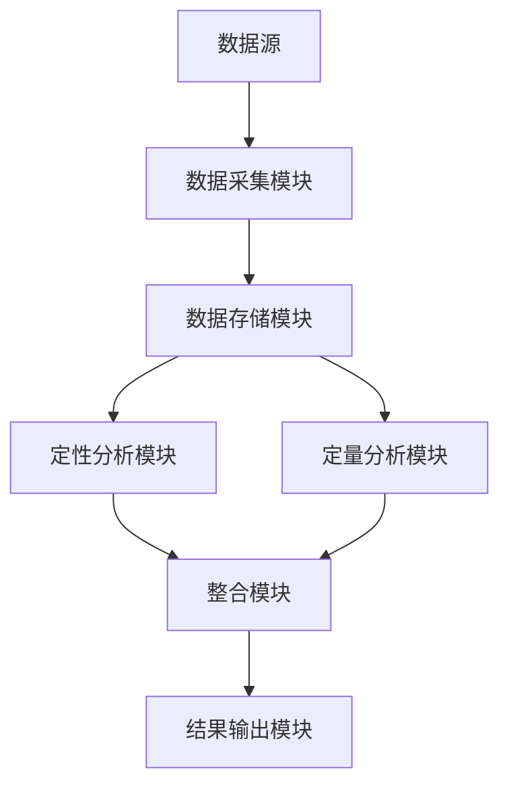
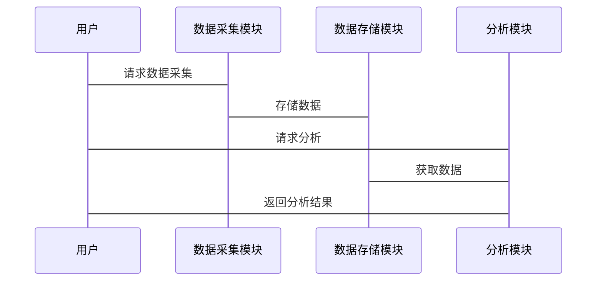

                 


# 芮格的"双轨分析"：结合定性和定量的投资方法

> 关键词：双轨分析、定性分析、定量分析、投资方法、芒格、统计套利

> 摘要：本文深入探讨了芒格提出的双轨分析方法，结合定性和定量投资策略，分析其原理、实现和应用。通过系统设计和实际案例，展示了如何整合两种方法以优化投资决策。

---

## 第一部分：双轨分析的背景与核心概念

### 第1章：双轨分析的背景与核心概念

#### 1.1 投资分析的演进
- 传统分析方法的局限性
- 定性与定量分析的结合必要性
- 双轨分析的提出背景

#### 1.2 双轨分析的核心概念
- 定性分析：宏观经济、行业和公司基本面
- 定量分析：估值指标和统计套利
- 双轨分析的整合机制

---

## 第二部分：双轨分析的核心原理

### 第2章：定性分析的要素与流程

#### 2.1 宏观经济分析
- 经济周期与市场趋势

#### 2.2 行业分析
- 行业竞争力和增长潜力

#### 2.3 公司基本面分析
- 财务状况与管理团队

### 第3章：定量分析的模型与方法

#### 3.1 市盈率、市净率等估值指标
- 指标计算与应用

#### 3.2 财务数据的量化分析
- 盈利能力、成长性和流动性分析

#### 3.3 统计套利与因子分析
- 多因子模型与风险控制

### 第4章：双轨分析的整合策略

#### 4.1 定性与定量分析的协同作用
- 互补优势与风险控制

#### 4.2 数据驱动的决策优化
- 统计分析与机器学习模型

#### 4.3 模型验证与调整
- 回测分析与策略优化

---

## 第三部分：双轨分析的数学模型与算法

### 第5章：定量分析的数学基础

#### 5.1 统计学基础
- 均值、方差与协方差

#### 5.2 优化理论基础
- 线性规划与非线性优化

#### 5.3 时间序列分析
- ARIMA模型与GARCH模型

### 第6章：双轨分析的算法实现

#### 6.1 数据预处理与特征提取
- 数据清洗与标准化

#### 6.2 回归分析与预测模型
- 线性回归与逻辑回归

#### 6.3 聚类分析与风险评估
- K-means算法与风险分组

---

## 第四部分：双轨分析的系统架构设计

### 第7章：系统功能模块设计

#### 7.1 数据采集模块
- 数据源获取与存储

#### 7.2 定性分析模块
- 宏观经济与行业分析

#### 7.3 定量分析模块
- 估值指标与因子分析

#### 7.4 结果整合与优化模块
- 策略优化与风险控制

### 第8章：系统架构图

#### 8.1 系统架构图


#### 8.2 接口设计与交互流程


---

## 第五部分：双轨分析的项目实战

### 第9章：环境搭建与数据准备

#### 9.1 Python环境安装与配置
- 安装Python与相关库（如pandas、numpy、scikit-learn）

#### 9.2 数据源
- 股票数据获取与处理

### 第10章：系统核心实现源代码

#### 10.1 数据预处理
```python
import pandas as pd
data = pd.read_csv('stock_data.csv')
data = data.dropna()
```

#### 10.2 回归分析
```python
from sklearn.linear_model import LinearRegression
model = LinearRegression()
model.fit(X_train, y_train)
```

#### 10.3 风险评估
```python
from sklearn.metrics import mean_squared_error
mse = mean_squared_error(y_test, y_pred)
print(f"均方误差：{mse}")
```

### 第11章：案例分析与解读

#### 11.1 实际案例分析
- 使用双轨分析评估某公司股票

#### 11.2 投资组合优化
- 基于双轨分析构建最优投资组合

### 第12章：项目小结

- 项目实现的关键点总结
- 成功经验与教训

---

## 第六部分：最佳实践、小结、注意事项与拓展阅读

### 第13章：最佳实践

- 数据质量的重要性
- 模型的持续优化
- 风险控制的必要性

### 第14章：小结

- 双轨分析的优势与局限
- 未来的发展方向

### 第15章：注意事项

- 数据偏差的风险
- 模型过拟合的问题
- 市场波动的不确定性

### 第16章：拓展阅读

- 推荐书籍与文献
- 在线资源与社区

---

## 作者：AI天才研究院 & 禅与计算机程序设计艺术

---

通过以上目录大纲，文章将系统地介绍芒格的双轨分析方法，结合定性和定量投资策略，分析其理论基础、算法实现和实际应用，为读者提供全面而深入的理解。

