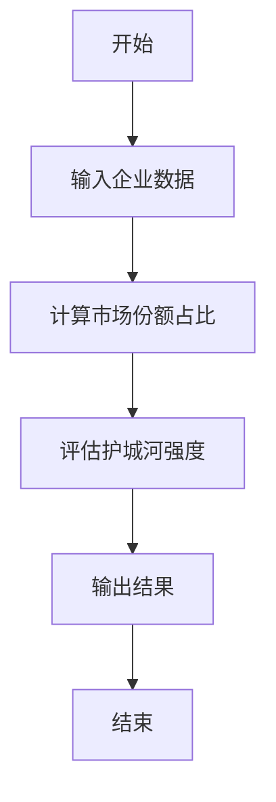
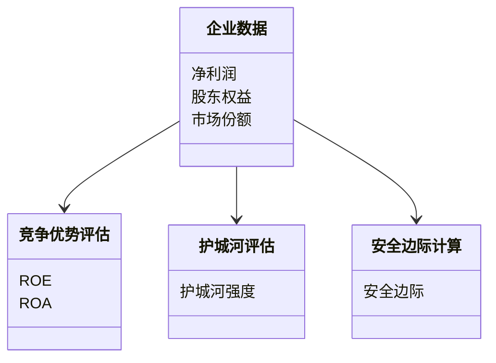
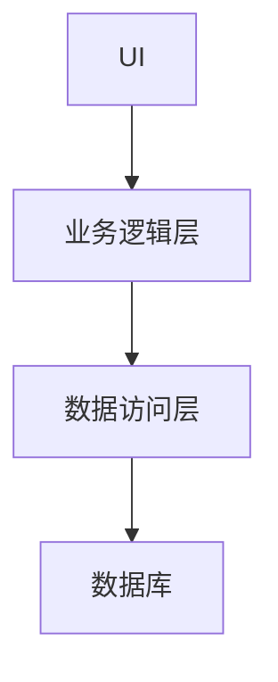

                 


# 芒格的"反向工程"思维在投资中的应用

## 关键词：芒格、反向工程、投资、竞争优势、护城河、安全边际

## 摘要：  
芒格的"反向工程"思维是一种从结果倒推原因的投资方法，通过分析企业的竞争优势、护城河和安全边际来评估投资标的的价值。本文系统地介绍了反向工程思维的核心概念、算法原理、系统架构以及实际案例，并通过Python代码实现展示了其在投资决策中的应用。文章最后总结了反向工程思维的优势和注意事项，为投资者提供了实用的指导。

---

# 第一部分: 芒格的"反向工程"思维概述

## 第1章: 投资的基础概念与芒格思维的起源

### 1.1 投资的基本概念

#### 1.1.1 投资的定义与分类  
投资是指将资金投入某个项目或资产，以期获得未来收益的行为。根据投资对象的不同，可以分为股票、债券、房地产等多种类型。股票投资是最常见的形式之一，通过购买公司股权，投资者可以分享公司的盈利。

#### 1.1.2 投资的基本原则  
投资的基本原则包括：  
1. **价值投资**：寻找被市场低估的优质资产。  
2. **分散投资**：降低风险，避免过度集中。  
3. **长期投资**：耐心持有优质资产，避免频繁交易。  

#### 1.1.3 芒格思维的起源  
芒格的"反向工程"思维源于他对物理学和工程学的深厚背景。他认为，投资应该像工程师设计产品一样，从目标出发，逆向推导所需的条件。这种方法在投资中表现为：从企业的长期价值出发，分析其竞争优势和护城河。

---

### 1.2 芒格投资理念的核心思想

#### 1.2.1 "反向工程"思维的定义  
"反向工程"思维是一种通过分析企业的竞争优势、护城河和安全边际，来判断其长期价值和投资潜力的方法。与传统投资方法不同，反向工程思维注重从企业的内在价值出发，而不是单纯依赖市场情绪或短期价格波动。

#### 1.2.2 芒格思维的特点  
- **长期视角**：关注企业的长期价值，而不是短期价格波动。  
- **竞争优势**：寻找具有可持续竞争优势的企业。  
- **安全边际**：确保投资的安全性，避免过度冒险。  

#### 1.2.3 芒格思维与其他投资方法的对比  

| 投资方法 | 核心思想 | 优点 | 缺点 |  
|----------|----------|------|------|  
| 技术分析 | 通过价格和成交量预测市场走势 | 短期操作性强 | 易受市场情绪影响 |  
| 基本分析 | 通过财务数据评估企业价值 | 长期稳定性高 | 需要大量数据支持 |  
| 芒格思维 | 从竞争优势出发，逆向推导投资价值 | 强调企业护城河和长期价值 | 需要深入分析企业基本面 |  

---

## 第2章: 芒格"反向工程"思维的核心概念与原理

### 2.1 核心概念

#### 2.1.1 竞争优势  
竞争优势是企业长期盈利能力的基石。一个企业如果在市场中具有独特的竞争优势，例如品牌、技术、成本控制等，就能在长期竞争中占据优势地位。

#### 2.1.2 护城河  
护城河是指企业防止竞争对手侵蚀其市场份额的能力。强大的护城河可以确保企业在长期竞争中保持优势，例如可口可乐的品牌忠诚度就是一种强大的护城河。

#### 2.1.3 安全边际  
安全边际是指企业在市场估值低于其内在价值时，所留出的缓冲空间。通过安全边际，投资者可以降低投资风险，避免因市场波动导致的损失。

### 2.2 芒格思维的原理

#### 2.2.1 竞争优势的量化模型  
竞争优势可以通过企业的利润率、市场份额、研发投入等多个指标来衡量。例如，可以通过ROE（净资产收益率）来评估企业的盈利能力。

$$ \text{ROE} = \frac{\text{净利润}}{\text{股东权益}} $$

#### 2.2.2 护城河的评估公式  
护城河的评估可以通过企业的市场份额和品牌忠诚度来量化。例如，市场份额占比超过50%的企业通常具有较强的护城河。

$$ \text{市场份额占比} = \frac{\text{企业销售额}}{\text{行业总销售额}} $$

#### 2.2.3 安全边际的计算方法  
安全边际可以通过将企业的内在价值与市场价格进行比较来确定。

$$ \text{安全边际} = \text{内在价值} - \text{市场价格} $$

---

## 第3章: 芒格思维的算法原理与实现

### 3.1 算法原理

#### 3.1.1 竞争优势识别算法  
通过分析企业的财务数据和市场表现，识别其竞争优势。例如，可以通过ROE和ROA（资产回报率）来评估企业的盈利能力。

$$ \text{ROA} = \frac{\text{净利润}}{\text{总资产}} $$

#### 3.1.2 护城河评估算法  
通过市场份额和品牌忠诚度等指标，评估企业的护城河强度。例如，市场份额占比超过50%的企业具有宽护城河。

#### 3.1.3 安全边际计算算法  
通过比较企业的内在价值和市场价格，计算安全边际。

### 3.2 算法实现

#### 3.2.1 竞争优势识别的Python代码

```python
import pandas as pd

# 假设data为包含企业财务数据的DataFrame
def calculate_roe(data):
    return data['净利润'] / data['股东权益']

data['ROE'] = calculate_roe(data)
```

#### 3.2.2 护城河评估的流程图



---

## 第4章: 系统架构与设计

### 4.1 系统功能设计

#### 4.1.1 领域模型（Mermaid 类图）



### 4.2 系统架构设计

#### 4.2.1 系统架构图



---

## 第5章: 项目实战

### 5.1 案例分析

#### 5.1.1 投资标的选取  
以茅台为例，分析其竞争优势、护城河和安全边际。

#### 5.1.2 数据分析与计算  
通过Python代码计算茅台的ROE、市场份额占比和安全边际。

```python
import pandas as pd

# 假设data为茅台的财务数据
def calculate_market_share(data):
    return data['销售额'] / industry_sales

market_share = calculate_market_share(data)
print(f"市场份额占比：{market_share}")
```

---

## 第6章: 经验总结与注意事项

### 6.1 经验总结

#### 6.1.1 优势  
- 强调企业长期价值，避免短期波动干扰。  
- 注重竞争优势和护城河，降低投资风险。  

#### 6.1.2 注意事项  
- 需要深入分析企业的基本面，避免表面现象。  
- 安全边际是相对的，市场波动可能影响其准确性。  

---

## 附录: 完整代码实现

```python
import pandas as pd

# 示例数据
data = {
    '净利润': [100, 200, 300],
    '股东权益': [500, 600, 700],
    '销售额': [1000, 2000, 3000],
    '行业总销售额': [5000, 6000, 7000]
}

df = pd.DataFrame(data)

# 计算ROE
df['ROE'] = df['净利润'] / df['股东权益']

# 计算市场份额占比
df['市场份额占比'] = df['销售额'] / df['行业总销售额']

print(df)
```

---

## 作者：AI天才研究院 & 禅与计算机程序设计艺术

---

**总结**：芒格的"反向工程"思维是一种以企业长期价值为核心的逆向投资方法，通过分析竞争优势、护城河和安全边际，帮助投资者做出更明智的投资决策。本文通过理论与实践结合，详细阐述了该思维在投资中的应用，并通过Python代码实现展示了其算法原理。

