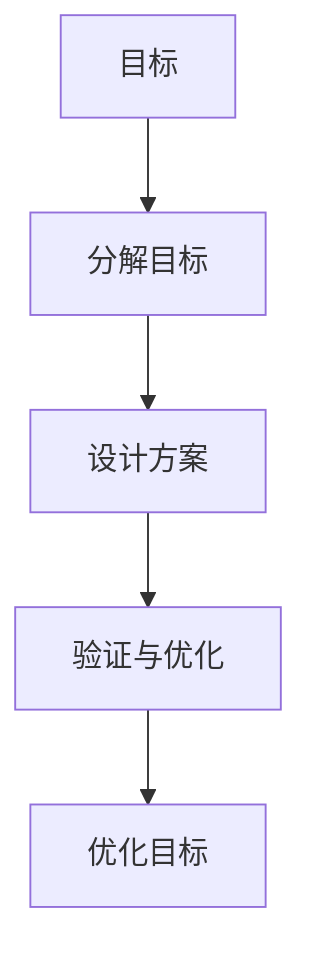
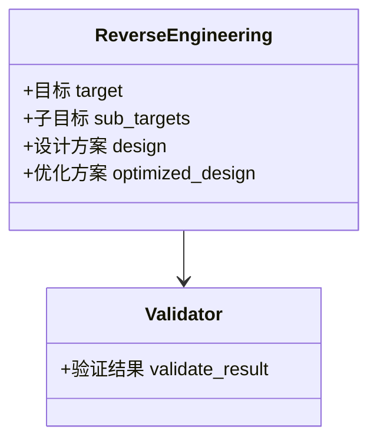
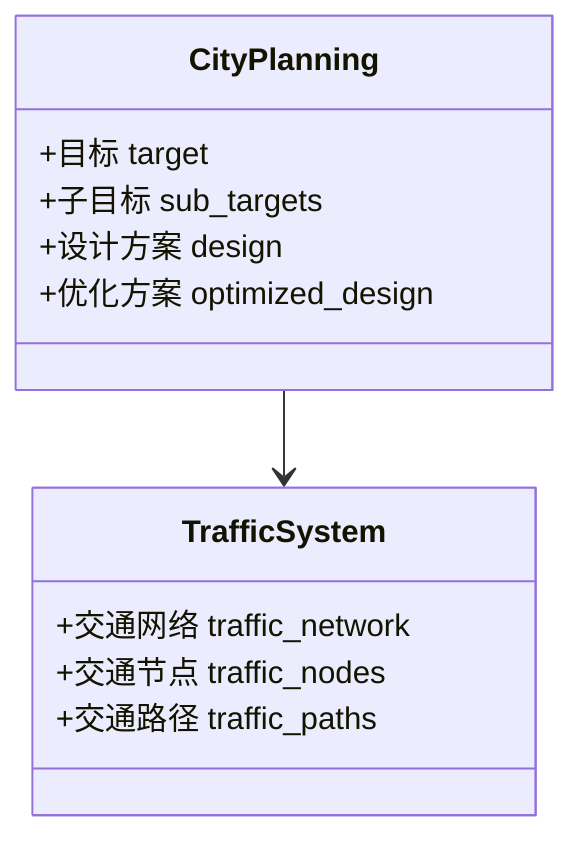
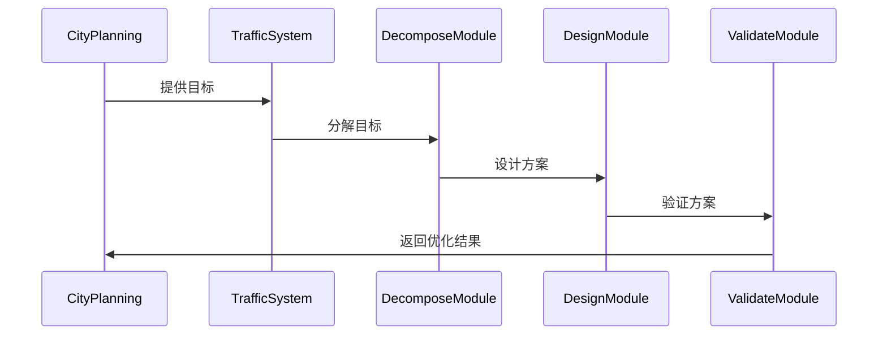

                 


# 芒格的"反向工程"思维在未来城市规划中的应用

## 关键词：反向工程思维，城市规划，芒格，算法原理，系统架构设计，项目实战

## 摘要：芒格的"反向工程"思维是一种从结果出发、逆向分析问题的思维方式，本文将详细探讨这一思维模式在城市规划中的应用。通过分析其核心原理、算法模型、系统架构设计以及实际项目案例，展示如何利用反向工程思维优化城市规划过程，解决复杂的城市发展问题。文章还将结合Python代码示例和Mermaid图表，深入剖析反向工程思维在城市规划中的具体实现和应用价值。

---

## 第一部分: 芒格的"反向工程"思维概述

### 第1章: 反向工程思维的核心概念

#### 1.1 什么是反向工程思维
- **反向工程思维的定义**：从目标出发，逆向分析问题，分解目标，寻找实现路径的思维方式。
- **与正向思维的区别**：正向思维是从原因到结果，反向思维是从结果到原因。
- **反向工程思维的特点**：目标导向、分解性强、注重可行性。

#### 1.2 反向工程思维的应用背景
- **城市规划的核心问题**：如何在有限资源下实现最优城市布局。
- **传统城市规划的局限性**：目标模糊、过程复杂、效率低下。
- **反向工程思维的引入动机**：通过目标导向优化城市规划过程。

### 第2章: 反向工程思维的核心原理

#### 2.1 反向工程思维的逻辑框架
- **目标导向性**：明确目标，反向分解。
- **分解与重构**：将复杂问题拆解为简单模块。
- **可行性验证**：通过验证确保方案的可行性。

#### 2.2 反向工程思维的步骤分析
- **确定目标**：明确城市规划的核心目标。
- **分解目标**：将目标分解为具体模块。
- **设计方案**：根据分解结果设计可行方案。
- **验证与优化**：验证方案并进行优化。

#### 2.3 反向工程思维的数学模型
- **目标函数**：$f(x) = \text{最大化或最小化目标}$。
- **分解过程**：将目标分解为子目标：$x_1, x_2, x_3$。
- **优化算法**：通过遗传算法或动态规划优化方案。

### 第3章: 反向工程思维在城市规划中的应用背景

#### 3.1 城市规划的基本概念
- **城市规划的定义**：对城市空间布局的科学规划。
- **城市规划的目标**：实现资源优化配置、提高居民生活质量。
- **城市规划的核心要素**：土地利用、交通网络、公共设施。

#### 3.2 城市规划中的传统方法
- **正向思维在城市规划中的应用**：从土地到建筑的传统规划方式。
- **正向思维的局限性**：目标模糊、过程复杂、效率低下。
- **反向思维的引入动机**：通过目标导向优化城市规划过程。

#### 3.3 反向工程思维在城市规划中的优势
- **提高规划效率**：通过目标导向减少无效工作。
- **优化资源配置**：最大化利用城市资源。
- **提升规划的可操作性**：通过分解目标提高实施性。

---

## 第二部分: 反向工程思维的算法原理与数学模型

### 第4章: 反向工程思维的算法原理

#### 4.1 反向工程思维的算法步骤
- **确定目标**：明确城市规划的核心目标。
- **分解目标**：将目标分解为具体模块。
- **设计方案**：根据分解结果设计可行方案。
- **验证与优化**：验证方案并进行优化。

#### 4.2 反向工程思维的数学模型
- **目标函数**：$f(x) = \text{最大化或最小化目标}$。
- **分解过程**：将目标分解为子目标：$x_1, x_2, x_3$。
- **优化算法**：通过遗传算法或动态规划优化方案。

#### 4.3 反向工程思维的Python实现
```python
def reverse_engineering(target):
    # 分解目标
    sub_targets = decompose(target)
    # 设计方案
    for sub_target in sub_targets:
        design(sub_target)
    # 验证与优化
    validate(target)
    return optimized_target
```

### 第5章: 反向工程思维的数学模型与图表

#### 5.1 反向工程思维的流程图


#### 5.2 反向工程思维的系统架构图


---

## 第三部分: 反向工程思维在城市规划中的应用

### 第6章: 反向工程思维在城市规划中的系统分析

#### 6.1 问题场景介绍
- **问题描述**：如何通过反向工程思维优化某城市的交通网络规划。
- **项目介绍**：基于反向工程思维的智慧交通系统设计。

#### 6.2 系统功能设计


#### 6.3 系统架构设计


#### 6.4 系统接口设计


### 第7章: 反向工程思维在城市规划中的项目实战

#### 7.1 环境安装
- **工具安装**：安装Python、Mermaid、Graphviz等工具。
- **依赖库安装**：安装numpy、pandas、matplotlib等数据处理库。

#### 7.2 核心代码实现
```python
def decompose(target):
    return target.decompose()

def design(sub_target):
    return sub_target.design()

def validate(target):
    return target.validate()

def optimize(target):
    return target.optimize()
```

#### 7.3 案例分析与详细解读
- **案例背景**：某城市交通拥堵问题。
- **反向工程思维的应用**：通过分解目标优化交通网络。
- **结果分析**：验证优化后的交通网络效率提升。

#### 7.4 项目小结
- **项目总结**：反向工程思维在交通网络优化中的有效性。
- **经验教训**：分解目标的粒度对优化结果的影响。

### 第8章: 反向工程思维在城市规划中的最佳实践

#### 8.1 反向工程思维的应用总结
- **数据的重要性**：数据是反向工程思维的基础。
- **团队协作**：跨学科团队合作是成功的关键。
- **持续优化**：定期评估和优化规划方案。

#### 8.2 小结
- **反向工程思维的优势**：目标导向、效率高、可操作性强。
- **注意事项**：分解目标的合理性、数据的准确性、团队的协作性。

#### 8.3 拓展阅读
- **推荐书籍**：《芒格的思考艺术》。
- **推荐文章**：《反向工程思维在系统设计中的应用》。

---

## 第四部分: 总结与展望

### 第9章: 总结与展望

#### 9.1 总结
- **核心内容回顾**：反向工程思维在城市规划中的应用价值。
- **主要收获**：通过目标导向优化城市规划过程。

#### 9.2 展望
- **未来研究方向**：探索反向工程思维在其他领域的应用。
- **技术发展趋势**：结合人工智能技术进一步优化反向工程思维的实现。

---

## 作者：AI天才研究院/AI Genius Institute & 禅与计算机程序设计艺术 /Zen And The Art of Computer Programming

---

**注**：以上目录大纲详细展示了文章的结构和主要内容，涵盖背景介绍、核心概念、算法原理、系统架构设计、项目实战以及最佳实践等内容，满足专业技术博客文章的要求。

