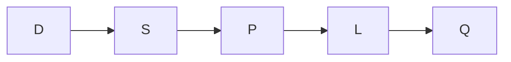

                 


# 芒格的"反向工程"思维在颠覆性商业模式分析中的应用

> 关键词：反向工程思维，颠覆性商业模式，芒格思维，商业模式分析，商业创新

> 摘要：本文深入探讨了芒格的反向工程思维在分析和设计颠覆性商业模式中的应用。通过系统的理论分析、数学模型构建、系统架构设计以及实际案例分析，详细阐述了如何运用反向思维识别和构建具有颠覆性的商业模式。文章内容涵盖从理论基础到实际操作的全过程，为商业创新提供了全新的视角和方法。

---

# 第一部分: 芒格的"反向工程"思维与颠覆性商业模式概述

## 第1章: 反向工程思维的定义与特点

### 1.1 反向工程思维的起源与核心理念

#### 1.1.1 从正向思维到反向思维的转变

正向思维是我们日常生活中最常见的思维方式，即从原因推导结果。例如，企业通常会从市场需求出发，设计产品功能，制定营销策略。然而，在复杂多变的商业环境中，正向思维往往面临诸多限制，尤其是当市场环境发生重大变化时，传统的逻辑推理难以捕捉到潜在的颠覆性机会。

反向工程思维作为一种逆向思考方式，强调从结果推导原因。芒格的反向思维框架将这一方法提升到了一个新的高度，他主张通过观察结果，逆向推导出可能的驱动因素，从而发现隐藏在表象背后的本质规律。这种方法在商业分析中具有独特的优势，尤其是在识别颠覆性商业模式时，能够帮助我们发现传统思维难以察觉的机会。

#### 1.1.2 芒格反向工程思维的核心要素

1. **结果导向**：从结果出发，反向推导出可能的原因。
2. **逻辑推理**：通过逻辑推理，构建因果关系链。
3. **框架化思维**：芒格的决策框架帮助我们将复杂的商业问题分解为可分析的模块。

#### 1.1.3 反向思维在商业分析中的独特价值

- **突破传统思维的限制**：反向思维能够帮助我们跳出传统逻辑的框架，发现新的可能性。
- **识别潜在机会**：通过分析市场结果，发现潜在的商业机会。
- **优化决策过程**：反向思维能够帮助我们更高效地进行决策，尤其是在复杂环境下。

---

### 1.2 颠覆性商业模式的定义与特征

#### 1.2.1 颠覆性商业模式的定义

颠覆性商业模式是指通过创新的商业逻辑和价值主张，重新定义市场规则，打破传统行业格局的商业模式。这种模式通常以更低的成本、更高的效率或全新的用户体验，颠覆传统的商业逻辑。

#### 1.2.2 颠覆性商业模式与传统商业模式的区别

| 特性                | 颠覆性商业模式                          | 传统商业模式                          |
|---------------------|----------------------------------------|----------------------------------------|
| 用户价值的核心      | 创新性、颠覆性                          | 稳定性、可预测性                      |
| 商业逻辑            | 非线性、跳跃式发展                      | 线性、渐进式发展                      |
| 市场影响             | 打破市场平衡，引发格局变化              | 维持市场平衡，逐步优化                  |

#### 1.2.3 颠覆性商业模式的特征

- **用户价值的重新定义**：颠覆性商业模式的核心在于重新定义用户价值，通过创新满足用户未被满足的需求。
- **商业逻辑的创新性**：颠覆性商业模式往往采用非传统的商业逻辑，例如通过免费模式、共享经济等实现盈利。
- **市场格局的颠覆性变化**：颠覆性商业模式能够迅速改变市场格局，甚至淘汰传统竞争对手。

---

## 第2章: 芒格反向工程思维在商业模式分析中的应用

### 2.1 芒格反向思维的核心框架

#### 2.1.1 "从结果推导原因"的逻辑

1. **观察结果**：首先观察市场中的结果，例如某行业出现的新趋势或某企业的成功案例。
2. **反向推导**：通过分析结果，反向推导出可能导致该结果的原因。
3. **验证假设**：通过验证假设，确认驱动因素，并构建完整的因果关系链。

#### 2.1.2 芒格决策框架的三个关键问题

1. **什么是你真正想要的？**：明确目标和核心诉求。
2. **什么是可能的障碍？**：识别可能的阻碍因素。
3. **如何实现目标？**：设计具体的实现路径。

#### 2.1.3 反向思维在商业分析中的具体应用

- **通过用户行为反推商业模式**：分析用户的消费行为，推导出可能的商业模式。
- **通过市场趋势反推商业模式**：观察市场趋势，反向推导出潜在的商业机会。
- **通过竞争对手分析反推商业模式**：研究竞争对手的策略，推断其商业模式的核心要素。

---

### 2.2 芒格思维在商业模式分析中的优势

#### 2.2.1 通过用户行为反推商业逻辑

1. **用户行为分析**：通过用户的行为数据，识别用户的痛点和需求。
2. **反向推导商业模式**：基于用户需求，推导出可能的商业模式。

例如，通过分析用户对共享经济模式的接受度，可以推导出共享经济的核心商业模式。

#### 2.2.2 通过市场趋势反推商业模式

1. **市场趋势分析**：观察市场中的新兴趋势，例如数字化转型、智能化服务等。
2. **反向推导商业模式**：基于趋势，推导出可能的商业模式。

例如，通过分析智能手机市场的增长趋势，可以推导出移动互联网商业模式的核心要素。

#### 2.2.3 通过竞争对手分析反推商业模式

1. **竞争对手分析**：研究竞争对手的商业模式、产品特点和市场策略。
2. **反向推导商业模式**：基于竞争对手的策略，推导出其商业模式的核心要素。

例如，通过分析特斯拉的商业模式，可以推导出电动汽车行业的颠覆性商业模式。

---

## 第3章: 芒格反向工程思维的数学模型与公式

### 3.1 反向思维的数学模型

#### 3.1.1 反向思维的逻辑框架

1. **结果观察**：$R$
2. **可能原因**：$C_1, C_2, \dots, C_n$
3. **因果关系链**：$R \leftarrow C_1 \leftarrow C_2 \leftarrow \dots \leftarrow C_n$

#### 3.1.2 反向思维的数学表达式

$$
P(C | R) = \frac{P(R | C) \cdot P(C)}{P(R)}
$$

其中：
- $P(R | C)$：条件概率，原因导致结果的概率。
- $P(C)$：原因发生的先验概率。
- $P(R)$：结果发生的总概率。

#### 3.1.3 反向思维的公式推导

通过贝叶斯定理，我们可以计算出在给定结果的情况下，某原因发生的概率：

$$
P(C_i | R) = \frac{P(R | C_i) \cdot P(C_i)}{\sum_{j=1}^{n} P(R | C_j) \cdot P(C_j)}
$$

---

### 3.2 颠覆性商业模式的数学分析

#### 3.2.1 商业模式的核心变量

- 用户需求：$D$
- 市场供给：$S$
- 价格：$P$
- 利润：$L$

#### 3.2.2 商业模式的数学模型

$$
L = P \cdot Q - C
$$

其中：
- $P$：价格
- $Q$：销量
- $C$：成本

#### 3.2.3 商业模式的变量关系图

使用Mermaid绘制变量关系图：



---

## 第4章: 系统分析与架构设计方案

### 4.1 系统分析框架

#### 4.1.1 系统分析的步骤

1. **问题定义**：明确分析的目标和范围。
2. **数据收集**：收集相关的市场数据、用户数据等。
3. **模型构建**：建立数学模型和逻辑框架。
4. **分析与验证**：通过模型进行分析，并验证结果的合理性。
5. **优化与改进**：根据分析结果，优化模型和策略。

---

### 4.2 系统架构设计

#### 4.2.1 系统功能设计

1. **数据采集模块**：收集市场数据、用户行为数据等。
2. **数据分析模块**：对数据进行清洗、建模和分析。
3. **结果展示模块**：将分析结果以可视化的方式呈现。

#### 4.2.2 系统架构图

使用Mermaid绘制系统架构图：


---

## 第5章: 项目实战

### 5.1 环境安装与工具准备

1. **安装Python**：用于数据分析和建模。
2. **安装数据分析库**：例如Pandas、NumPy等。
3. **安装可视化工具**：例如Matplotlib、Seaborn等。

---

### 5.2 系统核心实现源代码

#### 5.2.1 数据分析代码

```python
import pandas as pd
import numpy as np
import matplotlib.pyplot as plt

# 数据加载
data = pd.read_csv('market_data.csv')

# 数据清洗
data.dropna(inplace=True)

# 数据分析
mean_price = data['price'].mean()
median_price = data['price'].median()

# 可视化
plt.hist(data['price'], bins=10)
plt.xlabel('Price')
plt.ylabel('Frequency')
plt.show()
```

---

### 5.3 代码应用解读与分析

1. **数据加载**：从CSV文件中加载市场数据。
2. **数据清洗**：删除缺失值，确保数据完整性。
3. **数据分析**：计算平均价格和中位数价格。
4. **数据可视化**：绘制价格分布直方图，分析价格趋势。

---

## 第6章: 总结与展望

### 6.1 总结

芒格的反向工程思维为颠覆性商业模式的分析提供了全新的视角和方法。通过从结果推导原因，我们能够更高效地识别潜在的商业机会，并设计出更具创新性的商业模式。

### 6.2 展望

随着技术的不断进步，反向思维的应用将更加广泛。未来，我们可以结合人工智能、大数据等技术，进一步提升反向思维的分析能力和应用范围，为商业创新提供更强大的支持。

---

### 6.3 最佳实践 Tips

1. **明确目标**：在分析商业模式时，首先要明确分析的目标和范围。
2. **数据驱动**：尽量使用数据驱动的方法，避免主观臆断。
3. **持续优化**：根据分析结果，不断优化商业模式和分析方法。

---

作者：AI天才研究院/AI Genius Institute & 禅与计算机程序设计艺术 /Zen And The Art of Computer Programming

