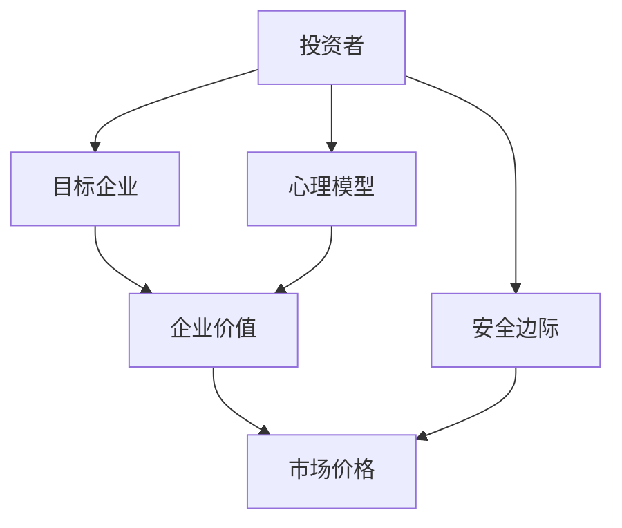
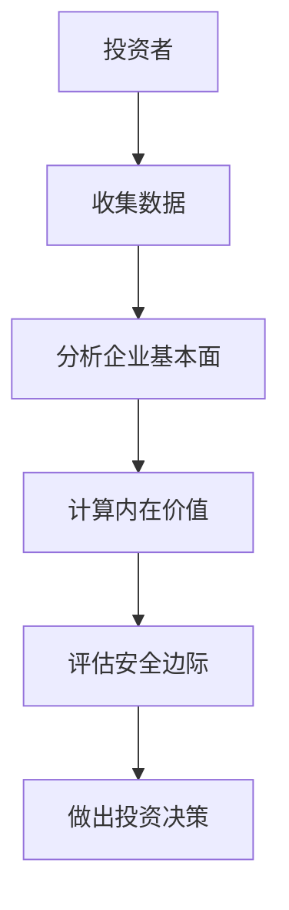
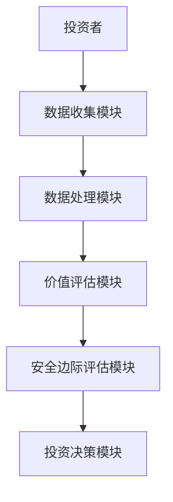
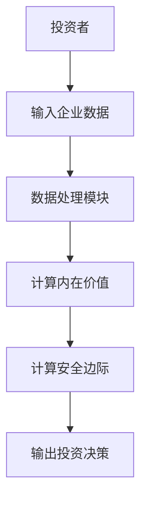

                 


# 芒格的"反向工程"思维：从成功案例中学习投资

> 关键词：芒格，反向工程，投资思维，价值投资，成功案例，心理模型

> 摘要：本文深入探讨了芒格的“反向工程”思维在投资领域的应用，通过分析芒格的投资理念、决策框架、数学模型和实际案例，系统地展示如何从成功案例中学习投资。文章结合技术语言和逻辑推理，帮助读者理解芒格的思维方式，并将其应用于实际投资中。

---

# 第1章：芒格的生平与投资理念概述

## 1.1 芒格的早年经历

查理·芒格（Charlie Munger）于1924年1月17日出生于美国密苏里州堪萨斯城。他从小就展现出对学习的极大热情，尤其是对数学和哲学的兴趣。芒格在哈佛大学完成了本科教育，随后进入哈佛法学院学习法律。然而，他对法律并没有太多兴趣，转而将注意力转向投资和商业领域。

## 1.2 芒格与巴菲特的合作历程

芒格的职业生涯转折点出现在1957年，当时他与沃伦·巴菲特（Warren Buffett）合作管理伯克希尔·哈撒韦公司（Berkshire Hathaway）。芒格以其独特的思维方式和对投资的深刻理解，迅速成为巴菲特的重要合作伙伴。两人共同的理念是“价值投资”，即以低于内在价值的价格购买优秀企业。

## 1.3 芒格的哲学与价值观

芒格深受哲学影响，尤其是受到大卫·休谟（David Hume）和亚当·斯密（Adam Smith）的影响。他强调“人类的认知局限性”和“心理偏见”的重要性。芒格认为，投资者必须认识到自己的局限性，并通过不断学习来弥补这些局限。

## 1.4 芒格的投资理念

芒格的投资理念可以概括为以下几点：

- **价值投资**：寻找那些具有持续竞争优势、良好管理和稳定现金流的企业。
- **安全边际**：以低于企业内在价值的价格买入，以确保投资的安全性。
- **逆向思维**：在别人贪婪时恐惧，在别人恐惧时贪婪。

---

# 第2章：反向工程思维的核心概念与联系

## 2.1 芒格反向工程思维的核心概念

### 2.1.1 逆向思考

芒格认为，投资的关键在于“逆向思考”。即，不是寻找市场上大家都在抢购的股票，而是寻找市场上被忽视、低估的股票。这种思维方式可以帮助投资者避免盲目跟风，抓住市场中的潜在机会。

### 2.1.2 企业价值评估的关键要素

芒格强调，企业价值评估的核心在于对企业基本面的深入分析，包括企业的财务状况、管理层素质、行业地位和竞争优势。

### 2.1.3 投资决策中的心理模型

芒格提出了“心理模型”的概念，认为投资者需要建立一套完整的心理模型，以帮助自己更好地理解和预测市场行为。这些心理模型包括概率论、复利效应、逆向思维等。

## 2.2 芒格反向工程思维的核心原理

### 2.2.1 价值与价格的辩证关系

芒格认为，价格是价值的函数，而不是相反。投资者应该关注企业的内在价值，而不是市场的价格波动。只有当价格低于内在价值时，投资才有意义。

### 2.2.2 安全边际的概念与应用

安全边际是芒格投资理念中的一个重要概念。它指的是股票的市场价格与内在价值之间的差距。通过保持安全边际，投资者可以降低投资风险。

### 2.2.3 投资中的“第二层思维”

芒格提出的“第二层思维”是指，不仅要考虑表面的财务数据，还要考虑企业的长期发展潜力、行业趋势和管理层的战略决策。

---

## 2.3 芒格反向工程思维的实体关系图



---

# 第3章：芒格反向工程思维的算法原理

## 3.1 芒格反向工程思维的算法概述

芒格的反向工程思维可以被视为一种基于概率和逻辑的算法。其核心在于通过分析市场行为和企业基本面，找到那些被市场低估的投资机会。

### 3.1.1 算法的核心思想

芒格的算法核心思想可以总结为以下步骤：

1. **识别市场低估的信号**：通过分析市场数据和企业财务指标，识别那些价格低于内在价值的企业。
2. **评估企业的竞争优势**：分析企业的行业地位、管理层素质和财务状况。
3. **计算安全边际**：确保买入价格低于内在价值，以降低投资风险。
4. **长期持有优质资产**：芒格强调长期投资，避免频繁交易。

### 3.1.2 算法的数学模型

芒格的算法中，价值评估是一个关键步骤。他使用以下公式来计算企业的内在价值：

$$ V = \frac{CF}{r - g} $$

其中：
- \( V \) 是企业的内在价值
- \( CF \) 是企业的自由现金流
- \( r \) 是折现率
- \( g \) 是现金流增长率

安全边际的计算公式为：

$$ MS = V - P $$

其中：
- \( MS \) 是安全边际
- \( P \) 是股票的市场价格

### 3.1.3 算法的步骤与流程

1. **收集数据**：收集目标企业的财务数据、行业数据和市场数据。
2. **分析企业基本面**：评估企业的财务状况、竞争优势和管理层素质。
3. **计算内在价值**：使用上述公式计算企业的内在价值。
4. **评估安全边际**：比较市场价格与内在价值，确定是否具备安全边际。
5. **做出投资决策**：如果市场价格低于内在价值且具备安全边际，则考虑买入；否则，继续寻找机会。

---

## 3.2 芒格反向工程思维的数学模型

### 3.2.1 价值评估的数学公式

$$ V = \frac{CF}{r - g} $$

### 3.2.2 安全边际的计算公式

$$ MS = V - P $$

### 3.2.3 投资决策的逻辑流程



---

# 第4章：芒格反向工程思维的系统分析与架构设计方案

## 4.1 系统分析

### 4.1.1 问题场景介绍

在投资领域，芒格的反向工程思维可以帮助投资者找到那些被市场低估的企业。这种思维方式需要结合市场数据和企业基本面分析，构建一个完整的投资决策系统。

### 4.1.2 系统功能设计

系统功能设计包括以下几个方面：

1. **数据收集**：收集企业的财务数据、市场数据和行业数据。
2. **数据处理**：对收集到的数据进行清洗和预处理。
3. **价值评估**：使用数学模型计算企业的内在价值。
4. **安全边际评估**：比较市场价格与内在价值，评估安全边际。
5. **投资决策**：基于安全边际和企业基本面分析，做出投资决策。

### 4.1.3 系统架构设计



---

## 4.2 项目实战

### 4.2.1 环境安装

为了实现芒格反向工程思维的系统，需要安装以下工具和环境：

- **编程语言**：Python 3.8+
- **数据处理工具**：Pandas、NumPy
- **数据可视化工具**：Matplotlib、Seaborn
- **投资分析工具**：Financial Modeling

### 4.2.2 核心实现源代码

以下是实现芒格反向工程思维的Python代码示例：

```python
import pandas as pd
import numpy as np

def calculate_intrinsic_value(cash_flow, discount_rate, growth_rate):
    return cash_flow / (discount_rate - growth_rate)

def calculate_margin_of_safety(intrinsic_value, market_price):
    return intrinsic_value - market_price

# 示例数据
cash_flow = 100
discount_rate = 0.1
growth_rate = 0.05
market_price = 80

# 计算内在价值
intrinsic_value = calculate_intrinsic_value(cash_flow, discount_rate, growth_rate)
margin_of_safety = calculate_margin_of_safety(intrinsic_value, market_price)

print(f"内在价值: {intrinsic_value}")
print(f"安全边际: {margin_of_safety}")
```

### 4.2.3 实际案例分析

假设我们有一个企业，其自由现金流为 $100，折现率为 10%，现金流增长率为 5%，市场价格为 $80。根据上述代码，我们可以计算出企业的内在价值和安全边际。

计算结果如下：

- 内在价值：$100 / (0.1 - 0.05) = $2000
- 安全边际：$2000 - $80 = $1920

由于安全边际为正，且市场价格低于内在价值，投资者可以考虑买入该企业股票。

---

## 4.3 系统交互设计



---

# 第5章：芒格反向工程思维的最佳实践

## 5.1 小结

芒格的反向工程思维是一种基于逻辑和概率的思维方式，它可以帮助投资者在复杂多变的市场中找到那些被低估的投资机会。通过分析企业的基本面和市场数据，投资者可以做出更加理性的决策。

## 5.2 注意事项

1. **数据质量**：数据的准确性和完整性对投资决策至关重要。
2. **模型局限性**：数学模型只是工具，不能完全反映市场的复杂性。
3. **市场变化**：市场环境的变化可能会影响模型的适用性。

## 5.3 拓展阅读

1. **《穷查理宝典》**：芒格的经典著作，详细介绍了他的投资理念和思维方式。
2. **《投资最重要的事情》**：巴菲特的经典著作，进一步阐述了价值投资的理念。

---

# 附录

## 附录A：术语表

- **内在价值**：企业的实际价值，与市场价格无关。
- **安全边际**：内在价值与市场价格之间的差距。
- **心理模型**：投资者用于分析和预测市场行为的一系列概念和理论。

## 附录B：案例数据

以下是芒格反向工程思维在实际案例中的应用：

```python
# 示例数据
cash_flow = 100
discount_rate = 0.1
growth_rate = 0.05
market_price = 80

# 计算内在价值
intrinsic_value = cash_flow / (discount_rate - growth_rate)
print(f"内在价值: {intrinsic_value}")

# 计算安全边际
margin_of_safety = intrinsic_value - market_price
print(f"安全边际: {margin_of_safety}")
```

## 附录C：工具代码

以下是芒格反向工程思维系统的Python代码实现：

```python
import pandas as pd
import numpy as np

def calculate_intrinsic_value(cash_flow, discount_rate, growth_rate):
    return cash_flow / (discount_rate - growth_rate)

def calculate_margin_of_safety(intrinsic_value, market_price):
    return intrinsic_value - market_price

# 示例数据
cash_flow = 100
discount_rate = 0.1
growth_rate = 0.05
market_price = 80

# 计算内在价值
intrinsic_value = calculate_intrinsic_value(cash_flow, discount_rate, growth_rate)
print(f"内在价值: {intrinsic_value}")

# 计算安全边际
margin_of_safety = calculate_margin_of_safety(intrinsic_value, market_price)
print(f"安全边际: {margin_of_safety}")
```

## 附录D：参考文献

1. 芒格，查理. 《穷查理宝典》. 北京：中信出版社，2009.
2. 巴菲特，沃伦. 《投资最重要的事情》. 北京：中信出版社，2013.

---

# 作者

作者：AI天才研究院/AI Genius Institute & 禅与计算机程序设计艺术/Zen And The Art of Computer Programming

