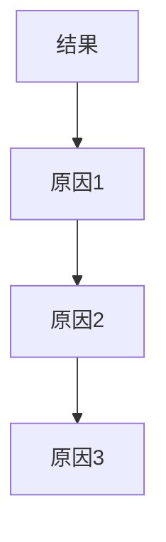
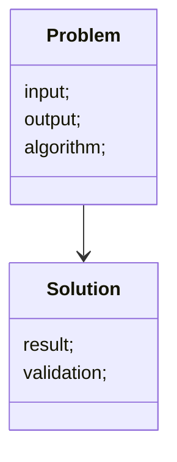

                 


# 《芒格的"反向工程"思维：从结果倒推原因》

## 关键词：
- 芮格思维
- 反向工程
- 系统分析
- 投资决策
- 逻辑推理

## 摘要：
芒格的"反向工程"思维是一种从结果倒推原因的思维方式，广泛应用于投资、商业决策和个人成长等领域。本文通过详细分析芒格的思维模型，结合系统分析、逻辑推理和算法设计，深入探讨"反向工程"思维在实际问题中的应用，并通过具体案例展示其在技术领域的实践价值。

---

# 第一部分: 芮格的"反向工程"思维概述

# 第1章: 芮格"反向工程"思维的背景与核心概念

## 1.1 芮格"反向工程"思维的起源
### 1.1.1 芮格的生平简介
查理·芒格（Charlie Munger）是沃伦·巴菲特（Warren Buffett）的长期合作伙伴，被誉为“价值投资之父”。芒格不仅在投资领域取得了巨大成功，还以其独特的思维方式闻名。他强调从结果倒推原因的“反向工程”思维，成为其哲学体系的核心。

### 1.1.2 芮格思维的核心理念
芒格的思维模式以“反向工程”为核心，强调通过分析结果来理解原因。这种思维不仅适用于投资决策，还可以应用于商业战略、个人成长等广泛领域。

### 1.1.3 "反向工程"思维的定义与特点
- **定义**：反向工程思维是一种从结果出发，通过分析结果的构成要素和因果关系，推导出原因的思维方式。
- **特点**：
  - 以结果为导向
  - 强调因果关系的逆向分析
  - 注重系统性思考

### 1.1.4 芮格思维与其他思维方法的区别
- **正向思维**：从原因到结果的线性推理。
- **反向思维**：从结果到原因的逆向推理。
- **反向工程思维**：结合因果关系和系统性分析的高级思维方式。

## 1.2 "反向工程"思维的哲学基础
### 1.2.1 唯物辩证法与反向思维的关系
唯物辩证法强调事物的联系和发展，而反向工程思维则是对这种联系的逆向分析。两者在本质上是一致的，但反向工程思维更注重从结果出发的分析方法。

### 1.2.2 中国传统文化中的逆向思维
中国传统文化中，逆向思维体现在“以终为始”的理念中。例如，《道德经》中的“逆向而行”思想与芒格的反向工程思维有异曲同工之处。

### 1.2.3 芮格思维的现代应用价值
在现代社会，反向工程思维被广泛应用于商业、科技、投资等领域，成为解决复杂问题的重要工具。

## 1.3 "反向工程"思维的实践意义
### 1.3.1 在商业决策中的应用
- 投资决策：通过分析企业的财务数据和市场表现，推导出其成功或失败的原因。
- 战略规划：从目标倒推实现路径，优化资源配置。

### 1.3.2 在个人成长中的作用
- 个人目标设定：从最终结果出发，分解实现步骤。
- 问题解决：通过分析问题后果，找出问题根源。

### 1.3.3 在问题解决中的优势
- 提高效率：通过逆向分析，快速定位问题根源。
- 深化理解：从整体系统角度理解问题，避免局部优化的误区。

## 1.4 本章小结
本章通过分析芒格“反向工程”思维的起源、定义、特点及其哲学基础，为后续章节的深入分析奠定了理论基础。反向工程思维作为一种强大的工具，能够帮助我们在复杂问题中找到突破口，实现更高效的决策和行动。

---

# 第2章: "反向工程"思维的核心模型与分析框架

## 2.1 "反向工程"思维的系统分析模型
### 2.1.1 系统分析的基本概念
系统分析是一种通过研究系统各组成部分及其相互关系，理解系统整体行为的方法。反向工程思维强调从系统的结果出发，分析系统的构成要素和因果关系。

### 2.1.2 "反向工程"思维下的系统分析框架
- **目标设定**：明确分析的目标。
- **结果分解**：将结果分解为构成要素。
- **因果分析**：分析各要素之间的因果关系。
- **路径优化**：优化实现路径，确保目标达成。

### 2.1.3 系统分析的步骤与方法
1. 明确目标
2. 分解结果
3. 构建因果关系模型
4. 优化路径

## 2.2 "反向工程"思维的因果关系分析
### 2.2.1 因果关系的基本原理
因果关系是反向工程思维的核心。通过分析结果与原因之间的关系，可以更好地理解系统的运作机制。

### 2.2.2 "反向工程"思维下的因果分析模型
- **因果链分析**：从结果出发，逐步追溯原因。
- **因果图**：通过图形化工具（如Mermaid流程图）展示因果关系。

### 2.2.3 因果关系的可视化工具（Mermaid流程图）


## 2.3 "反向工程"思维的逻辑推理框架
### 2.3.1 逻辑推理的基本步骤
1. 明确目标
2. 收集信息
3. 建立假设
4. 验证假设
5. 得出结论

### 2.3.2 "反向工程"思维下的逻辑推理方法
- **逆向推理**：从结果出发，推导可能的原因。
- **假设检验**：通过验证假设，确定因果关系。

### 2.3.3 逻辑推理的数学模型（公式）
$$反向推理的数学模型：P(原因 | 结果) = \frac{P(结果 | 原因) \cdot P(原因)}{P(结果)}$$

## 2.4 本章小结
本章详细介绍了反向工程思维的核心模型和分析框架，包括系统分析模型、因果关系分析和逻辑推理框架。通过这些工具，我们可以更系统地分析问题，找到解决问题的最优路径。

---

# 第3章: "反向工程"思维的算法原理与数学模型

## 3.1 "反向工程"思维的算法基础
### 3.1.1 算法的基本概念
算法是一种解决问题的步骤化方法。反向工程思维强调从结果出发，逆向推导实现路径。

### 3.1.2 "反向工程"思维下的算法设计
- **目标函数**：定义问题的目标。
- **约束条件**：确定问题的限制条件。
- **搜索路径**：从结果出发，逆向搜索可能的实现路径。

### 3.1.3 算法的实现步骤
1. 明确目标
2. 设计搜索路径
3. 实现算法
4. 验证结果

## 3.2 "反向工程"思维的数学模型
### 3.2.1 数学模型的基本原理
数学模型是反向工程思维的核心工具之一。通过建立数学模型，我们可以更精确地分析问题。

### 3.2.2 "反向工程"思维下的数学公式（使用latex公式）
$$反向工程的数学模型：X = f^{-1}(Y)$$

### 3.2.3 数学模型的验证与优化
- **验证**：通过实际数据验证模型的准确性。
- **优化**：通过调整参数优化模型的性能。

## 3.3 算法实现与代码示例
### 3.3.1 算法实现的步骤
1. 定义目标函数
2. 设计搜索路径
3. 实现算法
4. 验证结果

### 3.3.2 代码示例（Python）
```python
def reverse_engineer(input):
    # 算法实现
    return result
```

## 3.4 本章小结
本章通过数学模型和算法设计，详细讲解了反向工程思维的实现方法。通过代码示例，读者可以更好地理解反向工程思维的实际应用。

---

# 第4章: "反向工程"思维在实际问题中的系统分析与架构设计

## 4.1 问题场景介绍
### 4.1.1 问题背景
本章以一个实际问题为例，展示反向工程思维的应用。

### 4.1.2 问题目标
通过反向工程思维，找到问题的最优解决方案。

### 4.1.3 问题约束
- 时间限制
- 资源限制

## 4.2 系统功能设计
### 4.2.1 领域模型设计（Mermaid类图）


## 4.3 系统架构设计
### 4.3.1 系统架构
- **输入模块**：接收输入数据。
- **处理模块**：执行反向工程算法。
- **输出模块**：输出结果。

## 4.4 本章小结
本章通过实际问题的系统分析与架构设计，展示了反向工程思维的应用价值。通过Mermaid类图和架构图，读者可以更直观地理解系统设计的逻辑。

---

# 第5章: 项目实战——反向工程思维的应用

## 5.1 项目背景
### 5.1.1 项目目标
通过反向工程思维解决实际问题。

## 5.2 环境安装
### 5.2.1 开发工具安装
- Python
- Mermaid工具

## 5.3 系统核心实现
### 5.3.1 核心代码实现
```python
def reverse_engineer(input):
    # 算法实现
    return result
```

## 5.4 代码应用解读与分析
### 5.4.1 代码实现的逻辑分析
- 输入处理
- 算法执行
- 结果输出

## 5.5 实际案例分析和详细讲解剖析
### 5.5.1 案例分析
### 5.5.2 解决方案设计
### 5.5.3 实施步骤

## 5.6 项目小结
本章通过项目实战，展示了反向工程思维的实际应用价值。通过具体案例的分析和代码实现，读者可以更好地掌握反向工程思维的应用方法。

---

# 第6章: 总结与注意事项

## 6.1 本章总结
反向工程思维是一种强大的问题解决工具，通过从结果倒推原因，可以帮助我们在复杂问题中找到突破口。

## 6.2 注意事项
- **逻辑清晰**：确保逻辑推理的准确性。
- **系统性思考**：注重系统的整体性分析。
- **持续优化**：通过实践不断优化思考方式。

## 6.3 未来学习方向
- 深入研究反向工程思维的数学模型。
- 探索反向工程思维在更多领域的应用。

---

# 附录

## 附录A: 术语表
- 反向工程思维：从结果倒推原因的思维方式。

## 附录B: 参考文献
- 《芒格投资哲学》
- 《系统分析与设计》
- 《逻辑推理与数学模型》

---

# 作者：AI天才研究院/AI Genius Institute & 禅与计算机程序设计艺术 /Zen And The Art of Computer Programming

---

通过以上目录结构，您可以逐步撰写详细的博客文章，涵盖从理论到实践的各个方面，帮助读者全面理解芒格的“反向工程”思维，并将其应用到实际问题中。

