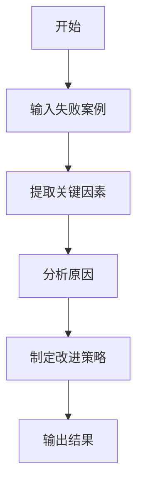
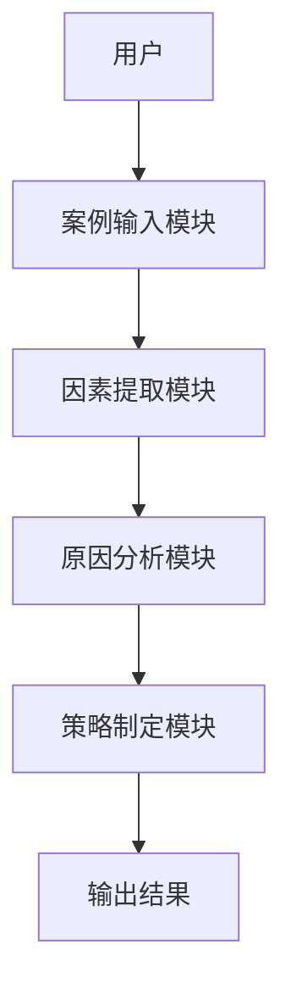

                 


# 芒格的"反向激励"分析在科技创业投资中的应用

> 关键词：芒格、反向激励、科技创业投资、多元思维模型、投资决策

> 摘要：本文探讨了芒格的“反向激励”分析方法在科技创业投资中的应用。通过分析芒格的多元思维模型和反向激励的核心概念，本文提出了在科技创业投资中应用反向激励的具体步骤和策略，并结合实际案例进行了深入分析。文章还探讨了反向激励在风险评估、投资决策以及系统设计中的应用，旨在为科技创业者和投资者提供一种新的视角和方法。

---

## 第一部分：引言

### 第1章：芒格与反向激励概述

#### 1.1 芒格的生平与投资理念

芒格是世界著名投资家巴菲特的长期合作伙伴，以独特的多元思维模型闻名。他的投资理念强调跨学科思考，避免单一维度的决策失误。

#### 1.2 反向激励的定义与特点

反向激励是一种通过分析失败案例来获取经验的方法，其核心在于从反面思考问题，避免重复犯错。

#### 1.3 芒格反向激励在科技创业投资中的应用背景

科技创业投资面临高风险和不确定性，反向激励提供了一种从失败案例中学习的途径，帮助投资者做出更明智的决策。

---

## 第二部分：理论基础

### 第2章：芒格的思维模型与反向激励分析

#### 2.1 芒格的思维模型

- 多元思维模型：通过多个学科的视角分析问题，避免单一思维的局限性。
- 核心要素：概率、风险、时间、杠杆等。

#### 2.2 反向激励的分析框架

- 分析步骤：识别失败案例，提取关键因素，分析原因，制定改进策略。
- 关键要素：风险评估、决策路径、系统性思维。

---

## 第三部分：核心概念

### 第3章：反向激励在科技创业投资中的应用

#### 3.1 科技创业投资的基本概念

- 定义：通过投资初创企业，支持创新和技术进步。
- 分类：种子期、成长期、成熟期投资。

#### 3.2 反向激励的应用

- 风险评估：通过分析失败案例，识别潜在风险。
- 投资决策：结合反向激励和多元思维模型，优化决策过程。

---

## 第四部分：算法原理

### 第4章：反向激励分析的算法实现

#### 4.1 算法流程图



#### 4.2 Python代码实现

```python
def reverse_incentive_analysis(cases):
    results = []
    for case in cases:
        factors = extract_factors(case)
        analysis = analyze_factors(factors)
        strategy = create_strategy(analysis)
        results.append(strategy)
    return results

def extract_factors(case):
    # 提取失败案例中的关键因素
    return {
        '风险因素': [factor1, factor2],
        '决策失误': [error1, error2]
    }

def analyze_factors(factors):
    # 分析关键因素
    return {
        '主要风险': risk,
        '次要风险': secondary_risk
    }

def create_strategy(analysis):
    # 制定改进策略
    return strategy
```

#### 4.3 数学模型

反向激励分析的风险评估模型：

$$
R = \sum_{i=1}^{n} P_i \times F_i
$$

其中，$R$ 表示总风险，$P_i$ 表示第 $i$ 个因素的风险概率，$F_i$ 表示第 $i$ 个因素的影响程度。

---

## 第五部分：系统分析与架构设计

### 第5章：反向激励分析系统设计

#### 5.1 系统功能设计

- 需求分析：输入失败案例，输出改进策略。
- 功能模块：案例输入、因素提取、原因分析、策略制定。

#### 5.2 系统架构设计



#### 5.3 接口设计

- 输入接口：接收失败案例数据。
- 输出接口：返回改进策略。

---

## 第六部分：项目实战

### 第6章：反向激励分析的项目实现

#### 6.1 环境安装

- 安装Python和必要的库，如pandas、numpy。

#### 6.2 核心代码实现

```python
import pandas as pd
import numpy as np

def calculate_probability(risk_factors):
    # 计算风险概率
    return np.mean(risk_factors)

def main():
    cases = pd.read_csv('failed_cases.csv')
    results = reverse_incentive_analysis(cases)
    print(results)

if __name__ == "__main__":
    main()
```

#### 6.3 案例分析

- 案例背景：一家科技初创公司因资金链断裂失败。
- 分析结果：资金管理不善是主要原因，建议加强资金监控。

---

## 第七部分：总结与展望

### 第7章：总结与最佳实践

#### 7.1 总结

反向激励分析通过失败案例提供宝贵经验，帮助投资者优化决策。

#### 7.2 最佳实践

- 定期回顾失败案例。
- 结合多元思维模型进行综合分析。

#### 7.3 小结

反向激励分析在科技创业投资中具有重要意义，值得深入研究和实践。

---

## 附录

### 附录A：术语表

- 反向激励：通过分析失败案例获取经验的方法。
- 多元思维模型：芒格提出的一种跨学科思维方式。

### 附录B：参考文献

- 芒格《穷查理宝典》
- 巴菲特《巴菲特投资思想》

---

## 作者：AI天才研究院 & 禅与计算机程序设计艺术

通过以上结构化的内容，本文系统地探讨了芒格的反向激励分析在科技创业投资中的应用，结合理论、算法和实际案例，为投资者提供了新的视角和方法。

