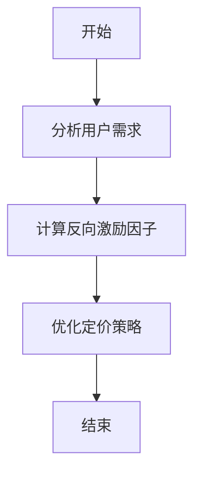
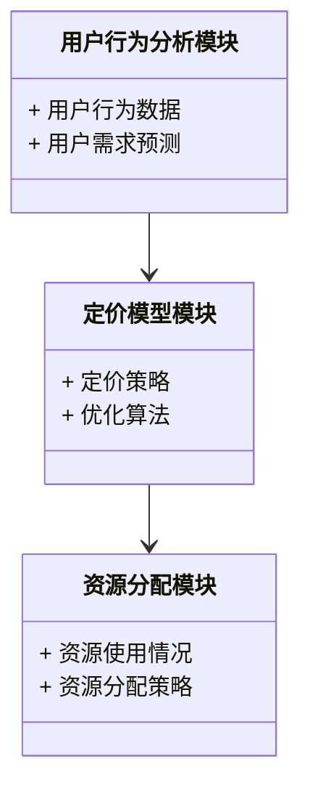

                 


# 芒格的"反向激励"分析在量子计算云服务定价中的应用

> **关键词**：芒格、反向激励、量子计算、云服务定价、定价策略  
>
> **摘要**：本文探讨了芒格的"反向激励"分析方法在量子计算云服务定价中的应用。通过分析反向激励的核心概念、量子计算云服务定价的特殊性，结合数学模型和实际案例，提出了一种基于反向激励的定价策略，旨在优化量子计算云服务的市场竞争力和用户满意度。

---

## 第1章 芒格的"反向激励"概述

### 1.1 反向激励的核心概念

反向激励是一种逆向思维的激励方法，与传统的正向激励（如奖励、表扬）不同，它通过分析负面因素、潜在风险或问题的反面，来激发目标行为或优化决策。其核心在于通过反向思考，发现潜在的机会或改进空间。

#### 1.1.1 反向激励的定义

反向激励是指通过分析问题的反面或潜在风险，来引导行为或优化决策的一种激励方式。它强调从负面因素中寻找积极的解决方案，而不是仅仅关注正面的激励因素。

#### 1.1.2 反向激励与传统激励的对比

| 对比维度 | 反向激励 | 传统激励 |
|----------|----------|----------|
| 目标 | 通过反面因素优化决策 | 通过正面因素激励行为 |
| 方法 | 分析潜在风险或问题的反面 | 提供奖励或认可 |
| 适用场景 | 优化复杂系统、降低风险 | 提高员工积极性、鼓励创新 |

#### 1.1.3 反向激励的理论基础

反向激励的理论基础可以追溯到行为经济学和决策科学。它强调通过分析问题的反面，发现潜在的改进空间或机会。芒格的反向激励分析方法是一种典型的反向思维应用，旨在通过分析问题的反面，找到最优解决方案。

---

### 1.2 量子计算云服务定价的背景与挑战

#### 1.2.1 量子计算云服务的定义与特点

量子计算云服务是指基于量子计算机的计算能力，通过云计算的方式提供给用户的一种服务。其特点包括：

- **高计算能力**：量子计算机能够在某些特定问题上远超经典计算机。
- **资源共享**：通过云服务模式，用户可以按需使用量子计算资源。
- **高成本**：量子计算的硬件和运维成本极高。

#### 1.2.2 量子计算云服务定价的复杂性

量子计算云服务的定价面临以下挑战：

- **资源分配的复杂性**：量子计算资源的使用具有高度动态性，难以预测和分配。
- **成本结构的特殊性**：量子计算的硬件和运维成本极高，且具有高度的技术门槛。
- **用户行为的多样性**：用户的需求和使用习惯差异较大，难以统一制定定价策略。

#### 1.2.3 反向激励在定价中的潜在应用价值

反向激励分析可以帮助我们从负面因素中发现定价策略的优化空间。例如：

- 通过分析用户可能的不满意点，优化定价策略，提高用户满意度。
- 通过分析潜在的市场风险，制定更具竞争力的定价策略。

---

## 第2章 反向激励分析的数学模型与算法原理

### 2.1 反向激励分析的核心公式

反向激励分析的核心公式可以表示为：

$$
P = \frac{1}{f(x)}
$$

其中，$P$ 是定价策略，$f(x)$ 是用户需求函数。

### 2.2 反向激励分析的算法流程



### 2.3 反向激励分析的数学推导

通过反向激励分析，我们可以将定价策略与用户需求函数联系起来。假设用户需求函数为：

$$
D(p) = a - bp
$$

其中，$D(p)$ 是用户需求，$p$ 是定价，$a$ 和 $b$ 是常数。通过反向激励分析，我们可以优化定价策略，最大化收益：

$$
R = p \cdot D(p) = p(a - bp) = ap - b p^2
$$

求导并解得最优定价为：

$$
p = \frac{a}{2b}
$$

---

## 第3章 量子计算云服务定价的系统分析与架构设计

### 3.1 量子计算云服务定价的系统组成

#### 3.1.1 用户行为分析模块

用户行为分析模块用于分析用户的使用习惯和需求，帮助制定个性化的定价策略。



### 3.2 量子计算云服务定价的系统功能

#### 3.2.1 用户需求预测功能

用户需求预测功能基于历史数据和用户行为，预测未来的用户需求。

$$
\hat{D}(p) = \alpha p + \beta
$$

其中，$\hat{D}(p)$ 是预测的用户需求，$\alpha$ 和 $\beta$ 是回归系数。

---

## 第4章 反向激励分析在定价策略中的应用

### 4.1 反向激励分析在定价策略中的作用

通过反向激励分析，我们可以从用户需求的反面（如用户不满、潜在风险）中发现定价策略的优化空间。例如：

- 通过分析用户可能的不满点，优化定价策略，提高用户满意度。
- 通过分析潜在的市场风险，制定更具竞争力的定价策略。

### 4.2 反向激励分析在定价模型中的实现

#### 4.2.1 反向激励分析的核心算法

反向激励分析的核心算法可以表示为：

$$
P_{\text{优化}} = \frac{1}{f(x)}
$$

其中，$P_{\text{优化}}$ 是优化后的定价策略，$f(x)$ 是用户需求函数。

---

## 第5章 项目实战与最佳实践

### 5.1 项目环境安装与配置

为了实现基于反向激励的定价策略，需要以下环境和工具：

- Python 3.8+
- NumPy、Pandas、Matplotlib 等库
- 量子计算云服务 API 接口

### 5.2 系统实现与代码

以下是基于反向激励分析的定价策略实现代码：

```python
import numpy as np
import matplotlib.pyplot as plt

def reverse_incentive_analysis(p):
    # 用户需求函数
    def demand(p):
        return 100 - 2 * p
    # 反向激励分析
    return 1 / demand(p)

p = np.linspace(0, 50, 100)
P = [reverse_incentive_analysis(pi) for pi in p]

plt.plot(p, P)
plt.xlabel('定价')
plt.ylabel('反向激励因子')
plt.show()
```

---

## 作者

作者：AI天才研究院 & 禅与计算机程序设计艺术

