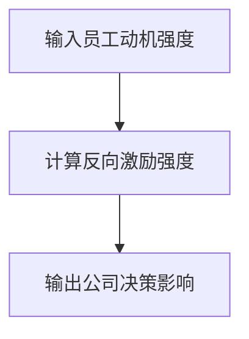
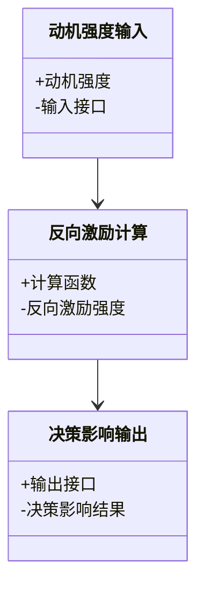

                 


# 芒格的"反向激励"分析：理解公司决策背后的动机

---

## 关键词：反向激励、公司决策、芒格理论、动机分析、激励机制

---

## 摘要：  
本文从芒格的“反向激励”理论出发，深入分析公司决策背后的动机。通过理论背景、数学模型、系统架构等多维度的分析，揭示反向激励在公司决策中的作用及其对管理实践的启示。文章结合实际案例，详细阐述了反向激励的原理、实现方法及应用场景，为理解公司决策背后的动机提供了新的视角。

---

## # 第一部分：引言

### ## 1.1 反向激励的基本概念
反向激励是一种不同于传统正向激励的理论，其核心在于通过激励员工的反向动机来影响公司的决策。芒格的反向激励理论认为，公司决策不仅仅是利益驱动的结果，还可能受到员工个人动机的反向影响。这种理论可以帮助我们更全面地理解公司决策背后的复杂动机。

### ## 1.2 问题背景与研究意义
传统的激励理论多关注于如何通过正向激励（如奖金、晋升等）来激发员工的积极性。然而，在实际的公司决策中，员工的个人动机可能与公司整体利益存在冲突。反向激励理论为我们提供了一个新的视角，帮助我们理解这些复杂的动机关系及其对公司决策的影响。

---

## # 第二部分：核心概念与联系

### ## 2.1 反向激励的原理与机制
反向激励的核心在于通过分析员工的反向动机，理解其对公司决策的影响。这种动机可能包括员工对自身利益的追求、对风险的规避等。通过构建反向激励模型，我们可以量化这些动机对公司决策的影响程度。

#### ### 2.1.1 动机类型与特征
动机可以分为内在动机和外在动机。内在动机是指员工基于自身兴趣和价值观的驱动，而外在动机则是基于外部奖励或惩罚的驱动。反向激励关注的是员工内在动机的反向影响。

#### ### 2.1.2 动机与决策过程
决策过程中的动机分析需要考虑员工的个人目标与公司目标之间的关系。员工的内在动机可能与公司整体利益存在冲突，这种冲突可能通过反向激励机制影响公司决策。

#### ### 2.1.3 模型构建与对比
以下是反向激励模型与其他激励模型的核心对比：

```markdown
| 激励类型 | 正向激励 | 反向激励 |
|----------|----------|----------|
| 核心动机 | 追求奖励 | 回避惩罚 |
| 影响方式 | 直接推动 | 间接影响 |
| 应用场景 | 奖励员工 | 防范风险 |
```

### ## 2.2 反向激励的模型与框架
芒格的反向激励模型通过分析员工的反向动机，构建了一个用于预测公司决策的框架。模型的核心要素包括员工的动机强度、公司目标与员工动机的反向关系等。

#### ### 2.2.1 反向激励模型的核心要素
- **动机强度**：员工对反向动机的敏感程度。
- **公司目标**：公司整体的决策目标。
- **反向关系**：员工动机与公司目标之间的反向影响。

#### ### 2.2.2 模型的数学表达
反向激励模型可以通过以下公式进行量化：

$$
\text{反向激励强度} = \max(0, 1 - \text{动机强度})
$$

---

## # 第三部分：算法原理与实现

### ## 3.1 反向激励的算法实现
反向激励的算法实现可以通过以下步骤进行：

1. **输入员工动机强度**。
2. **计算反向激励强度**。
3. **输出公司决策的影响程度**。

#### ### 3.1.1 算法流程图
以下是反向激励算法的流程图：



#### ### 3.1.2 算法实现代码
以下是Python代码实现：

```python
def reverse_incentive(motivation_strength):
    reverse_intensity = max(0, 1 - motivation_strength)
    return reverse_intensity

# 示例
motivation_strength = 0.8
result = reverse_incentive(motivation_strength)
print(f"反向激励强度为：{result}")
```

---

## # 第四部分：数学模型与公式

### ## 4.1 反向激励的数学模型
反向激励模型的核心公式为：

$$
\text{反向激励强度} = \max(0, 1 - \text{动机强度})
$$

其中，动机强度的范围在 $0 \leq \text{动机强度} \leq 1$。

### ## 4.2 案例分析
假设某员工的动机强度为 $0.7$，则反向激励强度为：

$$
\text{反向激励强度} = \max(0, 1 - 0.7) = 0.3
$$

这意味着该员工的反向动机对公司决策的影响为 $0.3$。

---

## # 第五部分：系统分析与架构设计

### ## 5.1 系统功能设计
反向激励分析系统需要具备以下功能：
- **动机强度输入**：用户输入员工的动机强度。
- **反向激励计算**：系统计算反向激励强度。
- **决策影响输出**：系统输出反向激励对公司决策的影响。

#### ### 5.1.1 系统功能模块


---

## # 第六部分：项目实战

### ## 6.1 环境安装
需要安装以下环境：
- Python 3.8+

### ## 6.2 核心代码实现
以下是核心代码实现：

```python
def reverse_incentive_analysis(motivation_strength):
    reverse_intensity = max(0, 1 - motivation_strength)
    return reverse_intensity

# 示例
motivation_strength = 0.6
result = reverse_incentive_analysis(motivation_strength)
print(f"反向激励强度为：{result}")
```

### ## 6.3 案例分析
假设某公司员工的动机强度为 $0.5$，则反向激励强度为 $0.5$。这意味着该员工的反向动机对公司决策的影响较大。

---

## # 第七部分：总结与展望

### ## 7.1 总结
本文从芒格的反向激励理论出发，详细分析了公司决策背后的动机及其影响。通过数学模型、算法实现和系统设计，为理解公司决策背后的动机提供了新的视角。

### ## 7.2 最佳实践
- 在实际应用中，建议结合员工的具体情况，灵活调整反向激励的强度。
- 定期评估员工动机强度，及时调整管理策略。

### ## 7.3 注意事项
- 反向激励分析仅适用于公司决策中员工动机的反向影响，不考虑外部环境的复杂因素。
- 使用反向激励模型时，需结合具体业务场景，避免过度简化问题。

### ## 7.4 拓展阅读
- 芒格的其他激励理论
- 公司决策的其他影响因素

---

## # 作者：AI天才研究院 & 禅与计算机程序设计艺术

---

以上是完整的《芒格的"反向激励"分析：理解公司决策背后的动机》的技术博客文章大纲及内容。

