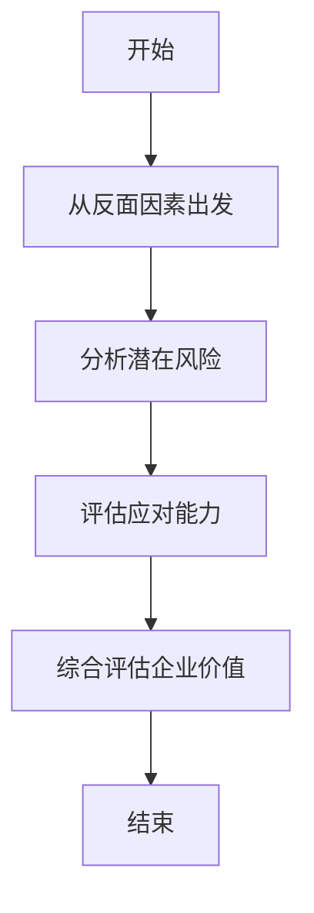
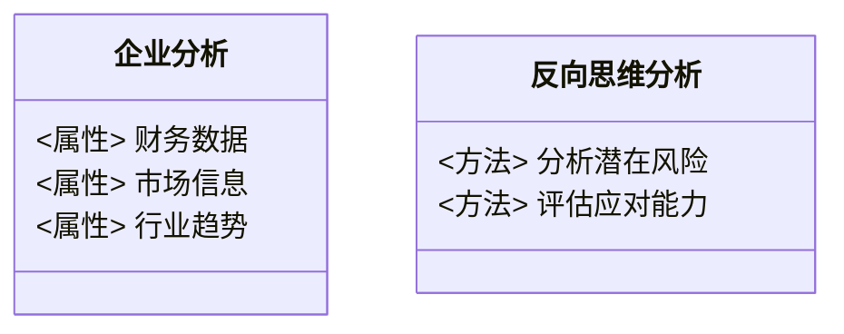
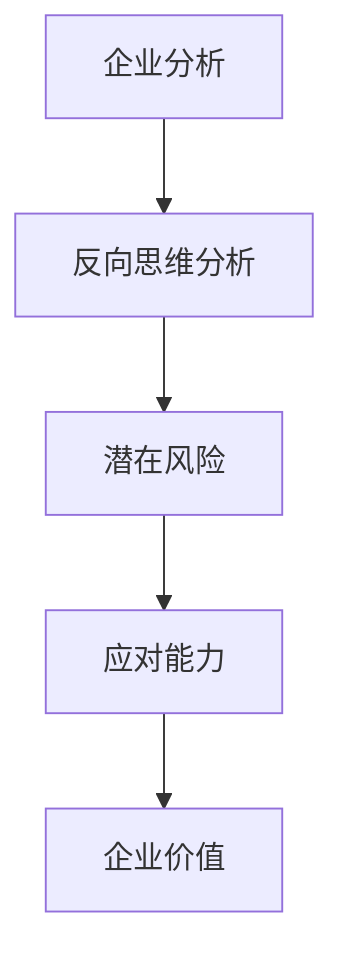
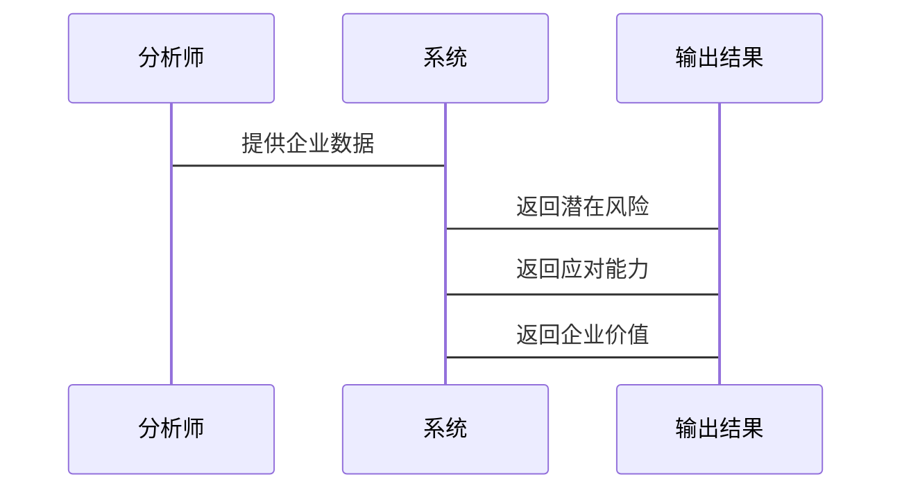

                 


# 芒格的"反向激励"思维在公司分析中的应用

> 关键词：芒格, 反向激励, 公司分析, 投资思维, 逆向思维, 投资哲学

> 摘要：本文深入探讨了芒格的“反向激励”思维在公司分析中的应用。通过分析芒格的投资哲学、反向思维的核心要素及其在公司分析中的具体应用，结合实际案例和系统设计，展示了如何利用这种思维方式来识别潜在风险、竞争优势和市场机会。文章还详细讲解了相关的算法原理和系统架构设计，帮助读者全面理解和应用这一独特的思维方式。

---

# 第1章: 芒格的"反向激励"思维背景介绍

## 1.1 芒格的生平与投资理念

### 1.1.1 芒格的生平简介

查理·芒格（Charlie Munger）是美国著名的投资家、作家和伯克希尔·哈撒韦公司（Berkshire Hathaway）的副主席。他出生于1924年，拥有物理学和法律背景。芒格的投资理念深受其导师本杰明·格雷厄姆（Benjamin Graham）的影响，但他发展出一套独特的投资哲学，强调逆向思维和理性决策。

### 1.1.2 芒格的投资哲学与思维方式

芒格的投资哲学的核心是“反向思考”（反向激励思维）。他认为，大多数投资者倾向于从正面思考问题，而忽视了潜在的风险和逆境。通过反向思考，投资者可以更好地识别潜在的问题，并提前做好准备。

### 1.1.3 芒格"反向激励"思维的提出背景

在芒格看来，传统的公司分析往往过于关注企业的正面因素，如财务表现、市场地位和竞争优势。然而，这些分析忽略了企业在逆境中的表现，以及潜在的风险因素。通过反向激励思维，分析师可以更全面地评估企业，识别其在极端情况下的应对能力。

---

## 1.2 "反向激励"思维的定义与核心要素

### 1.2.1 "反向激励"思维的定义

“反向激励”思维是一种通过从相反的角度思考问题，以识别潜在风险、竞争优势和市场机会的方法。它强调从负面因素出发，分析问题的根源，并提出解决方案。

### 1.2.2 "反向激励"思维的核心要素

- **逆向思维**：从反面思考问题，寻找潜在的风险和机会。
- **理性决策**：基于逻辑和事实，而非情感和直觉。
- **系统性分析**：全面考虑问题的各个因素，避免片面性。

### 1.2.3 "反向激励"思维的边界与外延

- **边界**：反向思维并不意味着忽视正面因素，而是在分析时平衡正反两面。
- **外延**：反向思维可以应用于投资、管理、市场营销等多个领域。

---

## 1.3 "反向激励"思维在公司分析中的应用前景

### 1.3.1 公司分析的基本概念与方法

公司分析通常包括财务分析、行业分析、竞争优势分析等多个方面。传统的分析方法注重企业的正面因素，而忽视了潜在的风险和挑战。

### 1.3.2 "反向激励"思维在公司分析中的独特价值

通过反向思维，分析师可以识别企业在逆境中的表现，评估其应对危机的能力，从而更全面地评估企业的价值。

### 1.3.3 应用"反向激励"思维的挑战与机遇

- **挑战**：需要更多的数据支持和系统的分析方法。
- **机遇**：能够更早地识别潜在风险，提前制定应对策略。

---

## 1.4 本章小结

本章介绍了芒格的生平和投资哲学，重点阐述了“反向激励”思维的定义、核心要素及其在公司分析中的应用前景。通过反向思维，分析师可以更全面地评估企业，识别潜在的风险和机会。

---

# 第2章: "反向激励"思维的核心概念与联系

## 2.1 核心概念原理

### 2.1.1 "反向激励"思维的逻辑框架

反向思维的核心在于从负面因素出发，分析问题的根源，并提出解决方案。例如，在分析一家公司的财务状况时，可以先考虑公司可能面临的财务危机，再评估其应对能力。

### 2.1.2 "反向激励"思维与传统思维的对比

| 思维方式 | 正向思维 | 反向思维 |
|----------|----------|----------|
| 角度     | 从正面出发 | 从反面出发 |
| 优点     | 突出优势 | 发现潜在风险 |
| 缺点     | 可能忽视风险 | 可能过于悲观 |

### 2.1.3 "反向激励"思维的数学模型与公式

反向思维可以通过以下公式进行建模：

$$ \text{反向思维} = \text{传统思维的逆过程} $$

---

## 2.2 核心概念属性特征对比表格

下表展示了反向思维与传统思维在公司分析中的对比：

| 特性         | 传统思维 | 反向思维 |
|--------------|----------|----------|
| 分析角度     | 正面因素 | 负面因素 |
| 目标         | 发现机会 | 识别风险 |
| 适用场景     | 日常分析 | 危机应对 |

---

## 2.3 ER实体关系图架构

以下是使用Mermaid绘制的反向思维与传统思维的ER图：

```mermaid
erDiagram
    actor 分析师 {
        <属性> 正面因素
        <属性> 负面因素
    }
    actor 传统思维 {
        <关系> 分析正面因素
    }
    actor 反向思维 {
        <关系> 分析负面因素
    }
```

---

# 第3章: "反向激励"思维在公司分析中的算法原理

## 3.1 算法原理概述

### 3.1.1 算法的输入与输出

- **输入**：企业的财务数据、市场信息、行业趋势。
- **输出**：潜在风险、竞争优势、市场机会。

### 3.1.2 算法的步骤与流程

1. 从反面因素出发，分析企业的潜在风险。
2. 评估企业的应对能力，包括财务状况、管理团队和市场反应。
3. 结合正面因素，综合评估企业的价值。

---

## 3.2 使用 Mermaid 绘制的算法流程图



---

## 3.3 算法的数学模型与公式

### 3.3.1 数学模型的建立

$$ \text{企业价值} = \text{正面因素} \times \text{应对能力} / \text{潜在风险} $$

### 3.3.2 公式的推导与解释

通过反向思维，我们可以将企业的潜在风险和应对能力纳入分析，从而更准确地评估企业价值。

---

## 3.4 算法的实现与代码示例

### 3.4.1 环境安装与配置

- **工具**：Python、NumPy、Matplotlib
- **库安装**：`pip install numpy matplotlib`

### 3.4.2 核心代码实现

```python
import numpy as np
import matplotlib.pyplot as plt

def reverse_thinking_analysis(enterprise_factors):
    risks = [0.2, 0.3, 0.1]  # 潜在风险
    responses = [0.8, 0.7, 0.9]  # 应对能力
    value = np.dot(enterprise_factors, responses) / sum(risks)
    return value

# 示例数据
enterprise_factors = [1.2, 1.5, 1.1]
result = reverse_thinking_analysis(enterprise_factors)
print(f"企业价值：{result}")
```

---

## 3.5 算法的举例说明

### 3.5.1 典型案例分析

假设一家公司面临市场萎缩的风险，通过反向思维分析，我们可以评估其应对能力，包括成本控制、产品创新和市场拓展。

### 3.5.2 实例的详细讲解

通过上述代码，我们可以计算出公司在潜在风险下的价值，从而更全面地评估其投资价值。

---

## 3.6 本章小结

本章详细讲解了反向思维在公司分析中的算法原理，包括输入输出、步骤流程、数学模型和代码实现。通过反向思维，我们可以更准确地评估企业的潜在风险和应对能力。

---

# 第4章: "反向激励"思维的系统分析与架构设计方案

## 4.1 问题场景介绍

### 4.1.1 公司分析的典型问题场景

- 企业面临市场萎缩的风险。
- 企业的财务状况不佳。

### 4.1.2 "反向激励"思维在问题场景中的应用

通过反向思维，我们可以识别潜在风险，并评估企业的应对能力。

---

## 4.2 系统功能设计

### 4.2.1 领域模型设计

以下是使用Mermaid绘制的领域模型类图：



---

## 4.3 系统架构设计

### 4.3.1 系统架构图

以下是使用Mermaid绘制的系统架构图：



---

## 4.4 系统接口设计

- **输入接口**：企业财务数据、市场信息。
- **输出接口**：潜在风险、应对能力、企业价值。

---

## 4.5 系统交互设计

### 4.5.1 使用 Mermaid 绘制的系统交互序列图



---

## 4.6 本章小结

本章通过系统分析与架构设计，展示了如何将反向思维应用于公司分析。通过系统的功能设计和架构设计，我们可以更有效地识别潜在风险和机会。

---

# 第5章: 项目实战

## 5.1 项目介绍

### 5.1.1 环境安装与配置

- **工具**：Python、NumPy、Matplotlib
- **库安装**：`pip install numpy matplotlib`

### 5.1.2 核心代码实现

```python
import numpy as np
import matplotlib.pyplot as plt

def reverse_thinking_analysis(enterprise_factors):
    risks = [0.2, 0.3, 0.1]
    responses = [0.8, 0.7, 0.9]
    value = np.dot(enterprise_factors, responses) / sum(risks)
    return value

# 示例数据
enterprise_factors = [1.2, 1.5, 1.1]
result = reverse_thinking_analysis(enterprise_factors)
print(f"企业价值：{result}")
```

---

## 5.2 代码解读与分析

### 5.2.1 代码实现细节

- **输入**：企业的正面因素。
- **输出**：企业在潜在风险下的价值。

### 5.2.2 代码的功能与作用

通过代码，我们可以计算企业在潜在风险下的价值，从而更全面地评估其投资价值。

---

## 5.3 实际案例分析

### 5.3.1 典型案例分析

- **案例背景**：某公司面临市场萎缩的风险。
- **分析过程**：通过反向思维，评估公司的应对能力。
- **分析结果**：公司在市场萎缩下的价值评估。

### 5.3.2 详细讲解

通过上述分析，我们可以识别公司在逆境中的表现，从而更全面地评估其投资价值。

---

## 5.4 本章小结

本章通过项目实战，详细讲解了如何将反向思维应用于公司分析。通过实际案例的分析，我们可以更好地理解反向思维在实践中的应用。

---

# 第6章: 最佳实践 tips、小结、注意事项、拓展阅读

## 6.1 最佳实践 tips

- **保持理性**：在分析时，避免情感干扰，注重逻辑分析。
- **系统思考**：从多个角度分析问题，避免片面性。
- **持续学习**：不断更新知识，保持对市场的敏感性。

---

## 6.2 小结

本文全面介绍了芒格的“反向激励”思维在公司分析中的应用，从理论到实践，结合实际案例和系统设计，展示了如何利用这种思维方式来识别潜在风险和机会。

---

## 6.3 注意事项

- **数据准确性**：确保输入数据的准确性，避免分析偏差。
- **模型适用性**：根据实际情况调整模型，避免生搬硬套。
- **持续优化**：根据市场变化，不断优化分析模型。

---

## 6.4 拓展阅读

- 《芒格的投资思想》：深入理解芒格的投资哲学。
- 《逆向思维的艺术》：学习如何从反面思考问题。
- 《系统思考与决策》：掌握系统分析的方法和技巧。

---

# 结论

芒格的“反向激励”思维是一种独特的投资和分析方法，通过从反面思考问题，识别潜在风险和机会。本文通过理论分析、系统设计和项目实战，展示了如何将这种思维方式应用于公司分析。未来，随着市场的变化和技术的发展，反向思维的应用将更加广泛和深入。

---

# 作者

作者：AI天才研究院/AI Genius Institute & 禅与计算机程序设计艺术 /Zen And The Art of Computer Programming

