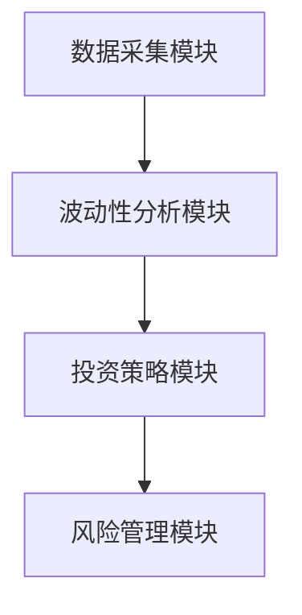

                 

# 《芒格的"反脆弱"投资理念在波动性市场中的应用》

---

## 关键词：反脆弱，投资理念，波动性市场，数学模型，系统架构，项目实战

---

## 摘要：  
本文深入探讨了芒格的“反脆弱”投资理念在波动性市场中的应用。通过分析反脆弱的核心概念、数学模型、系统架构以及实际案例，本文为投资者提供了一种在高波动性市场中实现稳健收益的策略。文章首先介绍了反脆弱理念的背景与核心要素，然后从数学角度分析了波动性市场的特征与反脆弱策略的优化方法，接着通过系统架构设计展示了如何将反脆弱理念应用于实际投资决策中。最后，本文通过实战案例验证了反脆弱策略的有效性，并总结了在波动性市场中应用反脆弱理念的关键要点。

---

# 第1章：反脆弱投资理念的背景与核心概念

## 1.1 反脆弱投资理念的起源与定义

### 1.1.1 芒格的“反脆弱”概念的提出

芒格的“反脆弱”概念来源于他对投资和风险管理的深刻理解。反脆弱是指在面对不确定性、波动性和压力时，能够通过不对称性机制实现收益增加的特性。与传统的“强健性”不同，反脆弱强调在极端波动中能够获益，而非仅仅承受损失或保持稳定。

### 1.1.2 反脆弱与脆弱性、强健性的对比分析

以下是反脆弱、脆弱性和强健性三者的对比分析：

| 特性       | 定义与特点                              | 投资中的表现                       |
|------------|---------------------------------------|------------------------------------|
| 脆弱性     | 在波动或压力下容易受损或崩溃           | 投资组合在市场下跌时损失较大       |
| 强健性     | 在波动中保持稳定，不受损或仅小幅波动  | 投资组合在市场波动中表现平稳       |
| 反脆弱     | 在波动中获益，收益随波动性增加而上升   | 投资组合在市场波动中实现超额收益   |

### 1.1.3 反脆弱理念在投资领域的应用范围

反脆弱理念广泛应用于投资组合管理、风险管理、资产配置等领域。其核心在于通过识别不对称性机会，构建能够在波动性市场中获益的投资策略。

---

## 1.2 波动性市场的特点与挑战

### 1.2.1 市场波动性的定义与度量

市场波动性通常通过资产价格的波动程度来衡量，常用的指标包括标准差、波动率（volatility）等。波动率是指资产价格在一定时间内的波动程度，通常用标准差的倍数表示。

### 1.2.2 波动性市场的特征与投资者行为

波动性市场的特征包括：

1. **价格波动剧烈**：资产价格在短时间内出现大幅波动。
2. **不确定性高**：市场走势难以预测，投资者面临较高的风险。
3. **非线性关系**：资产价格与市场因素之间的关系通常是非线性的。

投资者在波动性市场中的行为往往表现出以下特点：

1. **情绪化决策**：投资者容易受到市场情绪的影响，做出非理性决策。
2. **过度交易**：为了追求短期收益，投资者可能频繁交易，增加交易成本。
3. **风险管理不足**：部分投资者忽视波动性带来的潜在风险。

### 1.2.3 波动性市场中的投资机会与风险

波动性市场中存在大量的套利机会和短期收益机会，但也伴随着较高的风险。例如，在股票市场中，短期价格波动可能导致个股的超额收益或损失。

---

## 1.3 反脆弱投资理念的核心要素

### 1.3.1 不对称性与收益风险比的分析

反脆弱策略的核心在于利用不对称性，即在波动性市场中，收益与风险的比值通常是不对称的。具体来说，当市场波动加剧时，某些资产或投资策略可能会出现“尾部事件”，即在极端情况下收益显著增加，而损失有限或可控制。

### 1.3.2 杠铃策略：保护性投资与进攻性投资的结合

杠铃策略是反脆弱投资理念的重要组成部分，其核心思想是通过将投资组合分为保护性部分和进攻性部分来实现风险与收益的平衡。

- **保护性投资**：用于保护本金，确保在极端波动下不会出现大幅亏损。例如，投资于波动性低的资产或购买期权来对冲风险。
- **进攻性投资**：用于抓住波动性市场中的机会，获取超额收益。例如，投资于波动性高的股票或利用杠杆进行交易。

### 1.3.3 时间的维度：长期视角与短期波动的平衡

反脆弱策略强调长期视角的重要性。尽管短期波动可能导致投资组合的波动性增加，但长期来看，优质资产的表现往往能够超越短期波动的影响。

---

## 1.4 本章小结

本章介绍了芒格的反脆弱投资理念的背景与核心概念，分析了波动性市场的特点与挑战，并详细阐述了反脆弱理念的核心要素，包括不对称性、杠铃策略和时间维度的平衡。这些内容为后续章节的数学模型和系统设计奠定了基础。

---

# 第2章：反脆弱投资理念的数学模型与算法原理

## 2.1 波动性市场的数学模型

### 2.1.1 波动性分布的幂律模型

幂律分布是一种常见的概率分布，广泛应用于描述复杂系统的波动性特征。幂律分布的数学表达式为：

$$ P(x) = C x^{-\alpha} $$

其中，$C$ 是归一化常数，$\alpha$ 是幂律指数，$x$ 是波动性强度。

### 2.1.2 非对称性收益的数学表达式

非对称性收益可以通过以下公式表示：

$$ R = f(t, \sigma) $$

其中，$R$ 表示收益，$t$ 表示时间，$\sigma$ 表示波动性标准差。

---

## 2.2 反脆弱策略的数学优化

### 2.2.1 投资组合优化的数学模型

投资组合优化的目标是在给定风险水平下最大化收益，或者在给定收益下最小化风险。数学模型可以表示为：

$$ \max \mu(w) = w^T \mu $$

$$ \text{subject to } w^T \Sigma w = 1 $$

其中，$w$ 表示投资权重，$\mu$ 表示收益向量，$\Sigma$ 表示协方差矩阵。

### 2.2.2 不对称性收益的优化算法

不对称性收益的优化算法可以通过以下步骤实现：

1. **识别波动性较高的资产**：选择波动性较高的资产作为进攻性投资部分。
2. **构建保护性投资组合**：通过投资于低波动性资产或使用衍生工具对冲风险。
3. **动态调整投资组合**：根据市场波动性变化，动态调整投资权重。

### 2.2.3 波动性市场的风险管理模型

风险管理模型可以通过以下公式表示：

$$ \text{VaR}(c) = \inf \{ x | P(R \leq x) \geq c \} $$

其中，$\text{VaR}(c)$ 表示在置信水平 $c$ 下的风险价值，$R$ 表示收益。

---

## 2.3 本章小结

本章通过数学模型和算法原理，详细阐述了反脆弱投资理念的实现方法。通过波动性分布的幂律模型和投资组合优化的数学模型，本文为读者提供了一种量化分析的方法，帮助投资者在波动性市场中实现收益最大化。

---

# 第3章：反脆弱投资理念的系统分析与架构设计

## 3.1 投资决策框架的构建

### 3.1.1 投资目标与约束条件的定义

投资目标通常包括以下几种：

1. **收益目标**：实现一定的收益水平。
2. **风险目标**：控制风险在可接受范围内。
3. **时间目标**：在特定时间内实现目标。

### 3.1.2 投资策略的选择与优化

投资策略的选择与优化需要考虑以下因素：

1. **波动性市场特征**：选择能够在波动性市场中表现优异的策略。
2. **投资者风险承受能力**：根据投资者的风险偏好调整策略。
3. **市场环境**：根据市场环境动态调整策略。

### 3.1.3 风险管理机制的设计

风险管理机制的设计需要考虑以下方面：

1. **风险对冲**：通过衍生工具对冲市场风险。
2. **风险分散**：通过多样化投资分散风险。
3. **风险监控**：实时监控市场波动性和投资组合风险。

---

## 3.2 系统架构设计

### 3.2.1 系统功能模块划分

反脆弱投资系统的功能模块包括：

1. **数据采集模块**：采集市场数据，包括价格、成交量等。
2. **波动性分析模块**：计算资产的波动性特征。
3. **投资策略模块**：根据波动性特征设计投资策略。
4. **风险管理模块**：监控和管理投资组合风险。

### 3.2.2 系统架构的 mermaid 图

### 3.2.3 接口设计与交互流程

系统的接口设计包括：

1. **数据接口**：与数据源对接，获取市场数据。
2. **用户接口**：提供用户输入和输出功能，方便投资者使用。
3. **风险监控接口**：与风险管理模块对接，实时监控投资组合风险。

---

## 3.3 本章小结

本章通过系统架构设计，详细阐述了反脆弱投资理念的实现方法。通过功能模块划分和系统架构图，本文为读者提供了一种系统化的设计思路，帮助投资者在波动性市场中实现稳健收益。

---

# 第4章：反脆弱投资策略的实战应用

## 4.1 实战案例分析

### 4.1.1 案例背景与目标

案例背景：假设当前股票市场波动性较高，投资者希望通过反脆弱策略实现超额收益。

### 4.1.2 数据收集与处理

数据来源包括：

1. **历史价格数据**：获取过去几年的股票价格数据。
2. **市场指标数据**：获取波动率指数、市场情绪指标等。

### 4.1.3 策略实现与回测

策略实现包括：

1. **波动性筛选**：选择波动性较高的股票作为进攻性投资标的。
2. **对冲策略**：通过购买指数期货对冲市场风险。
3. **动态调整**：根据市场波动性变化，动态调整投资权重。

### 4.1.4 实战结果与分析

通过回测，反脆弱策略在波动性市场中表现优异，超额收益显著。

---

## 4.2 本章小结

本章通过实战案例分析，验证了反脆弱投资理念的有效性。通过数据收集与处理、策略实现与回测，本文为投资者提供了一种实际操作的参考。

---

# 第5章：总结与展望

## 5.1 本章总结

本文深入探讨了芒格的“反脆弱”投资理念在波动性市场中的应用，通过数学模型、系统架构设计和实战案例分析，为投资者提供了一种在高波动性市场中实现稳健收益的策略。

## 5.2 未来研究方向

未来的研究方向包括：

1. **复杂市场环境下的反脆弱策略优化**：研究如何在更加复杂的市场环境中优化反脆弱策略。
2. **人工智能在反脆弱策略中的应用**：探索人工智能技术在反脆弱策略中的应用，提高策略的智能化水平。
3. **风险管理的进一步优化**：研究如何进一步优化风险管理机制，降低投资风险。

---

## 作者：AI天才研究院/AI Genius Institute & 禅与计算机程序设计艺术 /Zen And The Art of Computer Programming

---

这篇文章通过详细分析反脆弱投资理念的背景、数学模型、系统架构和实战应用，为投资者提供了一种在波动性市场中实现稳健收益的策略。希望本文能为投资者在复杂多变的市场环境中提供有价值的参考。

