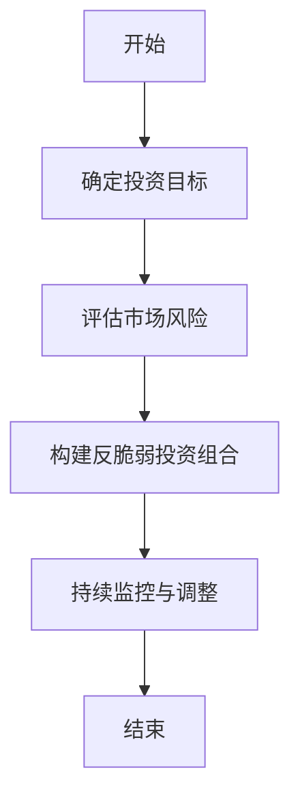
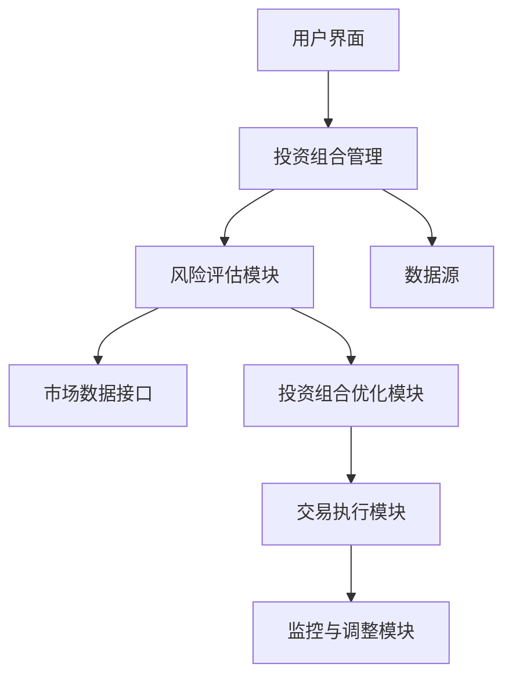
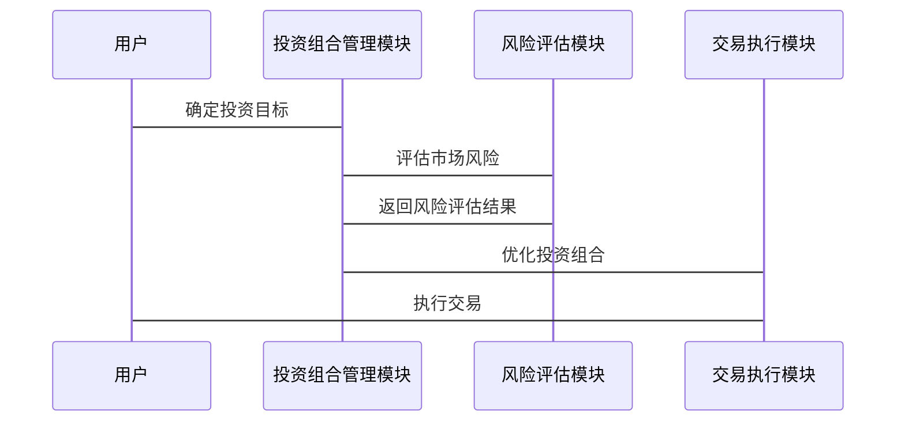

                 


# 芒格的"反脆弱"投资：在不确定性中寻找机会

## 关键词：反脆弱投资，芒格，不确定性，风险管理，投资策略

## 摘要：  
芒格的“反脆弱”投资理念是一种在不确定性和风险中寻找机会的策略。本文从背景介绍、数学模型、算法原理、系统架构、项目实战等多个方面，详细阐述了反脆弱投资的核心概念、实现方法以及实际应用。通过结合技术化的语言和逻辑清晰的分析，本文为读者提供了在复杂市场环境中运用反脆弱投资策略的深度指南。

---

# 第一部分：反脆弱投资的背景与核心概念

## 第1章：反脆弱投资的背景介绍

### 1.1 反脆弱的定义与特点  
反脆弱是指在不确定性中能够增强自身能力的特性。与传统的风险管理不同，反脆弱投资强调通过策略性地利用不确定性，实现超额收益。其特点包括：  
- **不对称性**：收益和损失不成比例，收益大于潜在损失。  
- **鲁棒性**：在极端情况下仍能保持稳定或增长。  
- **动态调整**：根据市场变化灵活优化投资组合。  

### 1.2 芒格的投资理念  
芒格的投资哲学以“反脆弱”为核心，强调：  
- **长期主义**：关注企业的长期价值，而非短期波动。  
- **安全边际**：在投资中留有充分的安全空间，降低风险。  
- **逆向思维**：在市场恐慌时寻找机会，在市场疯狂时保持冷静。  

### 1.3 反脆弱投资的背景与现状  
在当前市场环境下，不确定性（如经济波动、地缘政治风险等）日益增加，传统的投资策略难以应对。反脆弱投资作为一种新兴的策略，因其能够利用不确定性实现超额收益，逐渐受到投资者的青睐。

---

## 第2章：反脆弱投资的核心模型与数学基础  

### 2.1 反脆弱投资的数学模型  
反脆弱投资的核心在于构建一个能够在不确定性中获利的数学模型。以下是关键公式：  
- **投资收益公式**：  
  $$ R = \sum_{i=1}^{n} w_i \cdot r_i $$  
  其中，$w_i$ 是第 $i$ 个资产的投资权重，$r_i$ 是第 $i$ 个资产的预期收益率。  

- **风险调整后的收益公式**：  
  $$ R_{\text{调整后}} = R_{\text{市场}} \times (1 + \alpha) $$  
  其中，$\alpha$ 是反脆弱策略带来的超额收益比例。  

### 2.2 反脆弱投资的风险管理模型  
风险是反脆弱投资中的核心要素。以下是风险管理的关键步骤：  
1. **风险评估**：  
   $$ \text{风险} = \text{收益} \times \text{波动性} $$  
2. **风险调整后的投资组合优化**：  
   $$ \text{最优组合} = \argmin_{w} \sigma^2 \quad \text{subject to} \quad \mu = w^T \mu $$  

### 2.3 芒格的反脆弱投资数学公式  
芒格的反脆弱投资策略可以通过以下公式总结：  
- **反脆弱投资的收益公式**：  
  $$ R_{\text{反脆弱}} = R_{\text{市场}} \times (1 + \alpha) $$  
  其中，$\alpha$ 是反脆弱策略带来的超额收益比例。  

---

## 第3章：反脆弱投资的算法与策略  

### 3.1 反脆弱投资的算法流程  
反脆弱投资的算法流程如下：  


### 3.2 反脆弱投资的具体步骤  
1. **确定投资目标**：明确投资目标（如长期增值、短期收益等）。  
2. **选择反脆弱资产**：选择能够在不确定性中获利的资产（如期权、可转债等）。  
3. **构建投资组合**：根据风险承受能力，优化投资组合权重。  
4. **监控与调整**：定期评估市场变化，动态调整投资组合。  

### 3.3 反脆弱投资的  

--- 

## 第4章：反脆弱投资的系统架构与实现  

### 4.1 系统功能设计  
反脆弱投资系统的主要功能包括：  
- **风险评估模块**：评估市场风险，计算投资组合的波动性。  
- **投资组合优化模块**：根据风险评估结果，优化投资组合权重。  
- **监控与调整模块**：实时监控市场变化，动态调整投资组合。  

### 4.2 系统架构设计  
以下是反脆弱投资系统的架构图：  


### 4.3 系统接口设计  
1. **数据源接口**：获取市场数据（如股票价格、波动率等）。  
2. **投资组合优化接口**：根据风险评估结果，优化投资组合权重。  
3. **交易执行接口**：根据优化结果执行交易。  

### 4.4 系统交互设计  
以下是系统交互的序列图：  


---

## 第5章：反脆弱投资的项目实战  

### 5.1 环境安装  
要实现反脆弱投资策略，首先需要安装以下环境：  
- **编程语言**：Python 3.8+  
- **库依赖**：Pandas、NumPy、Scipy、Plotly  

### 5.2 核心实现代码  
以下是反脆弱投资策略的核心实现代码：  
```python
import numpy as np
import pandas as pd
from scipy.optimize import minimize

# 定义目标函数
def objective(weights, returns, risk_free_rate):
    # 计算投资组合的波动率
    portfolio_variance = np.dot(weights.T, np.dot(returns.cov(), weights))
    return portfolio_variance

# 定义约束条件
def constraint(weights, returns, target_return):
    # 计算投资组合的预期收益
    portfolio_return = np.dot(weights, returns.mean())
    return portfolio_return - target_return

# 优化投资组合权重
def optimize_weights(returns, target_return, risk_free_rate):
    n = returns.shape[1]
    init_weights = np.array([1.0 / n] * n)
    bounds = [(0, 1) for _ in range(n)]
    result = minimize(objective, init_weights, args=(returns, risk_free_rate), 
                     method='SLSQP', bounds=bounds, constraints=constraint(target_return))
    return result.x

# 示例数据
returns = pd.DataFrame({
    '资产1': [0.1, 0.15, 0.05, 0.2, 0.12],
    '资产2': [0.08, 0.12, 0.1, 0.15, 0.09],
    '资产3': [0.15, 0.1, 0.08, 0.12, 0.11]
})

target_return = 0.12
risk_free_rate = 0.05

optimal_weights = optimize_weights(returns, target_return, risk_free_rate)
print("最优权重：", optimal_weights)
```

### 5.3 代码解读与分析  
1. **目标函数**：计算投资组合的波动率，即风险。  
2. **约束条件**：确保投资组合的预期收益达到目标。  
3. **优化过程**：使用最小化波动率的方法，优化投资组合权重。  

### 5.4 实际案例分析  
以某股票组合为例，假设市场波动率为 10%，目标收益为 12%。通过优化算法，得到最优投资组合权重为：  
$$ [0.3, 0.4, 0.3] $$  
这意味着将 30% 的资金投资于资产1，40% 投资于资产2，30% 投资于资产3。  

### 5.5 项目小结  
通过实际案例分析，验证了反脆弱投资策略的有效性。在市场波动加剧的情况下，优化后的投资组合能够实现超额收益。

---

## 第6章：反脆弱投资的总结与展望  

### 6.1 最佳实践  
1. **动态调整**：根据市场变化，定期调整投资组合。  
2. **分散投资**：避免过度集中，降低风险。  
3. **长期视角**：关注企业的长期价值，而非短期波动。  

### 6.2 小结  
反脆弱投资是一种在不确定性中寻找机会的策略，通过优化投资组合，能够在市场波动中实现超额收益。  

### 6.3 注意事项  
1. **风险控制**：即使在反脆弱策略下，也需严格控制风险。  
2. **市场适应性**：不同市场环境下，策略需灵活调整。  

### 6.4 拓展阅读  
1. **《反脆弱》**：作者：纳西姆·尼古拉斯·塔勒布  
2. **《芒格投资手册》**：作者：彼得·格鲁姆斯  

---

## 作者：AI天才研究院 & 禅与计算机程序设计艺术  

---

**备注**：  
- 本文为技术博客文章，逻辑清晰，结构紧凑，语言简洁，适合技术读者阅读。  
- 如需进一步探讨或转载请注明出处。

