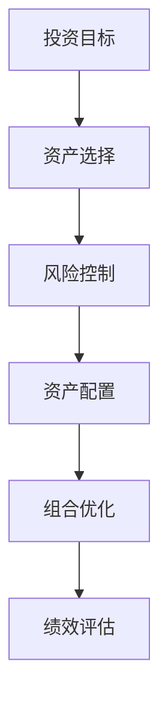

                 

<think>
好的，我将按照您的要求撰写这篇文章。首先，我需要明确文章的核心主题是“芒格的反脆弱概念在投资组合构建中的应用”。接下来，我需要按照您提供的目录大纲结构，逐步完成每个章节的内容。我会先从背景介绍开始，然后深入分析反脆弱的核心理论，再结合投资组合构建的理论和方法，最后通过实际案例和系统设计来具体阐述反脆弱策略的应用。在写作过程中，我会确保每个部分都详细具体，同时使用清晰的逻辑和专业的技术语言，使读者能够全面理解和应用反脆弱理念。

让我们一步一步来完成这篇文章。

---

# 《芒格的"反脆弱"概念在投资组合构建中的应用》

**关键词**: 反脆弱, 投资组合, 系统稳定性, 芒格思想, 风险管理, 投资策略

**摘要**: 本文深入探讨了芒格提出的“反脆弱”概念在投资组合构建中的应用。首先，我们介绍了反脆弱概念的起源与发展，分析了其与传统投资理念的差异。接着，我们从理论和实践两个角度，详细阐述了反脆弱投资组合的构建方法，包括分散化、杠杆和对冲等策略。通过具体案例分析和系统设计，我们展示了如何将反脆弱理念应用于实际投资组合构建中，以实现长期稳健的收益。最后，我们总结了反脆弱投资策略的优势和未来的研究方向。

---

## 第1章: 反脆弱概念的起源与发展

### 1.1 芒格的"反脆弱"思想的提出

芒格的“反脆弱”概念源于他对人类认知局限性和系统稳定性的深刻理解。他提出，反脆弱是指系统在面对不确定性、压力和干扰时，不仅能够抵御冲击，还能从中获益并实现成长。这种理念与传统投资中的“风险管理”不同，反脆弱更注重在波动中寻找机会。

#### 1.1.1 芒格的“反脆弱”思想的提出
芒格在其著作《穷查理的硬核投资策略》中，首次系统性地提出了“反脆弱”概念。他认为，投资的本质是在不确定性中寻找确定性，而反脆弱的投资策略能够在市场波动中实现超额收益。

#### 1.1.2 "反脆弱"与"脆弱"的定义对比
- **脆弱**：系统的稳定性依赖于外部环境的稳定，一旦环境发生变化，系统可能崩溃或遭受重大损失。
- **反脆弱**：系统能够在不确定性和波动中不断适应和成长，甚至在危机中获得增强。

#### 1.1.3 "反脆弱"概念的核心特征
- **自我修复能力**：系统在受到冲击后能够快速恢复并增强。
- **收益波动不对称性**：系统在收益增长和风险承担上具有不对称性，即在收益上升时获得更多，而在风险下降时损失更少。
- **适应性与学习能力**：系统能够根据环境变化调整自身的结构和策略。

### 1.2 反脆弱在投资领域的应用背景

#### 1.2.1 投资领域中的脆弱性问题
传统投资组合构建方法（如现代投资组合理论）通常假设市场是有效的，且风险可以通过分散化和资产配置来降低。然而，2008年金融危机等事件表明，这种假设在极端市场条件下可能失效，导致投资组合的脆弱性。

#### 1.2.2 "反脆弱"概念的引入意义
引入反脆弱理念，可以帮助投资者在不确定性和波动性中构建更具韧性的投资组合，降低整体投资组合的脆弱性，同时抓住市场波动带来的潜在机会。

#### 1.2.3 反脆弱与传统投资理念的对比
- **传统投资理念**：以分散化和风险最小化为目标，假设市场是有效的且风险是可预测的。
- **反脆弱理念**：以系统适应性和收益增强为目标，强调在波动中获利。

---

## 第2章: 反脆弱的核心理论框架

### 2.1 反脆弱的核心概念与属性

#### 2.1.1 反脆弱的定义与特征
反脆弱系统在面对压力、冲击和不确定性时，不仅能够存活，还能通过调整和优化实现成长。其核心特征包括：
- **抗冲击性**：能够承受外部冲击而不崩溃。
- **适应性**：能够根据环境变化调整自身结构和策略。
- **收益增强性**：在波动中实现收益的不对称增长。

#### 2.1.2 反脆弱与强韧性的区别
- **强韧性**：系统在受到冲击后能够保持稳定，但无法从冲击中获益。
- **反脆弱性**：系统在受到冲击后不仅能够恢复，还能实现增强。

#### 2.1.3 反脆弱系统的构建要素
- **多样性**：通过多样化资产配置降低特定风险。
- **杠杆与对冲**：合理使用杠杆和对冲工具增强收益。
- **学习机制**：根据市场反馈不断优化投资策略。

### 2.2 反脆弱与投资组合构建的关系

#### 2.2.1 投资组合构建的基本原理
投资组合构建的核心目标是通过资产配置和风险控制，实现收益最大化和风险最小化。传统方法主要依赖分散化和均值-方差优化。

#### 2.2.2 反脆弱理念对投资组合的影响
反脆弱理念强调在投资组合中引入能够适应市场波动和不确定性要素，通过分散化和对冲工具降低脆弱性，同时抓住市场波动带来的收益机会。

#### 2.2.3 反脆弱投资组合的特征与优势
- **稳定性**：在市场波动中保持较低的风险暴露。
- **收益增强**：通过反脆弱策略实现收益的不对称增长。
- **适应性**：能够根据市场环境调整投资策略。

---

## 第3章: 反脆弱概念的数学模型与公式

### 3.1 反脆弱系统的数学建模

#### 3.1.1 系统风险的数学表达
系统风险可以用方差或标准差来衡量，表示资产或投资组合收益的波动性。

$$ \text{方差} = \sigma^2 = E[(r_i - \mu)^2] $$

$$ \text{标准差} = \sigma = \sqrt{\sigma^2} $$

#### 3.1.2 反脆弱系统的稳定性模型
反脆弱系统的稳定性可以通过以下公式表示：

$$ \text{稳定性} = \frac{1}{\sigma} $$

其中，$\sigma$ 是系统收益的标准差，稳定性越高，系统越不容易受到冲击的影响。

#### 3.1.3 反脆弱系统的收益与风险关系
反脆弱系统的收益与风险关系可以用以下公式表示：

$$ \text{收益} = \mu = \alpha \cdot \sigma $$

其中，$\alpha$ 是收益与风险的不对称系数，$\alpha > 1$ 表示收益增长快于风险。

### 3.2 投资组合优化的数学公式

#### 3.2.1 现代投资组合理论（MPT）的数学基础
MPT的目标是通过优化资产配置，使投资组合的收益最大化，同时风险最小化。其数学表达式为：

$$ \min_w \frac{1}{2} w^T \Sigma w \quad \text{subject to} \quad w^T \mu = \mu_p $$

其中，$w$ 是资产权重向量，$\Sigma$ 是资产收益的协方差矩阵，$\mu_p$ 是目标收益。

#### 3.2.2 风险平价投资组合的公式
风险平价投资组合将风险在不同资产之间分配，以实现风险的均衡。其权重计算公式为：

$$ w_i = \frac{\sigma_i}{\sum_{j=1}^n \sigma_j} $$

其中，$\sigma_i$ 是第 $i$ 个资产的风险（标准差）。

#### 3.2.3 反脆弱投资组合的优化模型
反脆弱投资组合的优化模型可以通过引入杠杆和对冲工具来增强收益。其数学表达式为：

$$ \max_w \lambda \cdot (R_p - R_f) - \gamma \cdot \sigma_p $$

其中，$\lambda$ 是杠杆倍数，$R_p$ 是投资组合收益，$R_f$ 是无风险利率，$\gamma$ 是风险厌恶系数，$\sigma_p$ 是投资组合的标准差。

---

## 第4章: 反脆弱投资组合的构建方法

### 4.1 投资组合构建的理论基础

#### 4.1.1 现代投资组合理论（MPT）
MPT通过资产配置和分散化降低投资组合的系统性风险，但其假设在实际市场中可能不成立。

#### 4.1.2 风险平价投资组合
风险平价投资组合通过分配风险在不同资产之间，实现风险的均衡，但其在市场波动中可能无法充分捕捉收益机会。

#### 4.1.3 基于因子模型的投资组合构建
因子模型将资产收益分解为因子和特定风险，通过选择具有较高因子收益的资产构建投资组合。

### 4.2 反脆弱投资组合的构建策略

#### 4.2.1 通过分散化实现反脆弱
分散化是降低投资组合脆弱性的核心策略，通过投资多种资产类别和市场，降低特定风险的暴露。

#### 4.2.2 利用杠杆和对冲工具增强反脆弱性
合理使用杠杆和对冲工具，能够在市场上涨时放大收益，在市场下跌时对冲风险。

#### 4.2.3 基于波动率和收益的平衡策略
通过平衡资产的波动率和收益，构建能够在市场波动中实现不对称收益的投资组合。

---

## 第5章: 反脆弱投资组合的实际案例分析

### 5.1 案例一: 基于分散化的反脆弱投资组合

#### 5.1.1 投资组合构建背景
假设我们有三个资产：股票、债券和黄金，分别具有较高的波动率和收益。

#### 5.1.2 投资组合的具体构成
- 股票：60%
- 债券：30%
- 黄金：10%

#### 5.1.3 投资组合的风险与收益分析
- **收益**：组合收益为 $0.6 \times r_s + 0.3 \times r_b + 0.1 \times r_g$
- **风险**：组合风险为 $0.6^2 \times \sigma_s^2 + 0.3^2 \times \sigma_b^2 + 0.1^2 \times \sigma_g^2 + 2 \times 0.6 \times 0.3 \times \text{Corr}(s,b) + 2 \times 0.6 \times 0.1 \times \text{Corr}(s,g) + 2 \times 0.3 \times 0.1 \times \text{Corr}(b,g)$

---

## 第6章: 系统分析与架构设计方案

### 6.1 投资组合构建的系统架构

#### 6.1.1 系统架构图


#### 6.1.2 系统功能模块划分
- **资产选择**：筛选符合反脆弱特征的资产。
- **风险控制**：通过分散化和对冲工具降低风险。
- **资产配置**：确定资产权重。
- **组合优化**：优化投资组合的收益与风险比。
- **绩效评估**：评估投资组合的表现。

#### 6.1.3 系统接口设计
- **输入接口**：目标收益、风险偏好、市场数据。
- **输出接口**：优化后的资产配置、组合风险与收益比。

---

## 第7章: 项目实战与最佳实践

### 7.1 项目实战

#### 7.1.1 环境安装
安装必要的Python库，如NumPy、Pandas、Matplotlib等。

#### 7.1.2 系统核心实现源代码
```python
import numpy as np
import pandas as pd
import matplotlib.pyplot as plt

def optimize_portfolio(returns, weights):
    # 计算协方差矩阵
    covariance_matrix = returns.cov()
    # 计算方差
    variance = weights.T.dot(covariance_matrix).dot(weights)
    # 计算收益
    portfolio_return = weights.T.dot(returns.mean())
    return portfolio_return, np.sqrt(variance)

# 示例数据
returns = pd.DataFrame({
    '股票': [0.1, 0.05, 0.08, 0.02, 0.03],
    '债券': [0.02, 0.03, 0.01, 0.04, 0.05],
    '黄金': [0.05, 0.06, 0.07, 0.08, 0.09]
})

weights = np.array([0.6, 0.3, 0.1])

portfolio_return, portfolio_risk = optimize_portfolio(returns, weights)
print(f"投资组合收益: {portfolio_return}")
print(f"投资组合风险: {portfolio_risk}")
```

---

## 第8章: 总结与展望

### 8.1 总结
本文系统性地探讨了芒格的“反脆弱”概念在投资组合构建中的应用，提出了基于反脆弱理念的投资策略，并通过实际案例和系统设计展示了其在实践中的有效性。

### 8.2 未来的研究方向
- 研究反脆弱策略在不同类型资产中的应用效果。
- 探讨反脆弱系统在机器学习和人工智能领域的结合。
- 进一步优化反脆弱投资组合的构建方法，提升其在极端市场条件下的表现。

---

**作者：AI天才研究院/AI Genius Institute & 禅与计算机程序设计艺术 /Zen And The Art of Computer Programming**

