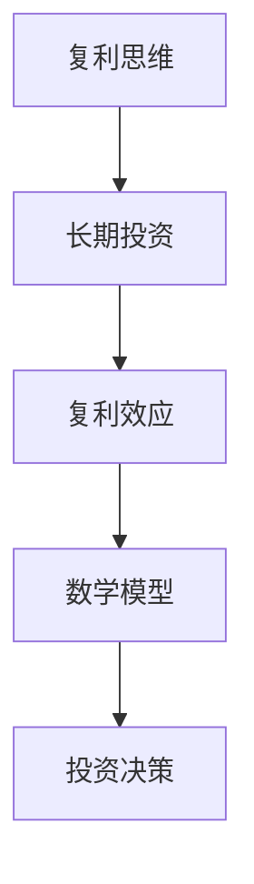
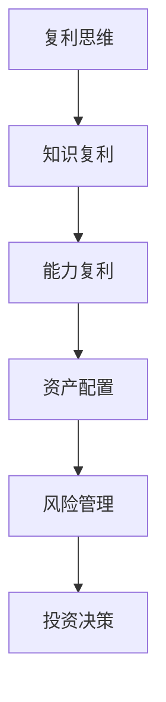

                 


# 《芒格的"复利思维"在长期投资中的应用》

> 关键词：芒格, 复利思维, 长期投资, 投资策略, 股票投资, 资产配置

> 摘要：本文深入探讨了芒格的复利思维在长期投资中的应用，从复利思维的核心概念、数学模型、算法原理到实际投资策略，结合具体案例分析，帮助投资者更好地理解和应用复利思维，实现长期稳健的投资回报。

---

# 第一部分：芒格的"复利思维"概述

## 第1章：复利思维的核心概念

### 1.1 复利思维的定义与特点

#### 1.1.1 复利思维的定义
复利思维是一种将时间和资源的投入所产生的收益，再投入产生的收益，形成指数级增长的思维方式。其核心在于“时间”和“复利效应”，即通过不断积累和再投资，实现财富的指数级增长。

#### 1.1.2 复利思维的特点
- **时间敏感性**：复利效应的威力需要时间来体现，时间越长，复利效应越显著。
- **指数增长**：复利思维的核心在于“利滚利”，即收益再投资后产生的二次收益，形成指数级增长。
- **低风险偏好**：芒格的复利思维强调长期稳健的投资，避免高风险投资导致的本金损失。

#### 1.1.3 复利思维与传统投资的区别
- **传统投资**：注重短期收益，追求快速获利，风险承受能力较低。
- **复利思维**：注重长期稳健，追求收益的持续积累，风险承受能力较强。

### 1.2 芮格的复利思维理论

#### 1.2.1 芮格的生平简介
查理·芒格是美国著名投资家、伯克希尔哈撒韦公司副主席，其投资理念以价值投资和长期稳健著称。芒格的复利思维源于他对物理学、心理学和经济学的深刻理解。

#### 1.2.2 复利思维的核心思想
芒格认为，复利思维的核心在于“时间”和“选择优秀的企业”，通过长期持有优质资产，实现财富的指数级增长。他强调，投资的本质是寻找具有持续竞争优势的企业，而不是短期市场波动。

#### 1.2.3 复利思维的实践案例
芒格通过长期持有可口可乐、苹果等优质企业，实现了财富的指数级增长。他的投资策略体现了复利思维的核心思想。

---

## 第2章：复利思维在长期投资中的应用背景

### 2.1 长期投资的基本原理

#### 2.1.1 长期投资的定义与特点
长期投资是指将资金投入优质资产，长期持有，通过复利效应实现财富增长。其特点是时间跨度长、风险较低、收益稳定。

#### 2.1.2 长期投资的市场环境
- **经济周期**：长期投资需要考虑经济周期的影响，选择在经济衰退期投资优质资产。
- **市场波动**：长期投资需要承受短期市场波动，但通过复利效应，最终实现收益。

#### 2.1.3 长期投资的风险与收益
- **风险**：市场波动、经济衰退、企业基本面变化等。
- **收益**：通过复利效应，实现财富的指数级增长。

### 2.2 复利思维在长期投资中的重要性

#### 2.2.1 复利效应的数学模型
复利计算公式：
$$ A = P \times (1 + r)^n $$
其中：
- \( A \) 表示本息和
- \( P \) 表示本金
- \( r \) 表示年利率
- \( n \) 表示年数

#### 2.2.2 复利效应在投资中的具体表现
- **本金增长**：通过复利效应，本金逐年增长，收益逐年增加。
- **时间价值**：时间越长，复利效应越显著。

#### 2.2.3 复利效应与长期投资的结合
通过长期持有优质资产，复利效应得以充分发挥，实现财富的指数级增长。

---

## 第3章：复利思维的核心概念与联系

### 3.1 复利思维的核心原理

#### 3.1.1 复利效应的数学公式
复利计算公式：
$$ A = P \times (1 + r)^n $$

#### 3.1.2 复利效应的经济意义
复利效应通过时间的积累，实现财富的指数级增长，是长期投资的核心驱动力。

#### 3.1.3 复利效应与投资决策的关系
投资决策需要考虑复利效应的时间因素，选择具有长期增长潜力的资产。

### 3.2 复利思维的属性特征对比

#### 3.2.1 复利思维的线性增长与指数增长对比
- **线性增长**：收益与本金成正比，增长缓慢。
- **指数增长**：收益通过复利效应，增长速度逐渐加快。

#### 3.2.2 复利思维的时间价值与空间价值对比
- **时间价值**：复利效应需要时间来体现。
- **空间价值**：通过投资优质资产，实现财富的扩展。

#### 3.2.3 复利思维的主动投资与被动投资对比
- **主动投资**：通过选择优质资产，主动管理投资组合。
- **被动投资**：通过指数基金等工具，被动实现复利效应。

### 3.3 复利思维的ER实体关系图



---

## 第4章：复利思维的算法原理

### 4.1 复利计算的数学模型

#### 4.1.1 复利计算公式
$$ A = P \times (1 + r)^n $$

#### 4.1.2 复利计算流程图
```mermaid
graph TD
    A[开始] --> B[输入本金P、年利率r、年数n]
    B --> C[计算A = P*(1 + r)^n]
    C --> D[输出A]
    D --> E[结束]
```

### 4.2 复利效应的算法流程图

```mermaid
graph TD
    A[开始] --> B[输入本金P、年利率r、年数n]
    B --> C[计算A = P*(1 + r)^n]
    C --> D[输出A]
    D --> E[结束]
```

### 4.3 复利效应的实际案例分析

#### 4.3.1 案例背景
假设本金为100元，年利率为10%，投资期限为10年。

#### 4.3.2 案例分析
$$ A = 100 \times (1 + 0.1)^{10} = 259.37 \text{元} $$

#### 4.3.3 案例总结
通过复利效应，100元在10年内增长到259.37元，实现财富的指数级增长。

---

## 第5章：系统化的复利思维体系

### 5.1 复利思维的系统架构

#### 5.1.1 系统架构图


#### 5.1.2 系统功能设计
- **知识复利**：通过不断学习和积累知识，提升投资能力。
- **能力复利**：通过不断实践和总结，提升投资能力。
- **资产配置**：根据市场环境和个人风险偏好，合理配置资产。
- **风险管理**：通过分散投资和对冲风险，降低投资风险。
- **投资决策**：根据市场环境和个人目标，制定投资策略。

#### 5.1.3 系统架构图


---

## 第6章：复利思维的项目实战

### 6.1 环境安装

#### 6.1.1 投资工具
- **股票投资**：选择优质企业，长期持有。
- **基金投资**：选择优秀基金经理管理的基金。
- **资产配置**：根据个人风险偏好，合理配置股票、债券、现金等资产。

### 6.2 系统核心实现源代码

#### 6.2.1 复利计算代码
```python
def compound_interest(principal, rate, years):
    return principal * (1 + rate) ** years

# 示例计算
principal = 100
rate = 0.1
years = 10
result = compound_interest(principal, rate, years)
print(f"复利计算结果为：{result}元")
```

#### 6.2.2 实际案例分析
```python
principal = 100
rate = 0.1
years = 10
result = compound_interest(principal, rate, years)
print(f"10年后的财富为：{result}元")
```

---

## 第7章：复利思维的最佳实践与注意事项

### 7.1 最佳实践 tips

- **长期持有优质资产**：选择具有持续竞争优势的企业，长期持有。
- **分散投资**：通过分散投资降低风险。
- **避免短期波动**：长期投资需要承受短期市场波动，但复利效应最终会体现。

### 7.2 小结
芒格的复利思维是一种通过长期持有优质资产，实现财富指数级增长的投资理念。其核心在于“时间”和“选择优质资产”，通过复利效应实现财富的长期稳健增长。

### 7.3 注意事项

- **风险控制**：长期投资需要控制风险，避免本金损失。
- **市场波动**：复利思维需要承受短期市场波动，但长期来看，复利效应会体现。
- **持续学习**：通过不断学习和积累知识，提升投资能力。

---

## 第8章：拓展阅读与深入思考

### 8.1 拓展阅读

- **《穷查理宝典》**：查理·芒格的投资思想集锦。
- **《投资最重要的少数事》**：彼得·林奇的投资理念。

### 8.2 深入思考

- **复利思维与风险管理**：如何通过风险管理实现复利效应的最大化？
- **复利思维与资产配置**：如何通过资产配置实现长期稳健的投资收益？
- **复利思维与市场周期**：如何在经济周期中应用复利思维？

---

## 作者：AI天才研究院/AI Genius Institute & 禅与计算机程序设计艺术 /Zen And The Art of Computer Programming

---

以上是《芒格的"复利思维"在长期投资中的应用》的技术博客文章目录大纲和详细内容。

