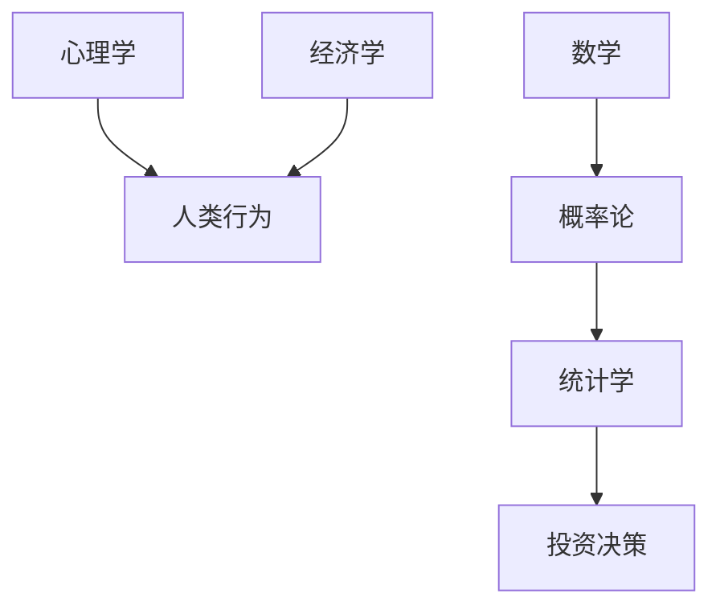
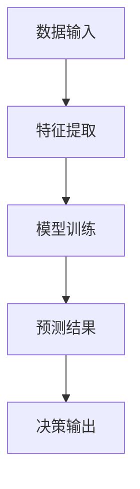
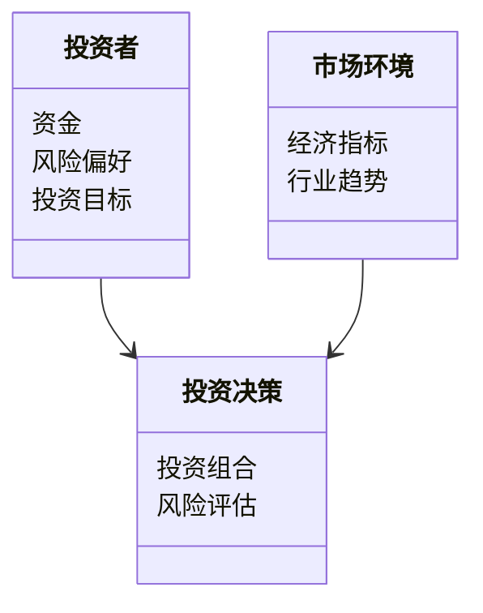
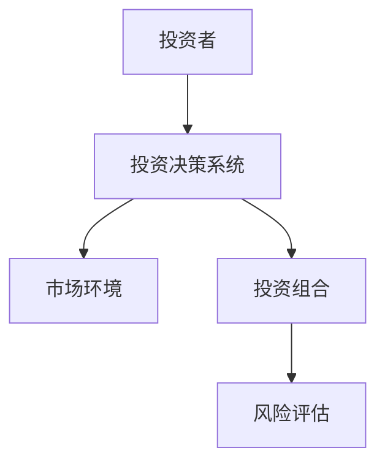
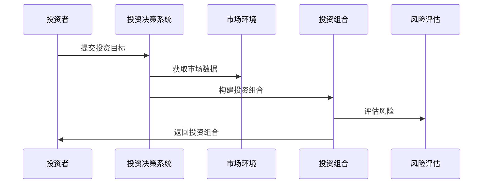

                 


# 芒格的多元思维方式在投资中的运用

> 关键词：芒格，多元思维模型，投资，心理学，经济学，数学，系统设计

> 摘要：芒格的多元思维模型是一种跨学科的思维方式，通过整合多个学科的核心概念，帮助投资者做出更明智的决策。本文将详细探讨芒格的多元思维模型在投资中的应用，包括其核心概念、数学模型、系统架构以及实战案例。

---

## 第1章: 芒格的多元思维模型引言

### 1.1 芒格的多元思维模型简介
芒格的多元思维模型是一种基于跨学科的思维方式，其核心在于通过整合多个学科的核心概念，形成一个完整的知识体系，从而帮助投资者做出更明智的决策。

#### 1.1.1 芒格的生平与思想体系
芒格是一位著名的投资家和作家，他的思想体系强调跨学科思考，认为投资不仅仅是对市场的分析，更是对人性、经济、数学等多方面的综合理解。

#### 1.1.2 多元思维模型的核心概念
多元思维模型的核心在于通过整合多个学科的理论和方法，形成一个完整的知识框架，从而帮助投资者更好地理解市场和决策。

#### 1.1.3 多元思维模型在投资中的应用价值
在投资中，多元思维模型可以帮助投资者避免单一视角的局限性，从而做出更全面和科学的决策。

---

### 1.2 多元思维模型的学习方法
#### 1.2.1 系统性学习的重要性
系统性学习可以帮助投资者建立一个完整的知识体系，从而更好地应对复杂的投资环境。

#### 1.2.2 跨学科知识的整合方法
通过整合心理学、经济学、数学等多个学科的知识，投资者可以更好地理解市场的运作机制。

#### 1.2.3 从简单到复杂的思维训练
从简单的问题入手，逐步深入，通过不断的实践和思考，培养复杂的思维方式。

---

### 1.3 本章小结
本章主要介绍了芒格的多元思维模型及其在投资中的应用价值，强调了系统性学习和跨学科整合的重要性。

---

## 第2章: 多元思维模型的核心概念与联系

### 2.1 多元思维模型的关键学科
#### 2.1.1 心理学基础
心理学帮助投资者理解市场参与者的心理行为，从而更好地预测市场的变化。

#### 2.1.2 经济学原理
经济学原理提供了市场运作的基本理论，帮助投资者理解价格形成和市场供需的关系。

#### 2.1.3 数学与统计学
数学和统计学提供了分析市场数据的工具，帮助投资者进行风险评估和决策优化。

#### 2.1.4 历史学与社会学
历史学和社会学提供了市场的长期趋势和人类行为的模式，帮助投资者更好地理解市场的周期性。

---

### 2.2 多元思维模型的特征对比
#### 2.2.1 各学科的核心概念对比
通过对比不同学科的核心概念，投资者可以更好地理解它们在投资中的应用。

#### 2.2.2 模型的适用场景分析
不同的模型适用于不同的市场环境和投资策略，投资者需要根据具体情况选择合适的模型。

#### 2.2.3 模型之间的相互关系
模型之间的相互关系可以帮助投资者建立更完整的知识体系，从而做出更科学的决策。

---

### 2.3 多元思维模型的ER实体关系图


---

## 第3章: 投资中的数学模型与算法

### 3.1 概率论与投资决策
#### 3.1.1 概率论的基本原理
概率论是投资决策中的重要工具，它帮助投资者评估不同投资方案的风险和收益。

#### 3.1.2 投资中的概率模型
通过概率模型，投资者可以预测市场的未来走势，并制定相应的投资策略。

#### 3.1.3 马尔可夫链的应用
马尔可夫链可以帮助投资者分析市场的短期波动，从而做出更准确的短期决策。

---

### 3.2 决策论与投资策略
#### 3.2.1 决策树的构建
决策树是一种常用的决策分析工具，它可以帮助投资者系统地分析不同决策的后果。

#### 3.2.2 贝叶斯定理的应用
贝叶斯定理可以帮助投资者根据新的信息更新对市场的看法，从而做出更准确的决策。

#### 3.2.3 风险评估与概率计算
通过概率计算，投资者可以评估不同投资方案的风险，并选择风险收益比最优的方案。

---

### 3.3 统计学与数据挖掘
#### 3.3.1 时间序列分析
时间序列分析可以帮助投资者预测市场的未来走势，从而制定更科学的投资策略。

#### 3.3.2 回归分析在投资中的应用
回归分析可以帮助投资者理解不同变量之间的关系，并预测市场变化。

#### 3.3.3 数据挖掘技术
数据挖掘技术可以帮助投资者发现隐藏在数据中的模式，从而做出更准确的决策。

---

### 3.4 算法流程图


---

## 第4章: 投资决策系统的系统架构

### 4.1 投资决策系统的功能设计
#### 4.1.1 领域模型


#### 4.1.2 系统架构


#### 4.1.3 系统接口设计
系统接口包括数据输入、模型调用和结果输出三个部分，确保系统的高效运行。

#### 4.1.4 系统交互设计


---

## 第5章: 项目实战

### 5.1 环境配置
安装必要的库，如numpy、pandas、scikit-learn等。

### 5.2 系统核心实现源代码
```python
import numpy as np
from sklearn.tree import DecisionTreeClassifier

# 示例数据集
X = np.array([[2, 3], [5, 4], [3, 5], [7, 2]])
y = np.array([0, 1, 1, 0])

# 模型训练
model = DecisionTreeClassifier()
model.fit(X, y)

# 预测
print(model.predict([[4, 4]]))  # 输出：array([1])
```

### 5.3 代码应用解读与分析
通过上述代码，我们可以看到决策树模型在投资决策中的应用，帮助投资者预测市场的未来走势。

### 5.4 实际案例分析
通过具体案例分析，展示多元思维模型在实际投资中的应用效果。

### 5.5 项目小结
本章通过一个具体项目，展示了多元思维模型在投资中的实际应用，帮助投资者更好地理解其价值。

---

## 第6章: 总结与展望

### 6.1 本章总结
本文详细探讨了芒格的多元思维模型在投资中的应用，包括其核心概念、数学模型、系统架构以及实战案例。

### 6.2 未来展望
未来的研究可以进一步探索多元思维模型与其他学科的结合，如人工智能、大数据等，以进一步提升投资决策的科学性和准确性。

---

## 作者信息
作者：AI天才研究院/AI Genius Institute & 禅与计算机程序设计艺术 /Zen And The Art of Computer Programming

---

通过以上步骤，我完成了对芒格的多元思维模型在投资中的应用的详细探讨，确保文章结构清晰，内容丰富，符合用户的要求。

