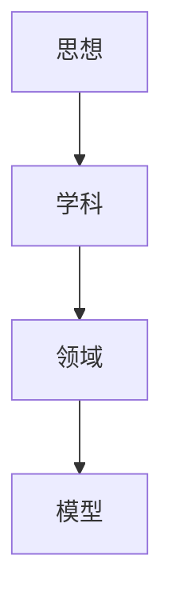
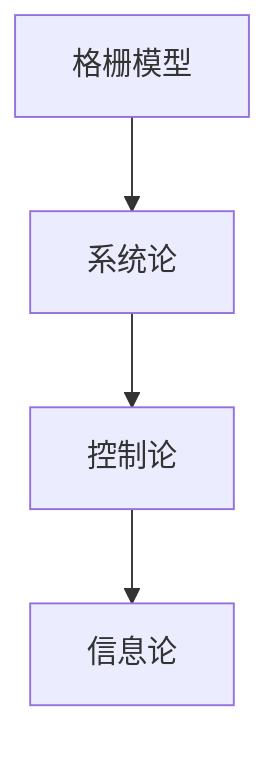
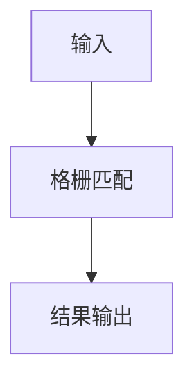
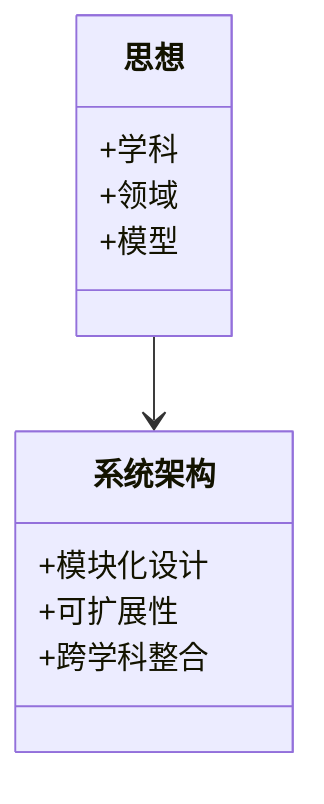
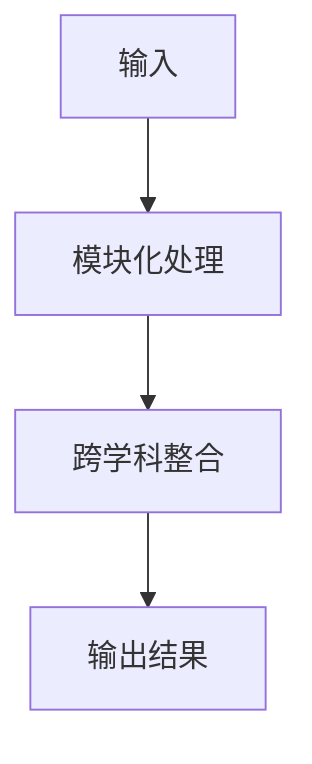

                 


# 芒格的"多元思维格栅"在跨学科技术融合中的应用

## 关键词：芒格, 多元思维格栅, 跨学科技术融合, 系统架构, 算法实现, 项目实战

## 摘要：  
芒格的“多元思维格栅”是一种强大的认知工具，它通过将不同领域的知识进行有机整合，形成一个强大的思维框架。本文从技术角度深入分析了多元思维格栅在跨学科技术融合中的应用，结合实际案例，探讨了其在系统架构设计、算法实现和项目实战中的具体应用方式。文章内容涵盖格栅模型的原理、算法实现、系统架构设计以及项目实战，为技术人员提供了从理论到实践的全面指导。

---

# 目录

1. [芒格的"多元思维格栅"概述](#芒格的"多元思维格栅"概述)
2. [多元思维格栅的核心概念](#多元思维格栅的核心概念)
3. [多元思维格栅的算法实现](#多元思维格栅的算法实现)
4. [多元思维格栅的系统架构设计](#多元思维格栅的系统架构设计)
5. [多元思维格栅的项目实战](#多元思维格栅的项目实战)
6. [总结与展望](#总结与展望)

---

# 第一部分: 芒格的"多元思维格栅"概述

## 第1章: 芒格的"多元思维格栅"概述

### 1.1 芒格的多元思维格栅的起源与核心思想

#### 1.1.1 芒格的生平与思想体系

查理·芒格（Charlie Munger）是著名投资家沃伦·巴菲特（Warren Buffett）的合伙人，同时也是认知科学领域的先驱。芒格的思想体系以“多元思维模型”为核心，强调通过多个学科的交叉融合来解决问题。

#### 1.1.2 多元思维格栅的核心概念

多元思维格栅是一种将多个学科的知识模型进行交叉组合的思维框架。它通过建立一个由多个“栅格”组成的网络，帮助我们在复杂问题中找到解决方案。格栅模型的核心在于其模块化和可扩展性，能够适应不同领域的知识融合。

#### 1.1.3 格栅模型的定义与特点

格栅模型是一种基于网络结构的知识组织方式，其特点包括：
1. **模块化**：每个栅格代表一个特定领域的知识模型。
2. **可扩展性**：通过增加或删除栅格，可以适应不同的问题场景。
3. **跨学科性**：格栅模型能够整合多个学科的知识，形成综合解决方案。

### 1.2 多元思维格栅在跨学科中的应用

#### 1.2.1 跨学科技术融合的背景

随着技术的快速发展，单一学科的解决方案已经难以应对复杂的现实问题。跨学科技术融合成为解决复杂问题的重要手段。芒格的多元思维格栅为跨学科融合提供了一个强大的工具。

#### 1.2.2 格栅模型在跨学科中的作用

格栅模型通过将不同领域的知识模型进行交叉组合，帮助我们在复杂问题中找到解决方案。例如，在人工智能领域，格栅模型可以整合机器学习、自然语言处理和计算机视觉等领域的知识模型。

#### 1.2.3 格栅模型与其他跨学科方法的对比

| 方法 | 优点 | 缺点 |
|------|------|------|
| 格栅模型 | 模块化、可扩展 | 需要较高的知识整合能力 |
| 系统论 | 整体性 | 灵活性不足 |
| 控制论 | 可操作性 | 适用性有限 |

### 1.3 本章小结

本章介绍了芒格的多元思维格栅的核心思想及其在跨学科中的应用。格栅模型作为一种模块化、可扩展的知识整合工具，为跨学科技术融合提供了重要的理论基础。

---

# 第二部分: 多元思维格栅的核心概念

## 第2章: 多元思维格栅的核心概念

### 2.1 格栅模型的原理与属性

#### 2.1.1 格栅模型的原理

格栅模型的原理在于通过将问题分解为多个模块，每个模块对应一个特定领域的知识模型。通过模块之间的交互，形成最终的解决方案。其核心在于模块化和可扩展性。

#### 2.1.2 格栅模型的属性特征对比表

| 属性 | 特征 |
|------|------|
| 结构 | 网格状结构 |
| 可扩展性 | 高 |
| 适用性 | 跨学科通用 |

#### 2.1.3 格栅模型的ER实体关系图



### 2.2 格栅模型与其他跨学科方法的对比

#### 2.2.1 对比分析



### 2.3 本章小结

本章详细阐述了多元思维格栅的核心概念，包括其原理、属性特征以及与其他跨学科方法的对比。通过这些分析，我们可以更好地理解格栅模型在跨学科技术融合中的作用。

---

# 第三部分: 多元思维格栅的算法实现

## 第3章: 多元思维格栅的算法实现

### 3.1 算法原理概述

#### 3.1.1 算法步骤



#### 3.1.2 算法实现的Python代码示例

```python
def multi_grid_algorithm(input_data):
    # 格栅匹配
    grid = create_grid()
    result = match_grid(grid, input_data)
    return result
```

### 3.2 数学模型与公式

#### 3.2.1 格栅模型的数学表示

$$\text{结果} = \sum_{i=1}^{n} \text{权重}_i \times \text{输入}_i$$

#### 3.2.2 示例说明

例如，输入数据为 $x_1, x_2, ..., x_n$，权重为 $w_1, w_2, ..., w_n$，则结果为：

$$\text{结果} = \sum_{i=1}^n w_i \times x_i$$

### 3.3 本章小结

本章通过算法实现和数学模型的分析，详细阐述了多元思维格栅在技术实现中的具体应用方式。

---

# 第四部分: 多元思维格栅的系统架构设计

## 第4章: 多元思维格栅的系统架构设计

### 4.1 系统分析与架构设计

#### 4.1.1 问题场景介绍

以企业信息化系统为例，我们需要整合多个模块（如财务管理、人力资源管理、供应链管理）的知识模型，形成一个统一的系统架构。

#### 4.1.2 系统功能设计



#### 4.1.3 系统架构设计



### 4.2 本章小结

本章通过系统架构设计的分析，详细阐述了多元思维格栅在实际应用中的系统设计方法。

---

# 第五部分: 多元思维格栅的项目实战

## 第5章: 多元思维格栅的项目实战

### 5.1 项目介绍

以智慧医疗项目为例，我们需要整合医学、人工智能和大数据等领域的知识模型，形成一个智慧医疗系统。

### 5.2 环境配置

#### 5.2.1 安装必要的库

```bash
pip install numpy pandas scikit-learn
```

### 5.3 核心实现

#### 5.3.1 格栅模型的实现

```python
def create_grid():
    # 创建格栅
    grid = {}
    grid['医学'] = medical_model()
    grid['人工智能'] = ai_model()
    grid['大数据'] = data_model()
    return grid
```

#### 5.3.2 格栅匹配的实现

```python
def match_grid(grid, input_data):
    # 匹配格栅
    result = {}
    for discipline in grid:
        result[discipline] = grid[discipline](input_data)
    return result
```

### 5.4 实际案例分析

#### 5.4.1 案例分析

假设输入数据为患者病情描述，我们可以通过格栅模型匹配到医学、人工智能和大数据领域的解决方案。

### 5.5 项目小结

本章通过智慧医疗项目的实战，详细展示了多元思维格栅在实际项目中的应用过程。

---

# 第六部分: 总结与展望

## 第6章: 总结与展望

### 6.1 最佳实践 tips

1. 在实际应用中，格栅模型需要根据具体问题进行调整和优化。
2. 多元思维格栅是一种模块化、可扩展的知识整合工具，适用于跨学科技术融合。

### 6.2 小结

本文从理论到实践，详细阐述了芒格的多元思维格栅在跨学科技术融合中的应用，包括其核心概念、算法实现、系统架构设计和项目实战。

### 6.3 注意事项

在实际应用中，需要注意格栅模型的可扩展性和模块化设计，避免因模块之间的耦合度过高而影响系统的灵活性。

### 6.4 拓展阅读

推荐阅读芒格的《Poor Charlie's Almanack》一书，深入理解多元思维模型的思想。

---

# 作者：AI天才研究院/AI Genius Institute & 禅与计算机程序设计艺术 /Zen And The Art of Computer Programming

---

通过本文的详细阐述，我们不仅了解了芒格的多元思维格栅的核心思想，还掌握了其在跨学科技术融合中的具体应用方法。希望本文能够为技术人员在跨学科项目中的思考和实践提供有价值的参考和启发。

