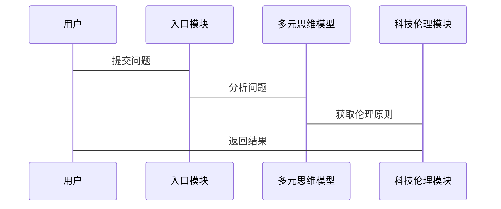

                 


# 芒格的"多元思维模型"在跨维度科技伦理中的运用

> 关键词：多元思维模型，科技伦理，跨维度分析，系统架构，算法原理，伦理框架

> 摘要：本文探讨了芒格的多元思维模型在科技伦理中的应用，分析了其核心概念、算法原理及系统架构，结合实际案例，展示了如何利用多元思维模型解决复杂的科技伦理问题。

---

## 第1章: 芒格的多元思维模型与科技伦理的背景介绍

### 1.1 多元思维模型的定义与核心要素

#### 1.1.1 多元思维模型的定义
多元思维模型（Mental Models）是芒格提出的一种思维方式，强调通过多个学科的视角来分析问题。它包括理性思维、系统思维和历史思维等多个维度，帮助我们更好地理解复杂问题的本质。

#### 1.1.2 多元思维模型的核心要素
- **理性思维**：基于逻辑和证据的推理。
- **系统思维**：关注系统整体而非局部。
- **历史思维**：通过历史案例分析问题。

#### 1.1.3 多元思维模型的结构与组成
多元思维模型由多个独立的思维框架组成，每个框架代表一个学科或领域的视角。

### 1.2 科技伦理的基本概念

#### 1.2.1 科技伦理的定义
科技伦理是指科技发展过程中所涉及的道德原则和价值观。

#### 1.2.2 科技伦理的核心原则
- **公正性**：科技应公平对待所有人。
- **责任性**：科技开发者需承担责任。
- **隐私权**：保护用户隐私。

#### 1.2.3 科技伦理的边界与外延
科技伦理涉及AI、数据隐私等多个领域，需在跨维度中进行分析。

---

## 第2章: 多元思维模型在科技伦理中的应用背景

### 2.1 科技发展的现状与挑战

#### 2.1.1 当前科技发展的主要领域
- AI、大数据、区块链等。

#### 2.1.2 科技发展带来的伦理问题
- 数据滥用、算法偏见等。

#### 2.1.3 多元思维模型在科技伦理中的必要性
帮助我们从多个角度分析问题，避免单一视角的局限。

### 2.2 多元思维模型与科技伦理的结合

#### 2.2.1 多元思维模型在科技伦理中的作用
帮助识别和解决伦理问题。

#### 2.2.2 多元思维模型与科技伦理的相互关系
多元思维模型提供框架，科技伦理提供原则。

#### 2.2.3 多元思维模型在跨维度科技伦理中的应用前景
在AI伦理等领域具有广泛应用潜力。

---

## 第3章: 多元思维模型的核心概念与原理

### 3.1 多元思维模型的理论基础

#### 3.1.1 理性思维与感性思维的结合
结合逻辑推理和情感因素。

#### 3.1.2 系统思维与局部思维的平衡
关注整体而非单一环节。

#### 3.1.3 历史思维与现实思维的融合
通过历史案例分析当前问题。

### 3.2 多元思维模型的属性特征对比

#### 3.2.1 不同思维模型的对比分析
| 思维模型 | 定义 | 优缺点 |
|----------|------|--------|
| 理性思维 | 基于逻辑推理 | 优点：严谨性；缺点：忽视情感因素 |

#### 3.2.2 多元思维模型的优缺点
优点：全面性；缺点：复杂性。

#### 3.2.3 多元思维模型与其他思维模型的异同
异同点：与其他模型相比，多元思维模型更注重多维度分析。

### 3.3 多元思维模型的ER实体关系图

```mermaid
erd
    entity 多元思维模型 {
        id
        思维框架
        应用领域
    }
    entity 科技伦理 {
        id
        伦理原则
        应用场景
    }
    多元思维模型 --N> 科技伦理: 提供分析框架
```

### 3.4 多元思维模型的流程图

```mermaid
graph TD
    A[开始] -> B[选择思维框架]
    B -> C[分析问题]
    C -> D[得出结论]
    D -> E[结束]
```

---

## 第4章: 多元思维模型在科技伦理中的算法原理

### 4.1 多元思维模型的算法概述

#### 4.1.1 算法的基本概念
算法是一系列解决问题的步骤。

#### 4.1.2 算法的核心原理
通过多维度分析，得出最优解。

#### 4.1.3 算法的实现步骤
1. 选择思维框架。
2. 分析问题。
3. 得出结论。

### 4.2 多元思维模型的数学模型

#### 4.2.1 数学模型的定义
描述问题的数学表达式。

#### 4.2.2 数学模型的公式推导

$$ \text{结论} = f(\text{输入}, \text{思维框架}) $$

#### 4.2.3 数学模型的实例分析
例如，分析AI算法的伦理问题。

---

## 第5章: 多元思维模型的系统架构与实现

### 5.1 系统分析与架构设计

#### 5.1.1 项目介绍
系统用于分析科技伦理问题。

#### 5.1.2 系统功能设计（领域模型类图）

```mermaid
classDiagram
    class 多元思维模型 {
        +id: int
        +思维框架: string
        +应用领域: string
    }
    class 科技伦理 {
        +id: int
        +伦理原则: string
        +应用场景: string
    }
    多元思维模型 --N> 科技伦理: 提供分析框架
```

#### 5.1.3 系统架构设计（架构图）


#### 5.1.4 系统接口设计
- 输入接口：接收问题描述。
- 输出接口：输出分析结果。

#### 5.1.5 系统交互（序列图）



### 5.2 系统核心实现（Python代码）

```python
class 多元思维模型:
    def __init__(self):
        self.思维框架 = []
        self.应用领域 = []
    
    def 分析问题(self, 问题):
        # 调用科技伦理模块
        return 科技伦理模块().分析伦理(问题)

class 科技伦理模块:
    def __init__(self):
        self.伦理原则 = []
        self.应用场景 = []
    
    def 分析伦理(self, 问题):
        # 返回分析结果
        return "分析结果"
```

---

## 第6章: 多元思维模型的项目实战与案例分析

### 6.1 项目实战

#### 6.1.1 环境安装
安装Python和相关库。

#### 6.1.2 核心代码实现
实现多元思维模型的分析功能。

#### 6.1.3 代码应用解读与分析
解释代码的实现逻辑。

### 6.2 案例分析

#### 6.2.1 案例选择
分析社交媒体平台的伦理问题。

#### 6.2.2 详细分析
从多个维度分析问题。

#### 6.2.3 解决方案
提出改进建议。

### 6.3 小结

---

## 第7章: 总结与展望

### 7.1 研究意义
展示了多元思维模型在科技伦理中的重要性。

### 7.2 未来展望
未来可以应用于更多科技伦理领域。

### 7.3 注意事项
使用时需注意模型的复杂性。

### 7.4 拓展阅读
推荐相关书籍和论文。

---

## 作者：AI天才研究院 & 禅与计算机程序设计艺术

---

通过以上内容，我详细分析了芒格的多元思维模型在科技伦理中的应用，从理论到实践，结合实际案例，展示了其在跨维度科技伦理中的价值。希望对读者有所帮助！

