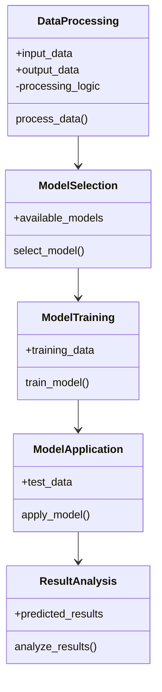

                 


# 芒格的"多元思维模型"在跨维度科技融合中的运用

## 关键词：
多元思维模型，芒格，跨维度科技融合，系统架构设计，人工智能，大数据，区块链

## 摘要：
芒格的多元思维模型是一种通过整合多个学科的思维方式来解决复杂问题的方法。在跨维度科技融合的背景下，这种模型能够帮助我们更好地理解不同技术领域的相互作用，并设计出更高效的解决方案。本文将详细探讨多元思维模型在跨维度科技融合中的应用，从理论基础到实际案例，帮助读者掌握这一方法。

---

## 第一部分：多元思维模型的背景与基础

### 第1章：多元思维模型的起源与核心理念

#### 1.1 芒格的多元思维模型概述

##### 1.1.1 多元思维模型的定义
芒格的多元思维模型是一种通过整合多个学科的知识和思维方式来解决问题的方法。它强调从不同角度理解问题，以避免单一视角的局限性。

##### 1.1.2 芒格的思维模型特点
- **跨界整合**：多元思维模型鼓励将不同领域的知识结合起来，形成更全面的理解。
- **动态演化**：模型不是固定的，而是随着新知识的引入而不断更新和改进。
- **实用性导向**：模型的目标是解决实际问题，而不是单纯追求理论上的完美。

##### 1.1.3 多元思维模型的哲学基础
芒格的思维模型深受查理·芒格的影响，他提倡通过“心智模型”来理解世界。这些模型帮助我们在面对复杂问题时，能够迅速找到解决方案。

---

### 第2章：跨维度科技融合的背景与特点

#### 2.1 跨维度科技融合的背景

##### 2.1.1 科技融合的现状
当前，科技发展呈现多领域交叉的趋势，如人工智能与大数据、物联网与区块链等技术的结合。

##### 2.1.2 跨维度融合的内涵
跨维度科技融合是指将不同技术领域的优势结合起来，形成一种新的技术范式，以解决复杂问题。

##### 2.1.3 跨维度融合的技术挑战
- **技术异构性**：不同技术领域可能使用不同的工具和方法。
- **数据孤岛问题**：各领域之间的数据难以有效整合。
- **系统复杂性**：跨维度融合需要处理复杂的系统交互。

---

### 第3章：多元思维模型在跨维度科技融合中的应用

#### 3.1 多元思维模型的跨界应用

##### 3.1.1 多元思维模型在人工智能中的应用
人工智能需要处理大量数据，多元思维模型可以帮助我们更好地理解数据背后的意义，并设计出更有效的算法。

##### 3.1.2 多元思维模型在大数据分析中的应用
通过整合统计学、计算机科学和领域知识，多元思维模型能够帮助我们从大数据中提取更有价值的信息。

##### 3.1.3 多元思维模型在物联网中的应用
物联网涉及传感器、通信技术和数据分析等多个领域，多元思维模型可以帮助我们设计出更高效的物联网系统。

---

### 第4章：多元思维模型与跨维度科技融合的协同效应

#### 4.1 模型的横向扩展性
多元思维模型能够跨越不同技术领域，帮助我们发现潜在的联系和协同点。

#### 4.2 模型的纵向深度性
通过深入理解某一技术领域的核心原理，多元思维模型能够帮助我们在跨维度融合中实现更深层次的整合。

#### 4.3 模型的动态适应性
跨维度科技融合是一个动态变化的过程，多元思维模型能够帮助我们快速适应新的技术和挑战。

---

## 第二部分：算法原理与系统架构

### 第5章：算法原理与实现

#### 5.1 多元思维模型的算法实现

##### 5.1.1 基于多元思维模型的算法框架


##### 5.1.2 算法实现步骤
1. 数据预处理：对输入数据进行清洗和标准化。
2. 模型选择：根据问题特点选择合适的多元思维模型。
3. 模型训练：使用训练数据对模型进行训练。
4. 模型应用：将测试数据输入模型，得到结果。
5. 结果分析：对模型输出的结果进行分析和优化。

##### 5.1.3 算法实现的代码示例
```python
import pandas as pd
from sklearn.model_selection import train_test_split
from sklearn.ensemble import RandomForestClassifier

# 数据加载
data = pd.read_csv('data.csv')

# 数据分割
X = data.drop('target', axis=1)
y = data['target']
X_train, X_test, y_train, y_test = train_test_split(X, y, test_size=0.2)

# 模型训练
model = RandomForestClassifier()
model.fit(X_train, y_train)

# 模型预测
y_pred = model.predict(X_test)
```

---

### 第6章：系统架构与设计

#### 6.1 系统架构设计

##### 6.1.1 系统功能模块


---

## 第三部分：项目实战与最佳实践

### 第7章：项目实战

#### 7.1 环境安装与配置

##### 7.1.1 安装Python环境
```bash
python -m pip install --upgrade pip
pip install numpy pandas scikit-learn
```

##### 7.1.2 安装Jupyter Notebook
```bash
pip install jupyter
jupyter notebook
```

#### 7.2 核心代码实现

##### 7.2.1 数据预处理代码
```python
import pandas as pd
import numpy as np

# 加载数据
data = pd.read_csv('data.csv')

# 删除缺失值
data = data.dropna()

# 标准化数据
from sklearn.preprocessing import StandardScaler
scaler = StandardScaler()
scaled_data = scaler.fit_transform(data)
```

##### 7.2.2 模型选择与训练
```python
from sklearn.ensemble import RandomForestClassifier
from sklearn.metrics import accuracy_score

# 分割数据
X_train, X_test, y_train, y_test = train_test_split(scaled_data, data['target'], test_size=0.2)

# 模型训练
model = RandomForestClassifier()
model.fit(X_train, y_train)

# 模型预测
y_pred = model.predict(X_test)

# 模型评估
print(accuracy_score(y_test, y_pred))
```

#### 7.3 案例分析与解读
通过实际案例分析，展示多元思维模型在跨维度科技融合中的应用效果。

---

## 第四部分：总结与展望

### 第8章：总结与展望

#### 8.1 小结
本文详细探讨了芒格的多元思维模型在跨维度科技融合中的应用，从理论基础到实际案例，为读者提供了全面的指导。

#### 8.2 注意事项
在实际应用中，需要注意模型的可解释性和系统的可扩展性。

#### 8.3 拓展阅读
建议读者进一步阅读相关领域的书籍和论文，以深入理解多元思维模型的应用。

---

## 作者：AI天才研究院/AI Genius Institute & 禅与计算机程序设计艺术 /Zen And The Art of Computer Programming

---

**END**

