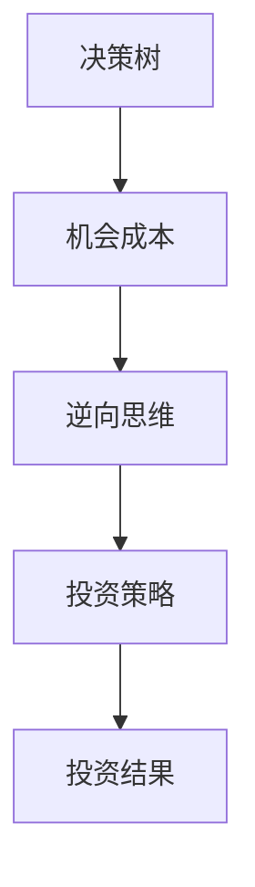
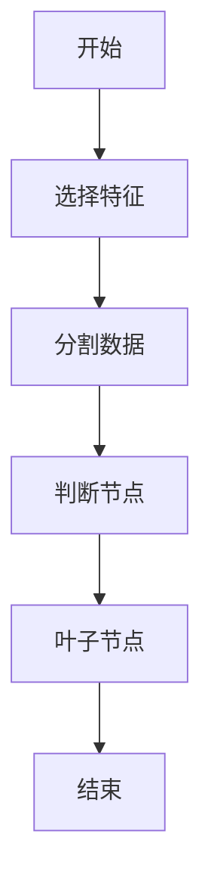
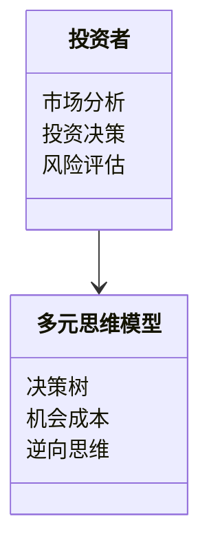
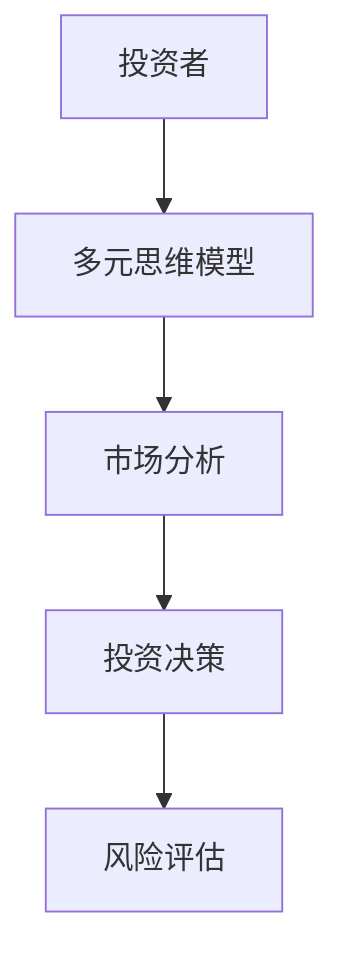

                 


# 芒格的多元思维模型：应对复杂投资环境

> 关键词：芒格的多元思维模型, 投资决策, 复杂环境, 决策树, 机会成本, 逆向思维, 投资策略

> 摘要：本文系统地介绍芒格的多元思维模型，包括决策树、机会成本和逆向思维等核心概念，分析这些模型在复杂投资环境中的应用。通过算法、系统架构和实际案例，深入探讨如何利用这些模型进行有效的投资决策和策略制定。

---

## 第1章: 芒格的多元思维模型简介

### 1.1 芒格的多元思维模型的定义

芒格的多元思维模型是由投资家查理·芒格提出的，旨在通过多个学科的思维模型来分析和解决问题。这些模型帮助投资者在复杂环境中做出更明智的决策。

#### 1.1.1 多元思维模型的核心概念

多元思维模型强调通过多个角度分析问题，避免单一视角的局限性。例如，决策树模型用于结构化分析，机会成本帮助权衡选择，逆向思维则用于发现市场机会。

#### 1.1.2 多元思维模型与传统投资方法的区别

传统投资方法通常依赖市场分析或财务指标，而多元思维模型结合了心理学、经济学等多个学科的原理，提供了更全面的分析框架。

#### 1.1.3 多元思维模型在投资中的重要性

在复杂投资环境中，单一方法往往难以应对不确定性。多元思维模型通过整合多个模型，帮助投资者更好地识别风险和机会，制定更稳健的投资策略。

---

### 1.2 多元思维模型的特点

#### 1.2.1 模型的多样性

芒格的模型涵盖决策树、机会成本、逆向思维等多个领域，提供了丰富的分析工具。

#### 1.2.2 模型的可组合性

这些模型可以组合使用，例如利用决策树进行结构化分析，结合机会成本评估选择，再用逆向思维优化策略。

#### 1.2.3 模型的实用性

这些模型不仅理论严谨，还能在实际投资中灵活应用，帮助投资者做出更理性的决策。

---

## 第2章: 多元思维模型的核心概念与联系

### 2.1 核心概念的定义与属性对比

以下是核心概念的对比表格：

| 概念 | 定义 | 特点 | 应用场景 |
|------|------|------|----------|
| 决策树 | 用于分析决策的可能结果 | 可视化、结构化 | 投资决策分析 |
| 机会成本 | 放弃某项选择所付出的代价 | 用于权衡选择 | 投资机会评估 |
| 逆向思维 | 从反方向思考问题 | 用于发现市场机会 | 投资策略制定 |

### 2.2 实体关系图（ER图）



---

## 第3章: 多元思维模型的算法原理

### 3.1 决策树算法

决策树是一种用于结构化分析的算法，帮助投资者清晰地看到不同决策路径的结果。



### 3.2 机会成本计算公式

机会成本的计算公式如下：

$$ 机会成本 = \sum_{i=1}^{n} (C_i - O_i) $$

其中，$C_i$ 是选择 $i$ 的成本，$O_i$ 是选择 $i$ 的收益。

### 3.3 逆向思维的应用

逆向思维通过反向思考问题，帮助发现市场的机会。

```python
def reverse_thinking(problem):
    solution = []
    for i in range(len(problem)):
        solution.append(problem[-i-1])
    return solution
```

---

## 第4章: 多元思维模型的系统分析与架构设计

### 4.1 系统功能设计



### 4.2 系统架构设计



---

## 第5章: 项目实战

### 5.1 环境安装

#### 5.1.1 安装Python

```bash
python --version
pip install numpy pandas
```

### 5.2 系统核心实现源代码

```python
import numpy as np
import pandas as pd

def calculate_opportunity_cost(costs, returns):
    return np.sum(costs - returns)

def reverse_thinking(problem):
    return problem[::-1]

# 示例数据
costs = np.array([10, 20, 30])
returns = np.array([15, 25, 35])
print("机会成本:", calculate_opportunity_cost(costs, returns))
print("逆向思维结果:", reverse_thinking([1, 2, 3]))
```

### 5.3 实际案例分析

假设我们有三个投资选项，分别计算机会成本和逆向思维后的策略：

```python
costs = [100, 200, 300]
returns = [150, 250, 350]
opportunity_cost = calculate_opportunity_cost(costs, returns)
print("机会成本:", opportunity_cost)
reversed_strategy = reverse_thinking([1, 2, 3])
print("逆向思维策略:", reversed_strategy)
```

---

## 第6章: 总结与展望

### 6.1 总结

芒格的多元思维模型通过整合多个学科的模型，帮助投资者在复杂环境中做出更明智的决策。通过决策树、机会成本和逆向思维等工具，投资者可以更好地分析问题，制定稳健的投资策略。

### 6.2 小结

在实际应用中，投资者需要不断学习和优化模型，结合具体情况进行调整。同时，建议投资者结合市场动态，灵活运用这些模型，以应对不断变化的投资环境。

### 6.3 注意事项

- 多元思维模型需要结合实际情况灵活运用，避免生搬硬套。
- 投资者应持续学习，保持对市场和模型的敏感性。
- 在使用数学模型时，确保数据的准确性和计算的正确性。

### 6.4 拓展阅读

- 《芒格的多元思维模型》
- 《投资学原理》
- 《决策树与投资分析》

---

## 作者：AI天才研究院 & 禅与计算机程序设计艺术

通过本文的系统讲解和案例分析，希望能帮助读者更好地理解芒格的多元思维模型，并在实际投资中灵活运用这些模型，制定更科学的投资策略。

