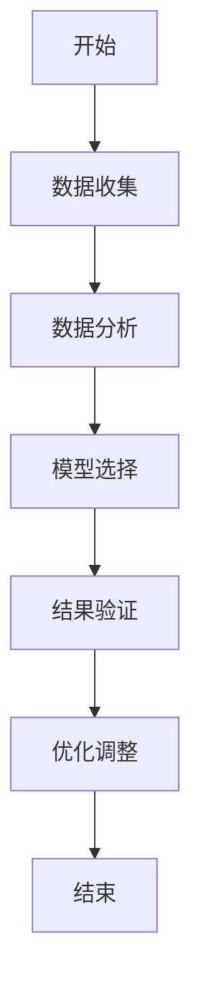
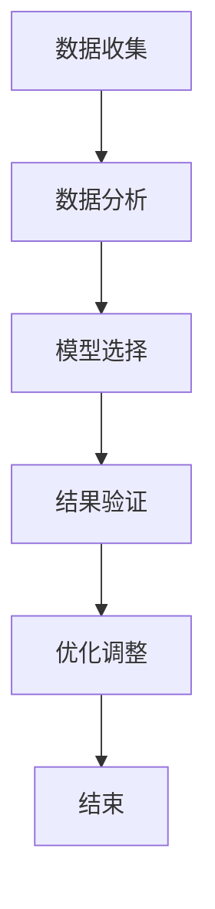
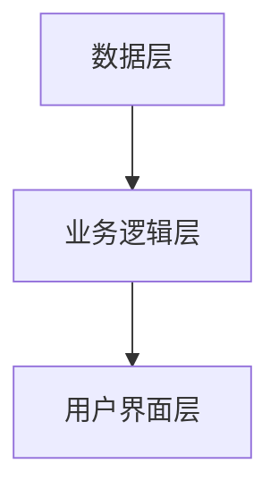

                 


# 芮格的"多元思维模型"：跨学科知识在投资中的应用

## 关键词：多元思维模型, 投资, 芮格, 跨学科, 心理学, 经济学, 统计学

## 摘要：  
芒格的“多元思维模型”是一种跨学科的投资方法，通过整合心理学、经济学、统计学等多个领域的知识，帮助投资者做出更明智的决策。本文将深入探讨多元思维模型的核心概念、跨学科应用、系统化分析以及实际项目中的应用，结合数学模型和系统架构设计，为读者提供全面的理解和实践指导。

---

## 第1章：多元思维模型的核心概念

### 1.1 多元思维模型的定义与背景

#### 1.1.1 多元思维模型的起源与发展  
多元思维模型（Mental Models）是由查理·芒格提出的投资理念，强调通过多个学科的思维模型来分析问题。这种思维方式不仅适用于投资，还可应用于其他领域。芒格认为，单一学科的知识不足以应对复杂的投资环境，因此需要整合多个领域的知识。

#### 1.1.2 多元思维模型的核心要素  
多元思维模型的核心在于通过多个学科的视角分析问题，识别模式和规律。其核心要素包括：  
1. **跨学科知识**：整合心理学、经济学、统计学等领域的知识。  
2. **问题分析**：通过多个模型的交叉验证，得出更准确的结论。  
3. **决策优化**：利用多个模型的优势，优化投资决策。  

#### 1.1.3 多元思维模型与投资的关系  
投资决策往往涉及复杂性，多元思维模型通过整合多个学科的视角，帮助投资者更好地理解市场行为、评估风险，并制定科学的投资策略。

### 1.2 芮格的生平与思想体系

#### 1.2.1 芮格的早年经历与投资理念  
查理·芒格是伯克希尔·哈撒韦公司的副主席，以价值投资理念闻名。他的投资理念强调长期价值、安全边际和跨学科分析。  

#### 1.2.2 芮格的多元思维模型的形成  
芒格通过长期的实践和研究，形成了多元思维模型，认为投资者需要通过多个学科的视角分析问题，才能做出更明智的决策。  

#### 1.2.3 芮格思想对投资的影响  
芒格的思想深刻影响了现代投资理论，尤其是其跨学科分析的方法，为投资者提供了新的思维方式。

---

## 第2章：多元思维模型的跨学科应用

### 2.1 经济学视角下的投资分析

#### 2.1.1 经济学基础理论与投资决策  
经济学的基本理论，如供需关系、市场均衡等，为投资决策提供了理论基础。通过经济学模型，投资者可以更好地理解市场行为和价格波动。

#### 2.1.2 市场行为与投资者心理  
经济学与心理学的结合，帮助投资者理解市场行为中的心理因素，如从众心理和羊群效应，从而做出更理性的决策。

#### 2.1.3 经济周期与投资策略  
经济周期的变化对投资策略有重要影响。通过分析经济周期，投资者可以调整投资组合，以应对不同的市场环境。

### 2.2 心理学视角下的投资行为

#### 2.2.1 心理偏差与投资决策  
心理学研究表明，投资者的心理偏差（如过度自信、从众心理）会影响投资决策。通过识别和克服这些偏差，投资者可以做出更理性的决策。

#### 2.2.2 行为金融学与投资行为  
行为金融学研究投资者的心理和行为，揭示市场中的非理性行为。通过这些研究，投资者可以更好地理解市场波动和投资风险。

#### 2.2.3 如何克服认知偏差  
克服认知偏差的关键在于提高自我认知，通过系统化的分析和跨学科的视角，避免单一思维的局限性。

### 2.3 统计学与概率论在投资中的应用

#### 2.3.1 统计学基础与投资分析  
统计学方法（如回归分析、概率分布）为投资分析提供了科学工具，帮助投资者量化风险和收益。

#### 2.3.2 概率论在风险评估中的应用  
通过概率论，投资者可以评估不同投资组合的风险和收益，制定更科学的投资策略。

#### 2.3.3 数据驱动的投资决策  
数据驱动的方法通过分析历史数据，识别市场趋势和投资机会，帮助投资者做出更准确的决策。

---

## 第3章：多元思维模型的系统化分析

### 3.1 多元思维模型的系统架构

#### 3.1.1 系统架构的组成与功能  
多元思维模型可以看作一个系统，包括数据收集、分析、决策支持等功能模块。  

#### 3.1.2 系统各模块之间的关系  
各模块之间相互依赖，通过数据流和信息交互，形成一个完整的分析系统。  

#### 3.1.3 系统架构的优缺点  
优点：多学科视角，决策科学；缺点：复杂性高，实施难度大。

### 3.2 多元思维模型的算法实现

#### 3.2.1 算法原理与流程图  
以下是多元思维模型的算法流程图：



#### 3.2.2 算法实现的代码示例  
以下是一个简单的多元思维模型实现示例：

```python
def multi_model_analysis(data):
    # 数据预处理
    processed_data = preprocess(data)
    # 模型选择
    selected_models = choose_models(processed_data)
    # 模型分析
    results = analyze_models(selected_models, processed_data)
    # 结果验证
    validated_results = validate_results(results)
    return validated_results

def preprocess(data):
    # 数据清洗和特征提取
    pass

def choose_models(data):
    # 根据数据选择合适的模型
    pass

def analyze_models(models, data):
    # 模型分析和结果计算
    pass

def validate_results(results):
    # 结果验证和优化
    pass
```

#### 3.2.3 算法的性能分析与优化  
通过分析算法的运行效率和准确性，可以对其进行优化，以提高投资决策的科学性和效率。

---

## 第4章：多元思维模型的数学模型与公式

### 4.1 经济学模型与公式

#### 投资回报率的计算公式  
投资回报率（ROI）的计算公式为：  
$$ ROI = \frac{净收益}{投资成本} \times 100\% $$  

#### 资产定价模型  
CAPM（资本资产定价模型）的公式为：  
$$ E(r_i) = r_f + \beta_i (E(r_m) - r_f) $$  

### 4.2 心理学模型与公式

#### 心理偏差的数学表达  
从众心理可以通过概率论中的贝叶斯定理进行分析，公式为：  
$$ P(A|B) = \frac{P(B|A)P(A)}{P(B)} $$  

---

## 第5章：多元思维模型的系统架构设计

### 5.1 系统功能设计

#### 系统功能模块划分  
系统功能模块包括：数据收集、数据分析、模型选择、结果验证、优化调整等。

#### 系统功能的实现流程  
以下是系统功能的实现流程图：



### 5.2 系统架构设计

#### 系统架构的总体设计  
系统架构采用分层设计，包括数据层、业务逻辑层和用户界面层。

#### 系统架构的详细设计  
以下是系统架构图：



---

## 第6章：多元思维模型的项目实战

### 6.1 环境安装与配置

#### 系统环境的搭建  
需要安装Python、Jupyter Notebook、Pandas等工具。

#### 开发工具的安装与配置  
安装并配置Jupyter Notebook和必要的Python库。

#### 数据库的安装与配置  
选择合适的数据库（如MySQL）并进行配置。

### 6.2 系统核心实现

#### 数据收集与预处理  
收集市场数据并进行清洗和特征提取。

#### 模型选择与分析  
选择合适的模型并对数据进行分析。

#### 结果验证与优化  
验证模型结果并进行优化调整。

---

## 第7章：最佳实践、小结、注意事项、拓展阅读

### 7.1 最佳实践  
1. 多元思维模型需要持续学习和实践。  
2. 在实际投资中，结合具体市场环境进行调整。  
3. 避免过度依赖单一模型，保持灵活性。

### 7.2 小结  
芒格的多元思维模型通过跨学科的知识整合，为投资者提供了更全面的分析工具。通过系统化的分析和实际项目中的应用，投资者可以更好地应对复杂的市场环境。

### 7.3 注意事项  
1. 投资者需具备扎实的跨学科知识基础。  
2. 在实际操作中，需结合具体市场环境进行调整。  
3. 避免盲目模仿，注重理论与实践的结合。

### 7.4 拓展阅读  
推荐阅读芒格的著作《穷查理宝典》以及相关投资理论书籍，以深入理解多元思维模型的应用。

---

## 作者：AI天才研究院/AI Genius Institute & 禅与计算机程序设计艺术 /Zen And The Art of Computer Programming

---

通过以上结构化的分析和详细的内容撰写，芒格的多元思维模型在投资中的应用得以全面而深入的阐述，帮助读者理解其理论基础、跨学科应用以及实际操作中的具体步骤。

