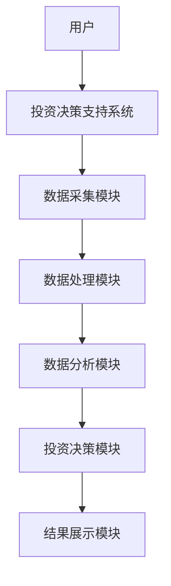

                 


# 《芒格的多学科知识在投资决策中的作用》

---

## 关键词：芒格、多学科知识、投资决策、思维模型、系统架构、数学模型

---

## 摘要：  
本文深入探讨了芒格的多学科知识体系在投资决策中的应用，分析了其“mental models”（心智模型）的核心思想，结合技术领域的算法原理、数学模型和系统架构，展示了如何通过多学科知识的交叉应用来优化投资决策过程。文章从芒格的投资哲学出发，详细阐述了多学科知识体系的构建方法及其在投资中的实际应用，最后通过项目实战和系统设计，为读者提供了一个完整的投资决策支持系统解决方案。

---

## 第一部分：芒格的多学科知识体系概述

### 第1章：芒格的生平与投资哲学

#### 1.1 芒格的生平简介  
查理·芒格（Charlie Munger）是世界著名投资家、作家和哲学家，也是伯克希尔·哈撒韦公司（Berkshire Hathaway）的副主席。芒格的职业生涯始于法律领域，但他对投资产生了浓厚兴趣，并逐渐发展出一套独特的价值投资理念。他的哲学思想深受苏格拉底、爱因斯坦和费曼等人的影响，形成了以“心智模型”为核心的多学科知识体系。

#### 1.2 芒格的投资哲学  
芒格的投资哲学强调“逆向思考”和“避免愚蠢”，即通过避免犯错来获得超额收益。他认为，投资的本质是通过理解和分析企业基本面，找到那些具有持续竞争优势和良好治理结构的企业进行长期投资。他的决策框架基于“心智模型”的构建，即通过多个学科的知识来分析问题，避免单一视角的局限性。

#### 1.3 多学科知识在投资中的重要性  
在投资决策中，单一学科的知识往往难以全面捕捉市场的复杂性。通过多学科知识的交叉应用，投资者可以更全面地评估企业的内在价值、行业竞争格局以及宏观经济环境，从而做出更明智的投资决策。芒格的多学科知识体系强调将心理学、经济学、物理学等学科的知识结合起来，形成一个完整的分析框架。

---

### 第2章：多学科知识体系的背景与意义  

#### 2.1 多学科知识的定义与特点  
多学科知识是指从多个学科中汲取知识，形成一个综合性的知识体系。其核心特点是跨学科、系统性和动态性。跨学科意味着整合不同领域的知识，系统性意味着将这些知识有机地结合起来，动态性则意味着知识体系需要不断更新和优化。

#### 2.2 芒格多学科知识体系的构建  
芒格的知识体系构建基于以下原则：  
1. **广泛涉猎**：涵盖哲学、科学、艺术等多个领域。  
2. **深度思考**：通过深入思考将知识转化为自己的思维方式。  
3. **动态更新**：随着市场环境的变化不断调整知识体系。  

#### 2.3 芒格多学科知识体系在投资中的意义  
芒格的多学科知识体系在投资中具有以下优势：  
1. **提高决策准确性**：通过多维度分析降低决策错误率。  
2. **降低投资风险**：通过跨学科分析识别潜在风险。  
3. **提升投资效率**：通过系统性分析优化投资流程。

---

### 第3章：芒格的“mental models”概念  

#### 3.1 “mental models”的定义与特点  
“心智模型”是指用不同学科的知识框架来分析问题。其特点包括：  
1. **可迁移性**：适用于多个领域的问题分析。  
2. **互补性**：不同模型之间可以相互补充。  
3. **动态性**：模型可以根据实际情况进行调整。  

#### 3.2 芒格“mental models”在投资中的应用  
在投资中，芒格通过“心智模型”分析企业的内在价值、行业竞争格局以及宏观经济环境。例如，他利用物理学的“能量守恒定律”来分析企业的竞争优势，利用心理学的“行为偏差”来识别市场泡沫。

#### 3.3 芒格“mental models”的优势  
1. **提高决策效率**：通过多维度分析快速识别投资机会。  
2. **降低决策风险**：通过模型交叉验证减少决策错误。  
3. **增强决策信心**：通过系统性分析提高投资决策的确定性。

---

## 第二部分：多学科知识体系在投资中的应用

### 第4章：算法原理与数学模型  

#### 4.1 投资决策中的算法原理  
在投资决策中，可以运用决策树、贝叶斯推理等算法来分析投资机会。例如，决策树可以帮助投资者通过概率分析选择最优投资方案。

#### 4.2 投资决策的数学模型  
以下是常见的投资数学模型：  
- **CAPM模型**：$$E(r) = r_f + β(r_m - r_f)$$  
  其中，E(r)是预期收益率，r_f是无风险利率，β是贝塔系数，r_m是市场预期收益率。  

- **DCF模型**：$$企业价值 = \sum_{t=1}^{n} \frac{CF_t}{(1 + r)^t}$$  
  其中，CF_t是第t年的现金流，r是折现率。

#### 4.3 投资决策算法的Python实现  
以下是CAPM模型的Python实现示例：

```python
def calculate_capm(risk_free_rate, market_return, beta):
    expected_return = risk_free_rate + beta * (market_return - risk_free_rate)
    return expected_return

# 示例
rf = 0.05
rm = 0.1
beta = 1.2
print(f"预期收益率：{calculate_capm(rf, rm, beta)}")
```

---

### 第5章：系统架构与项目实战  

#### 5.1 投资决策支持系统的架构设计  
以下是投资决策支持系统的架构图：



#### 5.2 投资决策系统的实现  
以下是投资决策系统的功能模块实现：

```python
class InvestmentSystem:
    def __init__(self):
        self.data = {}
    
    def collect_data(self):
        # 数据采集逻辑
        pass
    
    def analyze_data(self):
        # 数据分析逻辑
        pass
    
    def make_decision(self):
        # 投资决策逻辑
        pass

# 示例
system = InvestmentSystem()
system.collect_data()
system.analyze_data()
system.make_decision()
```

---

### 第6章：最佳实践与注意事项  

#### 6.1 最佳实践  
1. **持续学习**：不断更新知识体系。  
2. **系统性分析**：避免单一视角。  
3. **风险控制**：合理分散投资风险。  

#### 6.2 小结  
芒格的多学科知识体系为投资决策提供了强大的理论支持和技术工具。通过结合算法原理、数学模型和系统架构，投资者可以更高效地做出决策。

#### 6.3 注意事项  
1. **避免过度复杂化**：选择适合自己的方法。  
2. **注意数据质量**：确保数据的准确性和完整性。  
3. **定期回顾与调整**：根据市场变化优化投资策略。

---

## 第三部分：拓展阅读与总结  

### 7.1 拓展阅读  
推荐阅读以下书籍：  
1. 《穷查理宝典》—— 查理·芒格的投资思想集锦。  
2. 《投资学原理》—— 投资理论与实践的经典教材。  
3. 《思考，快与慢》—— 诺贝尔经济学奖得主丹尼尔·卡尼曼的行为心理学研究。

### 7.2 总结  
芒格的多学科知识体系为投资决策提供了独特的视角和方法。通过结合技术领域的算法、数学模型和系统架构，投资者可以构建一个高效的投资决策支持系统，从而在复杂多变的市场中获得超额收益。

---

## 作者：AI天才研究院/AI Genius Institute & 禅与计算机程序设计艺术 /Zen And The Art of Computer Programming

