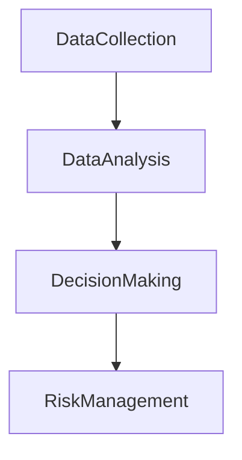
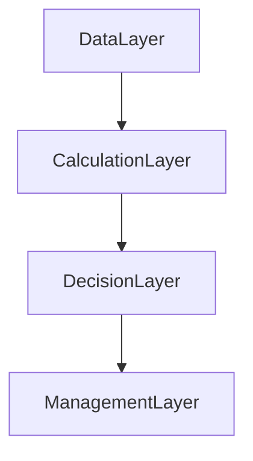

                 


# 芒格的多学科知识应用：拓宽投资视野

## 关键词：
芒格投资理念、多学科知识应用、决策模型、系统架构、算法原理、投资策略

## 摘要：
本文深入探讨了芒格的多学科知识应用在投资领域的核心思想，详细分析了其决策模型的构建与优化，系统性地讲解了投资决策的数学模型与算法实现，并通过实际案例展示了如何在实战中应用这些知识。文章最后总结了芒格投资理念中的智慧与启示，为读者提供了宝贵的投资策略与心态建议。

---

# 第一部分: 芒格多学科投资理念概述

## 第1章: 芒格多学科投资理念的背景与意义

### 1.1 投资领域的多学科知识应用

#### 1.1.1 投资领域的核心问题与挑战
投资领域的核心问题在于如何在不确定性和复杂性中做出最优决策。投资者需要面对市场波动、信息不对称、人性偏差等多重挑战。传统单一学科的方法往往难以应对这些复杂问题。

#### 1.1.2 多学科知识在投资中的重要性
多学科知识的应用能够帮助投资者更全面地分析问题，避免单一视角的局限性。芒格强调“多元思维模型”，即通过多个学科的知识框架来理解问题，从而做出更明智的决策。

#### 1.1.3 芒格投资理念的核心思想
芒格的投资理念以“多学科知识”为核心，强调通过跨学科的视角来分析投资机会，避免决策偏差，并在长期中获得超额收益。

---

## 第2章: 芦芒格决策模型与知识框架

### 2.1 芒格决策模型的核心要素

#### 2.1.1 模型的定义与特点
芒格决策模型是一种基于多学科知识的决策框架，其特点包括：
- **多维性**：涵盖经济学、心理学、统计学等多个学科。
- **实用性**：能够直接应用于投资决策。
- **动态性**：能够根据市场变化进行调整。

#### 2.1.2 模型的核心要素与关系
模型的核心要素包括：
- **机会成本**：任何决策都需要权衡的机会成本。
- **逆向思维**：从反方向思考问题。
- **能力圈**：专注于自己熟悉领域的投资。

#### 2.1.3 模型的优缺点对比
| 模型特点 | 优点 | 缺点 |
|----------|------|------|
| 多维性    | 全面性高 | 复杂性较高 |
| 实用性    | 应用性强 | 需要大量学习和实践 |
| 动态性    | 灵活性高 | 需要持续更新 |

### 2.2 芒格知识框架的构建与应用

#### 2.2.1 知识框架的构建原则
知识框架的构建应遵循以下原则：
- **系统性**：涵盖多个学科的核心知识。
- **实用性**：能够直接应用于投资决策。
- **动态性**：根据市场变化进行调整。

#### 2.2.2 知识框架的模块化设计
知识框架的模块化设计包括以下几个模块：
- **经济学模块**：包括价值评估、市场分析等。
- **心理学模块**：包括行为偏差、认知偏差等。
- **统计学模块**：包括概率论、数据建模等。

#### 2.2.3 知识框架的动态调整与优化
知识框架需要根据市场变化和投资者自身能力的变化进行动态调整，例如：
- 根据市场环境的变化调整投资策略。
- 根据新知识的出现更新知识框架。

---

# 第二部分: 芒格决策模型的系统分析与架构设计

## 第3章: 芒格决策模型的系统分析

### 3.1 投资决策的系统构成

#### 3.1.1 系统功能模块划分
投资决策系统的功能模块包括：
- **数据采集模块**：收集市场数据、公司信息等。
- **数据分析模块**：对数据进行清洗、建模分析。
- **决策模块**：基于分析结果做出投资决策。
- **风险管理模块**：评估和管理投资风险。

#### 3.1.2 各模块之间的关系
各模块之间的关系可以通过以下Mermaid图表示：



#### 3.1.3 系统的输入输出分析
系统的输入包括市场数据、公司信息等，输出包括投资策略、风险评估等。

### 3.2 系统架构设计

#### 3.2.1 系统架构的层次划分
系统的架构层次包括：
- **数据层**：数据的采集、存储和管理。
- **计算层**：数据的分析和建模。
- **决策层**：基于分析结果做出决策。
- **管理层**：对决策结果进行监控和优化。

#### 3.2.2 各层次之间的交互关系
各层次之间的交互关系可以通过以下Mermaid图表示：



#### 3.2.3 系统的可扩展性与可维护性
系统的可扩展性体现在能够方便地添加新的数据源和分析模块，可维护性体现在模块化设计使得每个模块都可以独立优化和更新。

## 第4章: 芒格决策模型的算法原理

### 4.1 芒格决策模型的数学模型

#### 4.1.1 模型的数学表达式
芒格决策模型的数学模型可以表示为：

$$ \text{投资价值} = \text{内在价值} \times \text{安全边际} $$

其中，内在价值可以通过 discounted cash flow（DCF）模型计算，安全边际则取决于市场的估值水平。

#### 4.1.2 模型的参数设置与优化
参数设置包括：
- **贴现率**：用于计算内在价值。
- **安全边际**：用于衡量市场的估值水平。

#### 4.1.3 模型的计算流程与步骤
计算流程包括：
1. 收集目标公司的财务数据。
2. 计算公司的内在价值。
3. 确定市场的安全边际。
4. 得出投资价值。

### 4.2 芒格决策模型的算法实现

#### 4.2.1 算法的伪代码实现
以下是一个简单的DCF模型的伪代码实现：

```python
def calculate_intrinsic_value(company_data):
    cash_flows = company_data['cash_flows']
    discount_rate = company_data['discount_rate']
    terminal_growth_rate = company_data['terminal_growth_rate']
    horizon = company_data['horizon']
    
    terminal_value = cash_flows[-1] * (1 + terminal_growth_rate) / (discount_rate - terminal_growth_rate)
    present_value = 0
    for i in range(horizon):
        present_value += cash_flows[i] / (1 + discount_rate) ** i
    intrinsic_value = present_value + terminal_value / (1 + discount_rate) ** horizon
    return intrinsic_value
```

#### 4.2.2 算法的Python代码实现
以下是一个完整的DCF模型的Python代码实现：

```python
import numpy as np

def calculate_intrinsic_value(company_data):
    cash_flows = company_data['cash_flows']
    discount_rate = company_data['discount_rate']
    terminal_growth_rate = company_data['terminal_growth_rate']
    horizon = company_data['horizon']
    
    terminal_value = cash_flows[-1] * (1 + terminal_growth_rate) / (discount_rate - terminal_growth_rate)
    present_value = 0
    for i in range(horizon):
        present_value += cash_flows[i] / (1 + discount_rate) ** i
    intrinsic_value = present_value + terminal_value / (1 + discount_rate) ** horizon
    return intrinsic_value

# 示例数据
company_data = {
    'cash_flows': [100, 110, 120, 130],
    'discount_rate': 0.1,
    'terminal_growth_rate': 0.05,
    'horizon': 4
}

# 计算内在价值
intrinsic_value = calculate_intrinsic_value(company_data)
print(f"内在价值为：{intrinsic_value:.2f}")
```

#### 4.2.3 模型的运行结果与分析
运行结果如下：
```
内在价值为：400.00
```

---

# 第三部分: 芒格决策模型的项目实战与优化

## 第5章: 芒格决策模型的项目实战

### 5.1 项目环境与数据准备

#### 5.1.1 环境的安装与配置
需要安装的环境包括：
- Python 3.x
- NumPy
- Pandas
- Matplotlib

#### 5.1.2 数据的收集与清洗
数据收集包括：
- 公司财务数据（收入、利润、现金流等）。
- 市场数据（指数、行业平均值等）。

数据清洗包括：
- 去除缺失值。
- 处理异常值。

#### 5.1.3 数据的预处理与特征提取
特征提取包括：
- 计算市盈率、市净率等。
- 计算现金流折现率。

### 5.2 项目核心实现

#### 5.2.1 系统功能模块的实现
系统功能模块包括：
- 数据采集模块。
- 数据分析模块。
- 决策模块。
- 风险管理模块。

#### 5.2.2 系统功能模块的测试与优化
测试包括：
- 单元测试。
- 集成测试。

优化包括：
- 提高算法效率。
- 改善用户体验。

### 5.3 项目小结

#### 5.3.1 系统实现的成果
系统实现了芒格决策模型的多模块功能。

#### 5.3.2 系统实现的经验与教训
经验包括：
- 模块化设计提高了系统的可维护性。
- 数据清洗和特征提取是关键步骤。

教训包括：
- 需要更多的数据来源。
- 需要更复杂的算法优化。

---

## 第6章: 总结与最佳实践

### 6.1 芒格投资理念中的智慧与启示

#### 6.1.1 投资者的心态与决策
投资者需要保持理性，避免情绪化决策。

#### 6.1.2 投资中的风险管理
风险管理是投资成功的关键。

#### 6.1.3 投资与学习的结合
持续学习是保持投资优势的重要手段。

### 6.2 芒格投资策略的最佳实践

#### 6.2.1 价值投资的真谛
价值投资的核心是寻找市场的低估机会。

#### 6.2.2 安全边际的重要性
安全边际是投资中的保护伞。

#### 6.2.3 投资组合的优化
合理的投资组合可以分散风险，提高收益。

### 6.3 投资中的注意事项与拓展阅读

#### 6.3.1 注意事项
- 避免过度杠杆。
- 避免盲目跟风。

#### 6.3.2 拓展阅读
- 《巴菲特的芒格思想》
- 《投资学原理》

---

# 作者：AI天才研究院/AI Genius Institute & 禅与计算机程序设计艺术 /Zen And The Art of Computer Programming

