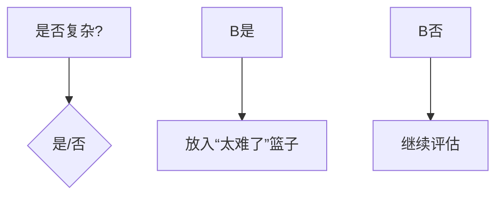
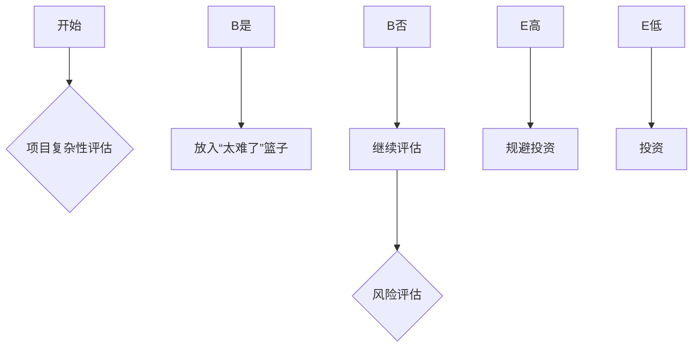
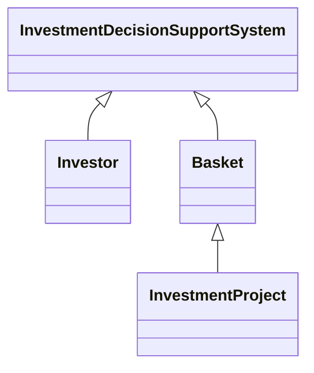
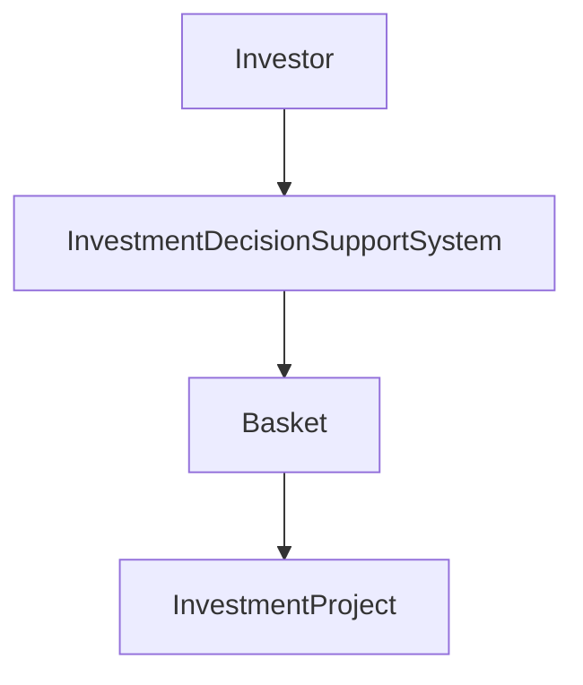

                 


# 芒格的"太难了"篮子：如何避开复杂投资

> **关键词**：芒格投资理念、复杂投资、决策模型、评分系统、投资决策支持系统

> **摘要**：芒格的“太难了”篮子是一个经典的复杂投资规避策略，旨在帮助投资者识别和避开那些过于复杂、难以评估的投资项目。本文通过系统化的分析和案例研究，深入探讨了复杂投资的核心特征、决策模型的算法原理、数学评分系统的设计与实现，以及如何通过投资决策支持系统来规避复杂投资。我们结合实际案例，使用决策树模型、评分系统、风险评估模型等方法，提供了一套完整的复杂投资规避解决方案。

---

## 第一部分：芒格投资理念与“太难了”篮子背景

### 第1章：芒格投资哲学概述

#### 1.1 芒格的生平与投资理念

芒格（Charlie Munger）是全球著名投资家、巴菲特的长期合作伙伴，其投资哲学以“逆向思维”和“价值投资”为核心。芒格强调投资者应避免过于复杂的决策，尤其是当问题过于复杂时，他倾向于将这些项目放入“太难了”篮子中，暂时搁置，等待更清晰的信号。

**芒格的核心投资理念**：
1. **避免复杂性**：复杂的投资项目容易让投资者陷入信息不对称和认知偏差的泥潭。
2. **长期价值**：芒格注重企业的长期价值，而非短期市场波动。
3. **安全边际**：在投资决策中，安全边际是确保收益的关键因素。

#### 1.2 “太难了”篮子的背景与定义

“太难了”篮子是芒格投资策略中的一个关键工具，用于筛选和规避那些难以评估的复杂投资项目。以下是“太难了”篮子的核心特征：

1. **信息不透明性**：项目的业务模式或财务状况不清晰。
2. **行业竞争激烈**：行业内的竞争格局复杂，难以预测。
3. **宏观经济波动**：项目受宏观经济波动影响较大。
4. **技术或商业模式创新**：过于依赖新技术或新模式，难以评估其可行性。

**复杂投资与简单投资的对比**：

| 特性                | 复杂投资                  | 简单投资                  |
|---------------------|---------------------------|---------------------------|
| 信息透明度          | 低                       | 高                       |
| 业务模式            | 复杂                     | 简单                     |
| 竞争格局            | 不稳定                   | 稳定                     |
| 宏观经济影响          | 高                       | 低                       |
| 投资难度            | 高                       | 低                       |
| 评估难度            | 高                       | 低                       |

#### 1.3 复杂投资的背景与问题

当前投资环境的复杂性主要体现在以下几个方面：
1. **全球化与技术进步**：全球化和技术创新使得投资项目的复杂性显著增加。
2. **市场波动性**：宏观经济波动和政策变化使得投资风险难以预测。
3. **投资者认知偏差**：投资者容易受到情绪和偏见的影响，导致决策失误。

---

## 第二部分：复杂投资的核心概念与分析框架

### 第2章：复杂投资的核心特征

#### 2.1 复杂投资的特征分析

复杂投资的核心特征可以用ER实体关系图来表示。以下是复杂投资的实体关系图：

```mermaid
er
actor:Investor
actor[Investor] -|{拥有}| Basket:"太难了"篮子
Basket -|{包含}| InvestmentProject
InvestmentProject -|{属性}复杂性、风险、收益
```

复杂投资的特征包括：
1. **复杂性**：项目的业务模式或技术过于复杂，难以评估。
2. **风险**：项目的风险较高，难以预测。
3. **收益**：项目可能的收益难以量化。

#### 2.2 复杂投资的决策树模型

以下是复杂投资的决策树模型：



---

## 第三部分：避开复杂投资的决策模型

### 第3章：芒格决策模型的算法原理

#### 3.1 决策树模型在复杂投资中的应用

以下是决策树模型的流程图：



#### 3.2 复杂投资的评分系统

以下是复杂投资评分系统的公式：

$$ \text{评分} = \sum (\text{权重}_i \times \text{指标}_i) $$

其中，权重 $w_i$ 和指标 $i$ 的具体数值可以根据实际情况进行调整。

以下是评分系统的代码实现：

```python
def calculate_complexity_score(criteria_scores, weights):
    return sum(score * weight for score, weight in zip(criteria_scores, weights))

# 示例
criteria_scores = [0.8, 0.6, 0.7]
weights = [0.5, 0.3, 0.2]
score = calculate_complexity_score(criteria_scores, weights)
print(score)  # 输出评分
```

---

## 第四部分：复杂投资的数学模型与评分系统

### 第4章：复杂投资的数学模型

#### 4.1 复杂投资的加权评分公式

$$ \text{评分} = \sum (\text{权重}_i \times \text{指标}_i) $$

其中，权重 $w_i$ 和指标 $i$ 的具体数值可以根据实际情况进行调整。

以下是评分系统的代码实现：

```python
def calculate_complexity_score(criteria_scores, weights):
    return sum(score * weight for score, weight in zip(criteria_scores, weights))

# 示例
criteria_scores = [0.8, 0.6, 0.7]
weights = [0.5, 0.3, 0.2]
score = calculate_complexity_score(criteria_scores, weights)
print(score)  # 输出评分
```

#### 4.2 复杂投资的风险评估模型

$$ \text{风险} = \sum (\text{风险因素}_i \times \text{权重}_i) $$

以下是风险评估模型的代码实现：

```python
def calculate_risk(risk_factors, weights):
    return sum(factor * weight for factor, weight in zip(risk_factors, weights))

# 示例
risk_factors = [0.7, 0.6, 0.5]
weights = [0.4, 0.3, 0.3]
risk = calculate_risk(risk_factors, weights)
print(risk)  # 输出风险值
```

---

## 第五部分：系统分析与架构设计方案

### 第5章：投资决策支持系统

#### 5.1 问题场景介绍

投资者在面对复杂投资时，往往难以准确评估项目的可行性和风险。因此，构建一个投资决策支持系统可以帮助投资者更好地规避复杂投资。

#### 5.2 系统功能设计

以下是系统功能设计的类图：



#### 5.3 系统架构设计

以下是系统架构设计的流程图：



---

## 第六部分：项目实战

### 第6章：复杂投资规避的实战案例

#### 6.1 项目环境安装

以下是项目环境安装的代码：

```bash
pip install numpy pandas scikit-learn
```

#### 6.2 项目核心实现

以下是项目核心实现的代码：

```python
import numpy as np
import pandas as pd
from sklearn.tree import DecisionTreeClassifier

# 示例数据
data = {
    '复杂性': [0.8, 0.6, 0.7],
    '风险': [0.7, 0.6, 0.5],
    '收益': [0.9, 0.8, 0.6]
}

df = pd.DataFrame(data)
model = DecisionTreeClassifier()
model.fit(df[['复杂性', '风险']], df['收益'])

# 预测
new_data = {'复杂性': 0.7, '风险': 0.6}
print(model.predict([[new_data['复杂性'], new_data['风险']]]))
```

#### 6.3 实际案例分析

以下是实际案例分析的具体步骤：

1. **数据收集**：收集投资项目的复杂性、风险和收益数据。
2. **数据预处理**：对数据进行清洗和标准化。
3. **模型训练**：使用决策树模型进行训练。
4. **模型预测**：对新项目进行预测，判断是否应放入“太难了”篮子。

---

## 第七部分：总结与展望

### 第7章：复杂投资规避的总结与展望

#### 7.1 最佳实践

1. **定期评估**：定期对投资项目进行评估，及时调整决策。
2. **持续学习**：不断学习新的投资知识和技能，提高决策能力。
3. **工具辅助**：利用投资决策支持系统辅助投资决策。

#### 7.2 小结

芒格的“太难了”篮子是一个简单而有效的复杂投资规避策略。通过系统化的分析和决策模型，投资者可以更好地识别和避开复杂投资项目，从而提高投资收益。

#### 7.3 注意事项

1. **避免过度依赖模型**：模型只是辅助工具，投资者需要结合实际情况进行决策。
2. **保持理性**：避免因情绪影响决策，保持理性思考。

#### 7.4 拓展阅读

1. 《芒格的“太难了”篮子》
2. 《投资的智慧：芒格的投资哲学》
3. 《复杂系统的风险管理》

---

**作者**：AI天才研究院/AI Genius Institute & 禅与计算机程序设计艺术/Zen And The Art of Computer Programming

