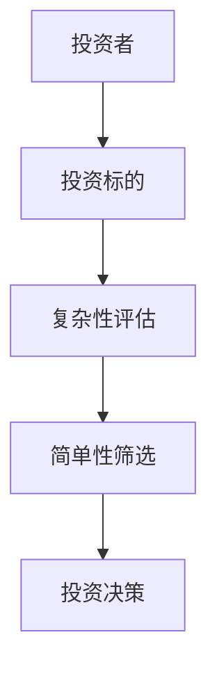
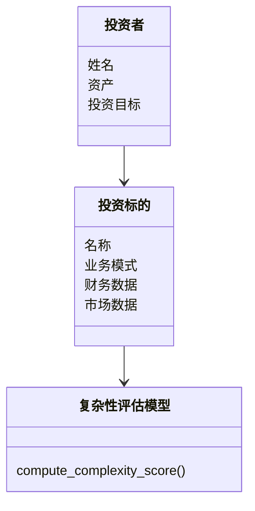
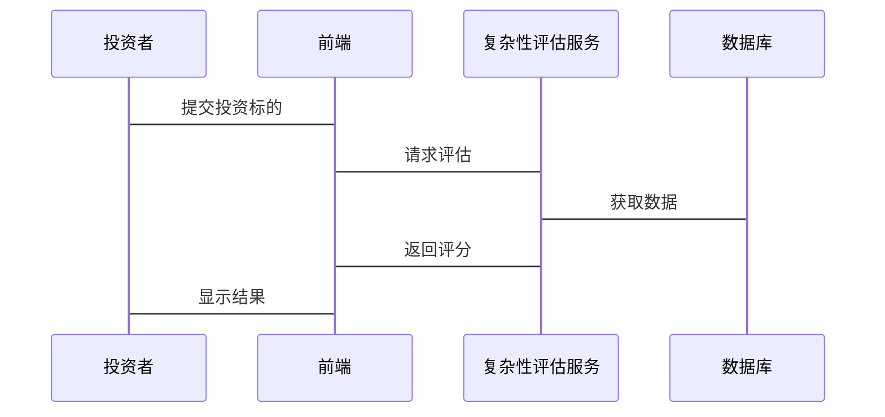

                 


# 芒格的"太难了"篮子：避开复杂投资

## 关键词：芒格、复杂投资、太难了篮子、简单性评估、投资策略

## 摘要：芒格的“太难了”篮子是一种投资策略，强调避开复杂性和不确定性较高的投资标的，选择简单易懂且容易评估的项目。本文详细介绍了该策略的核心概念、算法原理、系统架构及实际应用，帮助投资者更好地理解和应用这一策略。

---

## 第一部分：芒格"太难了"篮子的背景与核心概念

### 1.1 芒格"太难了"篮子的起源与意义

芒格是一位著名投资者，以其价值投资理念闻名。他提出的“太难了”篮子策略，旨在帮助投资者识别和避免过于复杂的投资项目。在当前金融市场中，许多投资者倾向于选择高风险、高回报的项目，但这种做法往往会导致重大损失。芒格的策略强调简化投资，选择那些简单易懂、易于评估的标的，从而降低风险，提高投资成功率。

### 1.2 复杂投资的定义与特征

复杂投资指的是那些涉及多个变量、难以预测和评估的项目。这类投资通常具有高度不确定性，容易受到外部环境变化的影响，导致投资风险增加。复杂投资的特征包括高杠杆、复杂业务模式、依赖特定市场条件等。

### 1.3 "太难了"篮子的结构与运作机制

“太难了”篮子是一种筛选机制，用于识别和排除复杂投资。其结构包括复杂性评估模型和简单性筛选标准。篮子的运作机制是通过评估投资标的的复杂性，将符合条件的项目放入篮子中，供投资者选择。该篮子的筛选标准包括简单性、可预测性和低风险性。

---

## 第二部分：芒格"太难了"篮子的核心概念与联系

### 2.1 核心概念原理

复杂性评估模型是一种数学模型，用于量化投资标的的复杂性。该模型考虑了多个因素，如业务模式复杂度、财务指标、市场依赖性等，通过加权计算得出复杂性评分。简单性与可预测性之间的关系是，简单性高的项目通常具有较高的可预测性，从而降低投资风险。

### 2.2 复杂投资与简单投资的特征对比

| 特征               | 复杂投资                     | 简单投资                     |
|--------------------|------------------------------|------------------------------|
| 业务模式           | 复杂，涉及多个变量           | 简单，易于理解和预测         |
| 财务指标           | 变化大，难以预测             | 稳定，易于评估               |
| 市场依赖性         | 高度依赖特定市场条件         | 依赖性低，受市场波动影响小   |

### 2.3 ER实体关系图



---

## 第三部分：芒格"太难了"篮子的算法原理

### 3.1 简单性评估算法

#### 3.1.1 算法概述

简单性评估算法通过多个指标评估投资标的的复杂性，包括业务模式复杂度、财务指标波动性和市场依赖性。算法步骤如下：

1. 收集投资标的的相关数据。
2. 计算每个指标的评分。
3. 根据评分权重计算总复杂性评分。
4. 根据预设阈值筛选出简单投资标的。

#### 3.1.2 算法实现

```python
def compute_complexity_score(company_data):
    # 计算业务模式复杂度评分
    business_complexity = company_data['business_complexity']
    # 计算财务指标波动性
    financial_fluctuation = company_data['financial_fluctuation']
    # 计算市场依赖性
    market_dependency = company_data['market_dependency']
    # 权重系数
    weights = [0.4, 0.3, 0.3]
    # 计算总复杂性评分
    complexity_score = business_complexity * weights[0] + financial_fluctuation * weights[1] + market_dependency * weights[2]
    return complexity_score

# 示例数据
company = {
    'business_complexity': 0.7,
    'financial_fluctuation': 0.6,
    'market_dependency': 0.8
}

score = compute_complexity_score(company)
print(f"Complexity Score: {score}")
```

#### 3.1.3 详细解释

上述代码计算了投资标的的复杂性评分。评分基于业务模式复杂度、财务指标波动性和市场依赖性，权重分别为0.4、0.3和0.3。评分越低，表示标的越简单，适合放入“太难了”篮子中。

---

## 第四部分：系统分析与架构设计

### 4.1 系统功能设计

#### 4.1.1 领域模型类图



### 4.2 系统架构设计


### 4.3 系统交互序列图



---

## 第五部分：项目实战

### 5.1 环境安装

需要安装Python和相关库，如pandas和numpy。

### 5.2 核心代码实现

```python
import pandas as pd
import numpy as np

def compute_complexity_score(data):
    # 加权计算复杂性评分
    weights = {'business_complexity': 0.4, 'financial_fluctuation': 0.3, 'market_dependency': 0.3}
    return np.dot(data[['business_complexity', 'financial_fluctuation', 'market_dependency']].values, list(weights.values()))

# 示例数据
data = pd.DataFrame({
    'business_complexity': [0.7, 0.5, 0.6],
    'financial_fluctuation': [0.6, 0.4, 0.5],
    'market_dependency': [0.8, 0.7, 0.6]
})

# 计算复杂性评分
scores = data.apply(compute_complexity_score, axis=1)
print(scores)
```

### 5.3 实际案例分析

以科技公司为例，计算其复杂性评分，判断是否适合放入“太难了”篮子。

---

## 第六部分：最佳实践与小结

### 6.1 小结

芒格的“太难了”篮子策略通过避免复杂投资，帮助投资者降低风险，提高投资成功率。本文详细介绍了该策略的核心概念、算法原理、系统架构及实际应用。

### 6.2 最佳实践 tips

1. **避免复杂项目**：选择简单易懂的投资标的。
2. **持续学习**：不断更新知识，适应市场变化。
3. **调整策略**：根据市场变化动态调整投资组合。

### 6.3 注意事项

投资需谨慎，避免盲目跟风，结合自身情况制定投资策略。

### 6.4 拓展阅读

推荐书籍《富爸爸穷爸爸》、《巴菲特投资策略》等，深入理解投资策略。

---

## 作者：AI天才研究院 & 禅与计算机程序设计艺术

本文由AI天才研究院撰写，转载请注明出处。

