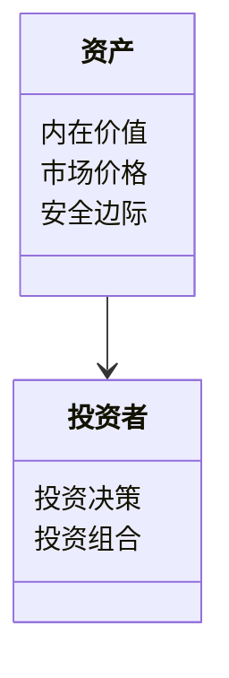
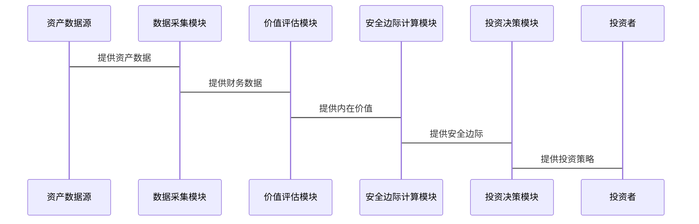
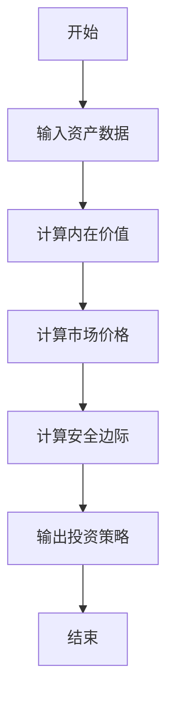

                 


# 芒格的"安全边际"理念在投资中的实践

## 关键词：芒格，安全边际，投资理念，系统架构，算法原理，投资决策，案例分析

## 摘要：
本文深入探讨了芒格的“安全边际”理念在投资中的实践应用。通过分析“安全边际”的核心概念、算法原理、系统架构以及实际案例，展示了如何将这一理念应用于投资决策中。文章结构清晰，内容详实，从理论到实践，为投资者提供了全面的指导。

---

# 第1章: 芒格与"安全边际"理念的起源

## 1.1 芒格的生平与投资哲学

### 1.1.1 查理·芒格的基本介绍
查理·芒格（Charlie Munger）是美国著名投资家、伯克希尔·哈撒韦公司副董事长，被誉为“投资圣人”。他不仅是巴菲特（Warren Buffett）的重要合作伙伴，也是价值投资理念的重要传播者。

### 1.1.2 芒格的投资哲学与思维方式
芒格的投资哲学强调“安全边际”和“逆向思维”。他认为，投资者应该寻找具有“安全边际”的投资标的，即以低于其内在价值的价格买入优质资产。他还强调跨学科思维，认为投资者需要理解心理学、经济学、数学等多学科知识。

### 1.1.3 芒格与巴菲特的合伙关系
芒格与巴菲特的合作始于1959年，两人共同创立了伯克希尔·哈撒韦公司，并将其打造成全球最大的投资公司之一。芒格的投资理念对伯克希尔的成功起到了至关重要的作用。

---

## 1.2 "安全边际"理念的提出与演进

### 1.2.1 "安全边际"的定义与内涵
“安全边际”是指资产的市场价格低于其内在价值的差额。芒格认为，投资者应该在市场价格远低于内在价值时买入，以确保投资的安全性。

### 1.2.2 "安全边际"理念的历史发展
“安全边际”理念起源于20世纪初，由本杰明·格雷厄姆（Benjamin Graham）提出，芒格在其基础上进一步发展和完善了这一理念。

### 1.2.3 "安全边际"在投资中的重要性
“安全边际”是投资成功的关键因素之一。它能够帮助投资者避免因市场波动而造成的损失，确保投资的长期稳健回报。

---

# 第2章: "安全边际"理念的核心概念与应用

## 2.1 "安全边际"的核心原理

### 2.1.1 "安全边际"的数学模型
“安全边际”可以通过以下公式计算：
$$\text{安全边际} = \text{内在价值} - \text{市场价格}$$

### 2.1.2 "安全边际"的计算方法
计算“安全边际”需要先确定资产的内在价值。内在价值可以通过基本面分析来估算，然后比较市场价格与内在价值的差异。

### 2.1.3 "安全边际"与投资决策的关系
“安全边际”越大，投资的风险越小，回报越稳定。因此，投资者应该优先选择具有较大“安全边际”的投资标的。

---

## 2.2 "安全边际"的属性特征对比

### 2.2.1 核心概念属性分析
| 属性 | 描述 |
|------|------|
| 内在价值 | 资产的实际价值，不考虑市场价格 |
| 市场价格 | 资产在市场上的交易价格 |
| 安全边际 | 市场价格与内在价值的差额，确保投资的安全性 |

### 2.2.2 不同投资理念的对比表格
| 投资理念 | 定义 | 与"安全边际"的联系 |
|----------|------|------------------|
| 市值法 | 根据市场价格评估资产价值 | 强调价格波动对投资的影响 |
| 基本面分析 | 根据财务数据评估资产价值 | "安全边际"的基础 |

### 2.2.3 "安全边际"与其他投资策略的联系
“安全边际”理念与价值投资密切相关。它通过寻找市场价格低于内在价值的资产，确保投资的安全性。

---

# 第3章: "安全边际"理念的系统分析与架构设计

## 3.1 投资系统功能设计

### 3.1.1 领域模型Mermaid类图


### 3.1.2 系统功能模块划分
- 数据采集模块：收集资产的市场价格和财务数据。
- 价值评估模块：计算资产的内在价值。
- 安全边际计算模块：计算资产的安全边际。
- 投资决策模块：根据安全边际制定投资策略。

### 3.1.3 功能模块之间的交互关系
1. 数据采集模块获取资产的市场价格和财务数据。
2. 价值评估模块根据财务数据计算资产的内在价值。
3. 安全边际计算模块计算资产的安全边际。
4. 投资决策模块根据安全边际制定投资策略。

---

## 3.2 系统架构设计

### 3.2.1 系统架构Mermaid架构图


### 3.2.2 系统组件之间的依赖关系
- 数据采集模块依赖于资产数据源。
- 价值评估模块依赖于财务数据。
- 安全边际计算模块依赖于内在价值和市场价格。
- 投资决策模块依赖于安全边际计算结果。

---

## 3.3 系统接口设计与交互序列图

### 3.3.1 系统接口设计
- 数据接口：提供资产的市场价格和财务数据。
- 计算接口：提供安全边际的计算结果。

### 3.3.2 系统交互序列图


---

# 第4章: "安全边际"理念的算法原理与数学模型

## 4.1 算法原理讲解

### 4.1.1 算法流程图（Mermaid）


### 4.1.2 算法实现的Python代码示例
```python
def calculate_intrinsic_value(financial_data):
    # 计算内在价值的代码
    return intrinsic_value

def calculate_market_price(asset):
    # 计算市场价格的代码
    return market_price

def calculate_margin_of_safety(intrinsic_value, market_price):
    return intrinsic_value - market_price

def investment_decision(margin_of_safety):
    if margin_of_safety > 0:
        return "买入"
    else:
        return "卖出"
```

### 4.1.3 算法的数学模型与公式
$$\text{安全边际} = \text{内在价值} - \text{市场价格}$$

---

## 4.2 数学模型与公式

### 4.2.1 安全边际率计算公式
$$\text{安全边际率} = \frac{\text{安全边际}}{\text{内在价值}} \times 100\%$$

### 4.2.2 安全边际值计算公式
$$\text{安全边际值} = \frac{\text{安全边际}}{\text{市场价格}} \times 100\%$$

---

# 第5章: "安全边际"理念的项目实战

## 5.1 环境安装与配置

### 5.1.1 投资分析工具的安装
- 安装Python和相关库（如pandas、numpy）。
- 安装数据分析工具（如Excel、SQL）。

### 5.1.2 数据源的获取与处理
- 数据获取：从股票交易所获取资产的市场价格数据。
- 数据处理：清洗和整理财务数据。

### 5.1.3 系统环境的配置步骤
- 安装必要的软件和库。
- 配置数据源和接口。

---

## 5.2 核心代码实现

### 5.2.1 "安全边际"计算的Python代码
```python
def calculate_margin_of_safety(intrinsic_value, market_price):
    return intrinsic_value - market_price

# 示例数据
intrinsic_value = 100
market_price = 80
margin_of_safety = calculate_margin_of_safety(intrinsic_value, market_price)
print("安全边际为:", margin_of_safety)
```

### 5.2.2 投资决策系统的实现
```python
def investment_decision(margin_of_safety):
    if margin_of_safety > 0:
        return "买入"
    else:
        return "卖出"

margin_of_safety = 20
decision = investment_decision(margin_of_safety)
print("投资决策为:", decision)
```

---

## 5.3 案例分析

### 5.3.1 案例背景
假设某资产的内在价值为100，市场价格为80，计算其安全边际。

### 5.3.2 计算过程
$$\text{安全边际} = 100 - 80 = 20$$

### 5.3.3 投资决策
由于安全边际为20，大于0，因此应该“买入”该资产。

---

## 5.4 项目总结

### 5.4.1 项目小结
通过本项目，我们学会了如何计算“安全边际”并制定投资决策。

### 5.4.2 投资中的注意事项
- 定期更新资产的内在价值和市场价格。
- 结合市场环境和经济周期进行投资决策。

---

# 第6章: 总结与展望

## 6.1 最佳实践 tips
- 选择具有较大安全边际的资产。
- 结合基本面分析和市场环境进行投资决策。

## 6.2 总结
芒格的“安全边际”理念是一种科学的投资方法，能够帮助投资者在不确定的市场中实现稳健的收益。

## 6.3 注意事项
- 安全边际不是一成不变的，需要定期更新。
- 投资者需要具备扎实的财务分析能力。

## 6.4 拓展阅读
- 《投资学原理》
- 《价值投资实战》

---

# 附录

## 附录A: 术语表
- 安全边际：资产的市场价格低于其内在价值的差额。
- 内在价值：资产的实际价值，不考虑市场价格。
- 市场价格：资产在市场上的交易价格。

## 附录B: 参考文献
- 芒格，查理. 《穷查理宝典》.
- 巴菲特，沃伦. 《巴菲特致股东的信》.

## 附录C: 索引
（根据文章内容自行生成）

---

# 作者
作者：AI天才研究院/AI Genius Institute  
联系邮箱：[contact@yourdomain.com](mailto:contact@yourdomain.com)

