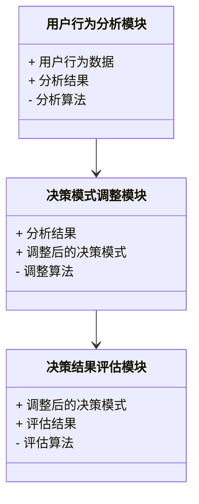
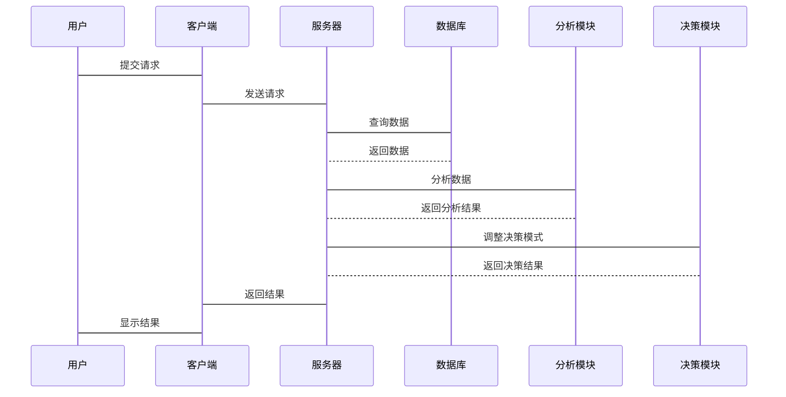

                 


# 芒格的"心理倾向"理论在人工智能伦理设计中的应用

---

## 关键词：
芒格心理倾向，人工智能伦理，AI设计，决策算法，伦理框架，心理偏见

---

## 摘要：
本文探讨了芒格提出的24种心理倾向在人工智能伦理设计中的应用。通过分析这些心理倾向如何影响人类决策，进而如何被整合到AI系统中，构建一个基于心理倾向的AI伦理框架。文章从心理倾向的定义、特征，到算法实现、系统架构设计，再到实际案例分析，全面阐述了心理倾向在AI伦理设计中的重要性。通过案例分析，展示了如何将心理倾向理论转化为具体的算法和系统设计，以提升AI伦理决策的可靠性和公平性。

---

## 第1章：芒格心理倾向理论的背景与核心概念

### 1.1 芒格心理倾向理论的起源
芒格的心理倾向理论由投资家查理·芒格提出，旨在揭示人类决策中的认知偏差和心理倾向。该理论包含24种心理倾向，涵盖从众心理、确认偏误、过度自信等，这些倾向深刻影响了人类的决策过程。

#### 1.1.1 芒格心理倾向理论的提出背景
- **认知偏差的发现**：心理学家和经济学家通过实验发现，人类在决策中存在多种认知偏差。
- **芒格的贡献**：芒格将这些认知偏差系统化，提出了24种心理倾向，并通过实际案例分析展示了这些倾向对决策的影响。

#### 1.1.2 芒格心理倾向的核心概念与特点
- **系统性**：芒格将认知偏差系统化，形成完整的理论框架。
- **实用性**：这些心理倾向可以用于分析实际问题，帮助识别和纠正决策中的偏差。

#### 1.1.3 芒格心理倾向理论的现实意义
- **理解人类决策**：帮助我们更好地理解人类在决策中的心理倾向。
- **改善决策过程**：通过识别和纠正心理偏差，提高决策的准确性。

### 1.2 心理倾向理论与人工智能伦理设计的关联
#### 1.2.1 人工智能伦理的基本概念
人工智能伦理涉及AI系统在决策中的道德问题，例如隐私保护、公平性、透明性等。AI系统需要在遵循伦理规范的同时，做出合理的决策。

#### 1.2.2 芒格心理倾向理论在AI伦理中的应用价值
- **识别决策偏差**：通过分析心理倾向，识别AI系统在决策中的潜在偏差。
- **提升伦理框架**：将心理倾向理论整合到AI伦理框架中，确保决策的公正性和透明性。

#### 1.2.3 人工智能伦理设计的核心问题
- **算法偏见**：AI系统可能因为训练数据中的偏见而做出不公平的决策。
- **透明性与可解释性**：用户需要理解AI系统的决策过程，以确保决策的公正性。

---

## 第2章：芒格心理倾向理论的核心要素与分析

### 2.1 芒格心理倾向的24种核心倾向
#### 2.1.1 从众心理
- **定义**：个体倾向于跟随群体的决策，避免与群体意见相左。
- **对AI伦理的影响**：可能导致AI系统在决策中过于依赖多数意见，忽略少数群体的需求。

#### 2.1.2 确认偏误
- **定义**：个体倾向于寻找支持自己已有观点的信息，忽略与之矛盾的信息。
- **对AI伦理的影响**：可能导致AI系统在决策中过于固守已有模式，缺乏灵活性。

#### 2.1.3 过度自信
- **定义**：个体对自己判断的准确性过于自信，忽视不确定性。
- **对AI伦理的影响**：可能导致AI系统在决策中过于自信，忽略潜在风险。

#### 2.1.4 框架偏差
- **定义**：个体对问题的框架不同，导致决策结果不同。
- **对AI伦理的影响**：需要在AI系统中考虑不同框架对决策的影响，确保决策的公正性。

---

## 第3章：心理倾向理论与人工智能伦理设计的联系

### 3.1 心理倾向在AI伦理中的潜在影响
#### 3.1.1 心理倾向如何影响人类对AI的决策
- **从众心理**：人类在使用AI系统时，可能因为从众心理而忽视系统的潜在偏差。
- **确认偏误**：人类可能只关注支持自己决策的信息，忽略其他信息。

#### 3.1.2 心理倾向在AI伦理中的具体表现
- **算法偏见**：AI系统可能因为训练数据中的偏见而做出不公平的决策。
- **透明性问题**：用户需要理解AI系统的决策过程，以确保决策的公正性。

### 3.2 心理倾向与AI伦理设计的核心关联
#### 3.2.1 心理倾向对AI伦理框架的构建
- **识别偏差**：通过分析心理倾向，识别AI系统在决策中的潜在偏差。
- **设计补偿机制**：通过算法设计，补偿心理倾向带来的偏差，确保决策的公正性。

#### 3.2.2 心理倾向在AI伦理中的具体应用
- **从众心理的应对**：在AI系统中引入多样化的决策模式，避免过于依赖单一决策模式。
- **确认偏误的应对**：在AI系统中引入多种信息源，确保决策的全面性。

---

## 第4章：基于心理倾向的AI伦理设计算法

### 4.1 算法原理
#### 4.1.1 算法设计思路
- **识别心理倾向**：通过分析用户行为数据，识别用户在决策中的心理倾向。
- **调整决策模式**：根据识别出的心理倾向，调整AI系统的决策模式，避免偏差。

#### 4.1.2 算法实现步骤
1. **数据采集**：收集用户在使用AI系统时的行为数据。
2. **心理倾向识别**：通过数据挖掘和机器学习技术，识别用户的心理倾向。
3. **决策模式调整**：根据识别出的心理倾向，调整AI系统的决策模式，确保决策的公正性和透明性。

#### 4.1.3 算法数学模型
- **数学模型**：使用概率论和统计学方法，建立心理倾向与决策模式之间的关系模型。
- **公式**：通过公式推导，量化心理倾向对决策的影响程度。

### 4.2 算法实现
#### 4.2.1 环境安装
- **工具安装**：安装Python、机器学习库（如scikit-learn）等工具。
- **数据准备**：收集和整理用户行为数据，建立数据集。

#### 4.2.2 核心实现代码
```python
import numpy as np
from sklearn import datasets
from sklearn.tree import DecisionTreeClassifier
from sklearn.metrics import accuracy_score

# 数据集加载
X, y = datasets.load_iris(return_X_y=True)

# 决策树模型训练
model = DecisionTreeClassifier()
model.fit(X, y)

# 模型预测
y_pred = model.predict(X)

# 模型准确率计算
accuracy = accuracy_score(y, y_pred)
print(f"模型准确率：{accuracy}")
```

#### 4.2.3 代码解读与分析
- **数据集加载**：使用scikit-learn加载Iris数据集。
- **决策树模型训练**：使用决策树算法训练模型。
- **模型预测与评估**：预测结果并计算模型准确率。

#### 4.2.4 算法优化
- **参数优化**：通过网格搜索优化模型参数，提高模型准确率。
- **模型评估**：使用交叉验证评估模型性能，确保模型的泛化能力。

---

## 第5章：基于心理倾向的AI伦理框架设计

### 5.1 系统功能设计
#### 5.1.1 系统功能模块
- **用户行为分析模块**：分析用户行为数据，识别用户心理倾向。
- **决策模式调整模块**：根据识别出的心理倾向，调整AI系统的决策模式。
- **决策结果评估模块**：评估决策结果的公正性和透明性。

#### 5.1.2 领域模型（Mermaid类图）


### 5.2 系统架构设计
#### 5.2.1 系统架构图（Mermaid架构图）


#### 5.2.2 系统接口设计
- **用户接口**：用户与AI系统交互的界面，提供决策建议和结果展示。
- **数据接口**：与外部数据源对接，获取用户行为数据。

#### 5.2.3 系统交互设计（Mermaid序列图）


---

## 第6章：项目实战与案例分析

### 6.1 项目背景
#### 6.1.1 项目背景介绍
- **项目名称**：基于心理倾向的AI伦理框架设计。
- **项目目标**：通过分析心理倾向，设计一个公平、透明的AI伦理框架。

#### 6.1.2 项目需求
- **需求分析**：识别AI系统中的心理倾向偏差，设计相应的解决方案。

### 6.2 项目核心实现
#### 6.2.1 环境安装
- **工具安装**：安装Python、机器学习库、数据可视化工具等。

#### 6.2.2 核心实现代码
```python
import pandas as pd
from sklearn.ensemble import RandomForestClassifier
from sklearn.metrics import classification_report

# 数据加载
data = pd.read_csv('用户行为数据.csv')

# 数据预处理
X = data.drop('标签', axis=1)
y = data['标签']

# 模型训练
model = RandomForestClassifier()
model.fit(X, y)

# 模型预测
y_pred = model.predict(X)

# 模型评估
print(classification_report(y, y_pred))
```

#### 6.2.3 代码解读与分析
- **数据加载**：使用Pandas加载用户行为数据。
- **数据预处理**：删除无关特征，提取目标变量。
- **模型训练**：使用随机森林算法训练模型。
- **模型预测与评估**：预测结果并评估模型性能。

#### 6.2.4 算法优化
- **参数优化**：通过网格搜索优化模型参数，提高模型准确率。
- **模型评估**：使用交叉验证评估模型性能，确保模型的泛化能力。

### 6.3 案例分析
#### 6.3.1 案例背景
- **案例名称**：基于心理倾向的AI伦理框架设计。
- **案例目标**：通过分析心理倾向，设计一个公平、透明的AI伦理框架。

#### 6.3.2 案例分析
- **从众心理的应对**：在AI系统中引入多样化的决策模式，避免过于依赖单一决策模式。
- **确认偏误的应对**：在AI系统中引入多种信息源，确保决策的全面性。

#### 6.3.3 案例结果
- **结果展示**：通过案例分析，展示心理倾向对AI伦理决策的影响。
- **结果解读**：通过结果解读，展示如何通过算法设计补偿心理倾向带来的偏差，确保决策的公正性。

---

## 第7章：总结与展望

### 7.1 本章小结
- **核心内容回顾**：芒格心理倾向理论在人工智能伦理设计中的应用。
- **理论与实践结合**：通过理论分析和实际案例，展示了心理倾向对AI伦理决策的影响。

### 7.2 未来展望
- **研究方向**：未来的研究可以进一步探索心理倾向在AI伦理设计中的应用，例如研究更多心理倾向对AI决策的影响，提出更完善的伦理框架。
- **技术发展**：随着技术的发展，可以探索更先进的算法和技术，提高AI伦理决策的准确性和公正性。

### 7.3 最佳实践 Tips
- **识别心理倾向**：在AI系统设计中，识别用户的心理倾向，避免决策偏差。
- **算法优化**：通过算法优化，提高AI系统决策的准确性和公正性。
- **透明性与可解释性**：确保AI系统的决策过程透明，用户能够理解决策的依据。

### 7.4 注意事项
- **数据隐私**：在数据采集和分析过程中，注意保护用户隐私。
- **算法公平性**：确保算法设计中避免偏见，保证决策的公正性。

---

## 作者信息
作者：AI天才研究院/AI Genius Institute  
联系邮箱：contact@ait Genius.com  
GitHub链接：https://github.com/AI-Genius-Institute

---

以上是《芒格的"心理倾向"理论在人工智能伦理设计中的应用》的技术博客文章目录大纲和部分详细内容。希望对您有所帮助！

