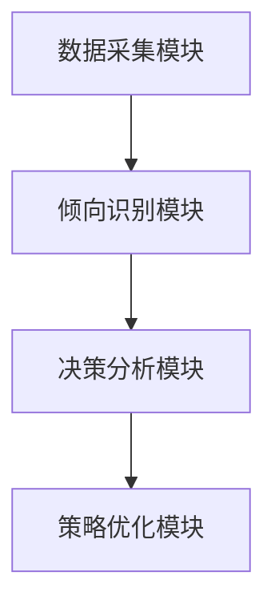
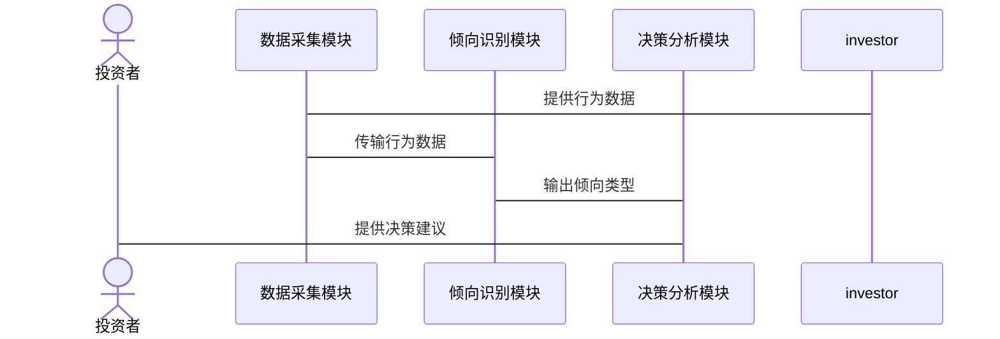
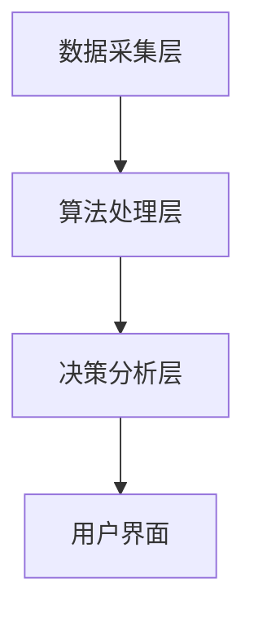
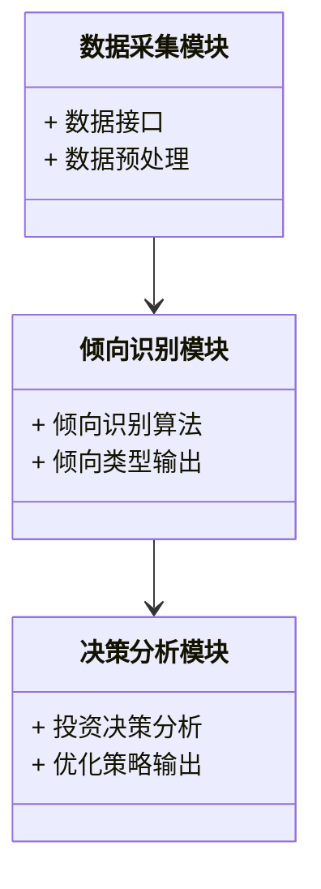

                 


# 芒格的"心理倾向"理论在投资分析中的应用

> 关键词：心理倾向，投资分析，芒格，投资决策，行为偏差，理性决策

> 摘要：本文系统地探讨了芒格的“心理倾向”理论在投资分析中的应用。从理论背景、系统分析、算法原理、系统设计到实战案例，全面解析了心理倾向如何影响投资决策，并通过具体案例展示了如何利用这些理论优化投资策略。文章最后总结了心理倾向理论在投资分析中的重要价值，并提出了未来研究的方向。

---

## 第一部分: 芒格的"心理倾向"理论概述

### 第1章: 芒格"心理倾向"理论的背景与核心概念

#### 1.1 芒格"心理倾向"理论的起源与背景

- **芒格的投资哲学概述**  
  芒格（Charlie Munger）的投资哲学以“心理倾向”为核心，强调人类思维中的认知偏差和行为偏差对投资决策的影响。他认为，投资者的行为往往受到心理倾向的驱动，而这些倾向可能导致非理性的决策。

- **心理倾向理论的提出背景**  
  在投资领域，传统模型通常假设投资者是理性的，但现实中投资者的行为往往受到情绪、认知偏差等因素的影响。芒格提出“心理倾向”理论，旨在揭示这些非理性因素如何影响投资决策，并帮助投资者克服这些倾向。

- **心理倾向与投资决策的关系**  
  心理倾向是指个体在决策过程中表现出的一系列行为模式，这些模式可能偏离理性决策。在投资分析中，心理倾向可能导致投资者做出错误的决策，如过度自信、从众心理等。

---

#### 1.2 心理倾向理论的核心概念

- **心理倾向的定义与分类**  
  心理倾向是指个体在特定情境下表现出的心理特征和行为模式。芒格将心理倾向分为若干类，包括从众心理、过度自信、确认偏差等。

- **心理倾向的核心要素与组成**  
  心理倾向的核心要素包括：认知偏差、情感因素、行为模式等。这些要素共同作用，影响投资者的决策过程。

- **心理倾向与投资分析的联系**  
  在投资分析中，心理倾向可以通过分析投资者的行为数据、情绪波动等来识别。通过理解这些倾向，投资者可以更好地控制自己的决策过程，避免非理性行为。

---

#### 1.3 心理倾向理论的理论框架

- **理论框架的构建**  
  心理倾向理论的理论框架包括以下几个方面：  
  1. 投资者的心理特征分析；  
  2. 心理倾向对投资决策的影响机制；  
  3. 投资决策的理性与非理性行为对比。

- **理论框架的核心假设**  
  芒格假设，心理倾向是投资者行为的核心驱动力，而理性决策是通过克服这些倾向来实现的。

- **理论框架的验证与应用**  
  通过实际投资案例分析，验证心理倾向理论在投资决策中的作用，并提出相应的投资策略优化方法。

---

### 第2章: 心理倾向理论的系统分析

#### 2.1 心理倾向理论的系统构成

- **心理倾向的分类体系**  
  芒格将心理倾向分为若干类别，包括：  
  - 从众心理（Conformity）：倾向于跟随大多数人，避免与他人意见相左；  
  - 过度自信（Overconfidence）：高估自己的能力，低估风险；  
  - 确认偏差（Confirmation Bias）：倾向于寻找与自己观点一致的信息；  
  - 损失厌恶（Loss Aversion）：对损失的厌恶程度高于对收益的追求。

- **心理倾向的核心属性特征对比**  
  以下是几种常见心理倾向的核心属性特征对比表：

| 心理倾向类型 | 核心属性 | 特征描述 |
|--------------|----------|----------|
| 从众心理      | 行为模式  | 趋向于跟随大多数人，避免与众不同 |
| 过度自信      | 认知偏差  | 高估自己的能力，低估风险 |
| 确认偏差      | 信息处理  | 倾向于寻找支持自己观点的信息 |
| 损失厌恶      | 情感因素  | 对损失的厌恶程度高于对收益的追求 |

---

#### 2.2 心理倾向理论的系统架构

- **系统架构的总体设计**  
  心理倾向分析系统架构包括以下几个模块：  
  1. 数据采集模块：收集投资者的行为数据；  
  2. 倾向识别模块：通过算法识别投资者的心理倾向；  
  3. 决策分析模块：分析心理倾向对投资决策的影响；  
  4. 策略优化模块：提出基于心理倾向的优化策略。

- **系统架构的功能模块划分**  
  下图展示了心理倾向分析系统的功能模块划分：



---

#### 2.3 心理倾向理论的系统接口设计

- **系统接口的功能描述**  
  系统接口主要用于数据输入和结果输出，包括：  
  - 数据输入接口：接收投资者的行为数据；  
  - 倾向识别接口：输出识别的心理倾向类型；  
  - 决策分析接口：输出心理倾向对投资决策的影响分析结果。

- **系统接口的交互设计**  
  下图展示了系统接口的交互流程：



---

## 第三部分: 心理倾向理论的算法原理

### 第3章: 心理倾向识别的算法原理

#### 3.1 心理倾向识别的算法原理

- **算法的输入与输出**  
  - 输入：投资者的行为数据，包括交易记录、市场反应等；  
  - 输出：识别出的心理倾向类型。

- **算法的数学模型与公式**  
  心理倾向识别算法基于概率模型，通过分析行为数据中的模式和特征，计算出心理倾向的概率。

$$ P(\text{心理倾向} | \text{行为数据}) = \frac{P(\text{行为数据} | \text{心理倾向}) \cdot P(\text{心理倾向})}{P(\text{行为数据})} $$

- **算法的Python实现代码**  
  下面是一个简单的心理倾向识别算法示例：

```python
import numpy as np
import pandas as pd

def mental_tendencies_analysis(data):
    # 数据预处理
    processed_data = data.dropna()
    
    # 计算倾向概率
    tendencies = ['从众心理', '过度自信', '确认偏差', '损失厌恶']
    probabilities = []
    for t in tendencies:
        prob = len(processed_data[processed_data['倾向'] == t]) / len(processed_data)
        probabilities.append((t, prob))
    
    return probabilities

# 示例数据
data = pd.DataFrame({
    '倾向': ['从众心理', '过度自信', '确认偏差', '损失厌恶', '从众心理']
})

result = mental_tendencies_analysis(data)
print(result)
```

---

#### 3.2 心理倾向影响的投资决策算法

- **算法的逻辑流程**  
  1. 识别投资者的心理倾向；  
  2. 分析心理倾向对投资决策的影响；  
  3. 提出优化投资策略的建议。

- **算法的实现步骤**  
  1. 数据采集：收集投资者的行为数据；  
  2. 倾向识别：通过算法识别心理倾向；  
  3. 决策分析：分析心理倾向对投资决策的影响；  
  4. 策略优化：提出优化策略。

- **算法的优化与改进**  
  通过引入机器学习算法（如随机森林、神经网络）进一步提高心理倾向识别的准确率。

---

## 第四部分: 心理倾向理论的系统设计

### 第4章: 心理倾向理论的系统设计

#### 4.1 系统设计的总体思路

- **系统架构设计**  
  系统架构采用分层设计，包括数据采集层、算法处理层和决策分析层。

- **系统架构的 mermaid 图**  
  下图展示了系统的架构设计：



---

#### 4.2 系统功能设计

- **系统功能模块**  
  系统功能模块包括数据采集模块、倾向识别模块、决策分析模块和策略优化模块。

- **系统功能的 mermaid 类图**  
  下图展示了系统功能模块的关系：



---

#### 4.3 系统接口设计

- **系统接口的功能描述**  
  系统接口主要用于数据输入和结果输出，包括：  
  - 数据输入接口：接收投资者的行为数据；  
  - 倾向识别接口：输出识别的心理倾向类型；  
  - 决策分析接口：输出心理倾向对投资决策的影响分析结果。

- **系统接口的交互设计**  
  下图展示了系统接口的交互流程：


---

## 第五部分: 心理倾向理论的应用实例

### 第5章: 心理倾向理论的应用实例

#### 5.1 应用实例分析

- **实例分析：从众心理对投资决策的影响**  
  在股票市场中，从众心理可能导致投资者盲目跟风，从而导致非理性投资行为。例如，当市场出现恐慌性抛售时，投资者可能会跟随市场情绪，导致进一步的亏损。

- **实例分析：过度自信对投资决策的影响**  
  过度自信的投资者可能会低估市场的风险，导致过度杠杆和错误的投资决策。例如，在2008年金融危机中，许多投资者因为过度自信而忽略了市场的风险。

---

#### 5.2 心理倾向理论的优化建议

- **优化策略：如何克服心理倾向**  
  1. 提高自我认知：认识到自己的心理倾向；  
  2. 建立决策框架：通过系统化的决策框架来减少心理倾向的影响；  
  3. 寻求外部反馈：通过与他人的讨论和反馈来验证自己的决策。

---

## 第六部分: 心理倾向理论的应用总结

### 第6章: 心理倾向理论的应用总结

#### 6.1 心理倾向理论的应用价值

- **理论价值**  
  心理倾向理论揭示了投资者行为中的非理性因素，为投资决策提供了新的视角。

- **实践价值**  
  通过识别和克服心理倾向，投资者可以做出更理性的决策，提高投资收益。

---

## 作者

作者：AI天才研究院/AI Genius Institute & 禅与计算机程序设计艺术 /Zen And The Art of Computer Programming

---

感谢您的耐心阅读！如需进一步探讨或获取更多内容，请随时联系！

