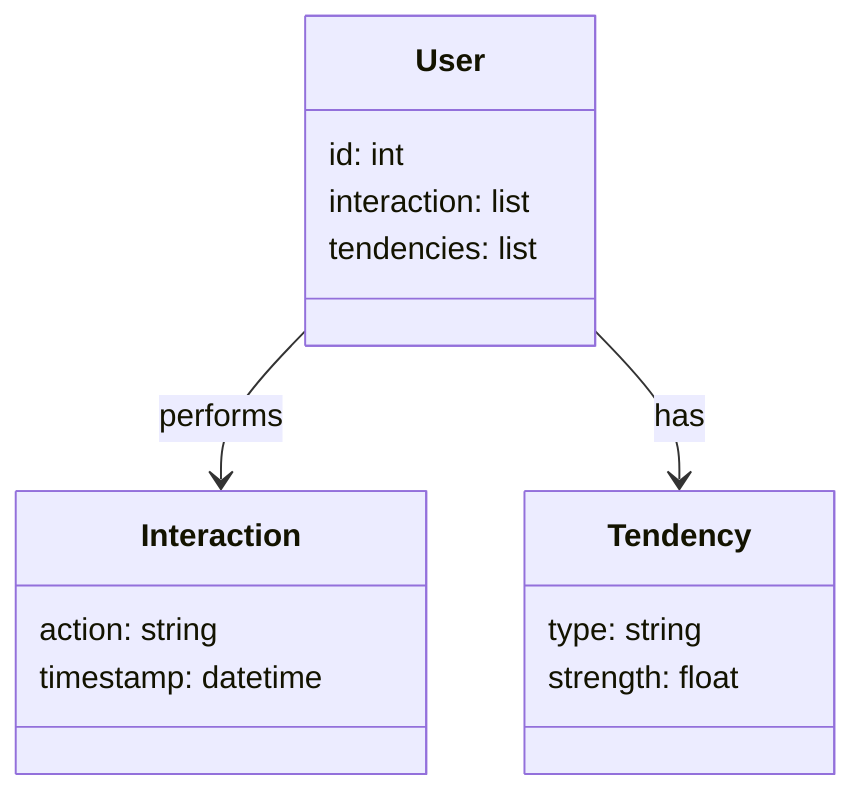
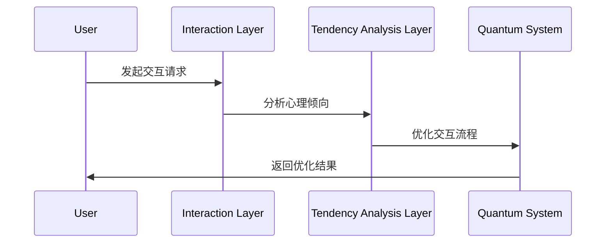

                 


# 《芒格的"心理倾向"理论在量子人机交互设计中的应用》

## 关键词：芒格心理倾向，量子计算，人机交互，系统设计，交互优化

## 摘要：芒格的心理倾向理论为量子人机交互设计提供了深刻的洞察，通过分析用户的心理倾向，可以优化量子计算的交互设计，提高用户体验和系统效率。

---

# 引言

## 1.1 心理倾向理论概述

### 1.1.1 心理倾向的定义与分类

心理倾向是人类在决策过程中表现出的各种内在倾向，包括从众、惯性、追求新奇等。这些倾向影响着人们的决策行为，理解这些倾向有助于设计更符合用户习惯的系统。

### 1.1.2 心理倾向的核心特征

心理倾向具有动态性、复杂性和个体差异性。不同的用户在不同的情境下表现出的心理倾向可能不同，因此在设计时需要考虑这些变化。

### 1.1.3 心理倾向的相互作用与影响

心理倾向之间的相互作用会影响最终的决策结果。例如，从众倾向可能强化惯性倾向，从而影响用户的交互行为。

---

## 1.2 量子人机交互设计的基本概念

### 1.2.1 量子计算的定义与特点

量子计算是一种基于量子叠加和量子纠缠的计算方式，具有并行性和高效性。与经典计算不同，量子计算能够在某些特定问题上表现出巨大的优势。

### 1.2.2 人机交互设计的定义与目标

人机交互设计是指通过设计用户与计算机之间的交互界面和流程，以提高用户体验和系统可用性为目标。

### 1.2.3 量子人机交互设计的独特性

量子人机交互设计结合了量子计算的特性，需要考虑量子系统的复杂性和用户心理倾向的多样性。

---

## 1.3 芒格心理倾向理论与量子人机交互设计的结合

### 1.3.1 理论结合的背景与意义

随着量子计算技术的发展，用户与量子系统之间的交互需求日益增加。理解用户的心理倾向有助于设计更高效的量子交互系统。

### 1.3.2 理论结合的核心问题

如何将心理倾向理论应用于量子人机交互设计，以优化用户体验和系统性能。

### 1.3.3 理论结合的应用前景

通过心理倾向理论，可以预测和优化用户的交互行为，提升量子计算系统的可用性和用户满意度。

---

# 第2章 心理倾向理论的核心概念与联系

## 2.1 心理倾向理论的核心原理

### 2.1.1 心理倾向的层次结构

心理倾向可以分为基本倾向和复合倾向，基本倾向是核心的心理驱动力，复合倾向是多种基本倾向的组合。

### 2.1.2 心理倾向的关键属性

心理倾向具有强度、方向和持久性等属性，这些属性决定了倾向对决策的影响程度。

### 2.1.3 心理倾向的动态变化

心理倾向在不同情境下会发生变化，用户的心理状态和外部环境都会影响倾向的表现。

---

## 2.2 心理倾向与量子人机交互的关系

### 2.2.1 心理倾向对人机交互的影响

用户的心理倾向直接影响其与量子系统的交互行为，例如，从众倾向可能导致用户在量子计算中选择与大多数人一致的方案。

### 2.2.2 量子计算的特点与心理倾向的关联

量子计算的复杂性和不确定性可能引发用户的焦虑倾向，影响其交互行为。

### 2.2.3 心理倾向在量子人机交互中的具体表现

用户在使用量子系统时，可能会表现出规避风险倾向，影响其对量子算法的选择。

---

## 2.3 心理倾向理论的ER实体关系图

```mermaid
er
actor: 用户
model: 心理倾向模型
interaction: 人机交互行为
quantum_system: 量子计算系统
actor --> interaction: 触发交互行为
interaction --> model: 应用心理倾向
model --> quantum_system: 影响量子计算
```

---

# 第3章 心理倾向理论在量子人机交互中的算法实现

## 3.1 心理倾向分析算法原理

### 3.1.1 心理倾向分析的基本流程

1. 数据采集：收集用户在量子计算中的交互数据。
2. 倾向识别：通过算法识别用户的主要心理倾向。
3. 倾向分析：评估倾向的强度和方向。

### 3.1.2 基于概率的倾向分析方法

使用概率论模型，计算用户表现出某种倾向的概率。

### 3.1.3 算法的数学模型

$$ P(\text{倾向}|D) = \frac{P(D|\text{倾向})P(\text{倾向})}{P(D)} $$

其中，P(倾向|D)表示在数据D下用户表现出某种倾向的概率。

---

## 3.2 量子计算中的交互优化算法

### 3.2.1 量子计算的基本原理

量子计算利用量子叠加和量子纠缠进行并行计算，能够在某些问题上比经典计算快得多。

### 3.2.2 基于心理倾向的交互优化策略

根据用户的心理倾向，优化量子计算的交互流程，减少用户的认知负荷。

### 3.2.3 优化算法的实现步骤

1. 数据采集：收集用户的交互数据。
2. 倾向识别：分析用户的主要心理倾向。
3. 优化设计：根据倾向调整交互流程。

---

## 3.3 算法实现的Python代码示例

```python
import numpy as np
from sklearn.metrics 

# 示例代码：心理倾向分析
def analyze_tendency(users):
    # 假设users是用户数据列表
    # 返回用户的倾向类型
    pass

# 示例代码：量子计算优化
def optimize_interaction(quantum_system, user_tendencies):
    # 根据用户的倾向优化量子计算的交互流程
    pass
```

---

# 第4章 系统分析与架构设计方案

## 4.1 项目背景与介绍

随着量子计算的快速发展，用户与量子系统之间的交互需求日益增加，如何设计高效的量子交互系统成为一个重要课题。

## 4.2 系统功能设计

### 4.2.1 领域模型类图



### 4.2.2 系统架构设计


### 4.2.3 系统接口设计

系统接口包括用户输入接口、交互日志接口和量子计算接口。

### 4.2.4 系统交互序列图



---

# 第5章 项目实战

## 5.1 环境安装

安装必要的Python库，如numpy、scikit-learn等。

## 5.2 核心代码实现

### 5.2.1 心理倾向分析代码

```python
import numpy as np
from sklearn.metrics 

def analyze_tendency(users):
    # 示例代码：分析用户的心理倾向
    pass
```

### 5.2.2 量子计算优化代码

```python
def optimize_interaction(quantum_system, user_tendencies):
    # 示例代码：优化量子计算的交互流程
    pass
```

## 5.3 代码应用解读与分析

详细解读代码的功能和实现逻辑，说明如何通过代码实现心理倾向分析和交互优化。

## 5.4 实际案例分析

通过具体案例分析，展示心理倾向理论在量子人机交互设计中的实际应用。

## 5.5 项目小结

总结项目的实现过程和成果，强调心理倾向理论在量子交互设计中的重要性。

---

# 第6章 总结与展望

## 6.1 总结

本文详细探讨了芒格心理倾向理论在量子人机交互设计中的应用，分析了心理倾向的核心概念，提出了优化量子计算交互流程的方法。

## 6.2 注意事项

在实际应用中，需要注意心理倾向的动态变化和个体差异，避免单一化的设计。

## 6.3 拓展阅读

推荐相关领域的书籍和论文，供读者进一步学习和研究。

---

# 作者

**作者：AI天才研究院/AI Genius Institute & 禅与计算机程序设计艺术 /Zen And The Art of Computer Programming**

---

通过本文的系统分析和具体案例，我们展示了芒格心理倾向理论在量子人机交互设计中的巨大潜力和实际应用价值。希望本文能够为相关领域的研究和实践提供有价值的参考和启示。

