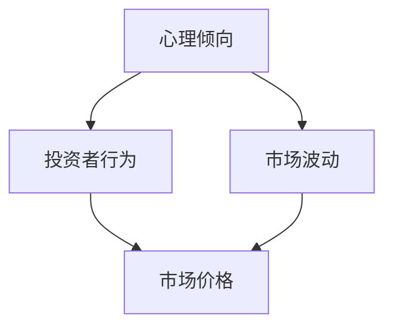
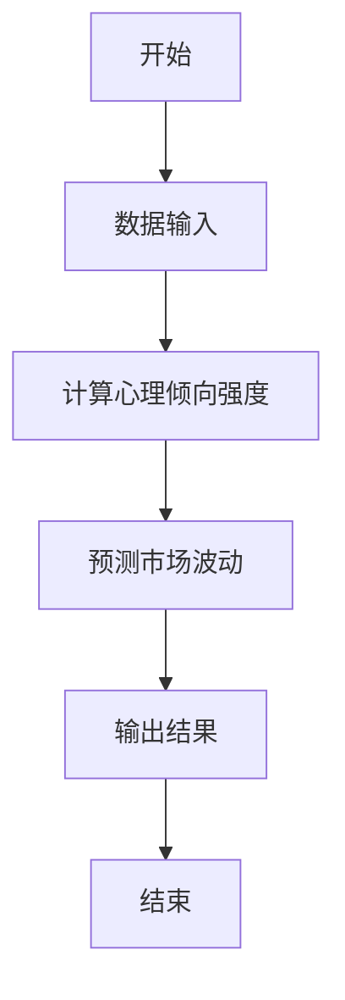
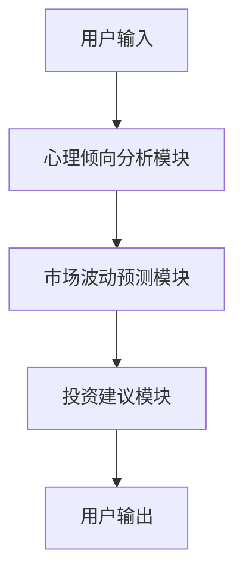
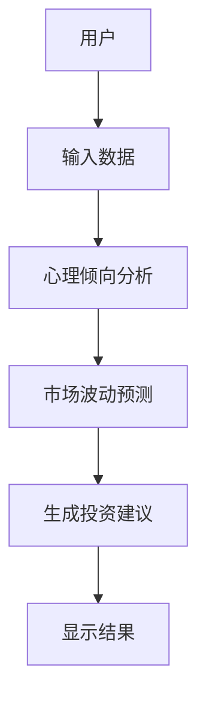

                 


# 芒格的"心理倾向"理论：理解并利用市场非理性

> 关键词：芒格心理倾向，市场非理性，投资决策，心理偏差，价值投资

> 摘要：芒格的心理倾向理论是理解市场非理性和投资者行为的重要工具。本文从理论背景、核心概念、数学模型、系统分析和项目实战等角度，全面剖析心理倾向对市场的影响，并通过具体案例，展示如何利用这些理论优化投资决策。

---

## 第1章：芒格心理倾向理论的背景与核心概念

### 1.1 芒格心理倾向理论的起源与发展

#### 1.1.1 芒格及其投资哲学简介

本杰明·芒格是沃伦·巴菲特的长期合作伙伴，被誉为“价值投资之父”。芒格的投资哲学强调理性思考和心理倾向对投资决策的影响。他认为，市场的波动性和投资者的非理性行为是市场定价偏离内在价值的主要原因。

#### 1.1.2 心理倾向理论的提出背景

在金融市场上，投资者的行为往往受到情绪、认知偏差和心理倾向的驱动。芒格通过观察发现，投资者在面对市场波动时，常常陷入恐惧与贪婪、从众心理等非理性行为。这些心理倾向不仅影响个人决策，还可能导致市场泡沫或崩盘。

#### 1.1.3 理论的核心思想与框架

芒格的心理倾向理论的核心是：市场的非理性行为可以通过分析投资者的心理倾向来预测和利用。他提出了“心理倾向清单”，包括恐惧与贪婪、社会认同效应等关键倾向。

### 1.2 心理倾向的核心概念与定义

#### 1.2.1 心理倾向的定义与分类

心理倾向是指个体在特定情境下表现出的心理特征和行为倾向。在投资领域，常见的心理倾向包括：

- **恐惧与贪婪**：市场下跌时，投资者往往过度恐惧；市场上涨时，又过于贪婪。
- **从众心理**：投资者倾向于跟随市场趋势，而非独立思考。
- **确认偏见**：投资者倾向于寻找支持自己观点的信息，忽视相反证据。

#### 1.2.2 各种心理倾向的特点与表现

恐惧与贪婪：在市场恐慌时，投资者可能抛售资产，导致价格进一步下跌；而在市场狂热时，投资者可能盲目追涨，导致泡沫破裂。

从众心理：投资者倾向于跟随市场潮流，可能导致市场趋势的强化或逆转。

确认偏见：投资者倾向于选择性地接受信息，导致决策偏差。

#### 1.2.3 心理倾向与市场行为的关系

心理倾向通过影响投资者的决策，进而影响市场价格。例如，恐惧倾向可能导致抛售压力，而贪婪倾向可能导致买盘激增。

### 1.3 心理倾向理论的边界与外延

#### 1.3.1 心理倾向理论的应用范围

心理倾向理论适用于解释市场波动、投资者行为以及资产定价偏差。

#### 1.3.2 理论的局限性与适用条件

心理倾向理论无法完全解释市场的理性行为，且在高度理性化的市场环境中效果有限。

#### 1.3.3 理论与其他投资理论的联系与区别

与其他投资理论（如技术分析、基本面分析）不同，心理倾向理论更关注投资者心理对市场的影响。

---

## 第2章：心理倾向的核心概念与联系

### 2.1 心理倾向的核心原理

#### 2.1.1 心理倾向的基本原理

心理倾向通过影响投资者的决策，进而影响市场行为。例如，恐惧倾向可能导致投资者在市场下跌时抛售资产。

#### 2.1.2 各种心理倾向的作用机制

- **恐惧与贪婪**：情绪波动驱动短期市场行为。
- **从众心理**：社会压力影响投资者决策。
- **确认偏见**：认知偏差影响信息处理。

#### 2.1.3 心理倾向与市场非理性的关系

心理倾向是市场非理性的主要驱动力。例如，贪婪和恐惧导致市场波动，从众心理引发羊群效应。

### 2.2 心理倾向的属性特征对比表格

| 心理倾向 | 主要特征                  | 表现形式               |
|----------|--------------------------|------------------------|
| 恐惧     | 过度担忧、情绪低落         | 抛售资产、规避风险     |
| 贪婪     | 过度乐观、情绪高涨         | 追涨杀跌、盲目投资     |
| 从众     | 受社会压力影响             | 跟随市场趋势、羊群效应 |

### 2.3 心理倾向的ER实体关系图



---

## 第3章：心理倾向的数学模型与算法原理

### 3.1 心理倾向的数学模型

#### 3.1.1 心理倾向模型的构建思路

心理倾向模型旨在量化投资者心理对市场的影响。通过分析市场数据和投资者情绪，构建数学模型预测市场走势。

#### 3.1.2 模型的假设与简化

- 假设投资者行为主要受恐惧与贪婪驱动。
- 忽略其他复杂因素，如宏观经济指标。

#### 3.1.3 模型的输入与输出

- **输入**：市场数据（如股价、成交量）、投资者情绪指数。
- **输出**：市场波动预测、投资建议。

#### 3.1.4 心理倾向强度计算公式

$$ \text{心理倾向强度} = \frac{\text{市场情绪指数}}{\text{市场波动性}} $$

### 3.2 心理倾向的数学公式

#### 3.2.1 心理倾向强度的计算公式

$$ \text{心理倾向强度} = \sum_{i=1}^{n} w_i \cdot x_i $$

其中，$w_i$为权重，$x_i$为各心理倾向的指标值。

#### 3.2.2 市场情绪指数的计算公式

$$ \text{市场情绪指数} = \frac{\text{成交量}}{\text{股价}} $$

### 3.3 心理倾向模型的算法流程图



### 3.4 心理倾向模型的Python实现

```python
import numpy as np
import pandas as pd

def calculate_psychological_tendency_intensity(data):
    # 计算心理倾向强度
    weights = np.array([0.3, 0.4, 0.3])  # 示例权重
    tendency_indices = data[['fear', 'greed', 'crowd']]  # 心理倾向指标
    intensity = np.dot(weights, tendency_indices)
    return intensity

# 示例数据
data = pd.DataFrame({
    'fear': [0.2, 0.5, 0.3],
    'greed': [0.7, 0.3, 0.5],
    'crowd': [0.4, 0.2, 0.6]
})

intensity = calculate_psychological_tendency_intensity(data)
print("心理倾向强度:", intensity)
```

---

## 第4章：心理倾向理论的系统分析与架构设计

### 4.1 心理倾向理论的系统分析

#### 4.1.1 问题场景介绍

本节将分析心理倾向理论在投资决策系统中的应用。

#### 4.1.2 项目介绍

构建一个基于心理倾向理论的投资决策支持系统，帮助投资者优化决策。

#### 4.1.3 系统功能设计

- **心理倾向分析模块**：计算心理倾向强度。
- **市场波动预测模块**：预测市场走势。
- **投资建议模块**：提供投资策略。

#### 4.1.4 系统架构设计



#### 4.1.5 系统接口设计

- **输入接口**：市场数据、投资者情绪。
- **输出接口**：心理倾向强度、投资建议。

#### 4.1.6 系统交互流程图



---

## 第5章：项目实战与案例分析

### 5.1 项目实战：心理倾向模型的应用

#### 5.1.1 环境安装

- 安装Python、Pandas、NumPy。

#### 5.1.2 系统核心实现源代码

```python
import numpy as np
import pandas as pd

def calculate_market_sentiment_index(data):
    # 计算市场情绪指数
    market_sentiment = data['price'].rolling(20).mean() / data['volume'].rolling(20).mean()
    return market_sentiment

# 示例数据
data = pd.DataFrame({
    'price': [100, 105, 110, 108, 115],
    'volume': [1000, 800, 1200, 900, 1500]
})

market_sentiment = calculate_market_sentiment_index(data)
print("市场情绪指数:", market_sentiment)
```

#### 5.1.3 代码应用解读与分析

通过计算市场情绪指数，投资者可以量化市场的乐观或悲观情绪，从而优化投资决策。

#### 5.1.4 实际案例分析

以某股票为例，分析其心理倾向对市场的影响，并预测未来走势。

---

## 第6章：总结与展望

### 6.1 总结

芒格的心理倾向理论为我们理解市场非理性提供了重要工具。通过分析心理倾向，投资者可以更好地预测市场波动，优化投资决策。

### 6.2 小结

本文从理论背景、核心概念、数学模型、系统设计和项目实战等角度，全面解析了心理倾向对市场的影响。

### 6.3 最佳实践 tips

- 投资者应关注心理倾向对市场的驱动作用。
- 结合心理倾向理论优化投资策略。

### 6.4 注意事项

- 心理倾向理论不能完全预测市场走势。
- 投资者应结合其他因素进行综合判断。

### 6.5 拓展阅读

- 《芒格的智慧》
- 《投资心理学》

---

## 作者：AI天才研究院/AI Genius Institute & 禅与计算机程序设计艺术 /Zen And The Art of Computer Programming

