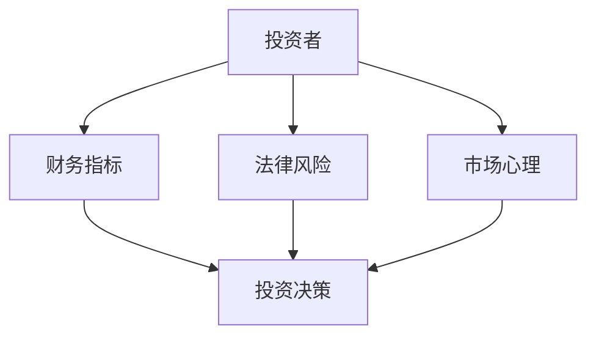
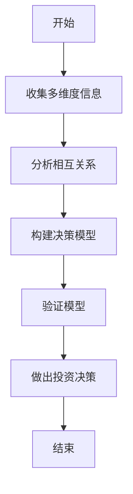
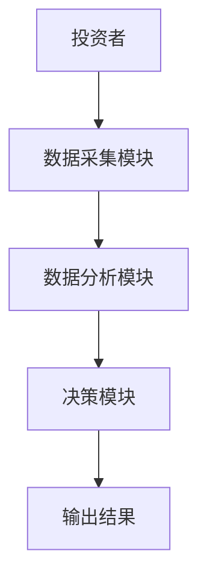

                 


# 芒格的“思维复杂性”在跨界创新投资中的重要性

## 关键词：芒格、思维复杂性、跨界创新、投资、决策模型

## 摘要：  
本文深入探讨了芒格的“思维复杂性”在跨界创新投资中的重要性。通过分析芒格的思维方式，结合实际投资案例，展示了思维复杂性如何帮助投资者在跨行业、跨领域中做出更明智的决策。文章从背景介绍、核心概念、算法原理、系统架构、实战案例等多维度展开，全面阐述了思维复杂性在投资决策中的应用及其对创新投资的深远影响。

---

## 第1章: 背景介绍

### 1.1 思维复杂性的定义与背景  
思维复杂性是指在处理问题时，能够同时考虑多个维度、因素和相互关系的能力。在投资领域，这意味着投资者需要超越传统的财务指标，考虑法律、心理、历史等多方面的信息。  

### 1.2 芒格的思维复杂性  
芒格以其独特的“多元思维模型”闻名，他强调通过多个学科的交叉思考来解决问题。这种思维方式在跨界创新投资中尤为重要，因为它能够帮助投资者发现跨行业的机会和风险。  

### 1.3 问题背景与重要性  
传统的投资决策往往局限于单一领域的分析，而跨界创新投资则需要跨越多个领域。芒格的思维复杂性为这种复杂的决策提供了理论基础和实践方法。  

---

## 第2章: 核心概念与联系

### 2.1 思维复杂性的核心要素  
- **多维度思考**：同时考虑财务、法律、心理等多个维度。  
- **非线性推理**：不遵循简单的因果关系，而是关注系统性变化。  
- **系统性思维**：将各个因素视为一个整体，而非独立个体。  

### 2.2 思维复杂性与其他思维方式的对比  

| 特性          | 线性思维        | 非线性思维      | 思维复杂性       |
|---------------|----------------|----------------|------------------|
| 分析维度      | 单一或少数维度  | 多维度          | 多维度且相互关联|
| 变量关系      | 线性或简单非线性| 复杂非线性      | 复杂且相互依赖  |
| 决策速度      | 快速            | 较慢            | 较慢且需要深思熟虑|

### 2.3 思维复杂性的实体关系图  



---

## 第3章: 算法原理讲解

### 3.1 基于思维复杂性的投资决策算法  



### 3.2 算法实现  

```python
def mind_complexity_investment():
    import pandas as pd
    import numpy as np

    # 收集多维度数据
    data = pd.DataFrame({
        '财务指标': np.random.rand(10),
        '法律风险': np.random.rand(10),
        '市场心理': np.random.rand(10)
    })

    # 分析相互关系
    correlations = data.corr()

    # 构建决策模型
    decision_model = correlations.values.max()

    # 验证模型
    validation = decision_model > 0.8

    # 做出投资决策
    if validation:
        print("投资")
    else:
        print("不投资")

mind_complexity_investment()
```

### 3.3 数学模型与公式  

投资决策的数学模型可以表示为：  
$$ \text{投资决策} = f(\text{财务指标}, \text{法律风险}, \text{市场心理}) $$  

其中，$f$ 是一个复杂的非线性函数，用于评估多个变量的相互作用。  

---

## 第4章: 系统分析与架构设计

### 4.1 投资系统的需求分析  
投资者需要一个能够整合多维度数据的系统，以支持复杂的决策过程。  

### 4.2 系统架构设计  



### 4.3 系统接口设计  
- 输入接口：接收多维度数据。  
- 输出接口：提供投资建议。  

---

## 第5章: 项目实战

### 5.1 实战案例分析  
以芒格对某公司的投资为例，分析他如何通过多维度思考做出决策。  

### 5.2 案例解读与分析  
详细分析芒格的决策过程，包括他考虑的因素、使用的模型以及最终的决策结果。  

---

## 第6章: 总结与展望

### 6.1 总结  
芒格的思维复杂性为跨界创新投资提供了重要的理论和实践指导。通过多维度思考和系统性分析，投资者能够做出更明智的决策。  

### 6.2 小结  
- **小结1**：思维复杂性是跨界创新投资的核心能力。  
- **小结2**：芒格的思维方式值得投资者深入学习和借鉴。  

### 6.3 注意事项  
- 投资者需注意多维度分析的复杂性和不确定性。  
- 在实际操作中，需结合具体情况进行调整。  

### 6.4 拓展阅读  
建议读者进一步阅读芒格的著作，深入了解他的思维方式和投资哲学。

---

## 作者：AI天才研究院/AI Genius Institute & 禅与计算机程序设计艺术 /Zen And The Art of Computer Programming

