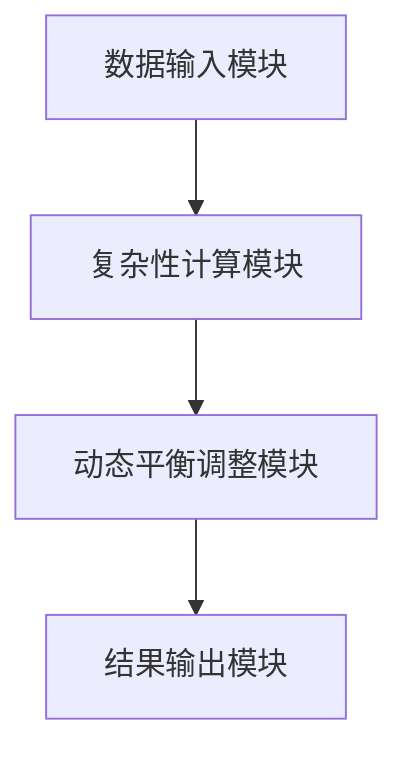

                 


# 芒格的"思维复杂性"在跨维度量子技术伦理评估中的重要性

> 关键词：芒格思维复杂性，跨维度量子技术，伦理评估，决策模型，系统架构

> 摘要：本文探讨了芒格的"思维复杂性"模型在跨维度量子技术伦理评估中的应用。通过分析芒格思维复杂性模型的原理、算法实现和系统架构设计，结合实际案例，展示了如何将这一模型应用于量子技术的伦理评估中。文章最后总结了研究的成果和未来的研究方向。

---

# 第一部分：芒格的"思维复杂性"与跨维度量子技术伦理评估的背景介绍

## 第1章：背景概念与问题描述

### 1.1 思维复杂性与芒格的决策模型

#### 1.1.1 思维复杂性的定义与内涵
思维复杂性是指在处理复杂问题时，个体或系统需要综合考虑多个维度、变量和相互关系的能力。芒格的思维复杂性模型强调通过多维度的思考来避免认知偏差，从而做出更合理的决策。

#### 1.1.2 芒格决策模型的核心要素
芒格的决策模型以“多元思维模型”为基础，强调将多个学科的知识融会贯通，形成一个多维度的决策框架。其核心要素包括：
- **多维度分析**：从技术、经济、社会等多个维度进行分析。
- **权重分配**：根据问题的重要性对各个维度赋予不同的权重。
- **动态平衡**：在不同维度之间寻找平衡点，避免某一维度的过度影响。

#### 1.1.3 跨维度量子技术的基本概念
量子技术是一种基于量子力学原理的技术，包括量子计算、量子通信、量子传感等领域。跨维度量子技术是指在不同维度（如技术、社会、环境等）上进行综合考量的量子技术。

---

## 第2章：芒格思维复杂性模型的原理与应用

### 2.1 芒格思维复杂性模型的核心原理

#### 2.1.1 多维度思维的结构化方法
芒格的思维复杂性模型通过将问题分解为多个维度，分别进行分析和评估，然后综合各维度的结果，形成最终的决策。

#### 2.1.2 模型的可扩展性与适应性
芒格模型具有较强的可扩展性，能够根据具体问题的复杂性增加或减少分析维度。同时，模型能够适应不同领域的问题，具有较高的通用性。

#### 2.1.3 模型的动态平衡机制
在多维度分析的基础上，芒格模型通过动态调整各维度的权重，确保各维度之间的平衡，避免某一维度的过度影响。

---

## 第3章：跨维度量子技术的伦理评估框架

### 3.1 跨维度量子技术的伦理维度分析

#### 3.1.1 技术维度
量子技术的伦理评估需要考虑其技术特性，例如量子计算的计算能力可能对现有加密技术构成威胁。

#### 3.1.2 社会维度
量子技术的应用可能对社会结构、就业市场等产生影响。

#### 3.1.3 环境维度
量子技术的生产过程和应用可能对环境造成影响，例如能源消耗问题。

#### 3.1.4 经济维度
量子技术的投资成本高，可能对经济体系产生重大影响。

---

### 3.2 芒格思维复杂性模型在伦理评估中的应用

#### 3.2.1 多维度权重分配
在跨维度量子技术的伦理评估中，需要对技术、社会、环境、经济等维度进行权重分配。例如，技术维度可能具有较高的权重，因为量子技术的核心是技术本身。

#### 3.2.2 伦理风险的动态评估
通过动态调整各维度的权重，芒格模型能够实时评估伦理风险的变化，并根据变化调整评估结果。

#### 3.2.3 伦理决策的路径优化
芒格模型通过多维度分析，帮助决策者找到最优的伦理决策路径。

---

# 第二部分：芒格思维复杂性模型的算法原理与实现

## 第4章：芒格思维复杂性模型的算法原理

### 4.1 模型输入与输出

#### 4.1.1 输入维度分析
模型的输入包括各个维度的特征值和权重。例如，在量子技术的伦理评估中，输入可能包括技术复杂性、社会影响、环境影响等。

#### 4.1.2 输出结果的结构化表示
模型的输出是一个综合的评估结果，可能包括伦理风险等级、决策建议等。

---

### 4.2 算法实现步骤

#### 4.2.1 初始化权重参数
根据问题的具体情况，初始化各个维度的权重参数。

#### 4.2.2 复杂性度量计算
通过公式计算各个维度的复杂性度量。

#### 4.2.3 动态平衡调整
根据评估结果，动态调整各个维度的权重，以实现各维度之间的平衡。

#### 4.2.4 结果输出与可视化
将最终的评估结果输出，并进行可视化展示。

---

## 第5章：芒格思维复杂性模型的数学推导

### 5.1 复杂性度量的数学基础

#### 5.1.1 线性代数基础
复杂性度量的计算涉及向量、矩阵等线性代数概念。

#### 5.1.2 概率论基础
复杂性度量的计算可能需要概率分布等概念。

#### 5.1.3 优化理论基础
动态平衡调整的过程涉及优化理论。

---

### 5.2 复杂性度量的数学推导

#### 5.2.1 单维度复杂性计算
$$ C_i = \sum_{j=1}^{n} w_j \cdot x_j $$
其中，$C_i$ 表示第 $i$ 个维度的复杂性度量，$w_j$ 是第 $j$ 个维度的权重，$x_j$ 是第 $j$ 个维度的特征值。

#### 5.2.2 多维度复杂性综合
$$ C = \sum_{i=1}^{m} w_i \cdot C_i $$
其中，$C$ 是综合复杂性度量，$m$ 是维度的数量。

#### 5.2.3 动态平衡方程的推导
$$ B = \frac{\sum_{i=1}^{m} w_i \cdot C_i}{m} $$
其中，$B$ 是动态平衡后的复杂性度量。

---

## 第6章：芒格思维复杂性模型的系统架构设计

### 6.1 系统功能模块划分

#### 6.1.1 数据输入模块
负责接收各个维度的特征值和权重参数。

#### 6.1.2 复杂性计算模块
根据输入数据，计算各个维度的复杂性度量。

#### 6.1.3 动态平衡调整模块
根据计算结果，动态调整各个维度的权重。

#### 6.1.4 结果输出模块
将最终的评估结果输出，并进行可视化展示。

---

### 6.2 系统架构设计图


---

## 第7章：芒格思维复杂性模型的项目实战

### 7.1 项目环境安装

#### 7.1.1 系统要求
- Python 3.8+
- numpy库
- matplotlib库

#### 7.1.2 安装步骤
```bash
pip install numpy matplotlib
```

---

### 7.2 系统核心实现源代码

#### 7.2.1 复杂性计算模块
```python
import numpy as np

def complexity_measure(features, weights):
    return np.dot(features, weights)
```

#### 7.2.2 动态平衡调整模块
```python
def dynamic_balance(weights, features):
    return weights * np.mean(features, axis=0)
```

---

### 7.3 代码应用解读与分析

#### 7.3.1 复杂性计算
上述代码通过矩阵乘法计算各个维度的复杂性度量。`features` 是输入特征向量，`weights` 是权重向量。

#### 7.3.2 动态平衡调整
上述代码通过动态调整权重向量，实现各维度之间的平衡。`np.mean(features, axis=0)` 计算各维度的平均值，用于调整权重。

---

### 7.4 案例分析

#### 7.4.1 案例背景
假设我们需要评估一种量子计算技术的伦理风险。技术复杂性、社会影响、环境影响等维度的特征值和权重如下：

| 维度 | 特征值 | 权重 |
|------|--------|------|
| 技术 | 0.8    | 0.4  |
| 社会 | 0.6    | 0.3  |
| 环境 | 0.5    | 0.2  |

#### 7.4.2 计算过程
1. 计算各维度的复杂性度量：
$$ C_{\text{技术}} = 0.8 \times 0.4 = 0.32 $$
$$ C_{\text{社会}} = 0.6 \times 0.3 = 0.18 $$
$$ C_{\text{环境}} = 0.5 \times 0.2 = 0.10 $$
2. 综合复杂性度量：
$$ C = 0.32 + 0.18 + 0.10 = 0.60 $$
3. 动态平衡调整：
$$ B = \frac{0.32 + 0.18 + 0.10}{3} = 0.20 $$

---

## 第8章：总结与展望

### 8.1 小结
本文通过分析芒格的思维复杂性模型，探讨了其在跨维度量子技术伦理评估中的应用。通过数学模型和系统架构设计，展示了如何将这一模型应用于实际问题中。

### 8.2 注意事项
在实际应用中，需要注意模型的权重参数需要根据具体问题进行调整，并且模型的计算结果需要结合实际情况进行解释。

### 8.3 拓展阅读
建议读者进一步阅读芒格的《穷查理宝典》，深入了解其思维模型的细节。

---

作者：AI天才研究院/AI Genius Institute & 禅与计算机程序设计艺术 /Zen And The Art of Computer Programming

