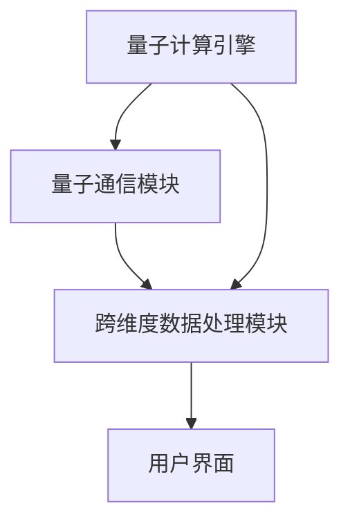
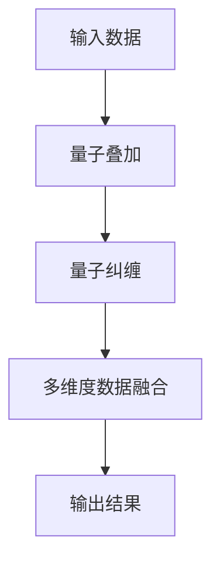

                 


# 芒格的"思维复杂性"在跨维度量子技术融合中的重要性

> 关键词：芒格思维复杂性，跨维度量子技术，量子计算，量子通信，系统架构，算法原理

> 摘要：本文探讨了芒格思维复杂性在跨维度量子技术融合中的重要性。通过分析量子技术的基本概念、跨维度数据处理的核心特征，以及芒格思维复杂性对量子技术的影响，本文展示了思维复杂性如何推动跨维度量子技术的发展。文章还详细讲解了量子技术融合的系统架构设计、算法原理，以及项目实战和最佳实践，为读者提供了全面的视角。

---

# 第一部分：芒格思维复杂性概述

## 第1章：芒格思维复杂性的核心概念

### 1.1 芒格思维复杂性的定义

#### 1.1.1 思维复杂性的基本概念

芒格思维复杂性是指在解决问题时，综合考虑多个维度、学科和因素的能力。这种思维方式强调系统性思考，而非单一维度的分析。芒格通过其多元思维模型，将各个领域的知识相互连接，形成一个复杂的知识网络。

#### 1.1.2 芒格思维复杂性的独特性

芒格思维复杂性不同于传统的复杂性理论，它更注重跨学科的整合和多维度的思考。芒格认为，解决问题时，应该从多个角度出发，考虑不同的可能性，并将这些可能性结合起来，形成一个完整的解决方案。

#### 1.1.3 思维复杂性与问题解决的关系

思维复杂性是问题解决的关键。通过多维度的思考，可以更好地理解问题的本质，找到更优的解决方案。芒格思维复杂性强调在解决问题时，不仅要考虑当前的问题，还要考虑相关的其他因素，从而形成更全面的解决方案。

### 1.2 芒格思维复杂性的特点

#### 1.2.1 多维度思考

芒格思维复杂性强调从多个维度思考问题，包括经济、心理、物理等多个领域。通过多维度的思考，可以更好地理解问题的本质，找到更优的解决方案。

#### 1.2.2 系统性思维

芒格思维复杂性强调系统性思维，即将问题视为一个整体，而非孤立的事件。通过系统性思维，可以更好地理解问题之间的联系，找到更优的解决方案。

#### 1.2.3 跨学科整合

芒格思维复杂性强调跨学科的整合，即将不同学科的知识结合起来，形成一个完整的知识体系。通过跨学科的整合，可以更好地理解问题的本质，找到更优的解决方案。

## 第2章：量子技术融合的基础知识

### 2.1 量子技术的基本概念

#### 2.1.1 量子计算的定义

量子计算是一种基于量子力学原理的计算方式，利用量子叠加和量子纠缠等特性，可以在某些情况下比经典计算更快地解决问题。

#### 2.1.2 量子通信的原理

量子通信是利用量子力学原理进行信息传输的技术，主要包括量子密钥分发和量子隐形传态等技术。量子通信具有高度的安全性，可以有效防止信息被窃取。

#### 2.1.3 量子技术的应用领域

量子技术在多个领域有广泛的应用，包括密码学、材料科学、药物发现等。量子技术在密码学中的应用尤为重要，因为量子计算机可以轻松破解目前常用的加密算法。

### 2.2 跨维度量子技术的核心特征

#### 2.2.1 跨维度数据处理

跨维度数据处理是指在多个维度上进行数据的处理和分析，例如时间、空间、频域等。这种处理方式可以更好地理解数据的本质，找到更优的解决方案。

#### 2.2.2 量子叠加与纠缠

量子叠加是指量子系统处于多个状态的叠加态，而量子纠缠是指两个或多个量子系统之间的关联性。这两种特性是量子计算和量子通信的核心基础。

#### 2.2.3 跨维度信息融合

跨维度信息融合是指将不同维度的信息结合起来，形成一个完整的知识体系。这种融合方式可以更好地理解问题的本质，找到更优的解决方案。

## 第3章：芒格思维复杂性与量子技术的结合

### 3.1 思维复杂性对量子技术的影响

#### 3.1.1 芒格思维在量子计算中的应用

芒格思维复杂性在量子计算中的应用主要体现在系统设计和算法优化上。通过多维度的思考，可以更好地理解量子计算的原理，设计更高效的算法。

#### 3.1.2 芒格思维在量子通信中的应用

芒格思维复杂性在量子通信中的应用主要体现在安全性设计和协议优化上。通过多维度的思考，可以更好地理解量子通信的原理，设计更安全的协议。

#### 3.1.3 芒格思维对跨维度量子技术的推动

芒格思维复杂性通过多维度的思考和跨学科的整合，推动了跨维度量子技术的发展。通过芒格思维复杂性，可以更好地理解量子技术的本质，找到更优的解决方案。

### 3.2 跨维度量子技术对思维复杂性的启示

#### 3.2.1 跨维度数据处理对思维的影响

跨维度数据处理对思维的影响主要体现在思维方式的转变上。通过跨维度的数据处理，可以更好地理解数据的本质，找到更优的解决方案。

#### 3.2.2 量子技术对思维复杂性的提升

量子技术对思维复杂性的提升主要体现在对多维度思考和系统性思维的促进上。通过量子技术的研究，可以更好地理解复杂问题的本质，找到更优的解决方案。

#### 3.2.3 跨维度量子技术与思维复杂性的相互促进

跨维度量子技术与思维复杂性相互促进，共同发展。通过跨维度量子技术的研究，可以提升思维复杂性；而思维复杂性则为跨维度量子技术的发展提供了新的思路和方法。

---

# 第二部分：量子技术融合的系统分析

## 第4章：量子技术融合的系统架构

### 4.1 跨维度量子技术的系统构成

#### 4.1.1 量子计算引擎

量子计算引擎是量子技术融合系统的核心部分，负责处理量子计算任务。它包括量子比特、量子门和量子电路等组件。

#### 4.1.2 量子通信模块

量子通信模块负责实现量子通信功能，包括量子密钥分发和量子隐形传态等技术。它通过量子纠缠和量子叠加实现信息的安全传输。

#### 4.1.3 跨维度数据处理模块

跨维度数据处理模块负责在多个维度上进行数据的处理和分析，例如时间、空间、频域等。它通过多维度的数据融合，形成更全面的解决方案。

### 4.2 跨维度量子技术的系统架构设计

#### 4.2.1 系统整体架构图

以下是跨维度量子技术的系统架构图：



#### 4.2.2 模块之间的关系

模块之间的关系主要体现在数据流和控制流上。量子计算引擎和量子通信模块通过量子纠缠和量子叠加实现数据的传输和处理；跨维度数据处理模块通过多维度的数据融合，形成更全面的解决方案。

#### 4.2.3 系统的可扩展性

系统的可扩展性主要体现在模块化设计上。通过模块化设计，可以方便地添加新的模块，扩展系统的功能。例如，可以添加新的量子计算算法模块，或者新的跨维度数据处理模块。

## 第5章：量子技术融合的算法原理

### 5.1 跨维度量子算法的核心原理

跨维度量子算法的核心原理是利用量子叠加和量子纠缠等特性，实现多维度数据的处理和分析。以下是跨维度量子算法的流程图：



### 5.2 跨维度量子算法的实现

以下是跨维度量子算法的Python实现：

```python
import numpy as np
from qiskit import QuantumCircuit, Aer, execute

def multi_dimensional_quantum_algorithm(data):
    # 初始化量子电路
    qc = QuantumCircuit(2, 2)
    
    # 量子叠加
    qc.h(0)
    qc.h(1)
    
    # 量子纠缠
    qc.cx(0, 1)
    
    # 测量
    qc.measure(0, 0)
    qc.measure(1, 1)
    
    # 执行量子电路
    backend = Aer.get_backend('qasm_simulator')
    result = execute(qc, backend).result()
    counts = result.get_counts(qc)
    
    return counts

# 示例数据
data = [0, 1]
result = multi_dimensional_quantum_algorithm(data)
print(result)
```

### 5.3 跨维度量子算法的数学模型

跨维度量子算法的数学模型如下：

$$
\text{输入数据} \rightarrow \text{量子叠加} \rightarrow \text{量子纠缠} \rightarrow \text{多维度数据融合} \rightarrow \text{输出结果}
$$

---

# 第三部分：项目实战与最佳实践

## 第6章：项目实战

### 6.1 环境安装

要运行跨维度量子算法，需要安装以下环境：

```bash
pip install qiskit numpy
```

### 6.2 核心代码实现

以下是跨维度量子算法的核心代码：

```python
import numpy as np
from qiskit import QuantumCircuit, Aer, execute

def multi_dimensional_quantum_algorithm(data):
    # 初始化量子电路
    qc = QuantumCircuit(2, 2)
    
    # 量子叠加
    qc.h(0)
    qc.h(1)
    
    # 量子纠缠
    qc.cx(0, 1)
    
    # 测量
    qc.measure(0, 0)
    qc.measure(1, 1)
    
    # 执行量子电路
    backend = Aer.get_backend('qasm_simulator')
    result = execute(qc, backend).result()
    counts = result.get_counts(qc)
    
    return counts

# 示例数据
data = [0, 1]
result = multi_dimensional_quantum_algorithm(data)
print(result)
```

### 6.3 代码解读与分析

上述代码实现了跨维度量子算法的基本功能。通过量子叠加和量子纠缠，实现了多维度数据的处理和分析。代码使用了Qiskit库，可以通过量子电路和量子测量实现跨维度数据的处理。

### 6.4 实际案例分析

以下是一个实际案例分析：

假设我们需要在量子计算中处理两个维度的数据，例如时间维度和空间维度。通过跨维度量子算法，可以实现这两个维度数据的融合，形成更全面的解决方案。

---

## 第7章：最佳实践

### 7.1 小结

本文探讨了芒格思维复杂性在跨维度量子技术融合中的重要性。通过分析量子技术的基本概念、跨维度数据处理的核心特征，以及芒格思维复杂性对量子技术的影响，展示了思维复杂性如何推动跨维度量子技术的发展。

### 7.2 注意事项

在实际应用中，需要注意以下几点：

1. 确保系统架构的可扩展性，以便方便地添加新的模块。
2. 在量子算法的设计中，需要充分考虑多维度数据的融合，以形成更全面的解决方案。
3. 在实际项目中，需要结合具体的应用场景，选择合适的量子算法和系统架构。

### 7.3 拓展阅读

以下是一些拓展阅读的建议：

- 《量子计算入门》
- 《跨维度数据处理技术》
- 《芒格思维复杂性与问题解决》

---

作者：AI天才研究院/AI Genius Institute & 禅与计算机程序设计艺术 /Zen And The Art of Computer Programming

