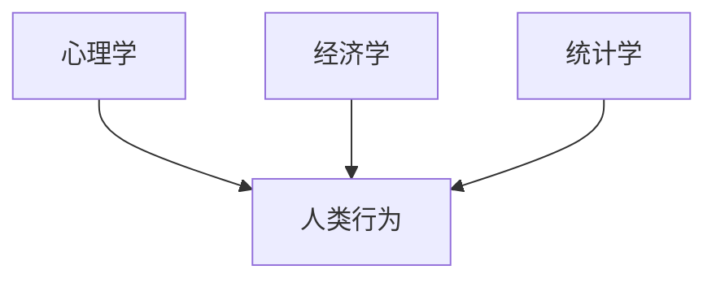
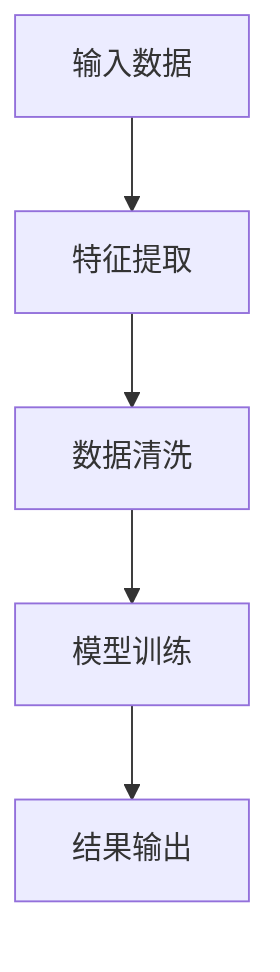
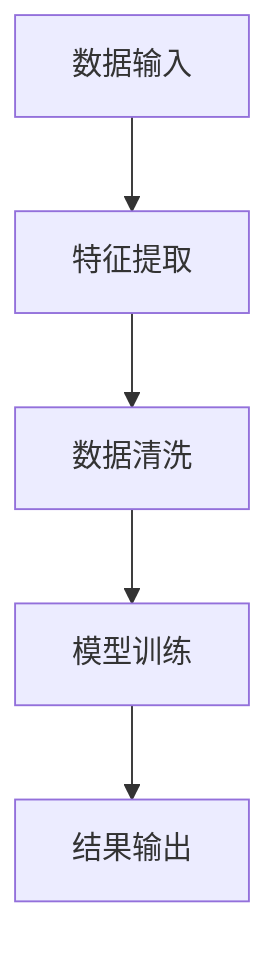
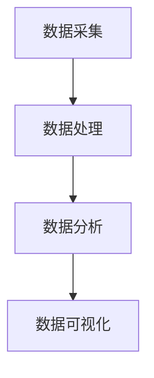
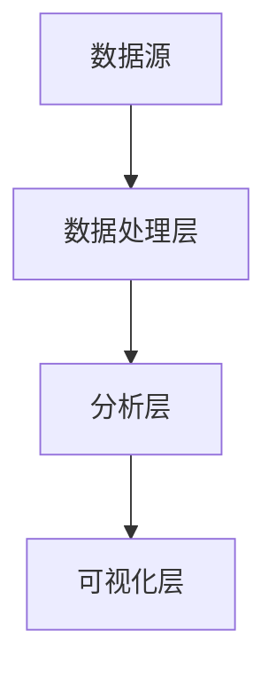

                 


# 芒格的"思维格栅"在大数据分析中的运用

> 关键词：芒格思维格栅、大数据分析、算法实现、系统架构、项目实战

> 摘要：本文探讨了芒格的“思维格栅”在大数据分析中的应用，通过分析其核心概念、算法原理、系统架构及项目实战，详细阐述了如何利用芒格的多学科思维模型提升大数据分析的效率与准确性。

---

# 第1章 芒格思维格栅的背景与核心概念

## 1.1 芒格思维格栅的定义与特点

芒格思维格栅是一种多维度的思维框架，由巴菲特的合作伙伴查理·芒格提出，旨在通过整合多个学科的知识，帮助人们更全面地理解和分析问题。其特点包括：

- **多学科性**：整合心理学、经济学、统计学等多学科知识。
- **系统性**：强调整体思维，避免单一视角。
- **实用性**：通过简化和提炼，提供可操作的决策工具。

## 1.2 大数据分析的背景与挑战

### 1.2.1 大数据分析的定义与特点
大数据分析是指对海量、多样化、高速度的数据进行处理、分析和挖掘，以提取有价值的信息和洞察。其特点包括数据量大（Volume）、数据类型多样（Variety）、数据处理速度快（Velocity）。

### 1.2.2 大数据分析的核心技术
- 数据采集：从各种来源（如数据库、日志、传感器等）获取数据。
- 数据清洗：去除噪音数据，确保数据质量。
- 数据分析：使用统计学、机器学习等方法进行分析。
- 数据可视化：通过图表等形式展示分析结果。

### 1.2.3 芒格思维格栅与大数据分析的结合
芒格思维格栅提供了一种系统性的分析框架，能够帮助大数据分析从业者从多个维度理解问题，避免片面决策。

---

# 第2章 芒格思维格栅的核心概念与联系

## 2.1 芒格思维格栅的核心概念

### 2.1.1 格栅模型的构成
芒格思维格栅由多个“格子”组成，每个格子代表一种思维方式或学科视角。例如：
- **心理学格子**：理解人类行为动机。
- **经济学格子**：分析经济规律。
- **统计学格子**：处理数据关系。

### 2.1.2 格栅模型的属性特征对比表

| 格子类型   | 主要特征                     |
|------------|------------------------------|
| 心理学     | 研究人类行为动机             |
| 经济学     | 分析经济规律                 |
| 统计学     | 处理数据关系                 |

### 2.1.3 格栅模型的ER实体关系图



## 2.2 芒格思维格栅的算法原理

### 2.2.1 格栅模型的算法流程图



### 2.2.2 格栅模型的数学模型

$$
\text{模型输出} = f(\text{输入特征})
$$

其中，$f$ 是格栅模型的函数。

---

# 第3章 芒格思维格栅在大数据分析中的算法实现

## 3.1 算法原理

### 3.1.1 格栅模型的算法流程



### 3.1.2 格栅模型的数学模型

$$
\text{特征相似度} = \frac{\sum_{i=1}^{n} |x_i - y_i|}{n}
$$

## 3.2 算法实现

### 3.2.1 环境安装

```bash
pip install numpy pandas scikit-learn
```

### 3.2.2 核心代码实现

```python
import numpy as np
from sklearn.tree import DecisionTreeClassifier

def create_grids_model():
    model = DecisionTreeClassifier()
    return model

def train_model(model, X, y):
    model.fit(X, y)
    return model

# 示例数据
X = np.array([[1, 2], [3, 4], [5, 6]])
y = np.array([0, 1, 0])

model = create_grids_model()
trained_model = train_model(model, X, y)
```

---

# 第4章 芒格思维格栅在大数据分析中的系统架构

## 4.1 系统架构设计

### 4.1.1 系统功能设计



### 4.1.2 系统架构图



---

# 第5章 项目实战：基于芒格思维格栅的客户画像分析

## 5.1 项目背景

通过分析电商客户的购买行为，构建客户画像，帮助企业精准营销。

## 5.2 数据清洗与特征提取

```python
import pandas as pd

# 示例数据
data = {'age': [25, 35, 45, 55],
        'income': [50000, 60000, 70000, 80000],
        'purchase': [1, 0, 1, 0]}
df = pd.DataFrame(data)
```

## 5.3 模型训练与结果分析

```python
from sklearn.model_selection import train_test_split

X = df[['age', 'income']]
y = df['purchase']

X_train, X_test, y_train, y_test = train_test_split(X, y, test_size=0.2)

model = create_grids_model()
trained_model = train_model(model, X_train, y_train)

print("Accuracy:", model.score(X_test, y_test))
```

---

# 第6章 最佳实践与小结

## 6.1 小结

芒格思维格栅为大数据分析提供了多维度的分析框架，能够帮助从业者更全面地理解问题。

## 6.2 注意事项

- 数据质量是分析的基础。
- 模型选择需结合实际场景。

## 6.3 拓展阅读

建议阅读《芒格的思维方法》和《大数据分析实战》。

---

作者：AI天才研究院/AI Genius Institute & 禅与计算机程序设计艺术/Zen And The Art of Computer Programming

