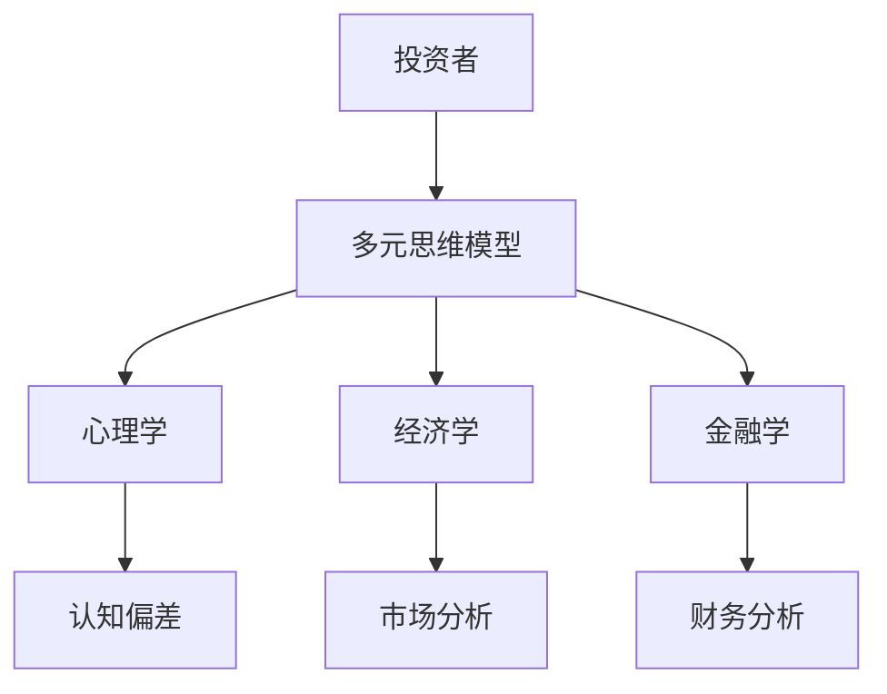
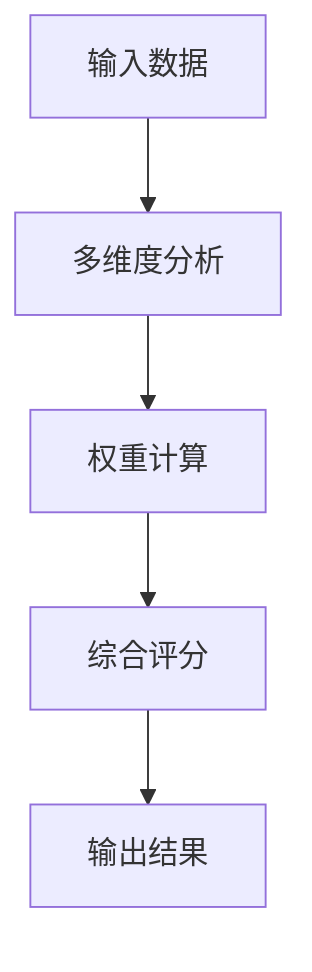

                 


# 芒格的"思维格栅"：构建全面的投资分析框架

---

## 关键词：
芒格、思维格栅、多元思维模型、投资分析、心理学、认知偏差、风险管理

---

## 摘要：
本文围绕芒格的“思维格栅”这一核心概念，详细阐述了其在投资分析中的应用。通过构建多元思维模型，结合心理学和认知偏差的分析，提出了一个全面的投资分析框架。文章从思维格栅的背景与概述出发，逐步深入分析其核心概念、算法原理、系统架构设计以及项目实战，并通过实际案例验证其有效性。最后，结合最佳实践，总结了思维格栅在投资分析中的应用价值。

---

## 第1章: 芒格的"思维格栅"背景与概述

### 1.1 思维格栅的定义与核心概念
#### 1.1.1 思维格栅的定义
思维格栅（Mental Lattice）是芒格提出的一种投资分析方法，旨在通过多学科的交叉分析，构建一个全面的投资决策框架。它不同于传统的单一分析方法，而是通过多个领域的知识交叉，形成一个立体的分析网络。

#### 1.1.2 格栅模型的核心要素
格栅模型的核心要素包括：
1. **多元思维模型**：涵盖心理学、经济学、金融学等多个领域的知识框架。
2. **认知偏差**：对投资者心理的深刻理解，避免决策中的常见错误。
3. **决策框架**：基于格栅模型的多维度分析，形成科学的投资决策流程。

#### 1.1.3 思维格栅与传统投资分析的区别
传统投资分析往往依赖单一的财务指标或市场分析，而思维格栅则强调多维度的交叉分析，注重心理因素和认知偏差的影响。

---

### 1.2 芒格的多元思维模型
#### 1.2.1 多元思维模型的起源
多元思维模型源于芒格对知识的广泛涉猎和对投资实践中常见错误的总结。他提出，投资者需要掌握多个领域的基本原理，才能避免单一视角的局限性。

#### 1.2.2 多元思维模型的核心思想
多元思维模型的核心思想是：通过多学科的交叉分析，找到问题的共性规律，从而做出更全面的投资决策。

#### 1.2.3 多元思维模型在投资中的应用
多元思维模型在投资中的应用包括：
1. **财务分析**：结合会计学、经济学原理分析企业的财务状况。
2. **心理学分析**：理解市场参与者的心理行为，避免情绪化决策。
3. **行业分析**：结合行业特点和竞争格局，评估企业的投资价值。

---

### 1.3 投资分析框架的背景与问题背景
#### 1.3.1 投资分析的传统方法与局限性
传统投资分析方法往往依赖于单一的财务指标或市场趋势分析，容易忽视心理因素和认知偏差的影响。

#### 1.3.2 多元思维模型的提出与解决方案
芒格提出的多元思维模型通过多维度的交叉分析，弥补了传统方法的不足，提供了更全面的投资分析框架。

#### 1.3.3 思维格栅在投资分析中的边界与外延
思维格栅的应用范围不仅限于投资领域，还可以扩展到其他决策领域，如商业战略、个人决策等。

---

### 1.4 本章小结
本章通过介绍思维格栅的核心概念和多元思维模型，为后续章节的分析奠定了基础。下一章将深入探讨思维格栅的核心概念与联系。

---

## 第2章: 思维格栅的核心概念与联系

### 2.1 多元思维模型的原理与应用
#### 2.1.1 多元思维模型的原理
多元思维模型的原理是通过多个学科的交叉分析，找到问题的共性规律，从而做出更全面的决策。

#### 2.1.2 多元思维模型的核心要素
1. **学科交叉**：涵盖心理学、经济学、金融学等多个学科。
2. **知识网络**：通过多维度的知识网络，形成立体的分析框架。
3. **问题共性**：从多个角度寻找问题的共性规律，避免单一视角的局限性。

#### 2.1.3 多元思维模型的数学模型与公式
多元思维模型的数学模型可以表示为：
$$
\text{决策} = \sum_{i=1}^{n} w_i \cdot x_i
$$
其中，$w_i$ 是第 $i$ 个因素的权重，$x_i$ 是第 $i$ 个因素的值。

---

### 2.2 心理学与认知偏差对投资决策的影响
#### 2.2.1 心理学基础
心理学是思维格栅的重要组成部分，尤其是行为心理学对投资决策的影响。

#### 2.2.2 认知偏差的分类与影响
常见的认知偏差包括：
1. **确认偏差**：倾向于寻找支持自己观点的证据。
2. **损失厌恶**：对损失的敏感性高于对收益的敏感性。
3. **从众心理**：盲目跟随市场潮流。

#### 2.2.3 认知偏差对投资决策的具体影响
认知偏差可能导致投资者做出非理性决策，如高位追涨、低位杀跌等。

---

### 2.3 思维格栅的实体关系图


---

### 2.4 本章小结
本章通过分析多元思维模型和心理学对投资决策的影响，构建了思维格栅的核心概念体系。下一章将深入探讨思维格栅的算法原理与数学模型。

---

## 第3章: 思维格栅的算法原理与数学模型

### 3.1 多元思维模型的算法原理
#### 3.1.1 多元思维模型的算法流程
1. **输入**：多个维度的分析数据。
2. **处理**：通过权重计算，整合多维度信息。
3. **输出**：综合分析结果。

#### 3.1.2 算法的数学模型与公式
多元思维模型的算法可以表示为：
$$
\text{综合评分} = \sum_{i=1}^{n} w_i \cdot x_i
$$
其中，$w_i$ 是第 $i$ 个因素的权重，$x_i$ 是第 $i$ 个因素的评分。

#### 3.1.3 算法的实现步骤
1. 确定分析维度和权重。
2. 收集各维度的数据。
3. 计算综合评分。
4. 输出分析结果。

---

### 3.2 心理学与认知偏差的数学建模
#### 3.2.1 认知偏差的数学模型
认知偏差的数学模型可以表示为：
$$
\text{决策} = \text{理性分析} + \text{认知偏差影响}
$$

#### 3.2.2 认知偏差对决策的影响公式
$$
\text{非理性决策} = \text{理性决策} \cdot (1 + \text{认知偏差系数})
$$

#### 3.2.3 认知偏差的数学验证
通过统计学方法，验证认知偏差对决策的影响程度。

---

### 3.3 思维格栅的算法流程图


---

### 3.4 本章小结
本章通过数学建模和算法流程图，详细阐述了思维格栅的算法原理。下一章将探讨思维格栅的系统分析与架构设计。

---

## 第4章: 思维格栅的系统分析与架构设计

### 4.1 系统分析与问题场景介绍
#### 4.1.1 投资分析的系统分析
从系统角度分析投资决策的多维度影响。

#### 4.1.2 思维格栅的应用场景
包括股票投资、风险管理、资产配置等多个方面。

#### 4.1.3 系统分析的步骤与方法
1. 确定分析目标。
2. 收集相关数据。
3. 建立分析模型。
4. 验证模型的有效性。

---

### 4.2 系统架构设计
#### 4.2.1 系统架构的组成部分
1. 数据输入模块。
2. 多维度分析模块。
3. 权重计算模块。
4. 综合评分模块。
5. 结果输出模块。

#### 4.2.2 系统架构的设计原则
1. 模块化设计。
2. 高可扩展性。
3. 易维护性。

#### 4.2.3 系统架构的实现方式
通过模块化编程实现各功能模块的独立性和可扩展性。

---

### 4.3 系统接口设计与交互设计
#### 4.3.1 系统接口的设计
定义各模块之间的接口和交互方式。

#### 4.3.2 系统交互的设计
通过用户友好的界面设计，提升用户体验。

#### 4.3.3 系统接口与交互的实现
使用图形化界面和API接口实现系统的交互设计。

---

### 4.4 本章小结
本章通过系统分析与架构设计，为思维格栅的实现提供了技术支持。下一章将通过项目实战，验证思维格栅的实际应用价值。

---

## 第5章: 思维格栅的项目实战

### 5.1 项目环境安装与配置
#### 5.1.1 环境安装步骤
1. 安装Python编程环境。
2. 安装必要的第三方库（如numpy、pandas、matplotlib等）。

#### 5.1.2 环境配置
配置Python版本和库的版本，确保兼容性。

---

### 5.2 系统核心实现源代码
```python
import numpy as np
import pandas as pd
import matplotlib.pyplot as plt

# 示例数据
data = {
    '因素': ['心理学', '经济学', '金融学'],
    '权重': [0.4, 0.3, 0.3],
    '评分': [85, 80, 90]
}

df = pd.DataFrame(data)

# 计算综合评分
weights = df['权重'].values
scores = df['评分'].values
综合评分 = np.dot(weights, scores)

print(f'综合评分为：{综合评分}')
```

---

### 5.3 代码应用解读与分析
1. **数据输入**：定义多维度的分析数据。
2. **权重计算**：根据权重和评分计算综合评分。
3. **结果输出**：输出综合评分。

---

### 5.4 案例分析与详细讲解
以某公司为例，分析其投资价值：
1. **数据收集**：收集公司财务数据、行业分析数据等。
2. **多维度分析**：结合多元思维模型进行综合分析。
3. **结果验证**：验证分析结果的合理性和准确性。

---

### 5.5 本章小结
本章通过项目实战，验证了思维格栅的实际应用价值。通过具体案例的分析，进一步加深了对思维格栅的理解和应用。

---

## 第6章: 思维格栅的最佳实践与总结

### 6.1 思维格栅的核心优势
1. **多维度分析**：避免单一视角的局限性。
2. **认知偏差控制**：减少非理性决策的影响。
3. **系统化方法**：提高投资分析的科学性和准确性。

---

### 6.2 投资分析中的注意事项
1. **数据质量**：确保输入数据的准确性和完整性。
2. **权重设定**：合理设定各因素的权重，避免偏重某一因素。
3. **模型优化**：根据实际情况不断优化分析模型。

---

### 6.3 拓展阅读与深入学习
推荐相关书籍和文献，进一步深入学习思维格栅的应用。

---

## 作者信息

作者：AI天才研究院/AI Genius Institute & 禅与计算机程序设计艺术 /Zen And The Art of Computer Programming

