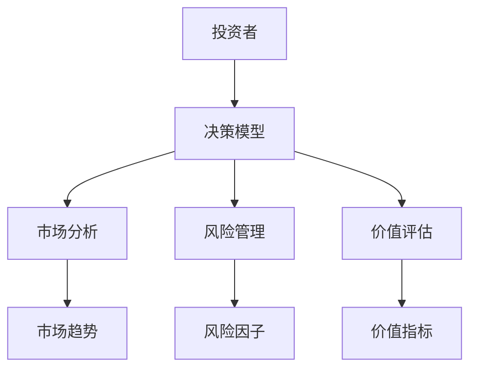
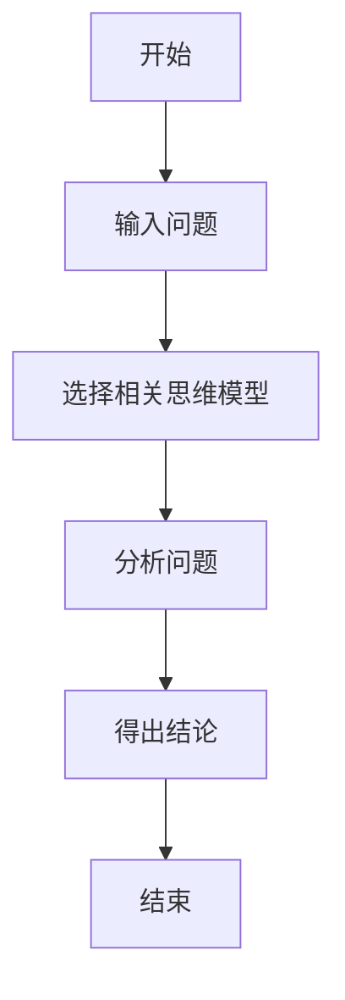
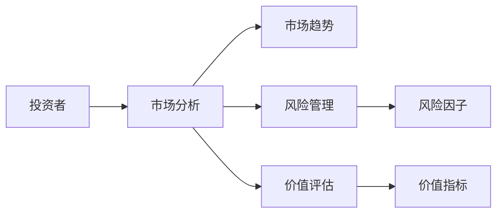
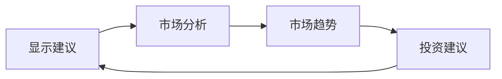

                 


# 芒格的思维模型：在投资中的应用

**关键词**：芒格思维模型，多元思维模型，投资决策，格栅理论，价值评估

**摘要**：本文深入探讨了芒格思维模型在投资中的应用，通过分析其核心概念、算法原理、系统架构以及实际案例，展示了如何利用多元思维模型做出更明智的投资决策。文章结合数学模型、流程图和Python代码，详细阐述了芒格思维模型的理论基础和实际应用，帮助读者更好地理解和应用这一方法。

---

## 第一部分：芒格思维模型的背景与核心概念

### 第1章：芒格思维模型概述

#### 1.1 芒格思维模型的背景与起源
芒格思维模型是由查理·芒格提出的，强调通过多元思维模型来分析问题。这种模型将多个学科的思维框架整合起来，帮助投资者做出更全面的决策。

#### 1.2 芒格思维模型的核心概念
- **格栅理论**：格栅理论是芒格思维模型的核心，通过构建多个思维框架（格栅）来分析问题，确保决策的全面性。
- **多元思维模型**：芒格认为，投资者需要掌握多个学科的思维模型，如心理学、经济学、数学等，才能更好地分析市场和投资机会。

#### 1.3 芒格思维模型与投资的关系
芒格思维模型通过整合多个学科的思维模型，帮助投资者在投资决策中考虑更多因素，降低决策风险。

---

## 第二部分：芒格思维模型的核心概念与联系

### 第2章：芒格思维模型的核心原理

#### 2.1 格栅理论的数学模型
格栅理论可以通过图论中的图结构来表示，每个思维模型是一个节点，节点之间的关系表示不同模型之间的关联。

$$
\text{图的顶点数} = n
$$

其中，n是不同思维模型的数量。

#### 2.2 多元思维模型的属性特征对比
以下是一个多元思维模型的属性对比表格：

| 思维模型 | 优点 | 缺点 |
|----------|------|------|
| 概率论 | 准确性高 | 计算复杂 |
| 逆向思维 | 简单直观 | 可能遗漏细节 |
| 复利效应 | 长期收益显著 | 短期波动大 |

#### 2.3 思维模型的ER实体关系图


---

## 第三部分：芒格思维模型的算法原理

### 第3章：芒格思维模型的算法实现

#### 3.1 格栅理论的算法流程


#### 3.2 多元思维模型的Python实现
以下是一个简单的Python代码示例，用于选择相关思维模型：

```python
def meng_gu_model():
    # 输入问题
    problem = input("请输入问题：")
    # 选择相关思维模型
    models = ["概率论", "逆向思维", "复利效应"]
    selected_models = []
    for model in models:
        if input(f"是否应用{model}？(y/n) ") == 'y':
            selected_models.append(model)
    # 分析问题
    for model in selected_models:
        print(f"应用{model}进行分析...")
    # 得出结论
    print("分析完成，得出结论。")
    
meng_gu_model()
```

---

## 第四部分：系统分析与架构设计方案

### 第4章：系统架构设计

#### 4.1 问题场景介绍
投资者需要通过芒格思维模型来分析市场趋势，评估投资标的的价值，并制定投资策略。

#### 4.2 系统功能设计
- **领域模型**：投资者、市场分析、风险管理、价值评估。
- **系统架构设计**：


#### 4.3 系统接口设计
- 输入：市场数据、投资标的参数
- 输出：分析结果、投资建议

#### 4.4 系统交互设计


---

## 第五部分：项目实战

### 第5章：实战案例分析

#### 5.1 环境配置
- 安装Python和相关库
- 数据来源：历史市场数据

#### 5.2 核心实现代码
```python
def analyze_market(ticker):
    # 分析市场趋势
    pass

def assess_value(ticker):
    # 评估价值
    pass

def manage_risk(ticker):
    # 管理风险
    pass

def investment_strategy():
    ticker = input("请输入股票代码：")
    analyze_market(ticker)
    assess_value(ticker)
    manage_risk(ticker)
    print("投资策略生成完成。")

investment_strategy()
```

#### 5.3 案例分析
以苹果公司为例，分析其市场趋势、评估其价值，并制定投资策略。

---

## 第六部分：最佳实践与小结

### 第6章：总结与注意事项

#### 6.1 总结
芒格思维模型通过整合多个学科的思维框架，帮助投资者做出更全面的决策。本文详细讲解了其核心概念、算法原理和实际应用。

#### 6.2 注意事项
- 投资者需不断更新和学习新的思维模型
- 需结合实际情况调整模型的应用

#### 6.3 拓展阅读
推荐阅读查理·芒格的《穷查理宝典》和《思考，快与慢》。

---

**作者：AI天才研究院/AI Genius Institute & 禅与计算机程序设计艺术 /Zen And The Art of Computer Programming**

