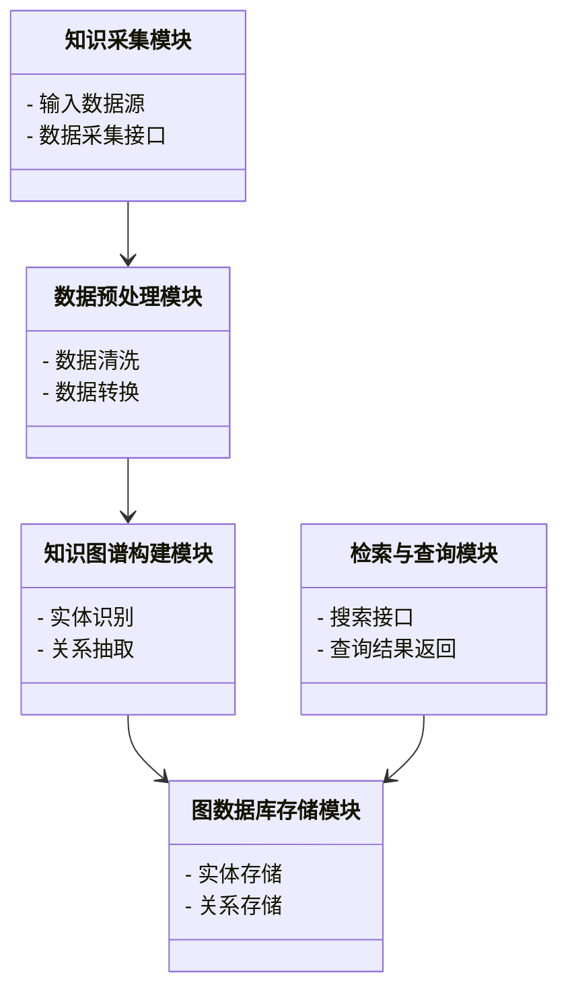
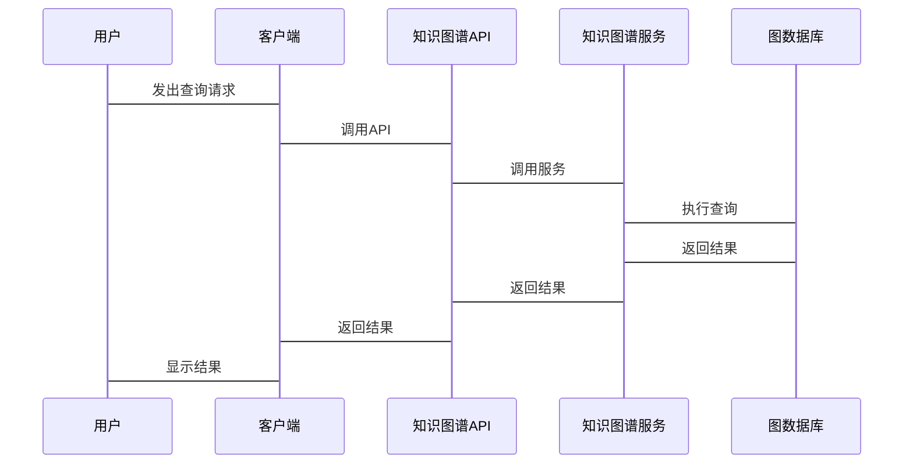
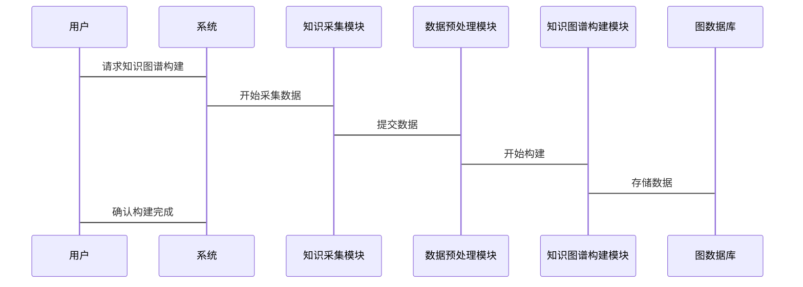

                 


# 芒格的"智者圈"理论在去中心化知识图谱中的新解读

---

## 关键词：芒格的"智者圈"理论，去中心化知识图谱，知识图谱，分布式系统，图数据库

---

## 摘要：本文探讨芒格的“智者圈”理论在去中心化知识图谱中的应用，分析其在分布式知识管理中的潜力，通过技术实现和案例分析，展示如何利用该理论优化知识图谱的构建与管理。

---

## 引言

知识管理在分布式系统中面临挑战，芒格的“智者圈”理论提供了多维度知识整合的方法。本文通过理论分析和技术实现，探讨其在去中心化知识图谱中的应用，展示其在提升知识管理效率和准确性方面的优势。

---

## 第一部分：芒格的“智者圈”理论与知识图谱基础

### 第1章：芒格的“智者圈”理论概述

#### 1.1 芒格“智者圈”理论的定义与核心思想

芒格的“智者圈”理论，即“心智模型”理论，强调通过多维度思考来解决问题。其核心在于将问题拆解，利用不同的知识模型进行分析。本文将此理论应用于知识图谱，提出分布式知识管理的新方法。

#### 1.2 “智者圈”理论与知识图谱的关系

知识图谱通过结构化数据表示知识，而“智者圈”理论提供了多维度分析的框架。本文分析两者的结合点，提出去中心化知识图谱的概念，并探讨其构建方法。

#### 1.3 本书的核心观点与研究意义

本文的核心观点是利用“智者圈”理论优化去中心化知识图谱的构建。研究意义在于提供一种新的知识管理方法，提升分布式系统中的知识整合与应用效率。

---

## 第二部分：去中心化知识图谱的技术实现

### 第4章：去中心化知识图谱的系统架构设计

#### 4.1 系统功能设计

系统功能模块包括知识采集、预处理、构建、存储与检索。领域模型设计如图所示：



#### 4.2 系统架构设计

系统采用分层架构：


系统交互流程：



#### 4.3 系统交互设计

系统交互流程：



---

## 项目实战

### 环境安装

安装必要的库：

```bash
pip install neo4j python-driver networkx
```

### 核心实现代码

```python
from neo4j import GraphDatabase
from networkx import Graph

class KnowledgeGraph:
    def __init__(self, uri, user, password):
        self.driver = GraphDatabase.driver(uri, auth=(user, password))
    
    def add_entity(self, entity):
        with self.driver.session() as session:
            session.run("CREATE (:Entity {name: $name})", name=entity)
    
    def add_relation(self, entity1, relation, entity2):
        with self.driver.session() as session:
            session.run("MATCH (a {name: $a}), (b {name: $b}) CREATE (a)-[r:$r]->(b)", a=entity1, r=relation, b=entity2)
    
    def query(self, query):
        result = []
        with self.driver.session() as session:
            for record in session.run(query):
                result.append(record)
        return result

# 实例化知识图谱
kg = KnowledgeGraph("bolt://localhost:7687", "neo4j", "password")

# 添加实体
kg.add_entity("芒格")
kg.add_entity("智者圈理论")
kg.add_entity("知识图谱")

# 添加关系
kg.add_relation("芒格", "提出", "智者圈理论")
kg.add_relation("智者圈理论", "应用于", "知识图谱")

# 查询
print(kg.query("MATCH (a)-[r]->(b) RETURN a.name, r.type, b.name"))
```

### 案例分析

构建一个简单的知识图谱，将“芒格”、“智者圈理论”和“知识图谱”连接起来，展示理论如何应用于知识图谱构建。通过查询，验证关系的有效性。

---

## 结论

芒格的“智者圈”理论为去中心化知识图谱提供了新的构建方法，通过多维度分析提升知识整合效率。本文通过理论分析和技术实现，展示了其在分布式知识管理中的应用潜力，为未来的研究提供了方向。

---

## 作者：AI天才研究院 & 禅与计算机程序设计艺术

---

*本文基于芒格的“智者圈”理论，结合分布式系统与知识图谱技术，探索新的知识管理方法，引用了芒格的名言："聪明的投资者是那些能够独立思考的人，他们不会盲目跟从潮流。"本文旨在通过技术创新，为知识管理提供新的思路。*

