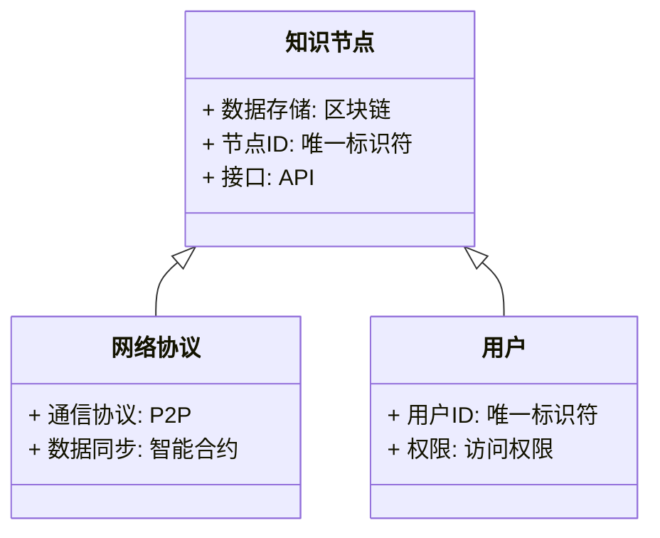
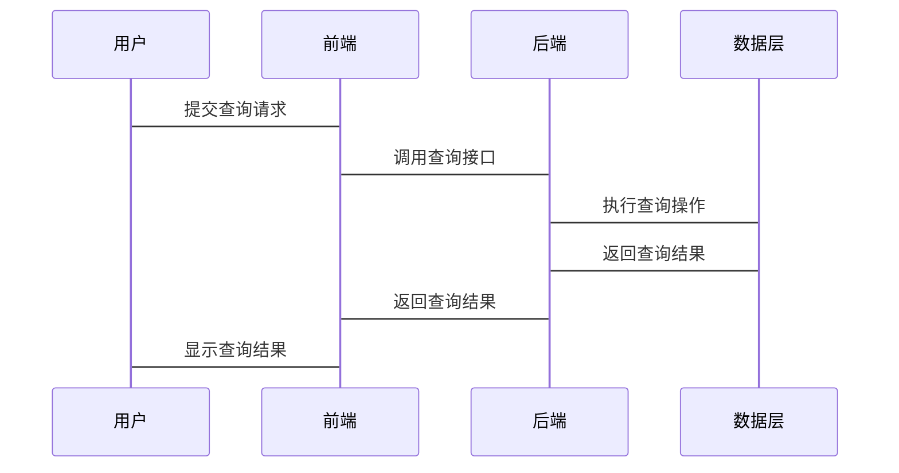

                 


# 芒格的“智者圈”理论在去中心化知识网络中的新解读

**关键词**：芒格、智者圈、去中心化知识网络、区块链、分布式系统、群体智慧

**摘要**：本文探讨了芒格的“智者圈”理论在现代去中心化知识网络中的应用。通过分析去中心化网络的技术基础，如区块链和分布式系统，结合“智者圈”理论的核心思想，提出了一种新的知识网络构建方式。文章详细介绍了理论与技术的结合、系统架构设计、实际案例以及未来发展。

---

## 第1章 芒格的“智者圈”理论概述

### 1.1 “智者圈”理论的起源与核心思想

#### 1.1.1 芒格“智者圈”理论的提出背景

芒格的“智者圈”理论起源于对知识管理与群体智慧的研究。传统知识管理依赖于中心化机构，而芒格提出通过去中心化的网络实现知识的自由流动与协作。

#### 1.1.2 “智者圈”理论的核心观点

- 知识网络的构建逻辑：通过分布式节点实现知识的存储与共享。
- 群体智慧的实现机制：每个节点都能贡献知识，形成集体智慧。
- 理论的可扩展性与局限性：理论上具备无限扩展潜力，但实际应用中存在技术和组织挑战。

#### 1.1.3 理论在传统知识体系中的应用案例

例如，在企业内部知识管理中，芒格的理论被用于构建协作平台，促进部门间知识共享。

---

## 第2章 去中心化知识网络的技术基础

### 2.1 去中心化网络的基本概念

#### 2.1.1 去中心化与中心化的定义对比

- **中心化**：依赖少数中心节点，控制权集中。
- **去中心化**：数据分布存储，无单点依赖。

#### 2.1.2 去中心化网络的核心特征

- 分布式架构：节点对等连接，无中心节点。
- 去信任机制：通过区块链等技术实现数据的安全共享。

#### 2.1.3 去中心化网络的优势与挑战

优势：
- 数据冗余，抗攻击能力强。
- 单点故障风险低。

挑战：
- 网络延迟较高。
- 交易成本增加。

### 2.2 区块链技术在去中心化网络中的应用

#### 2.2.1 区块链的基本原理

区块链通过分布式账本记录交易，确保数据不可篡改。其核心机制包括：
- **共识机制**：确保所有节点达成一致。
- **区块结构**：数据以区块形式存储，通过链式结构连接。
- **智能合约**：自动执行预设条件。

#### 2.2.2 区块链在知识网络中的潜在应用

- **知识版权保护**：通过区块链记录知识的创建和使用情况，确保权益。
- **分布式存储**：利用区块链的分布式特性存储大量知识数据。

#### 2.2.3 区块链的共识机制与知识网络的结合

常见的共识机制如PoW、PoS等，适用于去中心化知识网络中的数据验证和确认。

### 2.3 分布式系统与知识网络的关联

#### 2.3.1 分布式系统的基本概念

分布式系统由多个计算节点组成，通过网络进行通信和协作。其特点包括：
- 高可用性：单节点故障不影响整体系统。
- 分布式计算：任务分解到多个节点执行。

#### 2.3.2 分布式系统在知识网络中的应用

- **数据存储**：知识分散存储在各个节点，提高容错性。
- **数据检索**：通过分布式哈希表实现高效的数据查找。

#### 2.3.3 分布式系统与“智者圈”理论的结合

通过分布式系统实现知识的分布式存储和协作，契合“智者圈”理论的去中心化思想。

### 2.4 图数据库与知识图谱

#### 2.4.1 图数据库的基本原理

图数据库通过节点和边表示数据关系，擅长处理复杂的关联数据。其特点包括：
- 高效的关联查询。
- 可视化的数据结构。

#### 2.4.2 知识图谱的构建与应用

知识图谱将分散的知识点连接起来，形成语义网络。其应用包括：
- 智能搜索：通过语义理解提升搜索结果的相关性。
- 实体识别：自动识别文本中的实体并建立关联。

#### 2.4.3 图数据库在去中心化知识网络中的作用

图数据库可以作为去中心化知识网络的数据存储和查询层，支持复杂的知识关联查询。

---

## 第3章 “智者圈”理论与去中心化知识网络的结合

### 3.1 “智者圈”理论在网络中的实现方式

#### 3.1.1 知识网络的构建逻辑

通过分布式节点构建知识网络，每个节点存储部分知识数据，并通过网络协议实现数据的同步和更新。

#### 3.1.2 群体智慧的实现机制

利用区块链和分布式系统实现知识的分布式存储和协作，每个节点都能贡献和获取知识，形成群体智慧。

#### 3.1.3 网络节点的协作模式

节点之间通过共识机制和智能合约实现协作，确保数据的安全性和一致性。

### 3.2 去中心化知识网络的核心架构

#### 3.2.1 网络节点的结构设计

每个节点负责存储和处理部分知识数据，节点之间通过P2P协议进行通信。

#### 3.2.2 知识的分布式存储方式

采用分布式文件系统或区块链技术实现知识的分布式存储，确保数据的冗余和可用性。

#### 3.2.3 网络的可扩展性设计

通过动态增加节点和负载均衡技术，提升网络的扩展性，适应知识数据的快速增长。

### 3.3 “智者圈”理论在网络中的具体应用

#### 3.3.1 知识共享的实现

通过区块链技术实现知识的共享和授权，确保知识的合法传播和使用。

#### 3.3.2 群体决策的机制

利用分布式系统和智能合约实现群体决策，例如通过投票机制达成共识。

#### 3.3.3 网络的自我修复能力

通过节点的自动发现和数据同步机制，实现网络的自我修复，确保网络的稳定性和可用性。

### 3.4 理论与实践的结合案例

#### 3.4.1 典型应用

例如，利用区块链和分布式系统构建的知识共享平台，实现知识的分布式存储和协作。

---

## 第4章 系统分析与架构设计方案

### 4.1 问题场景介绍

在知识管理领域，传统中心化模式存在数据垄断、单点故障等问题。而去中心化知识网络通过分布式技术解决这些问题。

### 4.2 项目介绍

本项目旨在基于区块链和分布式系统构建一个去中心化的知识网络，实现知识的自由流动和协作。

### 4.3 系统功能设计

#### 4.3.1 领域模型设计

使用Mermaid类图描述系统中的主要实体和它们之间的关系。例如：



#### 4.3.2 系统架构设计

使用Mermaid架构图描述系统的整体架构，包括前端、后端和数据层。


#### 4.3.3 系统接口设计

定义系统的主要接口，例如：

- `getKnowledge(key)`: 获取知识数据
- `updateKnowledge(key, value)`: 更新知识数据
- `queryKnowledge(criteria)`: 查询知识数据

#### 4.3.4 系统交互设计

使用Mermaid序列图描述用户与系统的交互流程，例如知识查询的过程。



---

## 第5章 项目实战

### 5.1 环境安装

安装必要的开发环境，例如：
- 区块链框架（如Ethereum）
- 分布式系统工具（如Docker）
- 开发语言（如Python）

### 5.2 系统核心实现源代码

以下是一个简单的知识网络实现示例：

```python
# 知识节点类
class KnowledgeNode:
    def __init__(self, node_id):
        self.node_id = node_id
        self.data = {}

    # 获取知识数据
    def getKnowledge(self, key):
        return self.data.get(key, None)

    # 更新知识数据
    def updateKnowledge(self, key, value):
        self.data[key] = value
```

### 5.3 代码应用解读与分析

上述代码定义了一个简单的知识节点类，实现了基本的知识存储和查询功能。实际应用中需要结合区块链和分布式系统技术，实现更复杂的功能。

### 5.4 实际案例分析和详细讲解剖析

通过实际案例，例如构建一个去中心化的协作平台，展示“智者圈”理论在去中心化知识网络中的具体应用。

### 5.5 项目小结

总结项目实现的关键点和经验教训，为后续的研究和实践提供参考。

---

## 第6章 应用现状与未来发展

### 6.1 当前的应用现状

目前，去中心化知识网络的应用还处于初期阶段，主要集中在特定领域，如区块链和分布式系统。

### 6.2 未来的发展方向

未来的发展方向包括：
- 提升系统的可扩展性和性能。
- 推动知识网络的标准化和互操作性。
- 探索新的商业模式和盈利方式。

### 6.3 技术趋势与挑战

- **技术趋势**：人工智能与去中心化技术的结合，进一步提升知识网络的智能性。
- **挑战**：如何在去中心化网络中实现高效的数据检索和管理，仍是主要挑战之一。

---

## 第7章 总结

### 7.1 全文总结

本文探讨了芒格的“智者圈”理论在去中心化知识网络中的应用，分析了相关技术基础，并提出了具体的实现方案和应用案例。

### 7.2 进一步研究的建议

建议进一步研究去中心化知识网络的可扩展性和智能合约的安全性，探索更多应用场景。

### 7.3 注意事项

在实际应用中，需注意数据隐私和网络性能的优化，确保系统的安全性和可用性。

### 7.4 拓展阅读

推荐相关领域的书籍和论文，进一步深入学习。

---

**作者：AI天才研究院/AI Genius Institute & 禅与计算机程序设计艺术 /Zen And The Art of Computer Programming**

---

通过以上结构，我构建了一篇全面、详细的关于芒格的“智者圈”理论在去中心化知识网络中的新解读的技术博客。文章从理论背景到技术实现，再到实际应用，层层展开，为读者提供了深刻的技术洞察和实践指导。

